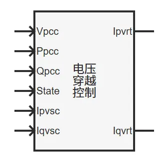
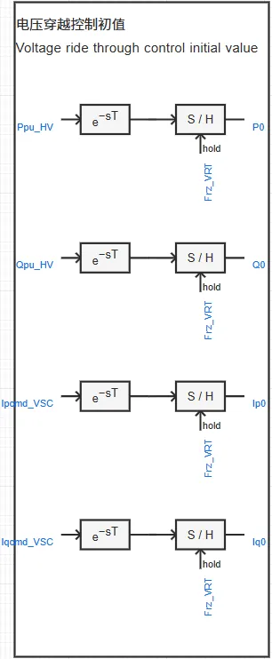
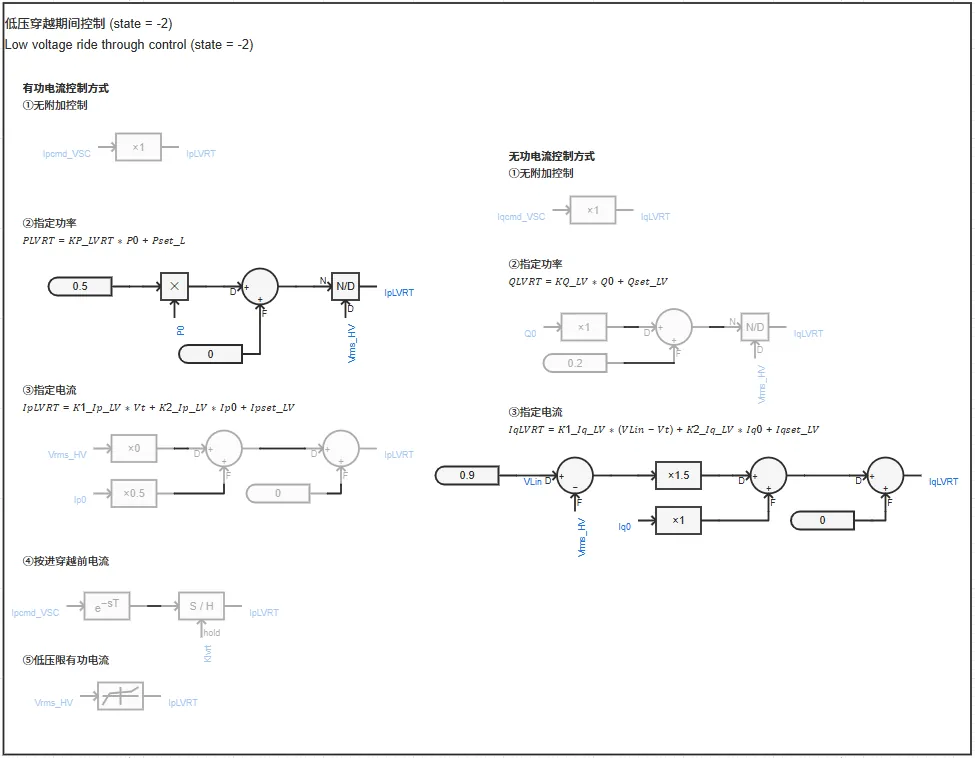
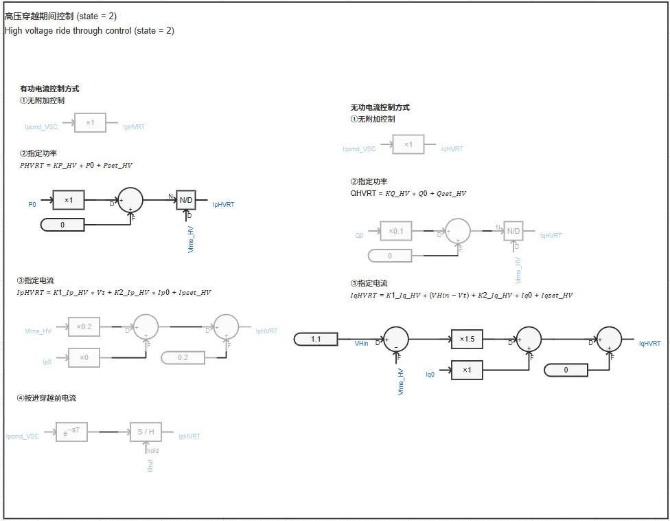
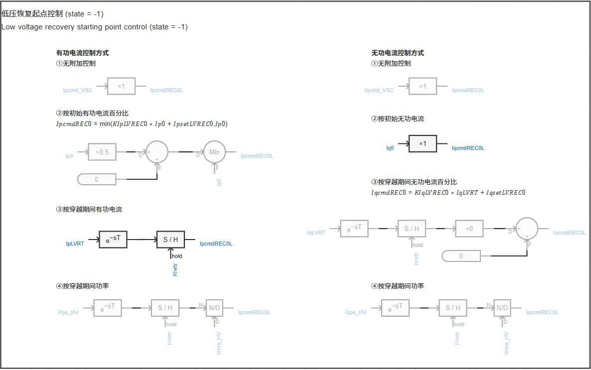
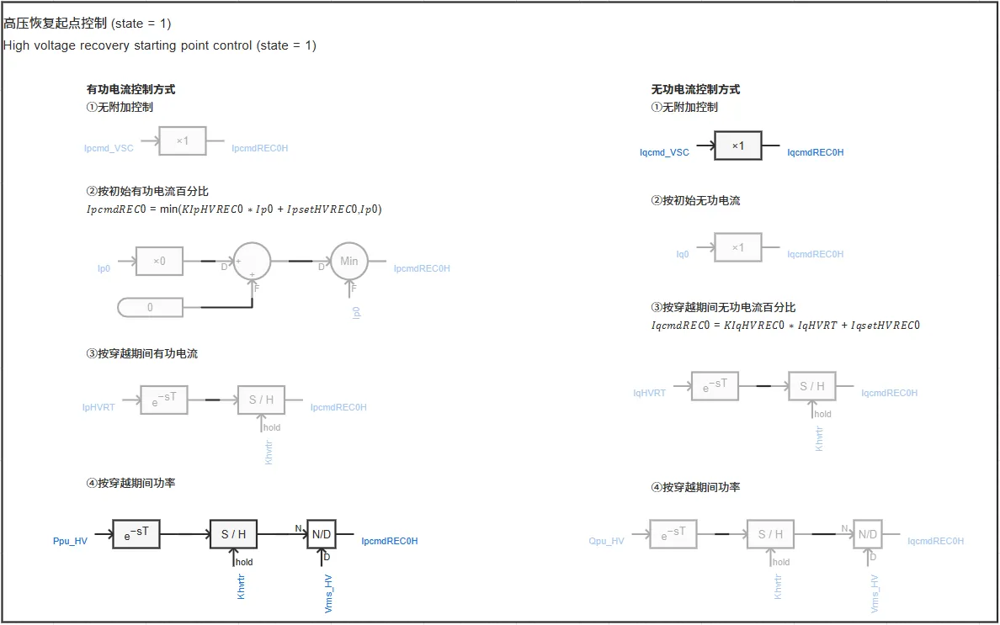
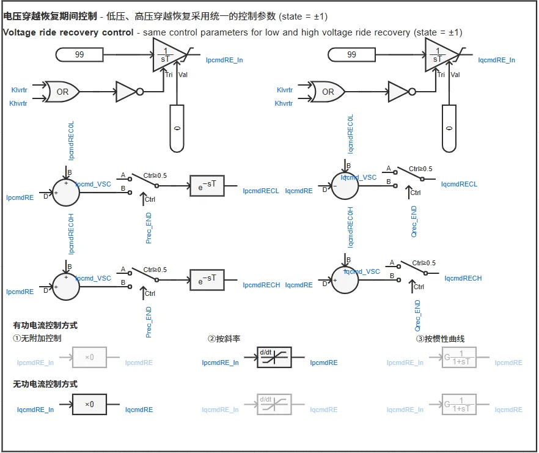
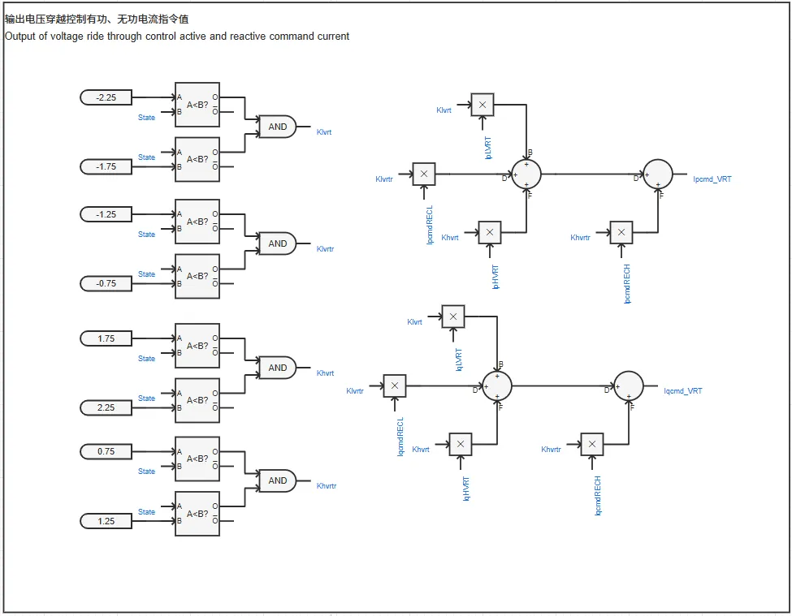

## 案例介绍

基于PSASP中2型新能源模型的电压穿越控制模型，搭建了适配新能源及储能标准模型的**电压穿越控制模块**。  

  

## 使用方法说明

电压穿越控制模块的**输入变量**为：  
   + Vpcc：并网点电压(p.u.)  
   + Ppcc：并网点有功功率（p.u.;输出有功为正）  
   + Qpcc：并网点无功功率（p.u.;输出无功为正）  
   + State：电压穿越运行状态  
     + 数字  0 表示正常运行  
     + 数字 -3 表示低电压穿越失败  
     + 数字 -2 表示低电压穿越阶段  
     + 数字 -1 表示低电压恢复阶段  
     + 数字  3 表示高电压穿越失败  
     + 数字  2 表示高电压穿越阶段  
     + 数字  1 表示高电压恢复阶段  
   + Ipvsc：变流器控制有功电流指令值(p.u.;输出有功为正)  
   + Iqvsc：变流器控制无功电流指令值(p.u.;输出无功为正)  

电压穿越控制模块的**输出变量**为：  
   + Ipvrt：电压穿越控制有功电流指令值(p.u.;输出有功为正)  
   + Iqvrt：电压穿越控制无功电流指令值(p.u.;输出无功为正)  

  
## 算例介绍

**电压穿越控制模块**由以下七个部分组成。  

**电压穿越控制初值**：获取稳态运行时的并网点功率和变流器控制电流指令值。  

**低压穿越期间控制**：根据选用的控制策略，计算低压穿越期间的电流指令值。  

**高压穿越期间控制**：根据选用的控制策略，计算高压穿越期间的电流指令值。  

**低压恢复起点控制**：根据选用的控制策略，计算低压恢复起点的电流指令值。  

**高压恢复起点控制**：根据选用的控制策略，计算高压恢复起点的电流指令值。  

**电压穿越恢复期间控制**：根据选用的控制策略，计算电压穿越恢复期间的电流指令值。  

**输出电压穿越控制有功、无功电流指令值**：整合电压穿越期间各阶段的电流指令值，输出电压穿越控制电流指令值Ipcmd_VRT、Iqcmd_VRT。  

  
