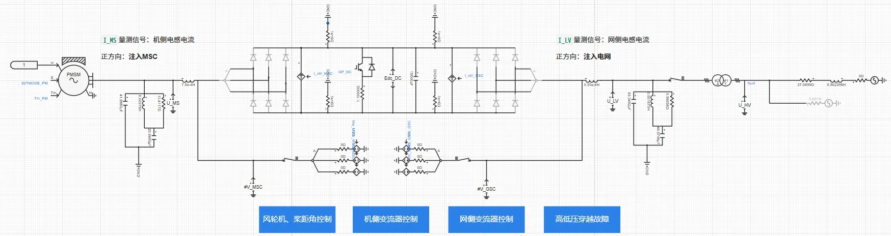
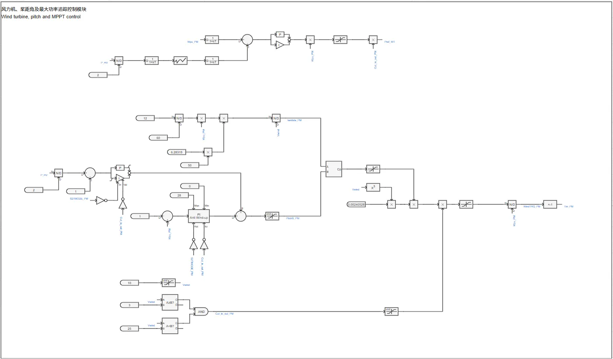
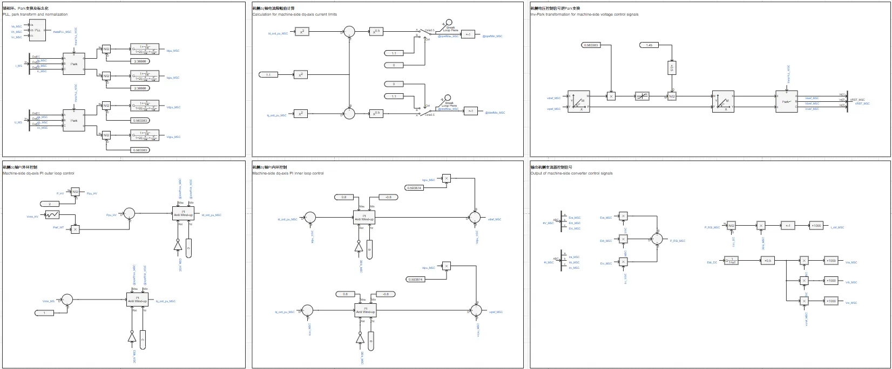
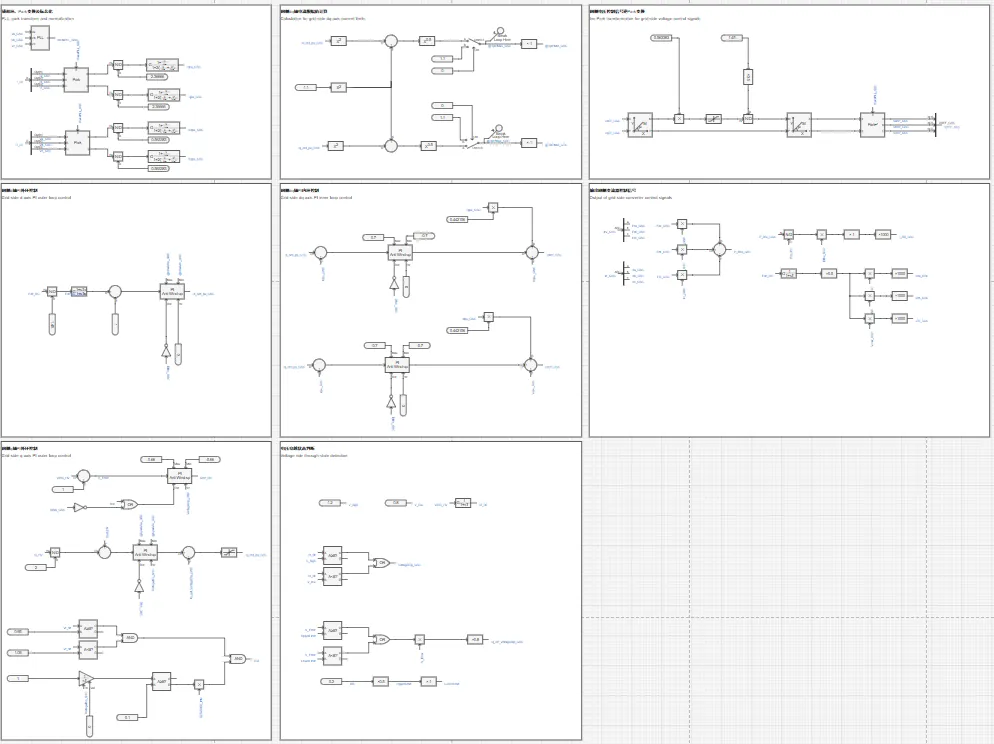
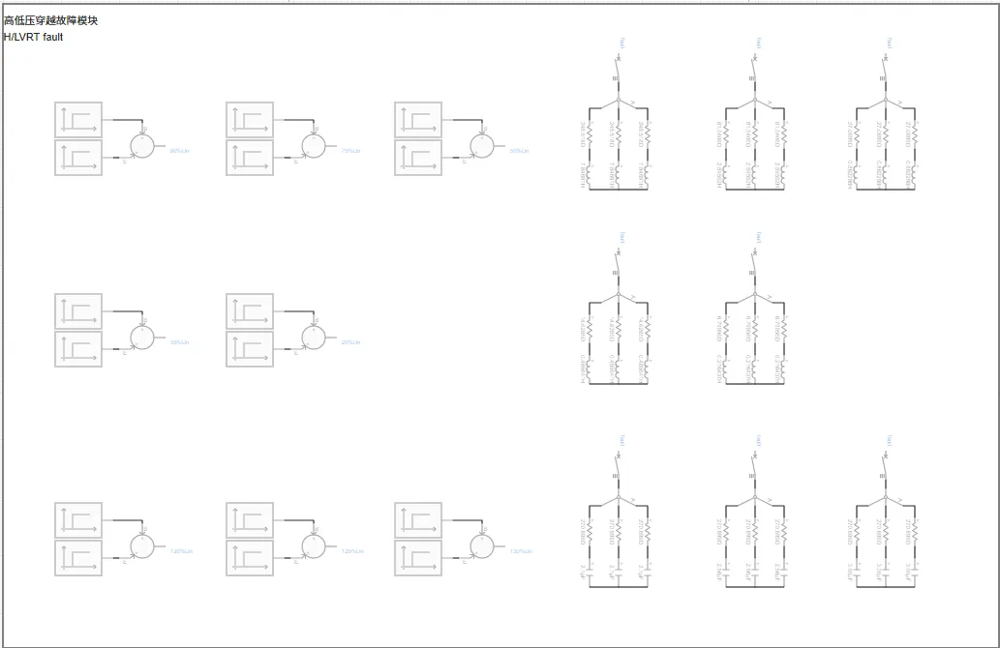
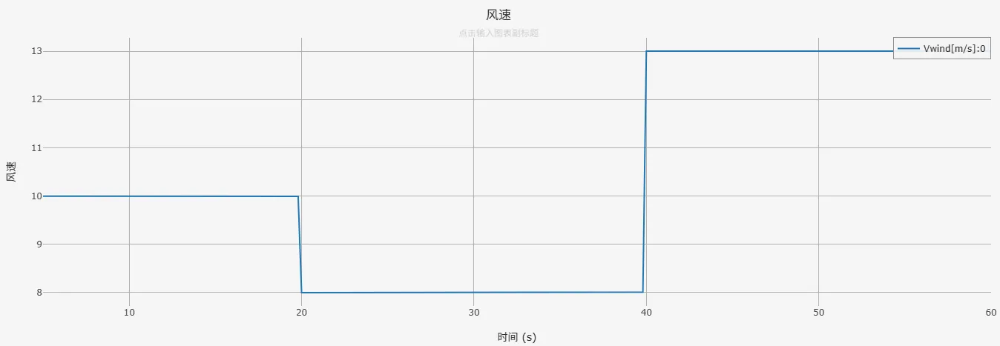
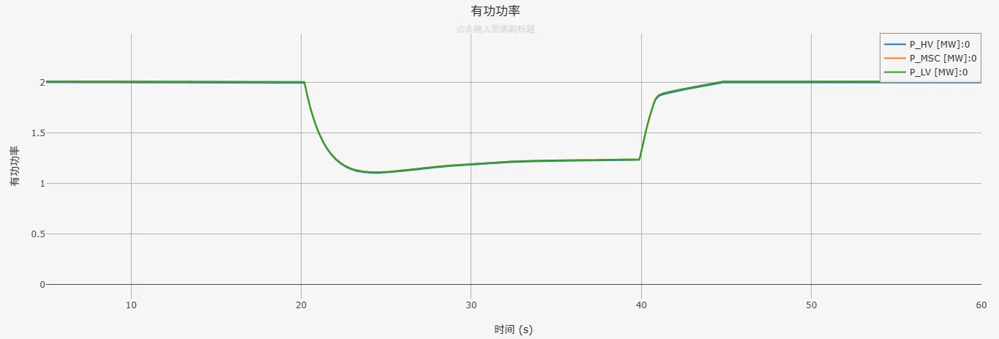
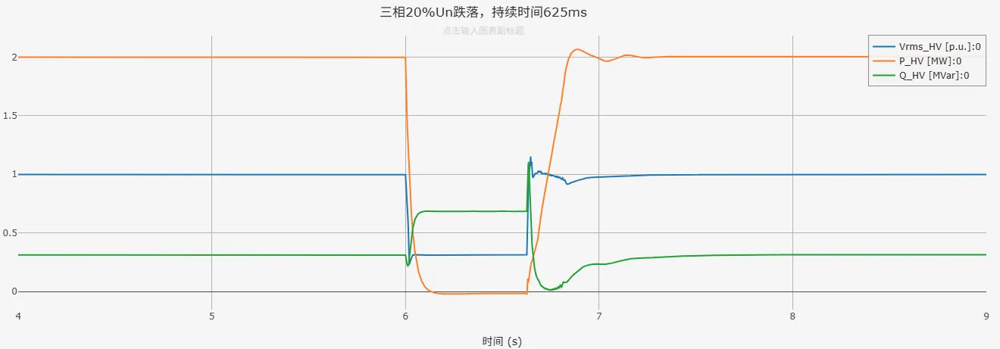
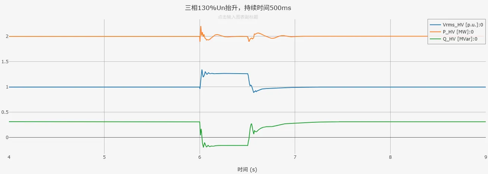

## 案例介绍

包含风轮机及桨距角控制、最大功率追踪控制、机侧变流器控制、网侧变流器控制、简单电压穿越控制以以及高低压穿越故障等模块的**跟网型直驱风机01型-平均模型-标准模型-v1**的典型案例。

## 使用方法说明

### 适用场景  

支持多短路比下的单机并网测试，适用于以下分析场景：
   + 风速变化响应测试  
   + 高低电压穿越测试  
   + 风机控制策略验证  
   + 不同电网强度下的风机运行特性分析  

### 适用范围  
   + 可稳定运行的风速范围：8-25m/s  
   + 建议步长范围：1-50μs  
   + 高低压穿越成功的短路比≥1.5 

### 功能概述  
   + 高低电压穿越电压阈值、变流器PI控制参数、初始风速等参数均开放可调  
   + 支持网侧、机侧变流器控制中dq轴电流优先模式的切换  
   + 支持并网方式的切换

  
## 算例介绍

**直驱风机01型-平均模型-标准模型-v1**由电气主拓扑、风轮机及桨距角控制、机侧变流器控制、网侧变流器控制及高低压穿越故障等五个部分组成。

**电气主拓扑**由永磁同步发电机、交流滤波器、Chopper斩波电路、等效受控电压源/电流源建模的变流器、升压变压器及单元测试组成。  
风机并网有两种方式可以选择：风机直接与理想电压源相连；风机经线路阻抗后与理想电压源相连，线路阻抗大小由短路比、阻抗比计算得到。两种并网方式的切换以及短路比、阻抗比的大小均可在参数组中进行设置。  

**风轮机及桨距角控制**由风力机模块、桨距角控制模块、转矩控制模块等机械部分组成，这些模块的功能为捕获风功率、调节桨距角、实现最大功率追踪。  

**机侧变流器控制**由锁相环、Park变换、机侧dq轴内外环控制、机侧dq轴电流限幅值计算、机侧电压控制信号逆Park变换与输出机侧变流器控制信号等部分组成，实现对机侧交流电压、并网点处输出有功功率的控制。  

**网侧变流器控制**与机侧变流器控制的组成类似，用来实现对直流电压、并网点处输出无功功率的控制。无功功率控制部分包含电压穿越状态判断与无功电流补偿控制，具备简单的高低压穿越能力。  

为方便进行高低压穿越测试，搭建了适用于经线路阻抗后与理想电压源相连时的**高低压穿越故障模块**，用户在参数方案中选取电压穿越类型，即可自动启用并设置相应的故障阻抗与故障持续时间。目前给出的故障阻抗参数适用于短路比为2时的工况。  

  
## 算例仿真测试

对**直驱风机01型-平均模型-标准模型-v1**分别进行了变风速测试和高低压穿越测试。

### 变风速测试结果
直驱风机标准模型的切入、切出风速为3m/s、25m/s，目前可在8-25m/s的风速范围内长时间稳定运行。**直驱风机01型-平均模型-标准模型-v1**在变风速测试中的仿真结果如下。其中，蓝色曲线P_HV为并网点处的有功功率、黄色曲线P_MSC为机侧变流器处的有功功率；红色曲线P_LV为网侧变压器处的有功功率。  

  
  

### 高低压穿越测试结果
按照《GB/T 36995-2018, 风力发电机组 故障电压穿越能力测试规程》国标要求进行高低压穿越测试，测试结果如下列各表所示（✓代表穿越成功，×代表穿越失败）。  

|          |  SCR=2  |  SCR=1.5  |  SCR=1  |
|:--------:|:-------:|:---------:|:-------:|
|  穿越情况 |    ✓    |    ✓     |   ×     |  

由上表测试结果可以看到，直驱风机标准模型可在短路比≥1.5时，在高低压穿越测试中穿越成功。  
以下为SCR=2时，直驱风机平均模型标准模型在三相20%Un跌落、三相130%Un抬升工况下的仿真结果。其中，蓝色曲线Vrms_HV为并网点电压、黄色曲线P_HV为并网点处有功功率、红色曲线Q_HV为并网点处无功功率。  

  

由仿真结果可以看到，直驱风机标准模型在电网电压跌落、抬升期间，输出有功、无功功率能够按照故障电压穿越能力的要求响应电压变化，且并网点电压能够在故障切除后恢复至初始状态，表明**直驱风机01型-平均模型-标准模型-v1**穿越成功。  

## 模型地址

点击打开模型地址：[**直驱风机01型-平均模型-标准模型-v1**](https://cloudpss.net/model/open-cloudpss/WTG_PMSG_01-avm-std-v1b2)  

## 附录

### 参数
import Parameters from './_parameters.md'

<Parameters/>

<!-- 
## 附：修改及调试日志

+ 20250108 参数标准化校验，模型测试，形成`WTG_PMSG_01-avm-std-v1a20250108`
+ 20250113 解决故障恢复后无功无法恢复到0的问题
+ 20250310 根据标准模型规范修改相关描述
    + 设置风机高/低穿电压阈值和并网点电压为用户可调参数
    + 增加启动时序参数组
+ 20250321 
    + 在并网处加入由短路比和阻抗比计算得到的线路阻抗
    + 提供风机直接与理想电压源相连，经线路阻抗与理想电压源相连两种并网方式
    + 加入高低穿故障测试模块
+ 20250326 
    + 优化高低穿故障测试模块，给定SCR=2时进行高低穿测试时的故障阻抗、电容大小
    + 修改受控电压源内阻为0.01Ω，以解决可能出现的系统不收敛问题
    + 优化风轮机及桨距角控制模块布局
+ 20250703 更新模型版本为v1b2，更新内容如下：
    + 删去与机侧、网侧受控电压源相连的5e-4大小的电阻，简化风机模型
    + 模型描述修改为markdown格式
    + 修改直流电容的初始电压为直流电压基准值
    + 删去不必要的电流表
    + 优化变量名和模型布局
+ 20250717 
  + 将受控电压源内阻改为0Ω
  + 增加闭锁二极管启用开关
+ 20250725 
  + 替换二阶传递函数模块
  + 修改电流方向和坐标变化，统一注入电网为正
  + 调整变流器控制中d轴电流、q轴电流与输出有功、无功功率方向一致
 
-->
