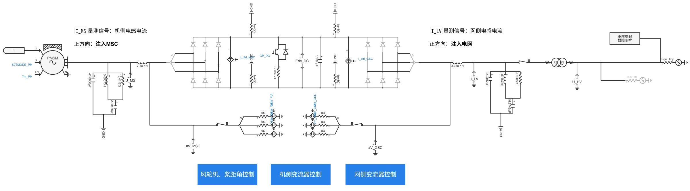
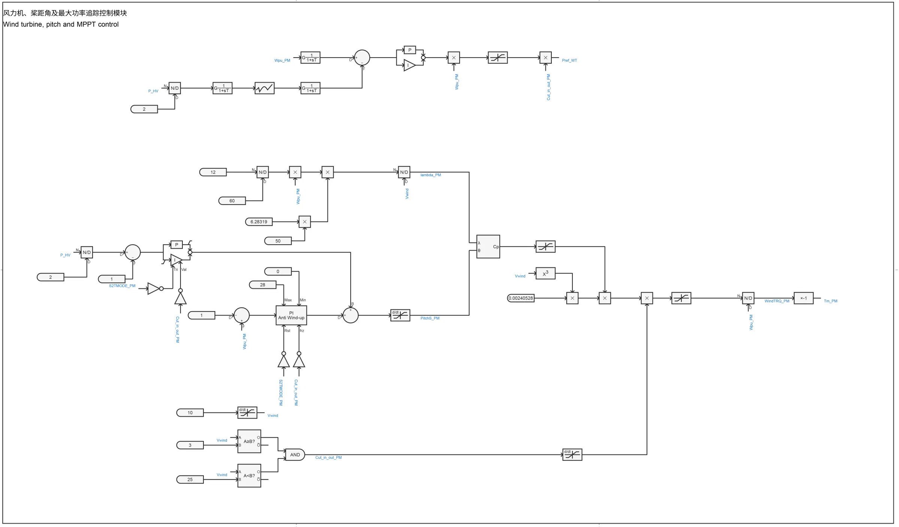
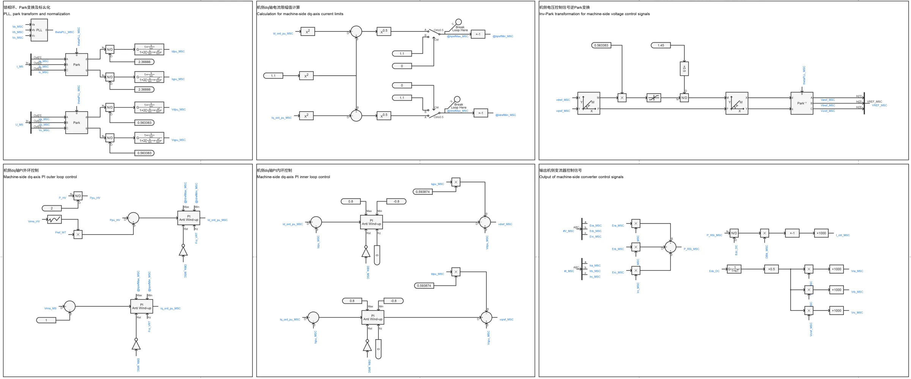
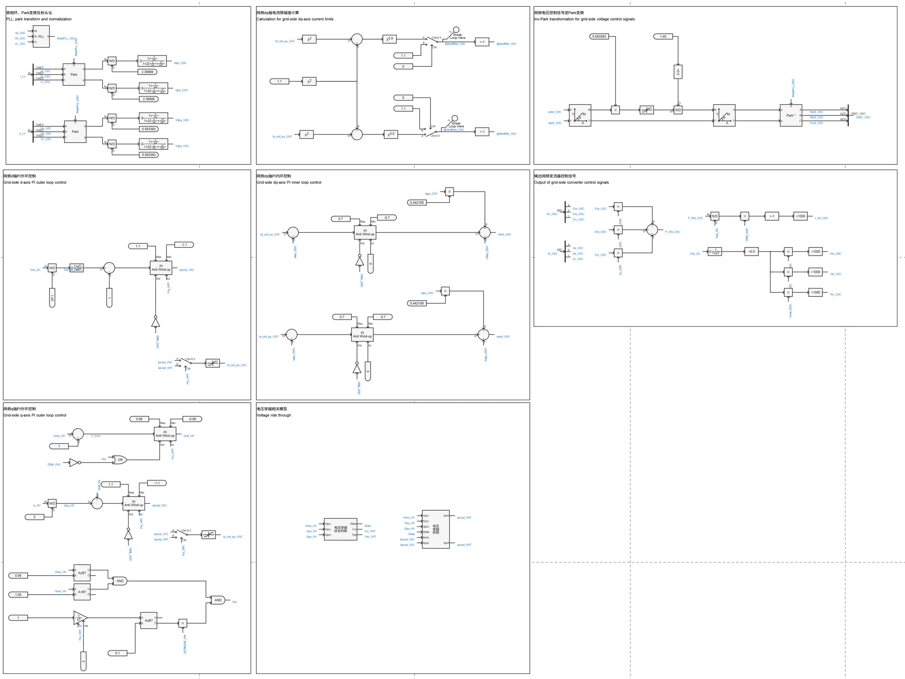
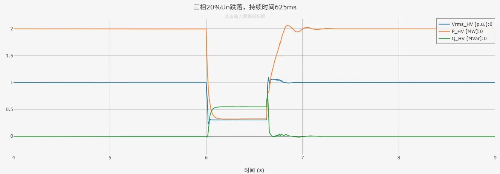
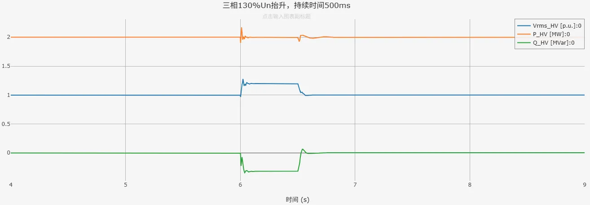

## 案例介绍

在直驱风机01型-平均模型-标准模型-v1的基础上进行修改和完善，将简单电压穿越控制替换为标准电压穿越状态判断模块、电压穿越控制模块，形成了**直驱风机01型-平均模型-标准模型-v2**典型案例。  
   + [直驱风机01型-平均模型-标准模型-v1](../20-wtg_pmsg_01-avm-std-v1/index.md)  
   + [电压穿越状态判断模块](../../../70-voltage-ride-though-model/10-vrt_sd-stdm-v1/index.md)  
   + [电压穿越控制模块](../../../70-voltage-ride-though-model/20-vrt_ctrl-stdm-v1/index.md)

## 使用方法说明

### 适用场景  

支持多短路比下的单机并网测试，适用于以下分析场景：
   + 风速变化响应测试  
   + 高低电压穿越测试  
   + 风机控制策略验证  
   + 不同电网强度下的风机运行特性分析 

### 适用范围  
   + 可稳定运行的风速范围：8-25m/s  
   + 建议步长范围：1-50μs  
   + 高低压穿越成功的短路比≥1.5 

### 功能概述  
   + 电压穿越控制详细参数、变流器PI控制参数、初始风速等参数均开放可调  
   + 支持网侧、机侧变流器控制中dq轴电流优先模式的切换  
   + 支持并网方式的切换  
   + 高低电压穿越判断、脱网保护控制可切换启用/禁用状态

  
## 算例介绍

**直驱风机01型-平均模型-标准模型-v2**由电气主拓扑、风轮机及桨距角控制、机侧变流器控制、网侧变流器控制、电压穿越状态判断、电压穿越控制以及电压穿越故障阻抗等模块组成。

**电气主拓扑**由永磁同步发电机、交流滤波器、Chopper斩波电路、等效受控电压源/电流源建模的变流器、升压变压器及单元测试组成。  
与直驱风机01型-平均模型-标准模型-v1相比有以下不同：
+ 将并网方式中的经线路阻抗后与理想电压源相连，替换为与戴维南等值电压源相连，等值阻抗由短路比、阻抗比计算得到  
+ 在升压变压器处设置由Dblk解锁信号与电压保护切机信号控制的断路器，实现电压保护脱网控制  
+ 将高低压穿越故障模块替换为封装的电压穿越故障阻抗模块，适用于与戴维南等值电压源相连，不限制短路比的大小；目前暂不支持高电压穿越的工况  

**风轮机及桨距角控制**由风力机模块、桨距角控制模块、转矩控制模块等机械部分组成，这些模块的功能为捕获风功率、调节桨距角、实现最大功率追踪。  

**机侧变流器控制**由锁相环、Park变换、机侧dq轴内外环控制、机侧dq轴电流限幅值计算、机侧电压控制信号逆Park变换与输出机侧变流器控制信号等部分组成，实现对机侧交流电压、并网点处输出有功功率的控制。  
与直驱风机01型-平均模型-标准模型-v1相比有以下不同：  
+ 设置dq轴外环PI控制在电压穿越期间冻结，避免故障切除后输出功率出现较大超调。  
  

**网侧变流器控制**与机侧变流器控制的组成类似，用来实现对直流电压、并网点处输出无功功率的控制。  
与直驱风机01型-平均详细模型-标准模型-v1相比有以下不同：  
+ 设置dq轴外环PI控制在电压穿越期间冻结  
+ 加入电压穿越状态判断模块、电压穿越控制模块  
+ 电压穿越期间，将参与dq轴内环PI控制的变流器控制电流指令值替换为电压穿越控制电流指令值  

## 算例仿真测试

### 高低压穿越测试
按照《GB/T 36995-2018, 风力发电机组 故障电压穿越能力测试规程》国标要求进行高低压穿越测试，测试结果如下列各表所示（✓代表穿越成功，×代表穿越失败）。  

|          |  SCR=2  |  SCR=1.5  |  SCR=1  |
|:--------:|:-------:|:---------:|:-------:|
|  穿越情况 |    ✓    |    ✓     |   ×     |  

由上表测试结果可以看到，直驱风机标准模型可在短路比≥1.5时，在高低压穿越测试中穿越成功。  
以下为SCR=2时，**直驱风机01型-平均模型-标准模型-v2**在三相20%Un跌落、三相130%Un抬升工况下的仿真结果。其中，蓝色曲线Vrms_HV为并网点电压、黄色曲线P_HV为并网点处有功功率、红色曲线Q_HV为并网点处无功功率。  

电压穿越相关参数设置如下：  

| **符号**     | **参数名**    | **参数值**       |
|:--------------:|:-----------:|:----------------:|
| VLin_LV              | 进入低穿状态电压值              | 0.90 p.u.          |
| VLout_LV             | 退出低穿状态电压值              | 0.93 p.u.          |
| TdlyVLin_LV          | 进入低穿延时                    | 0 s                |
| TdlyVLout_LV         | 退出低穿延时                    | 0 s                |
| LVRT_IN_PFLAG        | 低穿期间有功功率控制标志位      | 指定电流           |
| K1_Ip_LV             | 有功电流系数 1                  | 0                  |
| K2_Ip_LV             | 有功电流系数 2                  | 0.5                |
| Ipset_LV             | 有功电流设定值                  | 0 p.u.             |
| LVRT_IN_QFLAG        | 低穿期间无功功率控制标志位      | 指定电流           |
| K1_Iq_LV             | 无功电流系数 1                  | 1.5                |
| K2_Iq_LV             | 无功电流系数 2                  | 1                  |
| Iqset_LV             | 无功电流设定值                  | 0 p.u.             |
| Ip_LVREC0_FLAG       | 有功电流穿越恢复起始点标志位    | 按穿越期间有功电流 |
| TLVRT_RECOVER0_LV    | 电流维持时间                    | 0 s                |
| Iq_LVREC0_FLAG       | 无功电流穿越恢复起始点标志位    | 无附加控制         |
| VHin_HV              | 进入高穿状态电压值              | 1.10 p.u.          |
| VHout_HV             | 退出高穿状态电压值              | 1.08 p.u.          |
| TdlyVHin_HV          | 进入高穿延时                    | 0 s                |
| TdlyVHout_HV         | 退出高穿延时                    | 0 s                |
| HVRT_IN_PFLAG        | 高穿期间有功功率控制标志位      | 指定功率           |
| KP_HV                | 高电压穿越期间有功系数          | 1                  |
| Pset_HV              | 高电压穿越期间有功设定值        | 0 p.u.             |
| HVRT_IN_QFLAG        | 高穿期间无功功率控制标志位      | 指定电流           |
| K1_Iq_HV             | 无功电流系数 1                  | 1.5                |
| K2_Iq_HV             | 无功电流系数 2                  | 1                  |
| Iqset_HV             | 无功电流设定值                  | 0 p.u.             |
| Ip_HVREC0_FLAG       | 有功电流穿越恢复起始点标志位    | 按穿越期间有功电流 |
| THVRT_RECOVER0_HV    | 电流维持时间                    | 0 s                |
| Iq_HVREC0_FLAG       | 无功电流穿越恢复起始点标志位    | 无附加控制         |
| VRT_RECOVER_PFLAG    | 电压穿越恢复有功电流指令计算方式| 定斜率             |
| dIp_RECOVER_max_VRT  | 定斜率                          | 3 p.u./s           |
| VRT_RECOVER_QFLAG    | 电压穿越恢复无功电流指令计算方式| 无附加控制         |  

以下为SCR=2时，**直驱风机01型-平均模型-标准模型-v2**在三相20%Un跌落、三相130%Un抬升工况下的仿真结果。其中，蓝色曲线Vrms_HV为并网点电压、黄色曲线P_HV为并网点处有功功率、红色曲线Q_HV为并网点处无功功率。  

   

由仿真结果可以看到，电压穿越状态判断模块与电压穿越控制模块正常工作，**直驱风机01型-平均模型-标准模型-v2**穿越成功。  

## 模型地址

点击打开模型地址：[**直驱风机01型-平均模型-标准模型-v2**](https://cloudpss.net/model/open-cloudpss/WTG_PMSG_01-avm-std-v2b1)  

## 附录

### 参数
import Parameters from './_parameters.md'

<Parameters/>

<!-- 
## 附：修改及调试日志
 

直驱风机01型-平均模型-标准模型-v2：
+ 20250727 
  + 在直驱风机01型-平均模型-标准模型v1b2的基础上，将原有的简单高低穿控制替换为封装的电压穿越控制模型、电压穿越运行状态判断模型，并加入低电压穿越故障阻抗模块
  + 增加电压穿越控制相关的参数列表，并穿透至封装模型
  + 在变流器控制中增加与电压穿越控制模型的交互
  + 增加电压穿越控制相关变量的输出通道
  + 将并网方式中的经线路阻抗后与理想电压源相连，替换为与戴维南等值电压源相连，等值阻抗由短路比、阻抗比计算得到
  + 设置GSC、MSC变流器控制外环PI控制在电压穿越期间均被冻结
  + 完善模型布局与参数、变量的标准化命名

-->
