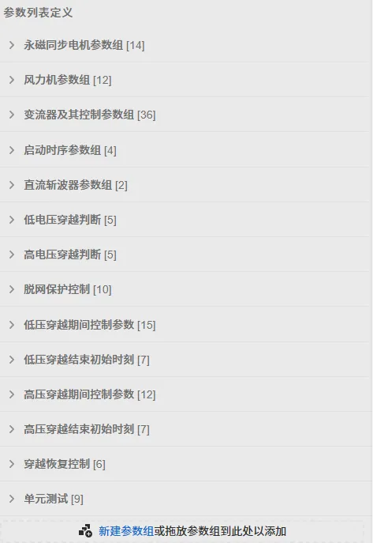
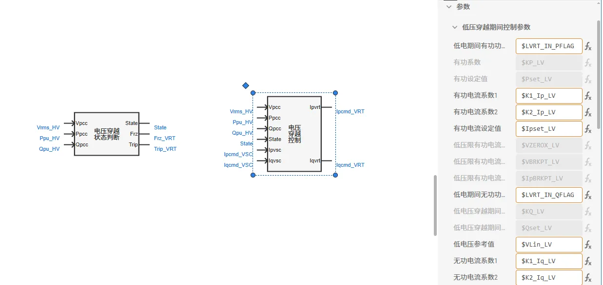
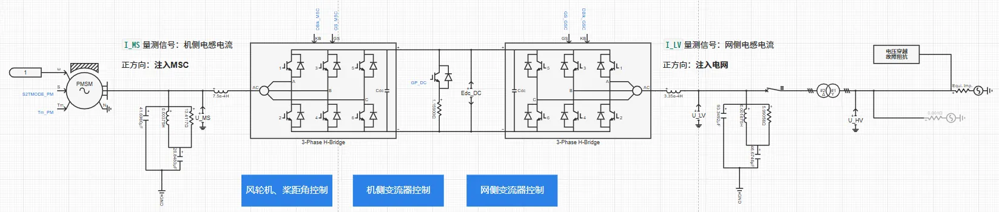
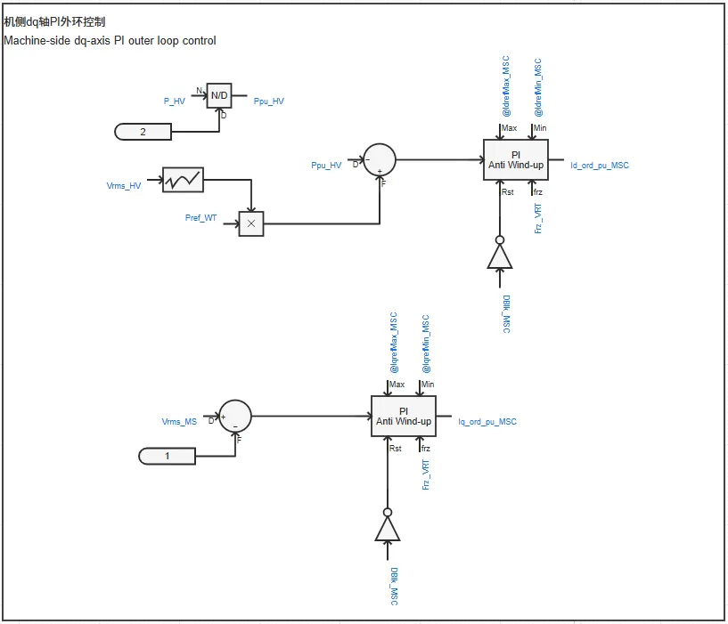
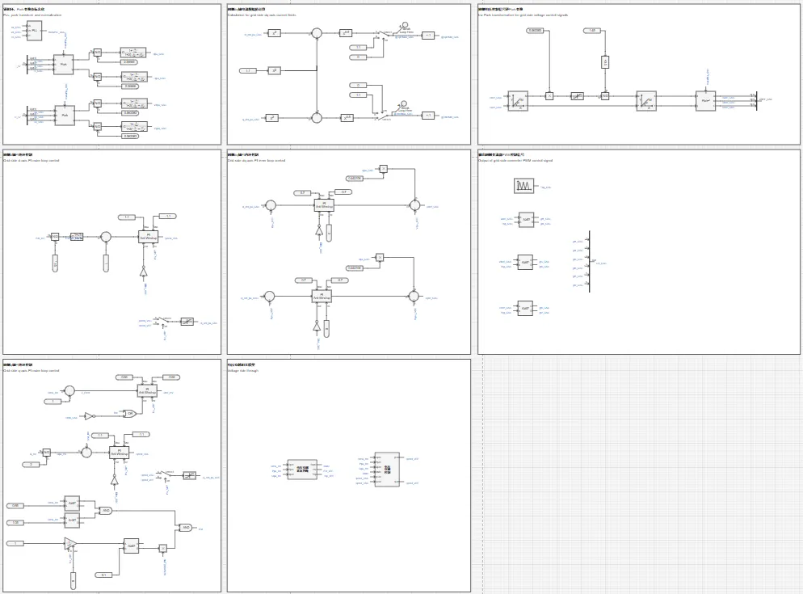
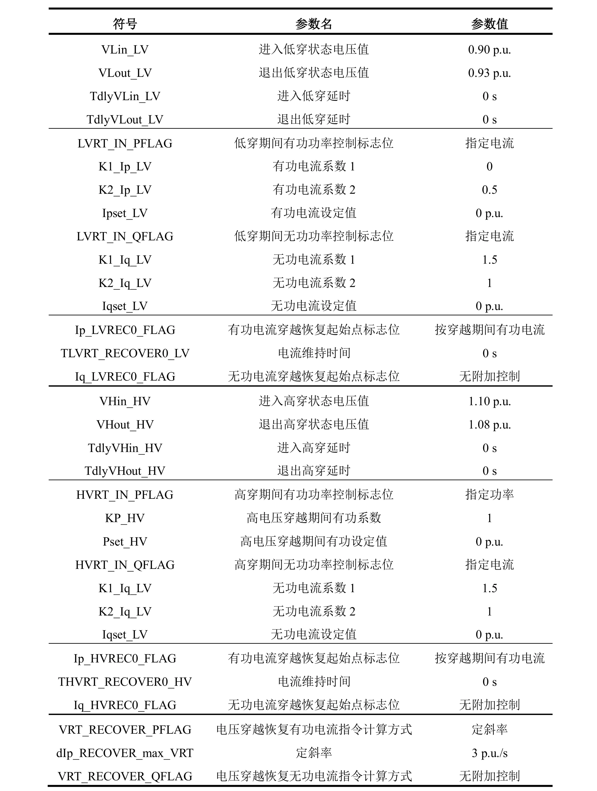
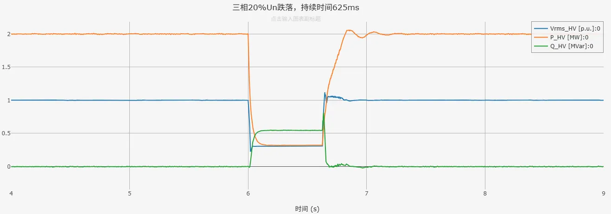
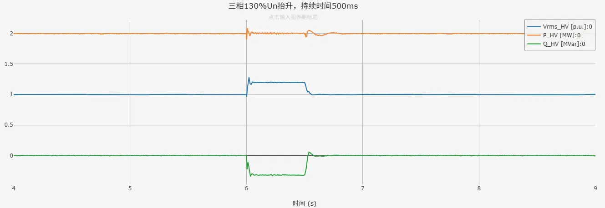

## 案例介绍

在[**直驱风机01型-快速详细模型-标准模型-v1**](../10-wtg_pmsg_01-fdm-std-v1/index.md)与[**直驱风机01型-平均模型-标准模型-v1**](../30-wtg_pmsg_01-avm-std-v1/index.md)的基础上，将简单高低穿控制替换为[**电压穿越状态判断模块**](../../../../170-voltage-ride-though-model/10-vrt_sd-stdm-v1/index.md)、[**电压穿越控制模块**](../../../../170-voltage-ride-though-model/20-vrt_ctrl-stdm-v1/index.md)，形成**直驱风机01型-快速详细\平均模型-标准模型-v2**典型案例。

## 使用方法说明

与**直驱风机01型-快速详细\平均模型-标准模型-v1**一致。 

  
## 算例介绍

**直驱风机01型-快速详细\平均模型-标准模型-v2**与直驱风机01型-快速详细\平均模型-标准模型-v1存在以下不同：

**模型参数**：增加了电压穿越控制相关的参数列表，并将参数穿透至电压穿越状态判断模块与电压穿越控制模块。  

  

  

**电气主拓扑**：
+ 将并网方式中的经线路阻抗后与理想电压源相连，替换为与戴维南等值电压源相连，等值阻抗由短路比、阻抗比计算得到  
+ 在升压变压器处设置由Dblk解锁信号与电压保护切机信号控制的断路器，实现电压保护脱网控制  
+ 将高低压穿越故障模块替换为封装的电压穿越故障阻抗模块，适用于与戴维南等值电压源相连，不限制短路比的大小；目前暂不支持高电压穿越的工况  

**机侧变流器控制**：设置dq轴外环PI控制在电压穿越期间冻结，避免故障切除后输出功率出现较大超调。  

**网侧变流器控制**：
+ 设置dq轴外环PI控制在电压穿越期间冻结  
+ 加入电压穿越状态判断模块、电压穿越控制模块  
+ 电压穿越期间，将参与dq轴内环PI控制的变流器控制电流指令值替换为电压穿越控制电流指令值  

## 算例仿真测试

在高低压穿越测试中，**直驱风机01型-快速详细\平均模型-标准模型-v2**与直驱风机01型-快速详细\平均模型-标准模型-v1一致，可在短路比≥1.5时，在高低压穿越测试中穿越成功。  
电压穿越相关参数设置如下：  

  

以下为SCR=2时，**直驱风机01型-快速详细模型-标准模型-v2**在三相20%Un跌落、三相130%Un抬升工况下的仿真结果。其中，蓝色曲线Vrms_HV为并网点电压、黄色曲线P_HV为并网点处有功功率、红色曲线Q_HV为并网点处无功功率。  

  

由仿真结果可以看到，电压穿越状态判断模块与电压穿越控制模块正常工作，**直驱风机01型-快速详细模型-标准模型-v2**穿越成功。  

## 模型地址

点击打开模型地址：[**直驱风机01型-快速详细模型-标准模型-v2**](http://cloudpss-calculate.local.ddns.cloudpss.net/model/open-cloudpss/WTG_PMSG_01-fdm-std-v2a1)  

点击打开模型地址：[**直驱风机01型-平均模型-标准模型-v2**](http://cloudpss-calculate.local.ddns.cloudpss.net/model/open-cloudpss/WTG_PMSG_01-avm-std-v2a1)  

<!-- 
## 附：修改及调试日志
直驱风机01型-快速详细模型-标准模型-v2：
+ 20250717 
  + 在直驱风机01型-快速详细模型-标准模型v1b2的基础上，将原有的简单高低穿控制替换为封装的电压穿越控制模型、电压穿越运行状态判断模型，并加入低电压穿越故障阻抗模块
  + 增加电压穿越控制相关的参数列表，并穿透至封装模型
  + 在变流器控制中增加与电压穿越控制模型的交互
  + 增加电压穿越控制相关变量的输出通道
  + 将并网方式中的经线路阻抗后与理想电压源相连，替换为与戴维南等值电压源相连，等值阻抗由短路比、阻抗比计算得到
  + 设置GSC、MSC变流器控制外环PI控制在电压穿越期间均被冻结
+ 20250725 
  + 替换二阶传递函数模块
  + 修改电流方向和坐标变化，统一注入电网为正
  + 完善模型布局与参数、变量的标准化命名
  + 调整变流器控制中d轴电流、q轴电流与输出有功、无功功率方向一致
 

直驱风机01型-平均模型-标准模型-v2：
+ 20250727 
  + 在直驱风机01型-平均模型-标准模型v1b2的基础上，将原有的简单高低穿控制替换为封装的电压穿越控制模型、电压穿越运行状态判断模型，并加入低电压穿越故障阻抗模块
  + 增加电压穿越控制相关的参数列表，并穿透至封装模型
  + 在变流器控制中增加与电压穿越控制模型的交互
  + 增加电压穿越控制相关变量的输出通道
  + 将并网方式中的经线路阻抗后与理想电压源相连，替换为与戴维南等值电压源相连，等值阻抗由短路比、阻抗比计算得到
  + 设置GSC、MSC变流器控制外环PI控制在电压穿越期间均被冻结
  + 完善模型布局与参数、变量的标准化命名

-->
