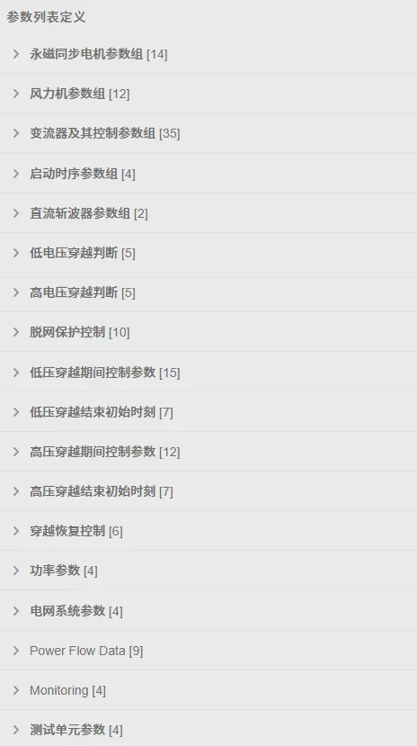
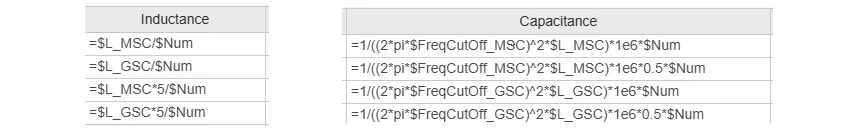
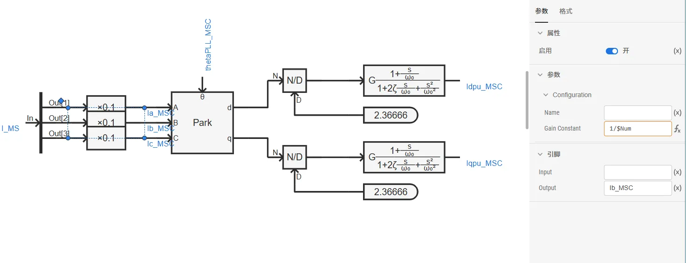
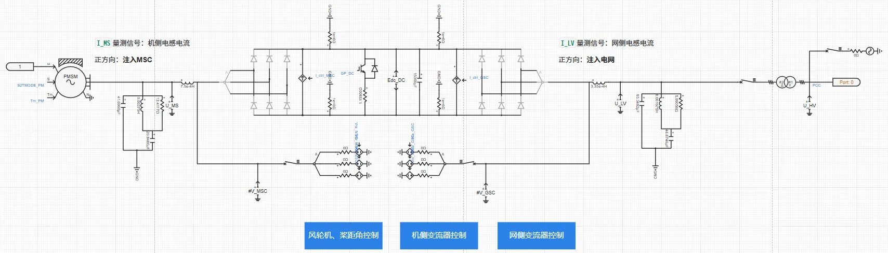
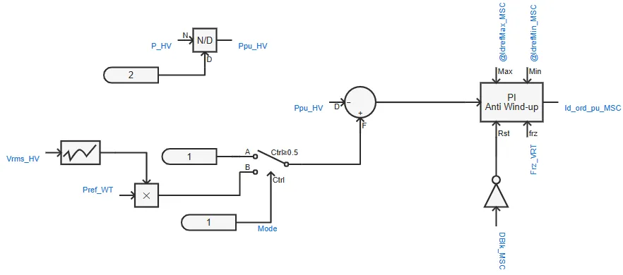
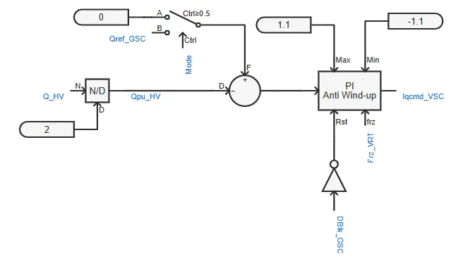
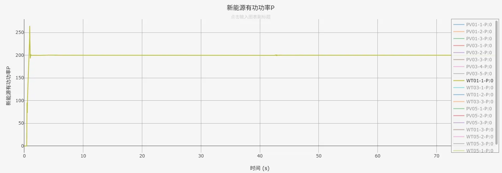
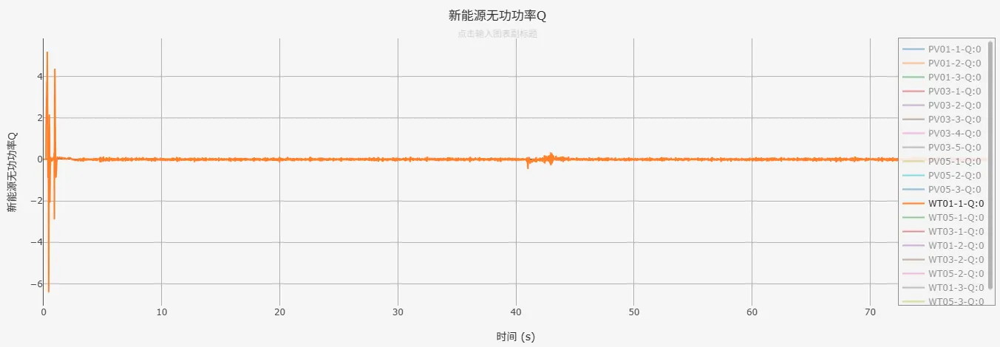

## 案例介绍

在[**直驱风机01型-平均模型-标准模型-v2**](../40-wtg_pmsg_01-fdm_avm-std-v2/index.md)的基础上，进行元件封装和倍乘等值，并建立潮流初始化模型，形成**直驱风机01型-标准封装模型-v2**典型案例。  

## 使用方法说明

1、在潮流计算参数组中填写节点注入有功功率、无功功率，在功率参数组中填写风电场额定容量  
2、进行潮流计算并写回潮流计算结果，即可自动填入用于暂态仿真的电网系统参数组，以及有功、无功功率指令  
3、开始电磁暂态仿真

  
## 算例介绍

**直驱风机01型-标准封装模型-v2**与直驱风机01型-平均模型-标准模型-v2存在以下不同：

**模型参数**：增加了潮流计算参数组、功率参数租、电网系统参数组，以及量测参数组。  

**倍乘等值**：按设备额定容量、风机台数数量变化倍数线性缩放电阻、电感、电容等参数，并保持电压、电流标幺值不变（有名值需要折算），在简化模型规模的同时，使等效模型在并网点呈现与真实多机系统相似的功率输出和动态响应，从而满足系统级稳定性分析的需求。  

   

  

**电气主拓扑**：在升压变压器高压侧添加与外部相连的模块端口。  

**变流器控制**：在机侧变流器控制d轴外环PI控制（并网点有功功率控制）和网侧变流器控制q轴外环PI控制（并网点无功功率控制）处，新增功率参考值控制方式，实现直驱风机风场等值模型暂态仿真稳态时的输出功率与潮流计算结果一致。  

  
## 算例仿真测试

在[CSEE标准系统-频率稳定](../../../../80-csee-standard-systems/50-frequency-stability/index.md)中加入**直驱风机01型-标准封装模型-v2**进行测试，仿真结果表明模型可以正常运行。  

  

## 模型地址

点击打开模型地址：[**直驱风机01型-标准封装模型-v2**](http://cloudpss-calculate.local.ddns.cloudpss.net/model/open-cloudpss/WTG_PMSG_01-avm-stdm-v2a1)  

<!-- 
## 附：修改及调试日志

+ 20250715~0716 
  + 在之前用于标准算例测试的直驱风机01型-封装模型的基础上，将原有的高低穿控制替换为封装的电压穿越控制模型、电压穿越运行状态判断模型，并将电压穿越模型参数映射至参数列表
  + 优化整理参数列表，新增脱网保护控制参数列表
  + 修改脱网保护标志位（修改为0：正常运行；1：脱网保护），以及触发脱网保护事件日志的方式（修改为上升沿触发）
  + 加入戴维南等值电压源，等值阻抗由短路比、阻抗比计算得到
  + 加入低电压穿越故障阻抗模块
  + 删去电压穿越控制、状态判断图纸，将电压穿越相关模型移至主拓扑图纸中
  + 设置GSC、MSC变流器控制外环PI控制在电压穿越期间均被冻结，以解决输出有功小于额定值时，电压恢复后功率出现较大突刺的问题
+ 20250717 优化模型布局
+ 20250725 
  + 替换二阶传递函数模块
  + 修改电流方向和坐标变化，统一注入电网为正
  + 完善模型布局与参数、变量的标准化命名
  + 调整变流器控制中d轴电流、q轴电流与输出有功、无功功率方向一致
+ 20250728 计算并网点电压标幺值时，基准值修改为并网点电压有效值/并网点电压幅值，以根据潮流计算结果正确计算并网点电压标幺值

-->
