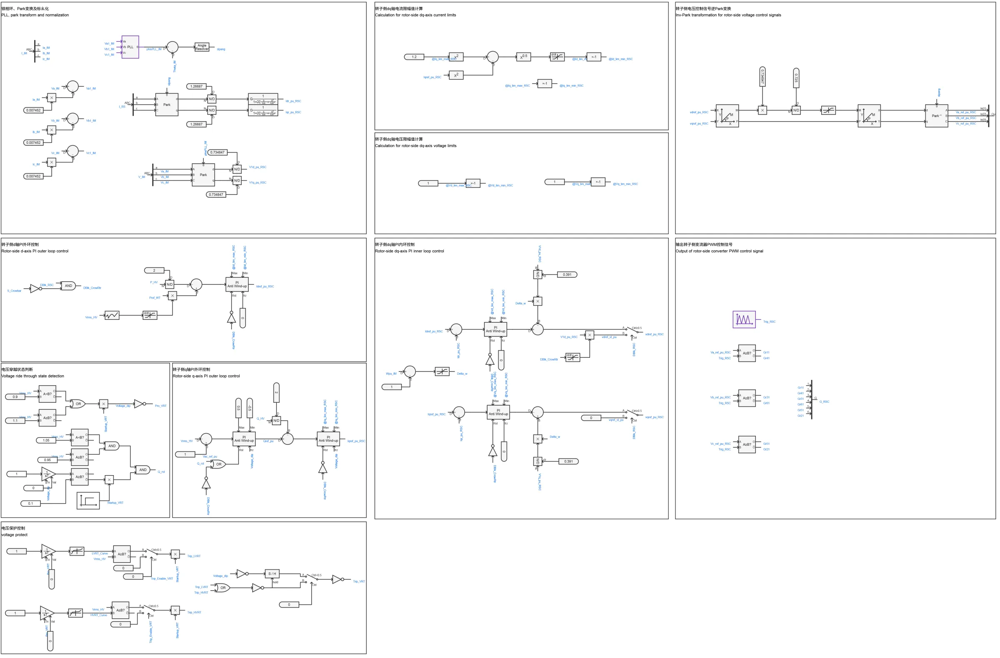
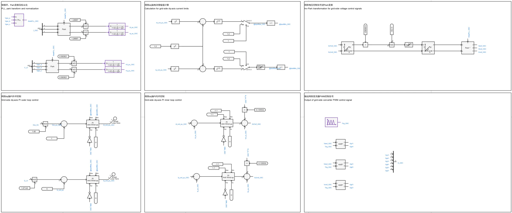

## 案例介绍

包含风轮机及桨距角控制、最大功率追踪控制、转子侧变流器控制、网侧变流器控制、脱网保护控制、简单电压穿越控制以及高低压穿越故障等模块的**跟网型双馈风机01型-快速详细模型-标准模型-v1**的典型案例。

## 使用方法说明

### 适用场景  

支持多短路比下的单机并网测试，适用于以下分析场景：
   + 风速变化响应测试  
   + 高低电压穿越测试  
   + 风机控制策略验证  
   + 不同电网强度下的风机运行特性分析  

### 适用范围  
   + 可稳定运行的风速范围：3-25m/s  
   + 建议步长范围：1-10μs  
   + 高低压穿越成功的短路比≥1.5 

### 功能概述  
   + 高低电压穿越电压阈值、变流器PI控制参数、初始风速等参数均开放可调  
   + 支持网侧变流器控制中dq轴电流优先模式的切换  
   + 支持并网方式的切换  
   + 脱网保护控制、撬棒电路可切换启用/禁用状态

  
## 算例介绍

**双馈风机01型-快速详细模型-标准模型-v1**由电气主拓扑、风轮机及桨距角控制、转子侧变流器控制、网侧变流器控制、撬棒过压保护控制及高低压穿越故障等六个部分组成。

**电气主拓扑**由绕线式感应电机、交流滤波器、Chopper斩波电路、IGBT开关详细建模的变流器、撬棒过压保护电路、升压变压器及单元测试组成。  
风机并网有两种方式可以选择：风机直接与理想电压源相连；风机经线路阻抗后与理想电压源相连，线路阻抗大小由短路比、阻抗比计算得到。两种并网方式的切换以及短路比、阻抗比的大小均可在参数组中进行设置。  

**风轮机及桨距角控制**由风力机模块、桨距角控制模块、MPPT控制模块等部分组成，这些模块的功能为捕获风功率、调节桨距角、实现最大功率追踪。  

**转子侧变流器控制**由锁相环、Park变换、转子侧dq轴内外环控制、转子侧dq轴电流限幅值计算、转子侧电压控制信号逆Park变换、输出转子侧变流器PWM控制信号，以及脱网保护控制等部分组成，实现对并网点处输出有功、无功功率的控制。无功功率控制部分包含电压穿越状态判断，具备简单的高低压穿越能力。  

**网侧变流器控制**与转子侧变流器控制的组成类似，用来实现对直流电压、网侧变流器输出无功功率的控制。  

**撬棒过压保护控制**在电网故障时短接转子绕组，限制电流，从而达到保护变流器的目的。

为方便进行高低压穿越测试，搭建了适用于经线路阻抗后与理想电压源相连时的**高低压穿越故障模块**，用户在参数方案中选取电压穿越类型，即可自动启用并设置相应的故障阻抗与故障持续时间。目前给出的故障阻抗参数适用于短路比为2时的工况。  

  
## 算例仿真测试

对**双馈风机01型-快速详细模型-标准模型-v1**分别进行了变风速测试和高低压穿越测试。

### 变风速测试结果
双馈风机标准模型的切入、切出风速为3m/s、25m/s，可在该风速范围内正常运行。**双馈风机01型-快速详细模型-标准模型-v1**在变风速测试中的仿真结果如下。其中，蓝色曲线P_HV为并网点处有功功率、黄色曲线P_IM为异步电机处有功功率；红色曲线P_LV为网侧变压器处有功功率。  
  
  

### 高低压穿越测试结果
按照《GB/T 36995-2018, 风力发电机组 故障电压穿越能力测试规程》国标要求进行高低压穿越测试，测试结果如下列各表所示（✓代表穿越成功，×代表穿越失败）。  

|          |  SCR=2  |  SCR=1.5  |  SCR=1  |
|:--------:|:-------:|:---------:|:-------:|
|  穿越情况 |    ✓    |    ✓     |   ×     |  

由上表测试结果可以看到，双馈风机标准模型可在短路比≥1.5时，在高低压穿越测试中穿越成功。  
以下为SCR=2时，**双馈风机01型-快速详细模型-标准模型-v1**在三相20%Un跌落、三相130%Un抬升工况下的仿真结果。其中，蓝色曲线Vrms_HV为并网点电压、黄色曲线P_HV为并网点处有功功率、红色曲线Q_HV为并网点处无功功率。  

  

由仿真结果可以看到，双馈风机标准模型在电网电压跌落、抬升期间，输出有功、无功功率能够按照故障电压穿越能力的要求响应电压变化，且并网点电压能够在故障切除后恢复至初始状态，表明**双馈风机01型-快速详细模型-标准模型-v1**穿越成功。  

## 模型地址

点击打开模型地址：[**双馈风机01型-快速详细模型-标准模型-v1**](cloudpss:/model/open-cloudpss/WTG_DFIG_01-fdm-std-v1b3)  

## 附录

### 参数

import Parameters from './_parameters.md'

<Parameters/>

<!-- 
## 附：修改及调试日志

+ 20241223 验证异步电机外接鼠笼电路正确性，对比PSCAD中的鼠笼异步电机等值电路图，在CloudPSS中绘制易于理解的外接鼠笼等值电路图
+ 20241224 整理参数，参数标准化
+ 20241225 整理模型
    + 对比PSCAD中的双馈风机详细化模型，补充缺失的控制与参数（风力机部分缺少切入切出风速的控制，GSC侧控制缺少电流限制有功、无功优先的选择）
    + 补上之前参数表中遗漏的crowbar电路参数
+ 20241226 修改模型存在的问题
    + 功率量测元件基准频率有误
    + 增添全局变量
    + 整合解锁信号
    + 修改Crowbar控制
+ 20241227 修改模型存在的问题
    + 修改Crowbar外接二极管电路
    + 排查到风力机输出Pref处缺少速度限幅器
    + 修改GSC中PI控制器为抗饱和PI控制器
    + 修改I_RS电流表方向为注入变流器方向
    + 修改参数名中后缀为CONV的为GSC
    + 修改DBlk相关命名
+ 20241230-1231 调试功率突刺，修改模型存在的问题
+ 20250102 将全局变量移到参数列表中，调整功率量测方向一致
+ 20250106 为解决低风速下风机输出功率为负值的问题，尝试将风轮机及桨距角控制模块中的MPPT实现方式更改为综稳中的查表法，并新增转矩PI控制，但结果与PSCAD中的公式法基本一致，因此仍保留PSCAD中的公式法实现MPPT
+ 20250107 在转子侧变流器q轴PI控制中新增一个给PI控制器的重置信号，该信号会在监测到故障结束且电压回稳后动作，以解决风机输出无功在故障结束后回不到0的问题
+ 20250117 增加双馈风机外接理想电压源或戴维南等效电压源的选项，并增添故障设置的相关参数
+ 20250208 基于Simulink官方双馈风机模型，修改CloudPSS双馈风机模型电机、变流器PI控制相关参数，修改后风机在低风速下输出功率不再为负
+ 20250217 修改戴维南理想电压源的等值电阻电抗值，解决了风机接戴维南理想电压源时，输出无功一直跌落的问题
+ 20250218 增加风机接戴维南等效电压源时，由用户设置的短路比和阻抗比，计算得到戴维南等效电压源的阻抗值参数
+ 20250226 删去参数表中鼠笼相关参数
+ 20250310 根据标准模型规范修改相关描述
    + 设置风机高/低穿电压阈值和并网点电压为用户可调参数
    + 删去现有的外接戴维南等效电压源方式
+ 20250321 
    + 在并网处加入由短路比和阻抗比计算得到的线路阻抗
    + 提供风机直接与理想电压源相连，经线路阻抗与理想电压源相连两种并网方式
    + 加入高低穿故障测试模块
+ 20250326 
    + 优化高低穿故障测试模块，给定SCR=2时进行高低穿测试时的故障阻抗、电容大小
    + 修改转子侧外环控制中低压功率逻辑特征电压值参数，以解决SCR=1.5时电压穿越失败的问题
+ 20250328 修改转子侧变流器控制中定子电阻为有名值
+ 20250727 更新模型版本为v1b2，更新内容如下：
    + 修改直流电容的初始电压为直流电压基准值
    + 模型描述修改为markdown格式
    + 删去不必要的电流表
    + 优化变量名和模型布局
    + 修改电流方向和坐标变化，统一注入电网为正
    + 调整变流器控制中d轴电流、q轴电流与输出有功、无功功率方向一致
    + 不启用crowbar时禁用整个crowbar电路，否则会出现功率振荡问题
+ 20250818 加入电压保护脱网控制
 
-->
