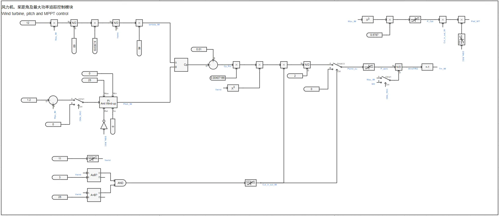

## 案例介绍

包含风轮机及桨距角控制、转子侧变流器控制、网侧变流器控制、简单高低穿控制以及高低压穿越故障等模块的**跟网型双馈风机01型-平均模型-标准模型-v1**的典型案例。

## 使用方法说明

**双馈风机01型-平均模型-标准模型-v1**的适用范围：  
   + 可稳定运行的风速范围：3-25m/s  
   + 建议步长范围：1-50μs  
   + 高低压穿越成功的短路比≥1.5 

  
## 算例介绍

**双馈风机01型-平均模型-标准模型-v1**由电气主拓扑、风轮机及桨距角控制、转子侧变流器控制、网侧变流器控制、撬棒过压保护控制及高低压穿越故障等六个部分组成。模型参数列表如下图所示。  

**电气主拓扑**由绕线式感应电机、交流滤波器、Chopper斩波电路、等效受控电压源/电流源建模的变流器、撬棒过压保护电路、升压变压器及单元测试组成。  
风机并网有两种方式可以选择：风机直接与理想电压源相连；风机经线路阻抗后与理想电压源相连，线路阻抗大小由短路比、阻抗比计算得到。两种并网方式的切换以及短路比、阻抗比的大小均可在参数组中进行设置。  

**风轮机及桨距角控制**由风力机模块、桨距角控制模块、MPPT控制模块等部分组成，这些模块的功能为捕获风功率、调节桨距角、实现最大功率追踪。  

**转子侧变流器控制**由锁相环、Park变换、转子侧dq轴内外环控制、转子侧dq轴电流限幅值计算、转子侧电压控制信号逆Park变换与输出转子侧变流器控制信号等部分组成，实现对并网点处输出有功、无功功率的控制。无功功率控制部分包含电压穿越状态判断，具备简单的高低压穿越能力。  

**网侧变流器控制**与转子侧变流器控制的组成类似，用来实现对直流电压、网侧变流器输出无功功率的控制。  

**撬棒过压保护控制**在电网故障时短接转子绕组，限制电流，从而达到保护变流器的目的。  

为方便进行高低压穿越测试，搭建了适用于经线路阻抗后与理想电压源相连时的**高低压穿越故障模块**，用户在参数方案中选取电压穿越类型，即可自动启用并设置相应的故障阻抗与故障持续时间。目前给出的故障阻抗参数适用于短路比为2时的工况。  

  
## 算例仿真测试

对**双馈风机01型-平均模型-标准模型-v1**分别进行了变风速测试和高低压穿越测试。

### 变风速测试结果
双馈风机平均模型标准模型的切入、切出风速为3m/s、25m/s，可在该风速范围内正常运行。双馈风机平均模型标准模型在变风速测试中的仿真结果如下。其中，蓝色曲线P_HV为并网点处有功功率、黄色曲线P_IM为异步电机处有功功率；红色曲线P_LV为网侧变压器处有功功率。  

  

### 高低压穿越测试结果
按照国标要求进行高低压穿越测试，测试结果如下列各表所示（✓代表穿越成功，×代表穿越失败）。  

|          |  SCR=2  |  SCR=1.5  |  SCR=1  |
|:--------:|:-------:|:---------:|:-------:|
|  穿越情况 |    ✓    |    ✓     |   ×     |  

由上表测试结果可以看到，双馈风机平均模型标准模型可在短路比≥1.5时，在高低压穿越测试中穿越成功。  
以下为SCR=2时，双馈风机平均模型标准模型在三相20%Un跌落、三相130%Un抬升工况下的仿真结果。其中，蓝色曲线Vrms_HV为并网点电压、黄色曲线P_HV为并网点处有功功率、红色曲线Q_HV为并网点处无功功率。  

  

  

由仿真结果可以看到，双馈风机平均模型标准模型在电网电压跌落、抬升期间，输出有功、无功功率能够按照故障电压穿越能力的要求响应电压变化，且并网点电压能够在故障切除后恢复至初始状态，表明**双馈风机01型-平均模型-标准模型-v1**穿越成功。  

## 模型地址

点击打开模型地址：[**双馈风机01型-平均模型-标准模型-v1**](http://cloudpss-calculate.local.ddns.cloudpss.net/model/open-cloudpss/WTG_DFIG_01-avm-std-v1b2)  

<!-- 
## 附：修改及调试日志

+ 20250102 在标准详细化双馈风机的基础上，修改变流器模块为平均化变流器，平均化变流器与PSCAD平均化双馈风机模型中的变流器保持一致，并修改变流器输入的控制信号
+ 20250107 在转子侧变流器q轴PI控制中新增一个给PI控制器的重置信号，该信号会在监测到故障结束且电压回稳后动作，以解决风机输出无功在故障结束后回不到0的问题
+ 20250116 将封装的平均化变流器模块穿透到底层，并将受控电压源的输入信号控制环节整合到转子侧和网侧变流器控制图纸中
+ 20250117 增加双馈风机外接理想电压源或戴维南等效电压源的选项，并增添故障设置的相关参数
+ 20250226 将详细化模型的修改同步到平均化模型
    + 基于Simulink官方双馈风机模型，修改CloudPSS双馈风机模型电机、变流器PI控制相关参数，修改后风机在低风速下输出功率不再为负
    + 修改戴维南理想电压源的等值电阻电抗值，解决了风机接戴维南理想电压源时，输出无功一直跌落的问题
    + 增加风机接戴维南等效电压源时，由用户设置的短路比和阻抗比，计算得到戴维南等效电压源的阻抗值参数
    + 删去参数表中鼠笼相关参数
+ 20250310 根据标准模型规范修改相关描述
    + 设置风机高/低穿电压阈值和并网点电压为用户可调参数
    + 删去现有的外接戴维南等效电压源方式
+ 20250321 
    + 在并网处加入由短路比和阻抗比计算得到的线路阻抗
    + 提供风机直接与理想电压源相连，经线路阻抗与理想电压源相连两种并网方式
    + 加入高低穿故障测试模块
+ 20250326 
    + 优化高低穿故障测试模块，给定SCR=2时进行高低穿测试时的故障阻抗、电容大小
    + 修改受控电压源内阻为0.01Ω
    + 修改转子侧外环控制中低压功率逻辑特征电压值参数，以解决SCR=1.5时电压穿越失败的问题
+ 20250328 修改转子侧变流器控制中定子电阻为有名值
+ 20250727 更新模型版本为v1b2，更新内容如下：
    + 修改直流电容的初始电压为直流电压基准值
    + 模型描述修改为markdown格式
    + 删去不必要的电流表
    + 优化变量名和模型布局
    + 修改电流方向和坐标变化，统一注入电网为正
    + 调整变流器控制中d轴电流、q轴电流与输出有功、无功功率方向一致
    + 不启用crowbar时禁用整个crowbar电路，否则会出现功率振荡问题
    + 删去与转子侧、网侧受控电压源相连的5e-4大小的电阻，简化风机模型
    + 模型描述修改为markdown格式
    + 将受控电压源内阻改为0Ω
    + 增加闭锁二极管启用开关
 
-->
