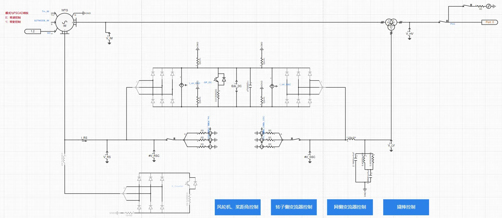

## 案例介绍

在[**双馈风机01型-平均模型-标准模型-v1**](../30-wtg_dfig_01-avm-std-v1/index.md)的基础上，进行元件封装和倍乘等值，并建立潮流初始化模型，形成**双馈风机01型-标准封装模型-v1**典型案例。  

## 使用方法说明

1、在潮流计算参数组中填写节点注入有功功率、无功功率，在功率参数组中填写风电场额定容量  
2、进行潮流计算并写回潮流计算结果，即可自动填入用于暂态仿真的电网系统参数组，以及有功、无功功率指令  
3、开始电磁暂态仿真 

  
## 算例介绍

**双馈风机01型-标准封装模型-v1**与双馈风机01型-平均模型-标准模型-v1存在以下不同：

**模型参数**：增加了潮流计算参数组、功率参数租、电网系统参数组，以及量测参数组。 

**倍乘等值**：按设备额定容量、风机台数数量变化倍数线性缩放电阻、电感、电容等参数，并保持电压、电流标幺值不变（有名值需要折算），在简化模型规模的同时，使等效模型在并网点呈现与真实多机系统相似的功率输出和动态响应，从而满足系统级稳定性分析的需求。  

  

**电气主拓扑**：  
+ 在升压变压器高压侧添加与外部相连的模块端口  
+ 在单元测试中与戴维南等值电压源相连，等值阻抗由短路比、阻抗比计算得到  
+ 将高低压穿越故障模块替换为封装的电压穿越故障阻抗模块，适用于与戴维南等值电压源相连，不限制短路比的大小；目前暂不支持高电压穿越的工况  

  

**转子侧变流器控制**：在转子侧变流器控制d轴外环PI控制（并网点有功功率控制）和q轴外环PI控制（并网点无功功率控制）处，新增功率参考值控制方式，实现双馈风机风场等值模型暂态仿真稳态时的输出功率与潮流计算结果一致。  

  

  
## 算例仿真测试

在[CSEE标准系统-频率稳定](../../../../80-csee-standard-systems/50-frequency-stability/index.md)中加入**双馈风机01型-标准封装模型-v1**进行测试，仿真结果表明模型可以正常运行。  

  

  

## 模型地址

点击打开模型地址：[**双馈风机01型-标准封装模型-v1**](http://cloudpss-calculate.local.ddns.cloudpss.net/model/open-cloudpss/WTG_DFIG_01-avm-stdm-v1a1)  

<!-- 
## 附：修改及调试日志

+ 20250729 在双馈风机01型-平均模型-标准模型的基础上，进行功率倍乘，建立潮流初始化模型，新增功率参考值控制方式，形成双馈风机01型-标准封装模型

-->
