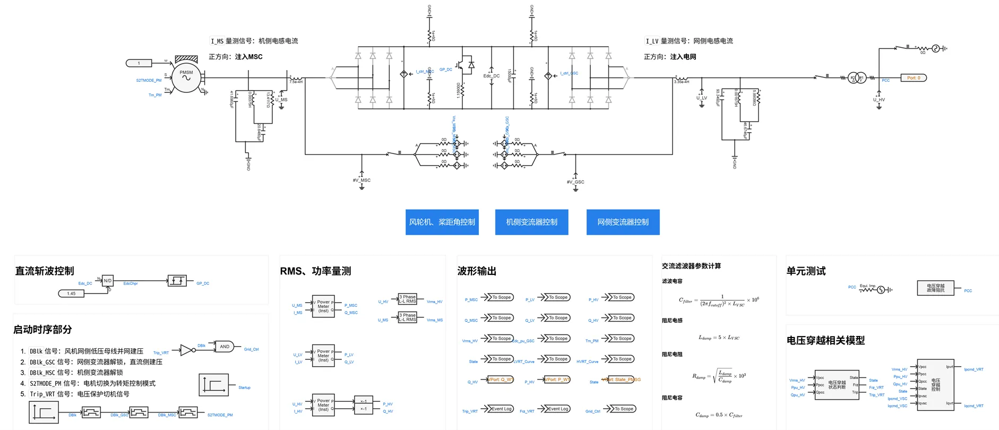
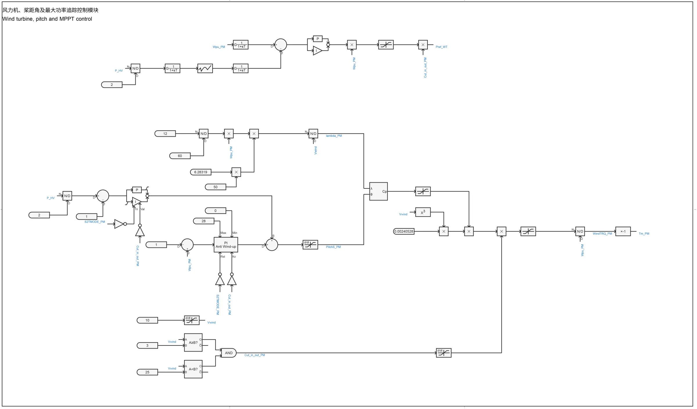
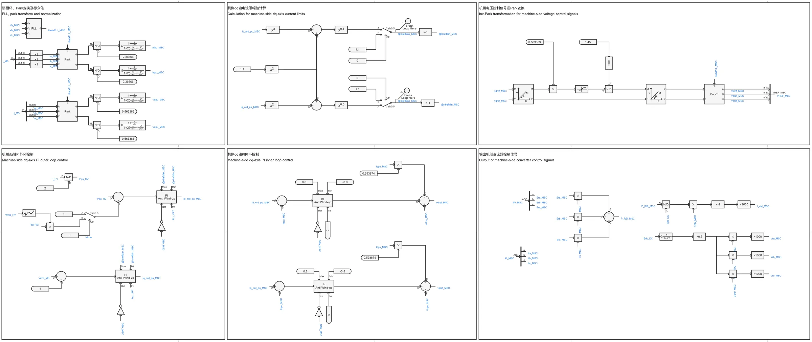
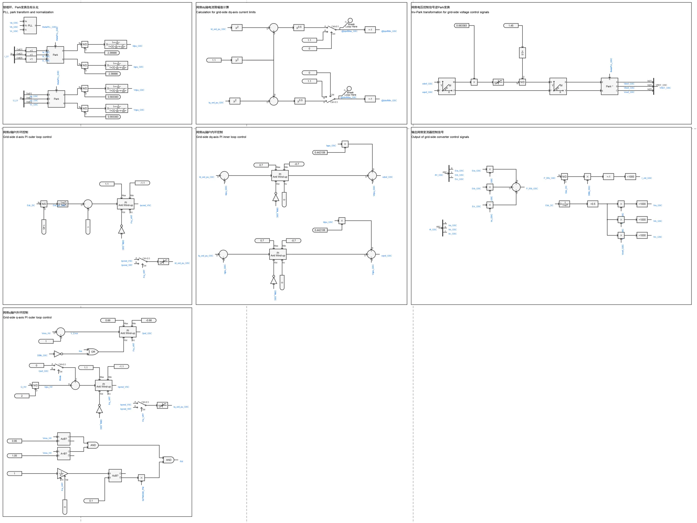
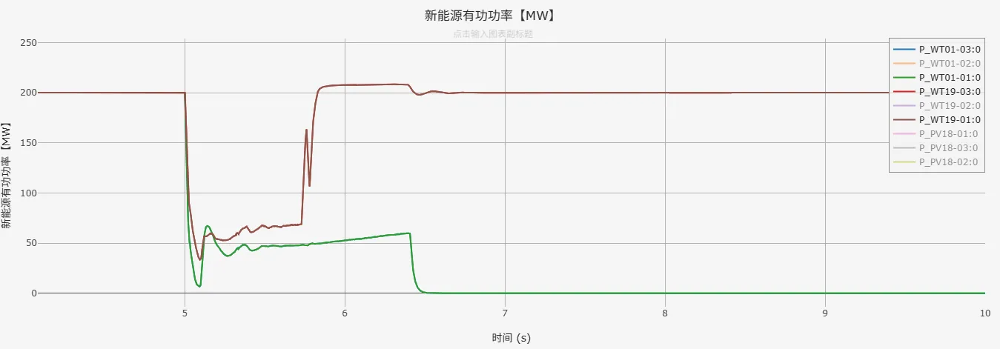
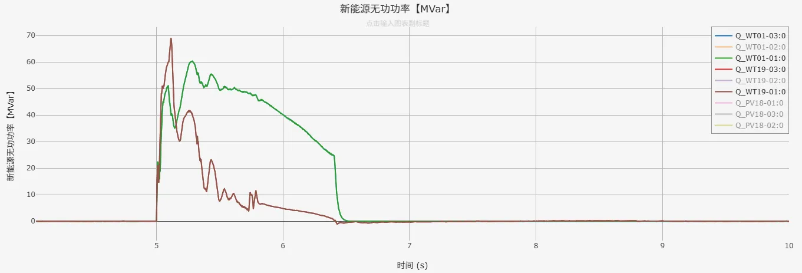

## 元件介绍

在[直驱风机01型-平均模型-标准模型-v2](../../10-wtg_pmsg/10-wtg_pmsg_01/40-wtg_pmsg_01-avm-std-v2/index.md)的基础上，进行元件封装和倍乘等值，增加功率参考值控制，建立潮流初始化模型，形成**直驱风机01型-标准封装模型-v2**。  

## 使用方法说明

### 适用场景
元件支持单机或接入大规模电力系统算例的仿真测试，适用于以下分析场景：
   + 风速变化响应测试  
   + 高低电压穿越测试  
   + 风机控制策略验证  
   + 不同电网强度下的风机运行特性分析  
   + 考虑系统功角、频率、电压的电网稳定性分析
   + 高比例新能源接入下的系统支撑能力评估  

### 适用范围  

   + 可稳定运行的风速范围：8-25m/s  
   + 建议步长范围：1-50μs  
   + 高低压穿越成功的短路比≥1.5

### 功能概述  

   + 电压穿越控制详细参数、变流器PI控制参数、初始风速等参数均开放可调  
   + 支持网侧、机侧变流器控制中dq轴电流优先模式的切换  
   + 高低电压穿越判断、脱网保护控制可切换启用/禁用状态
  
## 算例介绍

**直驱风机01型-标准封装模型-v2**由电气主拓扑、风轮机及桨距角控制、机侧变流器控制、网侧变流器控制、[电压穿越状态判断模块](../../70-voltage-ride-though-model/10-vrt_sd-stdm-v1/index.md)、[电压控制模块](../../70-voltage-ride-though-model/20-vrt_ctrl-stdm-v1/index.md)以及电压穿越故障阻抗等模块组成。  
与直驱风机01型-平均模型-标准模型-v2相比，主要有以下不同：  

+ **元件封装**：将模型进行封装，并在升压变压器高压侧添加与外部相连的模块端口  
+ **倍乘等值**：按设备额定容量、并联数量变化倍数，线性缩放电阻、电感、电容等参数，并保持电压、电流标幺值不变（有名值需要折算），在简化模型规模的同时，使等效模型在并网点呈现与真实多机系统相似的功率输出和动态响应，从而满足系统级稳定性分析的需求  
+ **功率参考值控制**：在机侧变流器控制d轴外环PI控制（并网点有功功率控制）和网侧变流器控制q轴外环PI控制（并网点无功功率控制）处，新增功率参考值控制方式，实现直驱风机01型-标准封装模型暂态仿真稳态时的输出功率与潮流计算结果一致

**电气主拓扑**由永磁同步发电机、交流滤波器、Chopper斩波电路、等效受控电压源/电流源建模的变流器、升压变压器及单元测试组成。  

**风轮机及桨距角控制**由风力机模块、桨距角控制模块、转矩控制模块等机械部分组成，这些模块的功能为捕获风功率、调节桨距角、实现最大功率追踪。  

**机侧变流器控制**由锁相环、Park变换、机侧dq轴内外环控制、机侧dq轴电流限幅值计算、机侧电压控制信号逆Park变换与输出机侧变流器控制信号等部分组成，实现对机侧交流电压、并网点处输出有功功率的控制。  
  

**网侧变流器控制**与机侧变流器控制的组成类似，用来实现对直流电压、并网点处输出无功功率的控制。  

  
## 算例仿真测试
在[CSEE-CLV](../../../80-csee-standard-cases/60-csee_vs_clv-v1/index.md)标准算例中加入**直驱风机01型-标准封装模型-v2**进行测试，仿真结果表明封装模型可以按照潮流计算结果进行暂态初始化，故障期间进入低电压穿越，并触发相应的电压保护脱网控制，验证了模型的正确性。  

  

## 模型地址

点击打开模型地址：[**直驱风机01型-标准封装模型-v2**](https://cloudpss.net/model/open-cloudpss/WTG_PMSG_01-avm-stdm-v2b1)  

## 附录

### 参数

import Parameters from './_parameters.md'

<Parameters/>

### 引脚

import Pins from './_pins.md'

<Pins/>

<!-- 
## 附：修改及调试日志

+ 20250715~0716 
  + 在之前用于标准算例测试的直驱风机01型-封装模型的基础上，将原有的高低穿控制替换为封装的电压穿越控制模型、电压穿越运行状态判断模型，并将电压穿越模型参数映射至参数列表
  + 优化整理参数列表，新增脱网保护控制参数列表
  + 修改脱网保护标志位（修改为0：正常运行；1：脱网保护），以及触发脱网保护事件日志的方式（修改为上升沿触发）
  + 加入戴维南等值电压源，等值阻抗由短路比、阻抗比计算得到
  + 加入低电压穿越故障阻抗模块
  + 删去电压穿越控制、状态判断图纸，将电压穿越相关模型移至主拓扑图纸中
  + 设置GSC、MSC变流器控制外环PI控制在电压穿越期间均被冻结，以解决输出有功小于额定值时，电压恢复后功率出现较大突刺的问题
+ 20250717 优化模型布局
+ 20250725 
  + 替换二阶传递函数模块
  + 修改电流方向和坐标变化，统一注入电网为正
  + 完善模型布局与参数、变量的标准化命名
  + 调整变流器控制中d轴电流、q轴电流与输出有功、无功功率方向一致
+ 20250728 计算并网点电压标幺值时，基准值修改为并网点电压有效值/并网点电压幅值，以根据潮流计算结果正确计算并网点电压标幺值

-->
