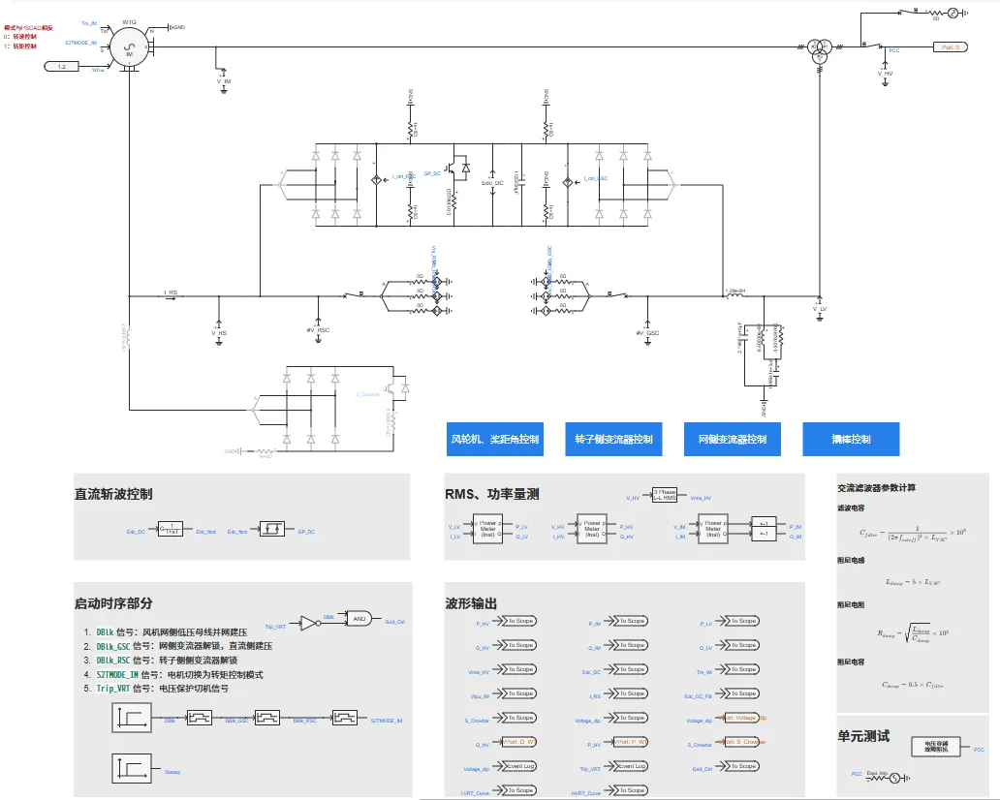
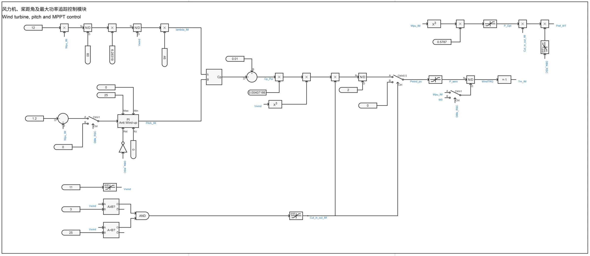
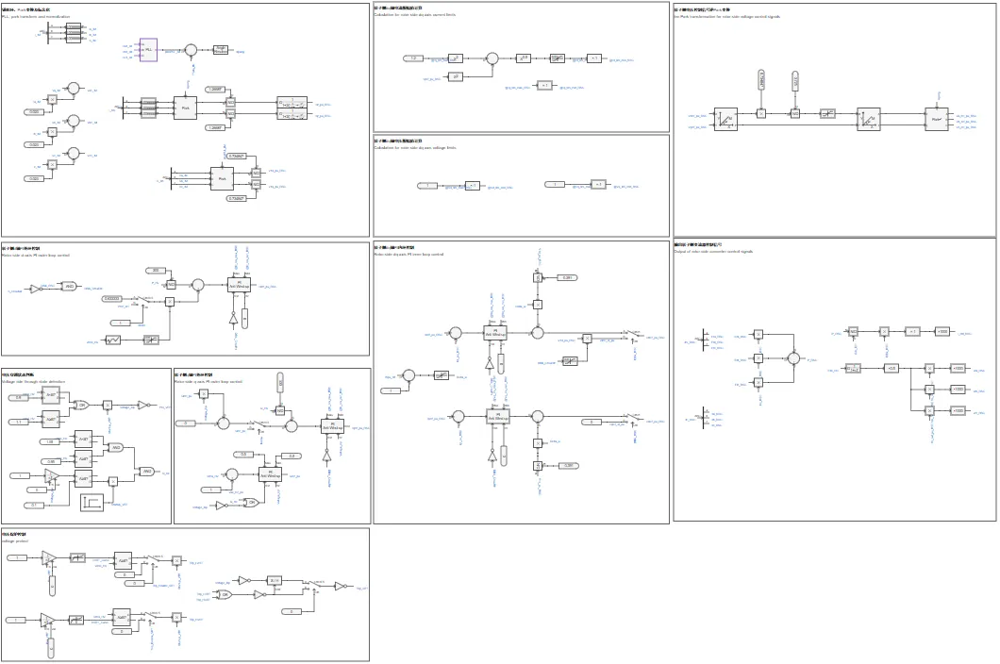
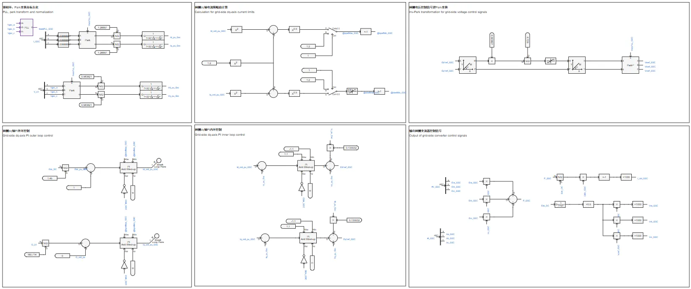
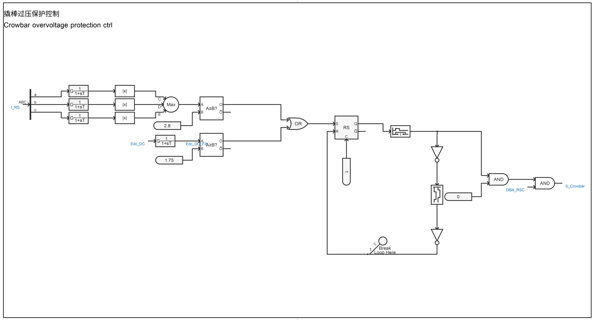
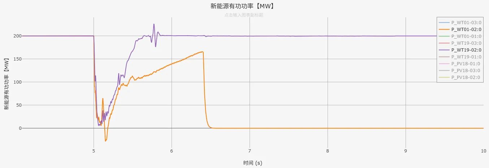
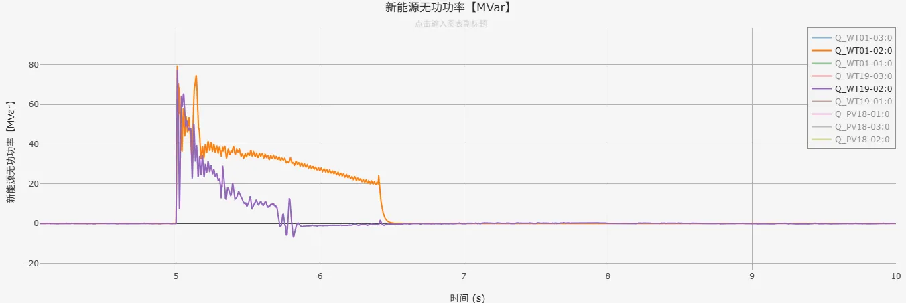

## 元件介绍

在[双馈风机01型-平均模型-标准模型-v1](../../20-wtg_dfig/10-wtg_dfig_01/20-wtg_dfig_01-avm-std-v1/index.md)的基础上，进行元件封装和倍乘等值，增加功率参考值控制，建立潮流初始化模型，形成**双馈风机01型-标准封装模型-v1**典型案例。  

## 使用方法说明

### 适用场景
元件支持单机或接入大规模电力系统算例的仿真测试，适用于以下分析场景：
   + 风速变化响应测试  
   + 高低电压穿越测试  
   + 风机控制策略验证  
   + 不同电网强度下的风机运行特性分析  
   + 考虑系统功角、频率、电压的电网稳定性分析
   + 高比例新能源接入下的系统支撑能力评估  

### 适用范围  

   + 可稳定运行的风速范围：3-25m/s  
   + 建议步长范围：1-50μs  
   + 高低压穿越成功的短路比≥1.5

### 功能概述  

   + 高低电压穿越电压阈值、变流器PI控制参数、初始风速等参数均开放可调  
   + 支持网侧变流器控制中dq轴电流优先模式的切换  
   + 脱网保护控制、撬棒电路可切换启用/禁用状态

  
## 算例介绍

**双馈风机01型-标准封装模型-v1**由电气主拓扑、风轮机及桨距角控制、转子侧变流器控制、网侧变流器控制、撬棒过压保护控制及高低压穿越故障等六个部分组成。  
与双馈风机01型-平均模型-标准模型-v1存在以下不同：  

+ **元件封装**：将模型进行封装，并在升压变压器高压侧添加与外部相连的模块端口  
+ **倍乘等值**：按设备额定容量、并联数量变化倍数，线性缩放电阻、电感、电容等参数，并保持电压、电流标幺值不变（有名值需要折算），在简化模型规模的同时，使等效模型在并网点呈现与真实多机系统相似的功率输出和动态响应，从而满足系统级稳定性分析的需求  
+ **功率参考值控制**：在转子侧变流器控制d轴外环PI控制（并网点有功功率控制）和q轴外环PI控制（并网点无功功率控制）处，新增功率参考值控制方式，实现双馈风机01型-标准封装模型暂态仿真稳态时的输出功率与潮流计算结果一致  

**电气主拓扑**由绕线式感应电机、交流滤波器、Chopper斩波电路、等效受控电压源/电流源建模的变流器、撬棒过压保护电路、升压变压器及单元测试组成。  

**风轮机及桨距角控制**由风力机模块、桨距角控制模块、MPPT控制模块等部分组成，这些模块的功能为捕获风功率、调节桨距角、实现最大功率追踪。  

**转子侧变流器控制**由锁相环、Park变换、转子侧dq轴内外环控制、转子侧dq轴电流限幅值计算、转子侧电压控制信号逆Park变换、输出转子侧变流器PWM控制信号，以及脱网保护控制等部分组成，实现对并网点处输出有功、无功功率的控制。无功功率控制部分包含电压穿越状态判断，具备简单的高低压穿越能力。  

**网侧变流器控制**与转子侧变流器控制的组成类似，用来实现对直流电压、网侧变流器输出无功功率的控制。  

**撬棒过压保护控制**在电网故障时短接转子绕组，限制电流，从而达到保护变流器的目的。  

  
## 算例仿真测试

在CSEE-CLV标准算例中加入**双馈风机01型-标准封装模型-v1**进行测试，仿真结果表明封装模型可以按照潮流计算结果进行暂态初始化，故障期间进入低电压穿越，并触发相应的电压保护脱网控制，验证了模型的正确性。  

  

  

## 模型地址

点击打开模型地址：[**双馈风机01型-标准封装模型-v1**](https://cloudpss.net/model/open-cloudpss/WTG_DFIG_01-avm-stdm-v1b1)  

## 附录

### 参数

import Parameters from './_parameters.md'

<Parameters/>

### 引脚

import Pins from './_pins.md'

<Pins/>

<!-- 
## 附：修改及调试日志

+ 20250729 在双馈风机01型-平均模型-标准模型的基础上，进行功率倍乘，建立潮流初始化模型，新增功率参考值控制方式，形成双馈风机01型-标准封装模型
+ 20250818 加入电压保护脱网控制
-->
