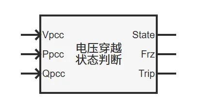
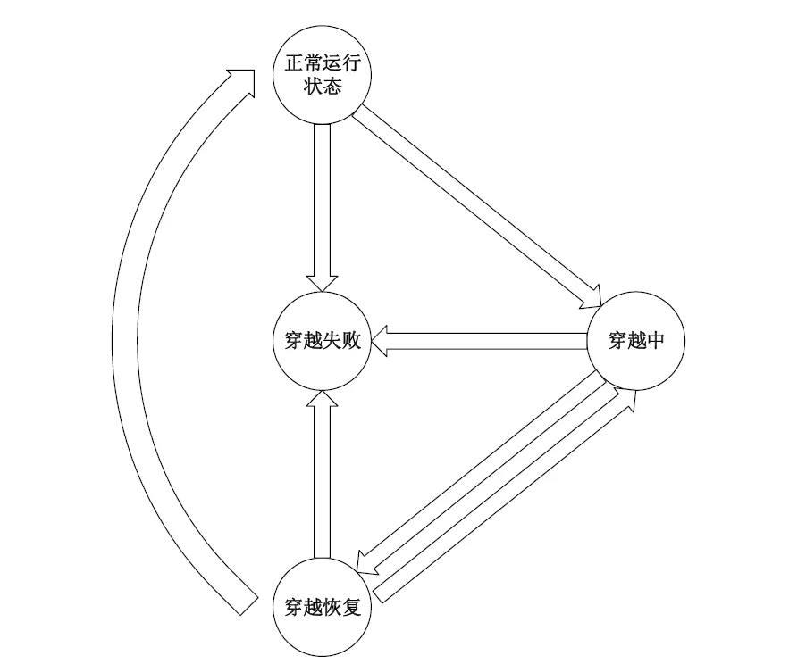
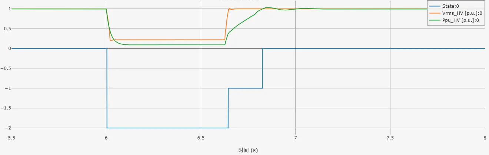
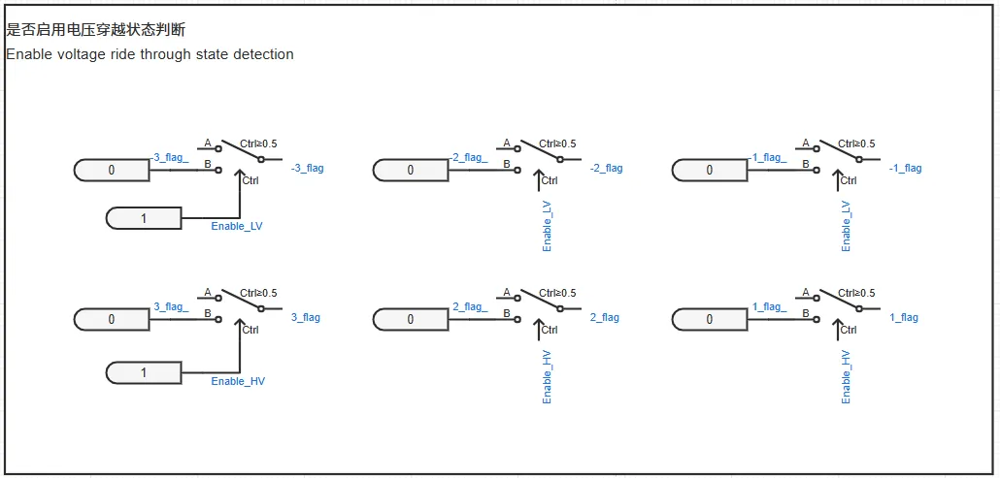
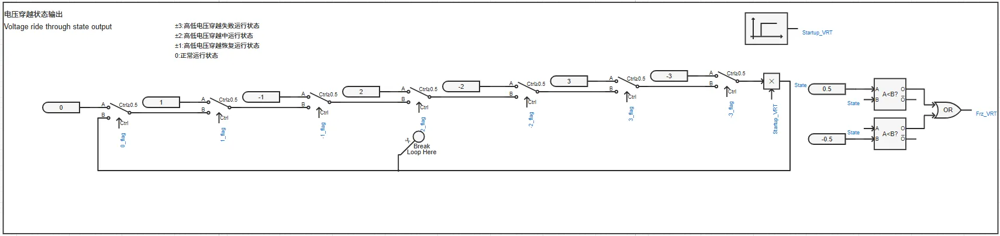
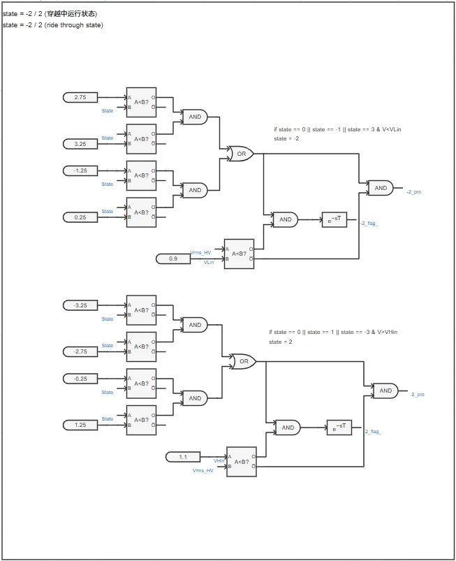
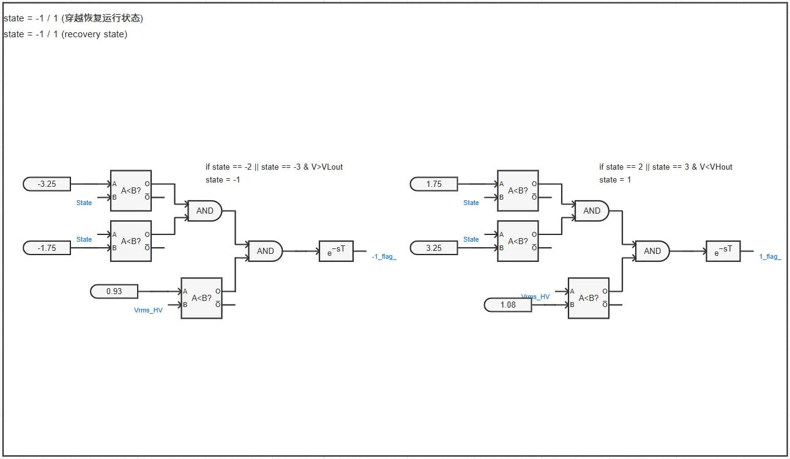
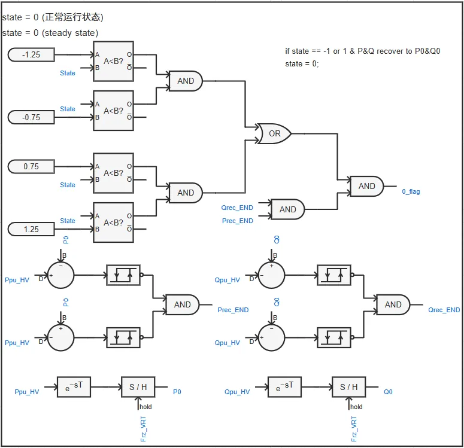
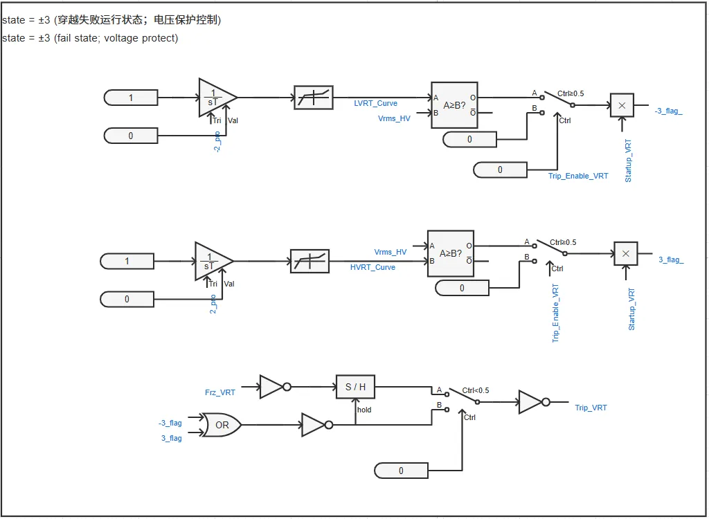

## 元件介绍

基于PSASP中2型新能源模型的电压穿越控制模型，搭建了适配新能源及储能标准模型的**电压穿越状态判断模块**。  

  

## 使用方法说明

### 适用场景
元件可配合[电压穿越控制模块](../../../70-voltage-ride-though-model/20-vrt_ctrl-stdm-v1/index.md)使用，用于输出电压穿越运行状态、PI控制冻结标志位与电压保护切机信号，实现新能源及储能标准模型的电压穿越控制。  

### 功能概述
+ 电压穿越判断参数、脱网保护控制参数均开放可调  
+ 高低电压穿越判断、脱网保护控制可切换启用/禁用状态

  
## 算例介绍

### 工作原理

电压穿越运行状态切换示意图如下。  

  

   + 稳态时，处于正常运行状态  
   + 并网点电压小于进入低穿阈值或大于进入高穿阈值时，切换至穿越中状态  
   + 并网点电压恢复至退出低穿阈值或退出高穿阈值后，切换至穿越恢复状态  
   + 并网点功率恢复至稳态值后，切换至正常运行状态  
   + 启用电压保护切机控制时，若并网点电压超出电压保护限制，则切换至穿越失败状态  
     + 若允许脱网后再次并网，则当并网点电压恢复后，切换至相应运行状态  
     + 若不允许脱网后再次并网，则始终处于穿越失败状态  

以使用了**电压穿越状态判断模块**和**电压穿越控制模块**的[直驱风机01型-平均模型-标准模型-v2](../../10-wtg_pmsg/10-wtg_pmsg_01/40-wtg_pmsg_01-avm-std-v2/index.md)为例，在三相20%Un跌落工况下的仿真结果如下图所示。其中，蓝色曲线State为电压穿越运行状态、黄色曲线Vrms_HV为并网点电压、红色曲线Ppu_HV为并网点处有功功率。  

启用故障后，并网点电压开始跌落，State= -2 ，并网点处有功功率按照低压穿越期间控制策略进行输出；故障清除后，并网点电压开始恢复，但此时并网点功率还未恢复至稳态值，因此State= -1 ，并网点处有功功率按照低压恢复期间控制策略进行输出；并网点功率恢复至稳态值后，State= 0 ，表明穿越成功。  

### 模块各部分介绍

**电压穿越状态判断模块**由以下六个部分组成。  

**是否启用电压穿越状态判断**：启用时，模块正常工作；禁用时，State始终为0。  

**电压穿越状态输出**：根据当前状态输出相应State的值，同时输出Frz_VRT（PI控制冻结标志位）的值。  

**穿越中运行状态**：判断是否处于穿越中运行状态，同时输出电压保护曲线重置信号。  

**穿越恢复运行状态**：判断是否处于穿越恢复运行状态。  

**正常运行状态**：判断是否处于正常运行状态。  

**穿越失败运行状态**（电压保护控制）：判断是否处于穿越失败运行状态，同时输出Trip_VRT（电压保护切机信号）。  

  

## 附录

### 参数

import Parameters from './_parameters.md'

<Parameters/>

### 引脚

import Pins from './_pins.md'

<Pins/>

