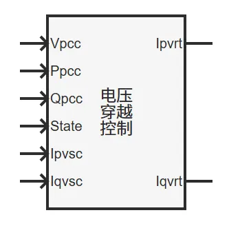
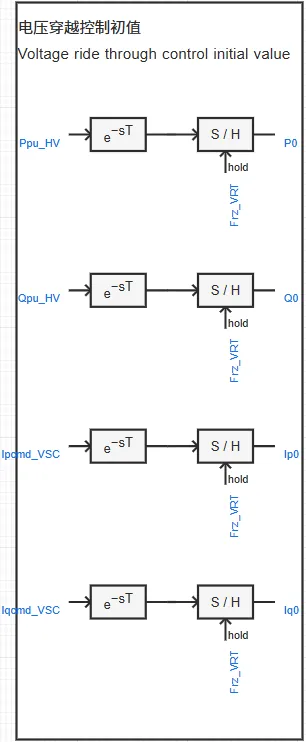
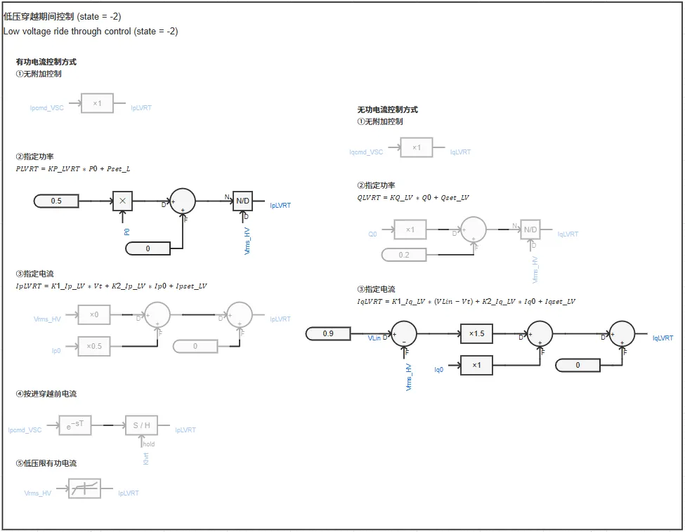
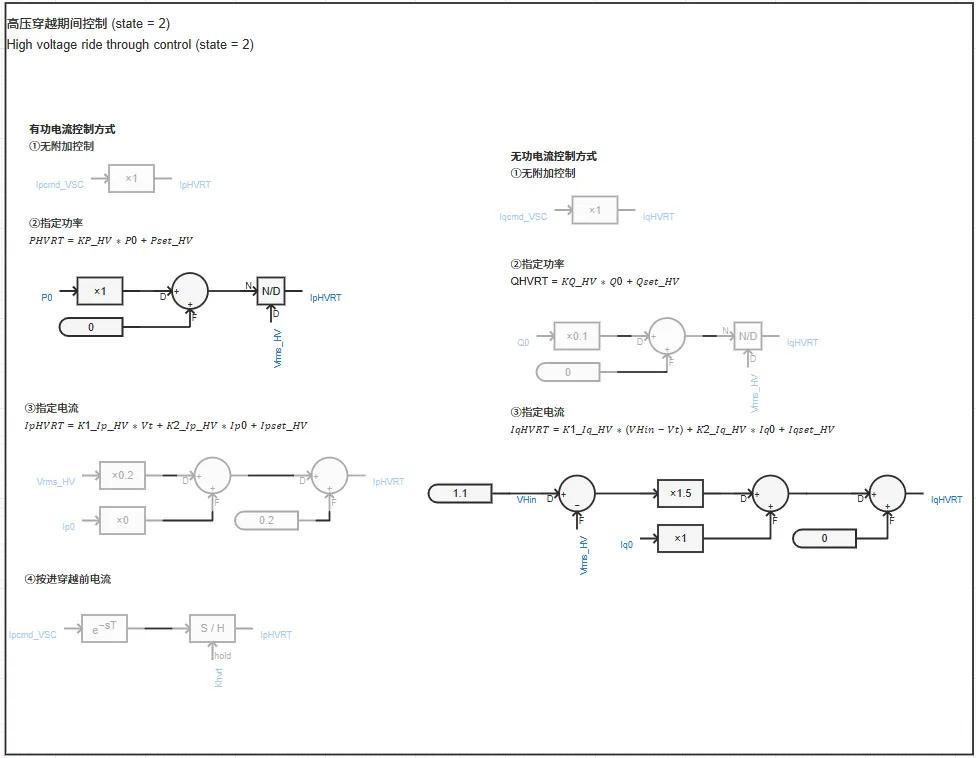
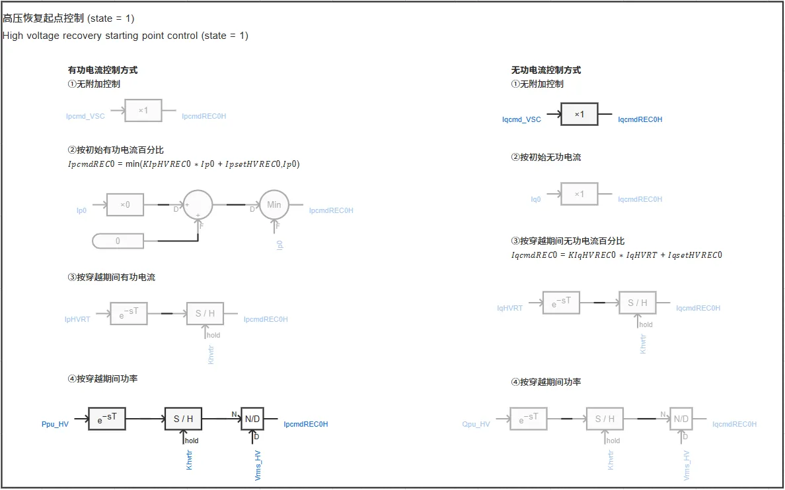
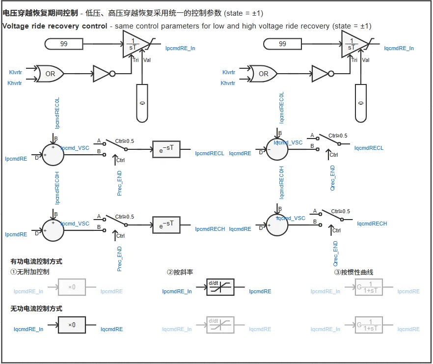
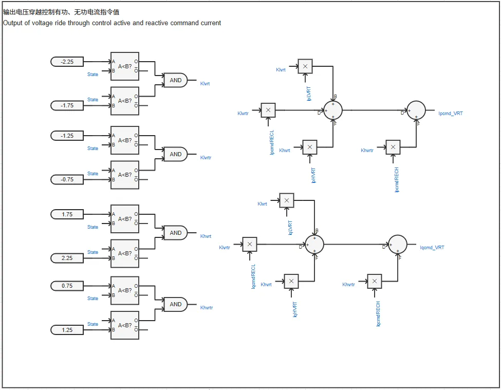

## 元件介绍

基于PSASP中2型新能源模型的电压穿越控制模型，搭建了适配新能源及储能标准模型的**电压穿越控制模块**。  

  

## 使用方法说明

### 适用场景

元件配合[电压穿越状态判断模块](../../../70-voltage-ride-though-model/10-vrt_sd-stdm-v1/index.md)使用，用于计算并输出电压穿越控制有功、无功电流指令值，实现新能源及储能标准模型的电压穿越控制。  
 
### 功能概述
+ 电压穿越控制详细参数开放可调  
+ 支持高低电压穿越期间、恢复期间不同控制策略的切换
  
## 算例介绍

**电压穿越控制模块**由以下七个部分组成。  

**电压穿越控制初值**：获取稳态运行时的并网点功率和变流器控制电流指令值。  

**低压穿越期间控制**：根据选用的控制策略，计算低压穿越期间的电流指令值。  
+ 有功电流控制方式包括：  
  + 无附加控制  
  + 指定功率  
  + 指定电流  
  + 按进穿越前电流  
  + 低压限有功电流  
+ 无功电流控制方式包括：  
  + 无附加控制  
  + 指定功率  
  + 指定电流  

**高压穿越期间控制**：根据选用的控制策略，计算高压穿越期间的电流指令值。  
+ 有功电流控制方式包括：  
  + 无附加控制  
  + 指定功率  
  + 指定电流  
  + 按进穿越前电流  
+ 无功电流控制方式包括：  
  + 无附加控制  
  + 指定功率  
  + 指定电流  

**低压恢复起点控制**：根据选用的控制策略，计算低压恢复起点的电流指令值。  
+ 有功电流控制方式包括：  
  + 无附加控制  
  + 按初始有功电流百分比  
  + 按穿越期间有功电流  
  + 按穿越期间功率  
+ 无功电流控制方式包括：  
  + 无附加控制  
  + 按初始无功电流  
  + 按穿越期间无功电流百分比  
  + 按穿越期间功率  

**高压恢复起点控制**：根据选用的控制策略，计算高压恢复起点的电流指令值。  
+ 有功电流控制方式包括：  
  + 无附加控制  
  + 按初始有功电流百分比  
  + 按穿越期间有功电流  
  + 按穿越期间功率  
+ 无功电流控制方式包括：  
  + 无附加控制  
  + 按初始无功电流  
  + 按穿越期间无功电流百分比  
  + 按穿越期间功率  

**电压穿越恢复期间控制**：根据选用的控制策略，计算电压穿越恢复期间的电流指令值。  
+ 有功电流控制方式包括：  
  + 无附加控制  
  + 按斜率  
  + 按惯性曲线  
+ 无功电流控制方式包括：  
  + 无附加控制  
  + 按斜率  
  + 按惯性曲线  

**输出电压穿越控制有功、无功电流指令值**：整合电压穿越期间各阶段的电流指令值，输出电压穿越控制电流指令值Ipcmd_VRT、Iqcmd_VRT。  

  

## 附录

### 参数

import Parameters from './_parameters.md'

<Parameters/>

### 引脚

import Pins from './_pins.md'

<Pins/>
