<!-- import DocCardList from '@theme/DocCardList';

<DocCardList /> -->

## 案例介绍

包含光伏电池单元、光伏电池环境条件、基于Boost升压电路的最大功率点跟踪控制、变流器及其控制、电压穿越运行状态判断、电压穿越控制，以及高低压穿越故障等模块的**跟网型光伏发电快速详细**标准模型的典型案例。

## 使用方法说明

**光伏发电快速详细**标准模型的适用范围：  
   + 建议步长范围：1–10 μs  
   + 高低压穿越成功的短路比≥1.5  

  
## 算例介绍

**光伏发电快速详细**标准模型由电气主拓扑、光伏电池环境条件、最大功率点跟踪控制、变流器控制、高低压穿越故障、电压穿越运行状态判断及电压穿越控制等七个部分组成。  

**电气主拓扑**由光伏电池单元、Boost升压电路、Chopper斩波电路、IGBT开关详细建模的变流器、交流滤波器、升压变压器及电压源组成。并网方式可选择与理想电压源或戴维南等值电压源相连，其中戴维南等值电压源的阻抗大小由用户设置的短路比、阻抗比计算得到。两种并网方式的切换以及短路比、阻抗比的大小均可在参数组中进行设置。  

  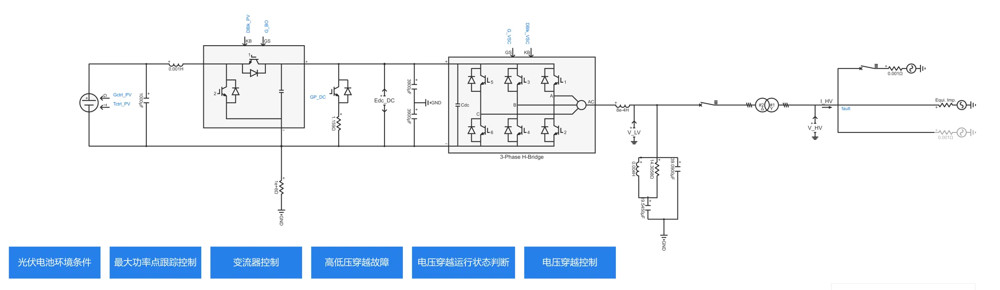

**光伏电池环境条件**输出辐照度和温度到光伏电池单元，用户可以选择是否启用辐照度或温度的随机变化。  

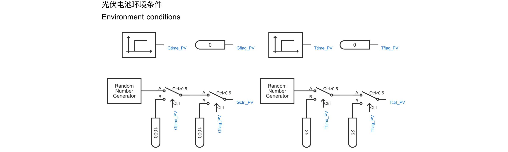

**最大功率点跟踪控制**采用电导增量法实现基于Boost升压电路的MPPT控制，实现对光伏输出有功功率的控制。  

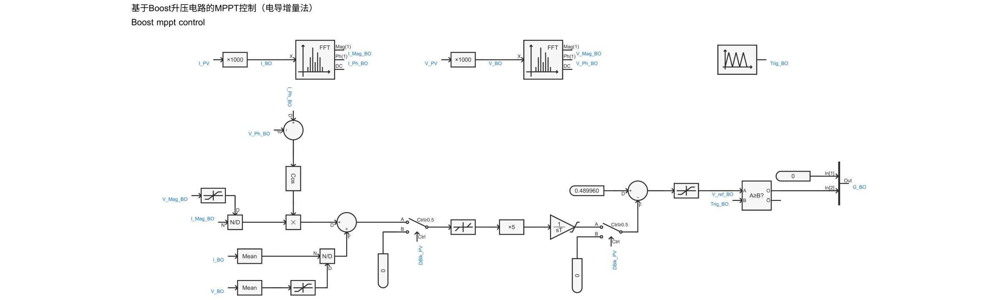

**变流器控制**由锁相环、Park变换、变流器dq轴内外环控制、变流器dq轴电流限幅值计算、变流器电压控制信号逆Park变换与输出变流器控制信号等部分组成，实现对直流电压、光伏输出无功功率的控制。  

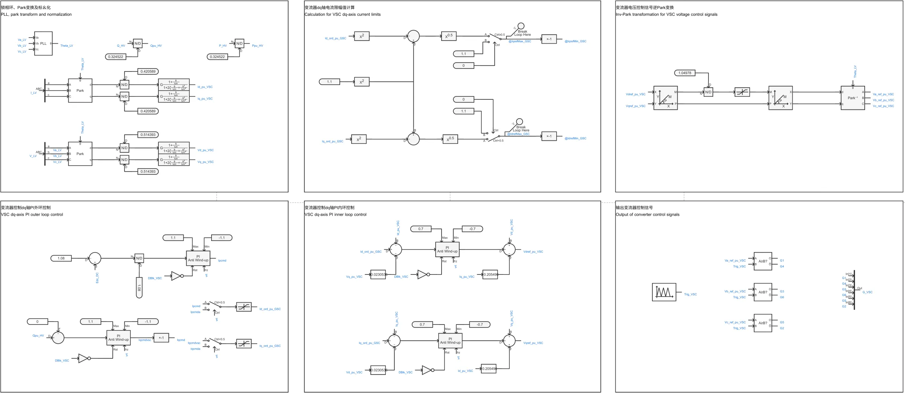

为方便进行高低压穿越测试，搭建了**高低压穿越故障模块**，用户在参数方案中选取电压穿越类型，即可自动启用并设置相应的故障阻抗与故障持续时间。目前给出的故障阻抗参数适用于短路比为2时的工况。  

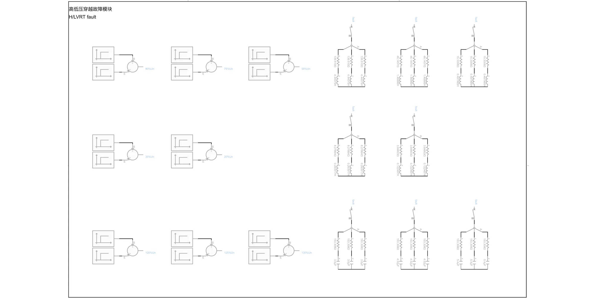

**电压穿越运行状态判断**用于判断并输出光伏发电模型当前的运行状态，包括正常运行(state=0)、低电压/高电压穿越中(state=-2/2)、低电压/高电压穿越恢复(state=-1/1)、低电压/高电压穿越失败(state=-3/3)，进入、退出高低穿状态的电压阈值、延时均可由用户设置。  

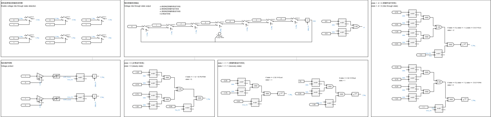

**电压穿越控制**用于计算并输出光伏发电模型在高低压穿越中、穿越恢复阶段的有功、无功电流参考值，包括高低压穿越期间控制、高低压恢复期间控制、电压穿越恢复期间电流限制等，用户可以选用不同的控制模式和控制参数。最终对计算得到的有功、无功电流参考值做处理后输出到变流器控制，作为dq轴内环控制的电流参考值，实现电压穿越控制与变流器控制的交互。  

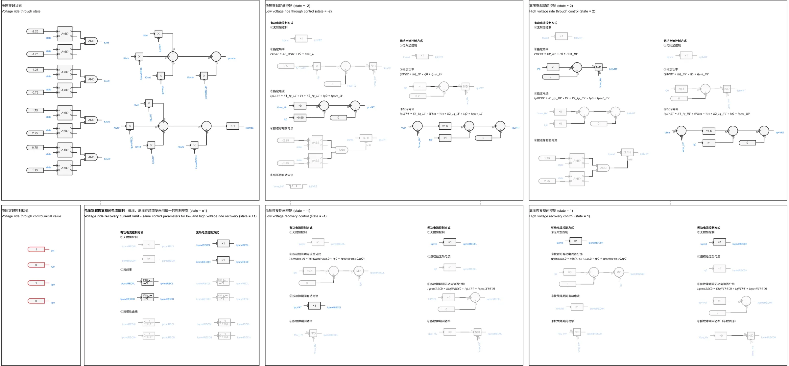

  
## 算例仿真测试

对**光伏发电快速详细**标准模型分别进行了环境条件随机变化测试和高低压穿越测试。

### 环境条件随机变化测试结果
光伏电池单元的额定辐照度、温度分别为1000W/m²、25°C。环境条件随机变化测试中，设置初始辐照度、温度均等于其额定值。辐照度、温度在5s时开始随机变化，变化频率均为1Hz，仿真结果如下图所示。  

  

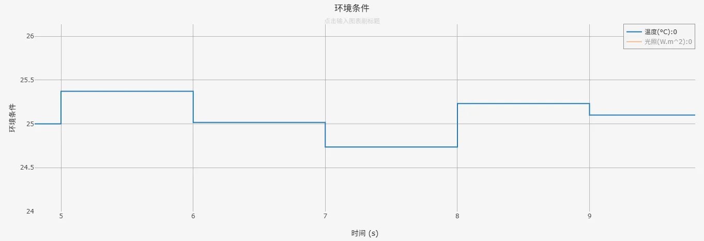  

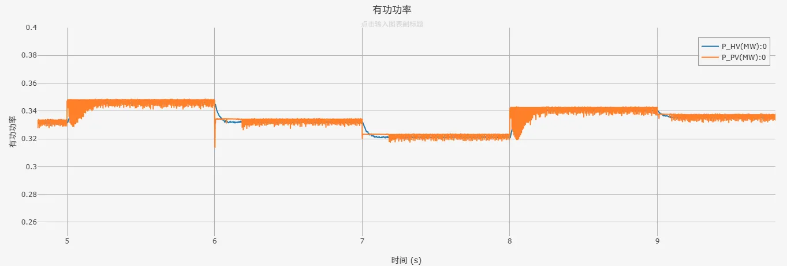

辐照度/温度随机变化频率为1Hz，环境条件发生变化时，有功功率随着环境的变化而发生变化。  

### 高低压穿越测试结果
按照国标要求进行高低压穿越测试，测试结果如下列各表所示（✓代表穿越成功，×代表穿越失败）。  

|          |  SCR=2  |  SCR=1.5  |  SCR=1  |
|:--------:|:-------:|:---------:|:-------:|
|  穿越情况 |    ✓    |    ✓     |   ×     |  

由上表测试结果可以看到，光伏发电快速详细标准模型可在短路比≥1.5时，在高低压穿越测试中穿越成功。  
以下为SCR=2时，光伏发电快速详细标准模型在三相20%Un跌落、三相130%Un抬升工况下的仿真结果。其中，蓝色曲线为光伏发电模型并网点电压、黄色曲线为光伏发电模型并网点处有功功率、红色曲线为光伏发电模型并网点处无功功率。  

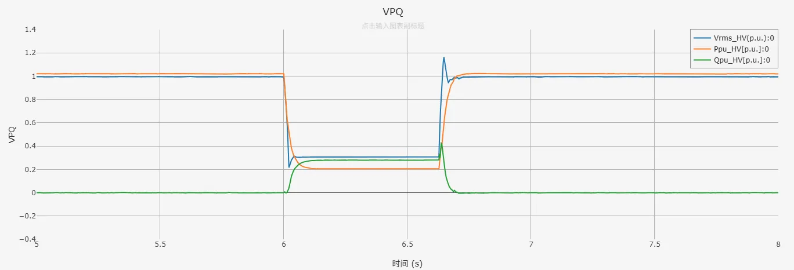  

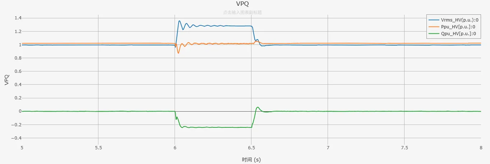  

由仿真结果可以看到，光伏发电快速详细标准模型在电网电压跌落、抬升期间，输出有功、无功功率能够按照故障电压穿越能力的要求响应电压变化，且并网点电压能够在故障切除后恢复至初始状态，表明**光伏发电快速详细**标准模型穿越成功。

## 附：修改及调试日志

+ 20250227-0228 参考PSCAD-PV_generic_example模型，基于CloudPSS平台光伏详细化模型，搭建光伏发电01型-快速详细-标准模型
+ 20250303 调试boost电路，替换boost电路、VSC电路为平台封装模块
+ 20250304 参考Simulink光伏发电系统模型，搭建基于boost升压电路的电导增量法MPPT控制
+ 20250305 参考Simulink光伏发电系统模型，建立基值系统，修改变流器控制变量与参数为标幺值
+ 20250307 整理参数，参数标准化，模型布局标准化
+ 20250314 继续整理参数，参数标准化，模型布局标准化
+ 20250317 调试参数基值系统
+ 20250318 参考CloudPSS风机标准化模型重新调整变流器控制模块基值系统和PI参数，解决光伏发电系统只能在特定光伏阵列参数下正常运行的问题
+ 20250319 优化模型布局，标准化输出通道
    + 增加升压变压器
    + 调试、优化电路中电感、电容值
+ 20250320 
    + 增加是否启用辐照度、温度随机变化的标志位
    + 给出交流滤波器参数计算说明
+ 20250321 引出变流器交流侧电压基准参数
+ 20250325 提供光伏直接与理想电压源相连，经线路阻抗与理想电压源相连两种并网方式
+ 20250326 在变流器控制中加入定无功控制，在直流侧加入直流Chopper斩波电路
+ 20250327 将高压基准由33kV调整为10kV
+ 20250403 优化线路中滤波电感、交流滤波器参数
+ 20250407 在变流器控制外环控制中加入由滤波电容计算的电压补偿
+ 20250408 在变流器控制中加入动态电流限幅环节
+ 20250409 将经线路阻抗与理想电压源相连的并网方式改为接戴维南等值电压源，戴维南等值电压源的阻抗同样由给定的短路比、阻抗比计算得到。修改后可实现光伏发电模型采用定无功控制时，并网点电压在低短路比下也在1p.u.附近。
+ 20250327-20250410 调试优化电压穿越运行状态判断、电压穿越控制模块，以及相关参数
+ 20250417-20250418 对光伏发电快速详细标准模型进行标准化、规范化处理
+ 20250424 整理优化模型参数组、变量名称
+ 20250521 完善电压穿越相关控制参数组的标准化命名
