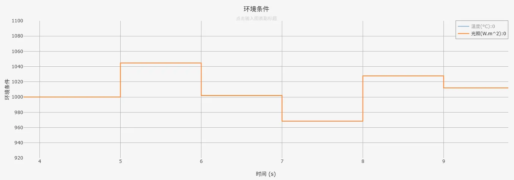
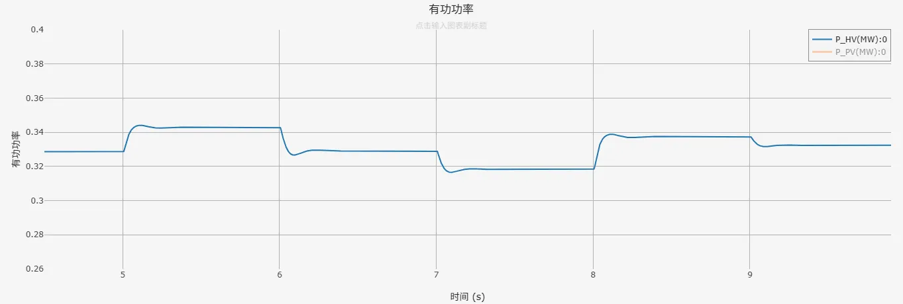

## 案例介绍

包含光伏电池单元、光伏电池环境条件、基于Boost升压电路的最大功率点跟踪控制、变流器及其控制、电压穿越状态判断、电压穿越控制，以及电压穿越故障阻抗等模块的**跟网型光伏发电01型-平均模型-标准模型-v1**的典型案例。  
   + [电压穿越状态判断模块](../../../../20-wind-power-system/70-voltage-ride-though-model/10-vrt_sd-stdm-v1/index.md)  
   + [电压穿越控制模块](../../../../20-wind-power-system/70-voltage-ride-though-model/20-vrt_ctrl-stdm-v1/index.md)

## 使用方法说明

### 适用场景  

支持多短路比下的单机并网测试，适用于以下分析场景：
   + 辐照度、温度随机变化响应测试  
   + 高低电压穿越测试  
   + 光伏发电系统控制策略验证  
   + 不同电网强度下的光伏发电系统运行特性分析  

### 适用范围  
   + 可稳定运行的辐照度范围：20 ~ 1200W/m^2，温度范围：-40 ~ 80°C  
   + 建议步长范围：1~50μs  
   + 高低压穿越成功的短路比≥1.5  

### 功能概述  
   + 电压穿越控制详细参数、变流器PI控制参数、初始辐照度、温度等参数均开放可调  
   + 支持变流器控制中dq轴电流优先模式的切换  
   + 支持并网方式的切换  
   + 高低电压穿越判断，脱网保护控制，辐照度、温度随机变化等可切换启用/禁用状态
  
## 算例介绍

**光伏发电01型-平均模型-标准模型-v1**由电气主拓扑、光伏电池环境条件、最大功率点跟踪控制、变流器控制、电压穿越状态判断模块、电压穿越控制模块，以及电压穿越故障阻抗等七个部分组成。  
  

**电气主拓扑**由光伏电池单元、Boost平均化升压电路、Chopper斩波电路、等效受控电压源/电流源建模的变流器、交流滤波器、升压变压器及单元测试组成。  
并网方式可选择与理想电压源或戴维南等值电压源相连，其中戴维南等值电压源的阻抗大小由用户设置的短路比、阻抗比计算得到。两种并网方式的切换以及短路比、阻抗比的大小均可在参数组中进行设置。单元测试中还包含适用于与戴维南等值电压源相连时的电压穿越故障阻抗模块，不限制短路比的大小，目前暂不支持高电压穿越的工况。  

  

**光伏电池环境条件**输出辐照度和温度到光伏电池单元，用户可以选择是否启用辐照度或温度的随机变化。  

**最大功率点跟踪控制**采用扰动观察法实现基于Boost升压电路的MPPT控制，实现对光伏输出有功功率的控制。Boost平均化升压电路的控制信号通过功率平衡法计算得到。  

**变流器控制**由锁相环、Park变换、变流器dq轴内外环控制、变流器dq轴电流限幅值计算、变流器电压控制信号逆Park变换、输出变流器控制信号，以及电压穿越状态判断模块、电压穿越控制模块等部分组成，实现对直流电压、光伏输出无功功率的控制；电压穿越期间，将参与dq轴内环PI控制的变流器控制电流指令值替换为电压穿越控制电流指令值；平均化变流器的控制信号同样通过功率平衡法计算得到。  

  
## 算例仿真测试

对**光伏发电01型-平均模型-标准模型-v1**分别进行了环境条件随机变化测试和高低压穿越测试。

### 环境条件随机变化测试结果
光伏电池单元的额定辐照度、温度分别为1000W/m²、25°C。环境条件随机变化测试中，设置初始辐照度、温度均等于其额定值。辐照度、温度在5s时开始随机变化，变化频率均为1Hz，仿真结果如下图所示。  

  

  

辐照度/温度随机变化频率为1Hz，环境条件发生变化时，有功功率跟随环境发生相应的变化。  

### 高低压穿越测试结果
按照《GB/T 19964-2024, 光伏发电站接入电力系统技术规定》国标要求进行高低压穿越测试，测试结果如下列各表所示（✓代表穿越成功，×代表穿越失败）。  

|          |  SCR=2  |  SCR=1.5  |  SCR=1  |
|:--------:|:-------:|:---------:|:-------:|
|  穿越情况 |    ✓    |    ✓     |   ×     |  

由上表测试结果可以看到，光伏发电系统标准模型可在短路比≥1.5时，在高低压穿越测试中穿越成功。  
以下为SCR=2时，**光伏发电01型-平均模型-标准模型-v1**在三相20%Un跌落、三相130%Un抬升工况下的仿真结果。其中，蓝色曲线Vrms_HV为光伏发电模型并网点电压、黄色曲线Ppu_HV为光伏发电模型并网点处有功功率、红色曲线Qpu_HV为光伏发电模型并网点处无功功率。  

  

  

由仿真结果可以看到，光伏发电系统标准模型在电网电压跌落、抬升期间，输出有功、无功功率能够按照故障电压穿越能力的要求响应电压变化，且并网点电压能够在故障切除后恢复至初始状态，表明**光伏发电01型-平均模型-标准模型-v1**穿越成功。  

## 模型地址

点击打开模型地址：[**光伏发电01型-平均模型-标准模型-v1**](https://cloudpss.net/model/open-cloudpss/PVS_01-avm-std-v1b1)  

## 附录

### 参数
import Parameters from './_parameters.md'

<Parameters/>

<!-- 
## 附：修改及调试日志

+ 20250421-20250422 基于光伏发电快速详细标准模型，搭建相应的平均模型
  + 搭建boost平均化等值电路、变流器平均化等值电路，相应修改最大功率点跟着控制模块、变流器控制模块中输出的控制信号
  + 进行环境条件随机变化、并网点电压变化的测试，验证光伏发电平均化标准模型的正确性
+ 20250424 整理优化模型参数组、变量名称
+ 20250506 修改boost电路平均化方法，具备DCM、CCM工作模式
+ 20250516 调试、优化boost电路平均化电路控制信号输出模块
+ 20250521  
  + 对比测试发现统一开关平均化（DCM、CCM）与功率平衡法平均化的区别很小，因此修改回简单的功率平衡法平均化
  + 完善电压穿越相关控制参数组的标准化命名
+ 20250623 补充遗漏的boost电路高压侧直流电容
+ 20250624 将光伏发电快速详细标准模型中的修改同步到平均化模型
    + 修改mppt控制方式为扰动观察法
    + 优化线路滤波参数
+ 20250729  
  + 将原有的高低穿相关控制替换为封装的电压穿越控制模型、电压穿越运行状态判断模型，并加入低电压穿越故障阻抗模块
  + 增加电压穿越控制相关的参数列表，并穿透至封装模型
  + 删去变流器控制内环PI控制在电压穿越期间的冻结控制
  + 完善模型布局与参数、变量的标准化命名
  + 调整变流器控制中d轴电流、q轴电流与输出有功、无功功率方向一致
  + 修改chopper电路中电阻大小为通过电压基准相关参数计算得到
  + 设置直流侧电容初始电压为直流电压基准值  
  + 将变流器受控电压源内阻改为0Ω
  + 在boost电路处的受控电压源增加断路器
  + 在变流器网侧增加闭锁二极管电路，并设置启用开关  
+ 20250807 新增变流器控制q轴外环PI参数

-->