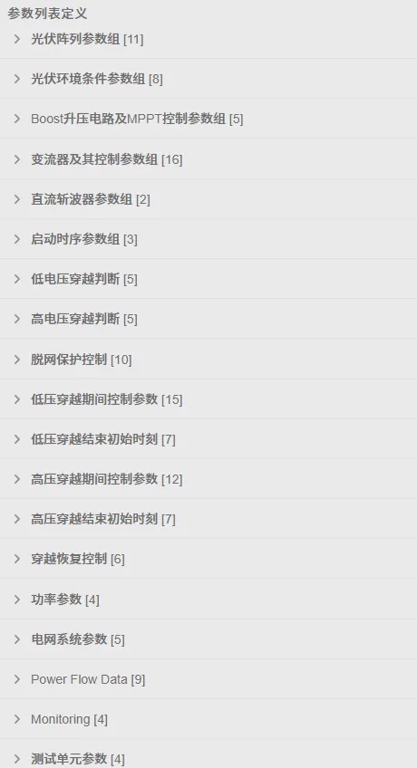
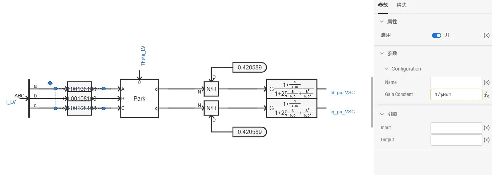
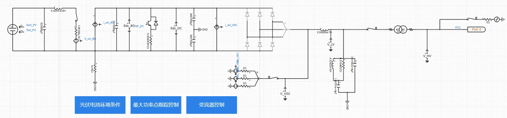
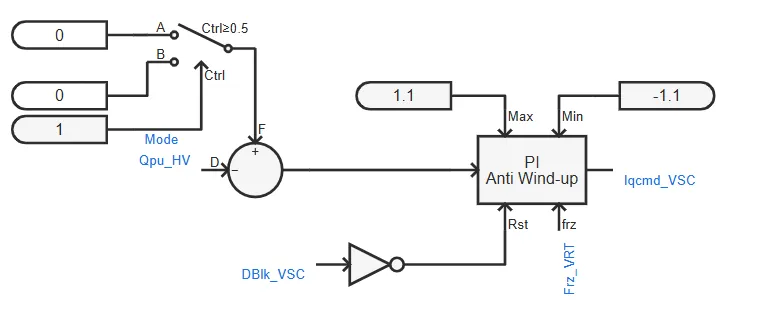
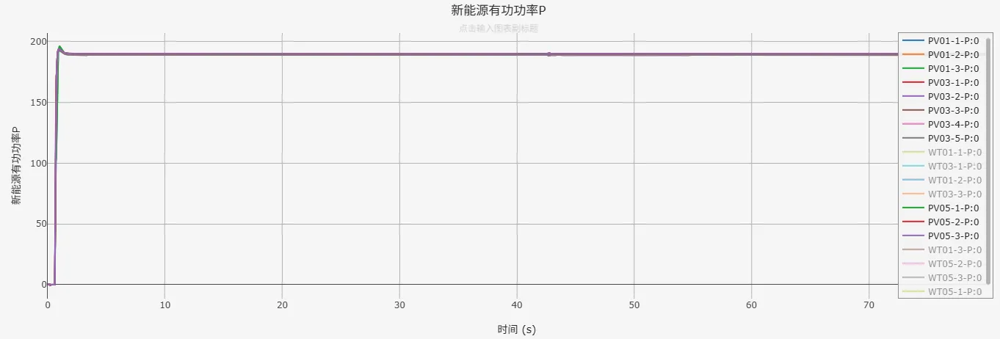
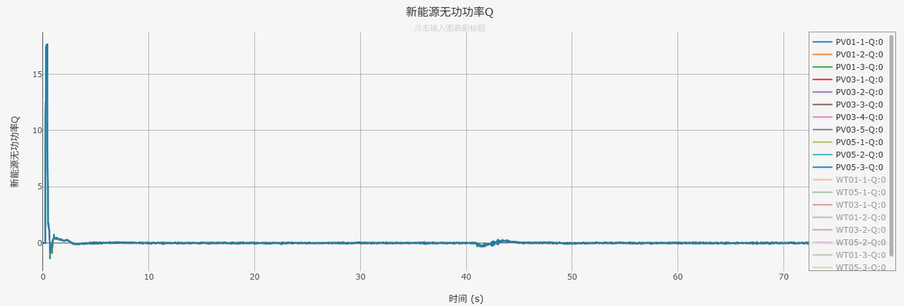

## 案例介绍

在[**光伏发电01型-平均模型-标准模型-v1**](../30-pvs_01-avm-std-v1/index.md)的基础上，进行元件封装和倍乘等值，并建立潮流初始化模型，形成**光伏发电01型-标准封装模型-v1**典型案例。  

## 使用方法说明

1、在潮流计算参数组中填写节点注入有功功率、无功功率，在功率参数组中填写风电场额定容量  
2、进行潮流计算并写回潮流计算结果，即可自动填入用于暂态仿真的电网系统参数组，以及有功、无功功率指令  
3、开始电磁暂态仿真  

  
## 算例介绍

**光伏发电01型-标准封装模型-v1**与光伏发电01型-平均模型-标准模型-v1存在以下不同：

**模型参数**：增加了潮流计算参数组、功率参数租、电网系统参数组，以及量测参数组。  

**倍乘等值**：按设备额定容量、风机台数数量变化倍数线性缩放电阻、电感、电容等参数，并保持电压、电流标幺值不变（有名值需要折算），在简化模型规模的同时，使等效模型在并网点呈现与真实多机系统相似的功率输出和动态响应，从而满足系统级稳定性分析的需求。  

  

**电气主拓扑**：在升压变压器高压侧添加与外部相连的模块端口。  

**最大功率点跟踪控制**：新增功率参考值控制方式，实现光伏电站等值模型暂态仿真稳态时输出的有功功率与潮流计算结果一致。  

**变流器控制**：在变流器控制q轴外环PI控制（并网点无功功率控制）处，新增功率参考值控制方式，实现光伏电站等值模型暂态仿真稳态时输出的无功功率与潮流计算结果一致。  
  

  
## 算例仿真测试

在[CSEE标准系统-频率稳定](../../../../80-csee-standard-systems/50-frequency-stability/index.md)中加入**光伏发电01型-标准封装模型-v1**进行测试，仿真结果表明模型可以正常运行。  

  

  

## 模型地址

点击打开模型地址：[**光伏发电01型-标准封装模型-v1**](http://cloudpss-calculate.local.ddns.cloudpss.net/model/open-cloudpss/PVS_01-avm-stdm-v1a1)  

### 参数

import Parameters from './_parameters.md'

<Parameters/>

### 引脚

import Pins from './_pins.md'

<Pins/>

<!-- 
## 附：修改及调试日志

+ 20250729 基于光伏发电01型-平均模型-标准模型，进行功率倍乘，建立潮流初始化模型，新增功率参考值控制方式，形成光伏发电01型-平均模型-封装模型 

-->
