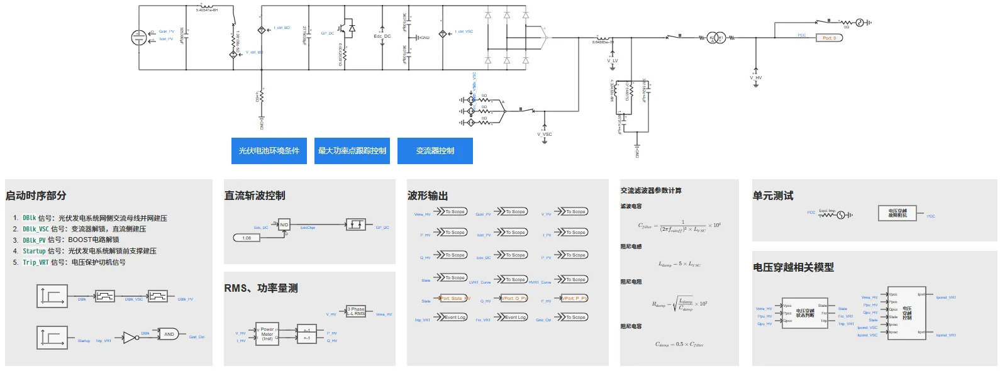
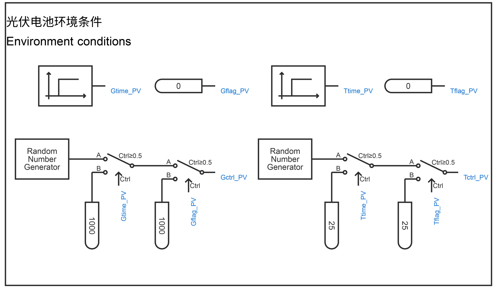
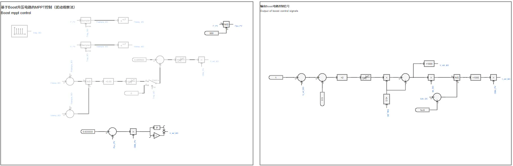
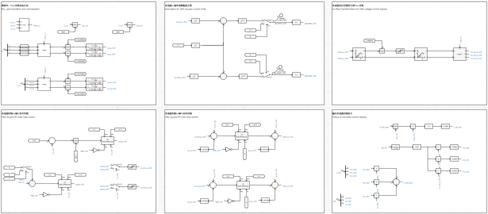
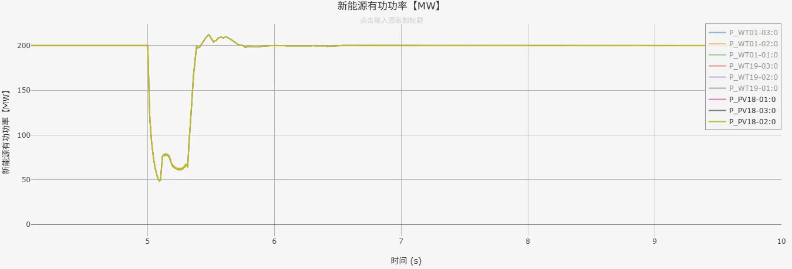
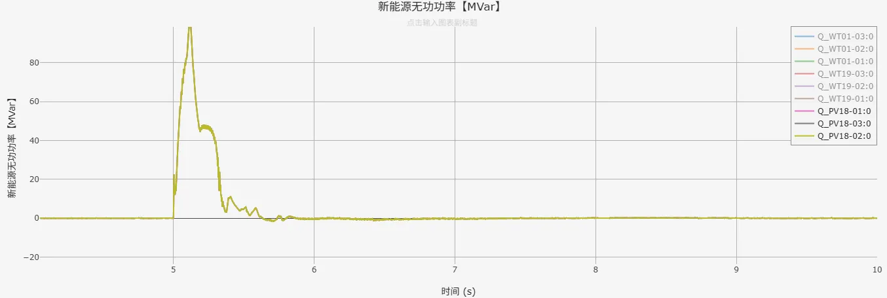

## 元件介绍

在[光伏发电01型-平均模型-标准模型-v1](../../10-pvs/10-pvs_01/20-pvs_01-avm-std-v1/index.md)的基础上，进行元件封装和倍乘等值，增加功率参考值控制，建立潮流初始化模型，形成**光伏发电01型-标准封装模型-v1**典型案例。  

## 使用方法说明

### 适用场景  

元件支持单机或接入大规模电力系统算例的仿真测试，适用于以下分析场景：
   + 辐照度、温度随机变化响应测试  
   + 高低电压穿越测试  
   + 光伏发电系统控制策略验证  
   + 不同电网强度下的光伏发电系统运行特性分析 
   + 考虑系统功角、频率、电压的电网稳定性分析
   + 高比例新能源接入下的系统支撑能力评估  

### 适用范围  
   + 可稳定运行的辐照度范围：20 ~ 1200W/m^2，温度范围：-40 ~ 80°C  
   + 建议步长范围：1~50μs  
   + 高低压穿越成功的短路比≥1.5  

### 功能概述  
   + 电压穿越控制详细参数、变流器PI控制参数、初始辐照度、温度等参数均开放可调  
   + 支持变流器控制中dq轴电流优先模式的切换  
   + 高低电压穿越判断，脱网保护控制，辐照度、温度随机变化等可切换启用/禁用状态
  
## 算例介绍

**光伏发电01型-标准封装模型-v1**由电气主拓扑、光伏电池环境条件、最大功率点跟踪控制、变流器控制、[电压穿越状态判断模块](../../../20-wind-power-system/70-voltage-ride-though-model/10-vrt_sd-stdm-v1/index.md)、[电压穿越控制模块](../../../20-wind-power-system/70-voltage-ride-though-model/20-vrt_ctrl-stdm-v1/index.md)，以及电压穿越故障阻抗等七个部分组成。  
与光伏发电01型-平均模型-标准模型-v1存在以下不同：  
**元件封装**：将模型进行封装，并在升压变压器高压侧添加与外部相连的模块端口  
**倍乘等值**：按设备额定容量、并联数量变化倍数，线性缩放电阻、电感、电容等参数，并保持电压、电流标幺值不变（有名值需要折算），在简化模型规模的同时，使等效模型在并网点呈现与真实多机系统相似的功率输出和动态响应，从而满足系统级稳定性分析的需求  
**功率参考值控制**：在Boost电路控制中新增有功功率参考值控制，在变流器控制q轴外环PI控制（并网点无功功率控制）处新增无功功率参考值控制，实现光伏发电01型-标准封装模型暂态仿真稳态时的输出功率与潮流计算结果一致  

**电气主拓扑**由光伏电池单元、Boost平均化升压电路、Chopper斩波电路、等效受控电压源/电流源建模的变流器、交流滤波器、升压变压器及单元测试组成。  

  

**光伏电池环境条件**输出辐照度和温度到光伏电池单元，用户可以选择是否启用辐照度或温度的随机变化。  

**最大功率点跟踪控制**采用扰动观察法实现基于Boost升压电路的MPPT控制，实现对光伏输出有功功率的控制。Boost平均化升压电路的控制信号通过功率平衡法计算得到。  

**变流器控制**由锁相环、Park变换、变流器dq轴内外环控制、变流器dq轴电流限幅值计算、变流器电压控制信号逆Park变换、输出变流器控制信号，以及电压穿越状态判断模块、电压穿越控制模块等部分组成，实现对直流电压、光伏输出无功功率的控制；电压穿越期间，将参与dq轴内环PI控制的变流器控制电流指令值替换为电压穿越控制电流指令值；平均化变流器的控制信号同样通过功率平衡法计算得到。  

  
## 算例仿真测试

在[CSEE-CLV](../../../80-csee-standard-cases/60-csee_vs_clv-v1/index.md)标准算例中加入**光伏发电01型-标准封装模型-v1**进行测试，仿真结果表明封装模型可以按照潮流计算结果进行暂态初始化，故障期间进入低电压穿越，验证了模型的正确性。  

  

  

## 模型地址

点击打开模型地址：[**光伏发电01型-标准封装模型-v1**](https://cloudpss.net/model/open-cloudpss/PVS_01-avm-stdm-v1b1)  

### 参数

import Parameters from './_parameters.md'

<Parameters/>

### 引脚

import Pins from './_pins.md'

<Pins/>

<!-- 
## 附：修改及调试日志

+ 20250729 基于光伏发电01型-平均模型-标准模型，进行功率倍乘，建立潮流初始化模型，新增功率参考值控制方式，形成光伏发电01型-平均模型-封装模型  
+ 20250807 新增变流器控制q轴外环PI参数

-->
