## 描述
随着电力电子变换技术、电动汽车技术的发展，配电网、微电网中充电桩、储能系统的比例逐步提升。对分布式储能逆变系统的详细建模和仿真具有重要意义。

CloudPSS提供了储能并网发电系统的详细模型和平均模型，并提供了两种模型的对比。用户可根据需要，自行选择相应的模型，并在此基础上进行修改和研究。

## 模型介绍

分布式储能逆变系统由储能电池（铅蓄电池）的戴维南等值模型、电压源变换器（详细/平均模型）、网侧滤波电容器、变流器控制系统和离并网切换控制构成。

其中，电压源变换器的详细模型由6个分立的IGBT及其反并联二极管组成，如下图。

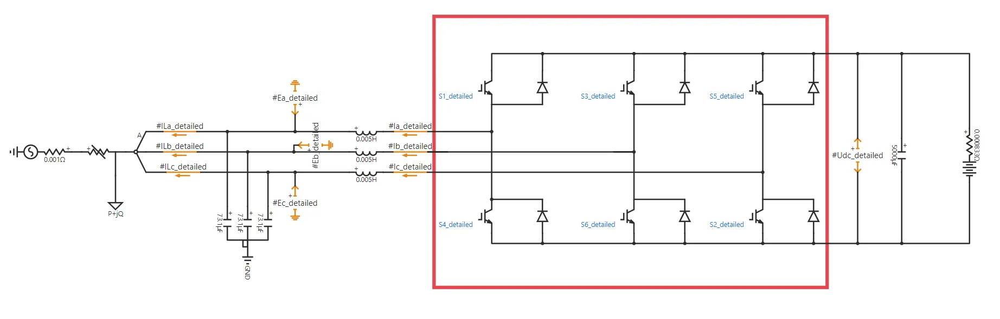

变换器的平均模型由交流侧3个受控电压源和直流侧一个受控电流源组成，如下图。

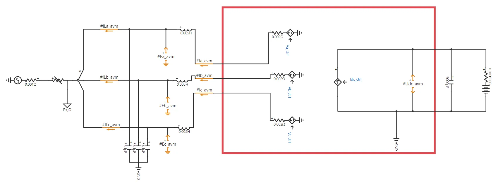

变流器的控制系统分为并网控制和离网控制两种。
* 并网控制采用定有功功率-无功功率控制（PQ控制）。
* 离网控制采用定交流电压-频率控制（VF控制）。
算例内置并网转离网切换控制，在切换点处，变流器的电压外环控制整体被切换。

详细模型的控制系统由电网电压定向、电压环-电流环双闭环控制、参考信号生成、SPWM控制四部分构成。

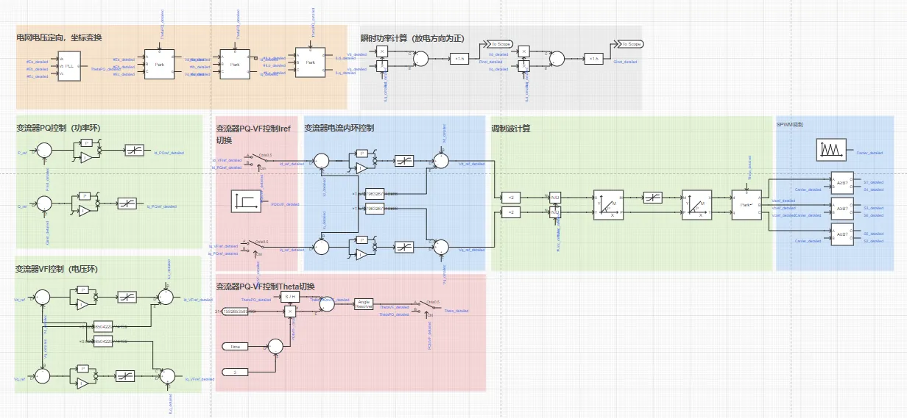

平均模型的控制系统省略了SPWM控制，但增加了变流器平均模型控制（其主要作用是保证交流侧和直流侧的功率平衡）。

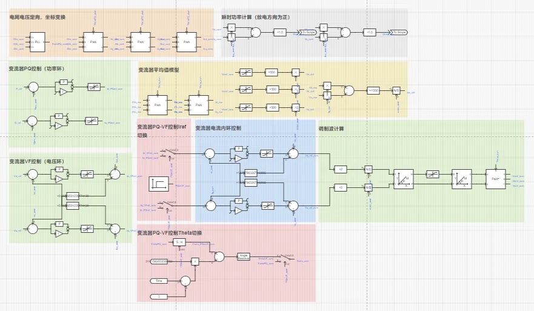

## 仿真

根据所选择的模型设定仿真步长，对储能并网发电系统进行电磁暂态仿真。其中，详细模型由于含有离散开关事件，建议在`运行`标签页->`电磁暂态仿真方案`>`求解器设置`处选择`开关/离散事件处理增强`选项，采用较小的仿真步长进行仿真。若PWM载波频率为$f_c$，则建议仿真步长应小于$1/({20f_c})$。选用平均模型时，由于不存在开关事件，故可选择`常规（默认）`选项，设置较高的仿真步长（建议50μs，通常不超过100μs）。 

### 仿真1：充放电切换过程

将详细模型和平均模型建立在统一算例工程中，进行如下设定。
* 保持详细模型和平均模型的给定条件相同，设置算例的起止时间及积分步长（5μs）等基本信息；
* 设定`运行`标签页参数方案列表中的`充电转放电控制时间 [s]`为1；
* 设定`运行`标签页参数方案列表中的`并网转离网控制时间 [s]`为100，即不进行离网控制；

点击`启动任务`，即可得到仿真结果。详细化模型和平均化模型的直流电压、有功/无功功率、交流电流、荷电状态（State of Charge, SOC）仿真结果对比如下图所示。

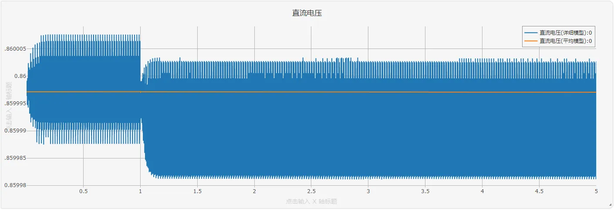

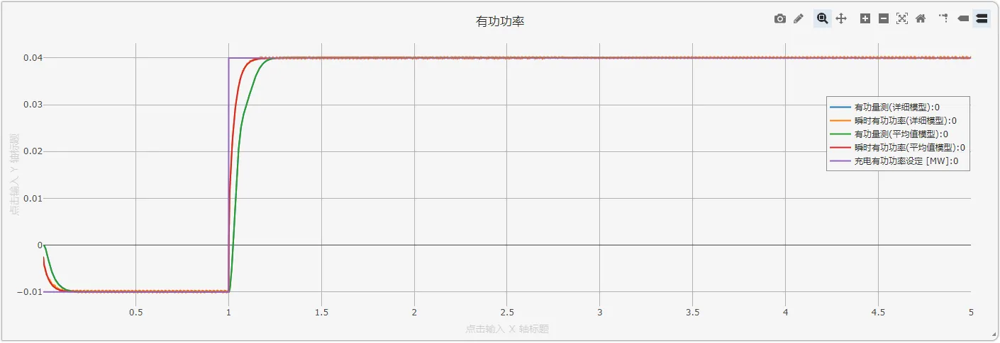

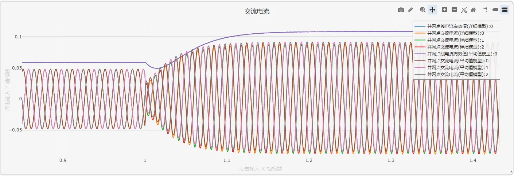

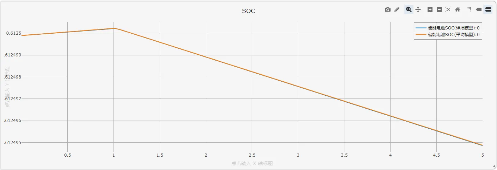

可见，充放电功率切换暂态过程，平均模型与详细模型结果一致。

### 仿真2：并网转离网过程

将详细模型和平均模型建立在统一算例工程中，进行如下设定。
* 保持详细模型和平均模型的给定条件相同，设置算例的起止时间及积分步长（5μs）等基本信息；
* 设定`运行`标签页参数方案列表中的`充电转放电控制时间 [s]`为0，即电池一直为放电模式；
* 设定`运行`标签页参数方案列表中的`并网转离网控制时间 [s]`为5；

点击`启动任务`，即可得到仿真结果。详细化模型和平均化模型的直流电压、有功/无功功率、交流电流、荷电状态（State of Charge, SOC）仿真结果对比如下图所示。

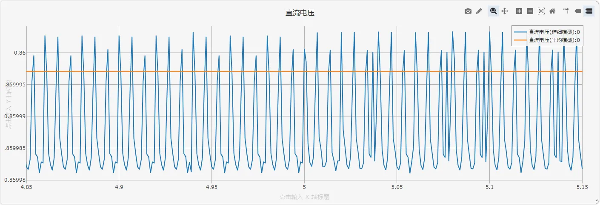

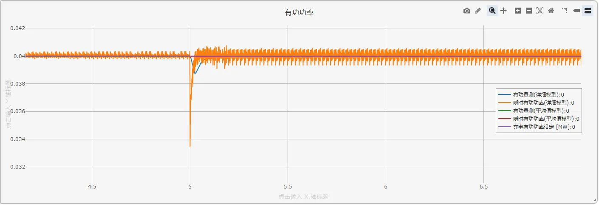

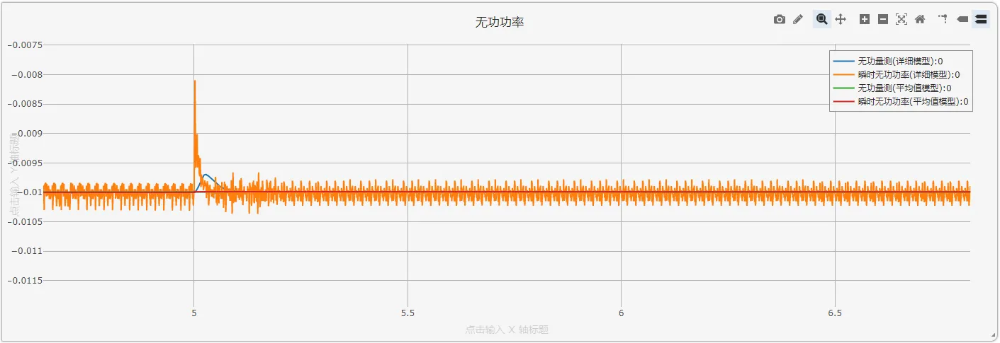

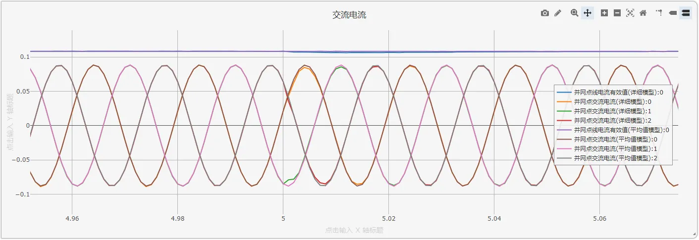

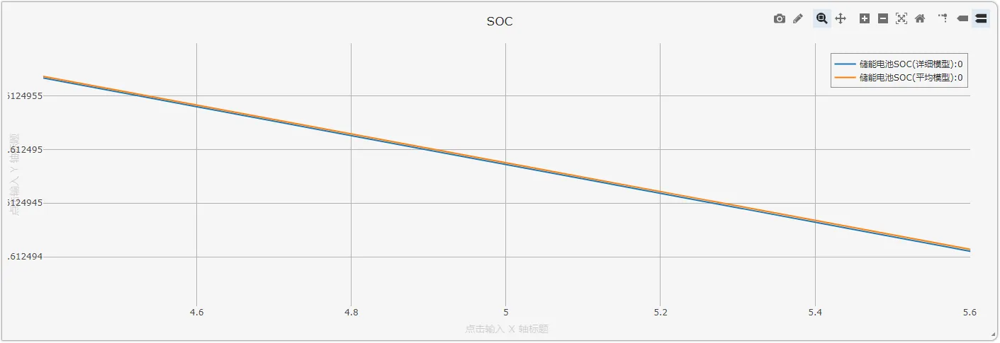

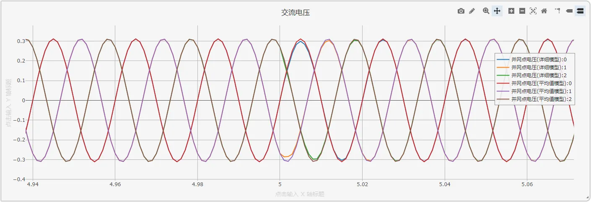

可见，并网转离网切换过程详细模型和平均模型结果一致，切换过程平滑。