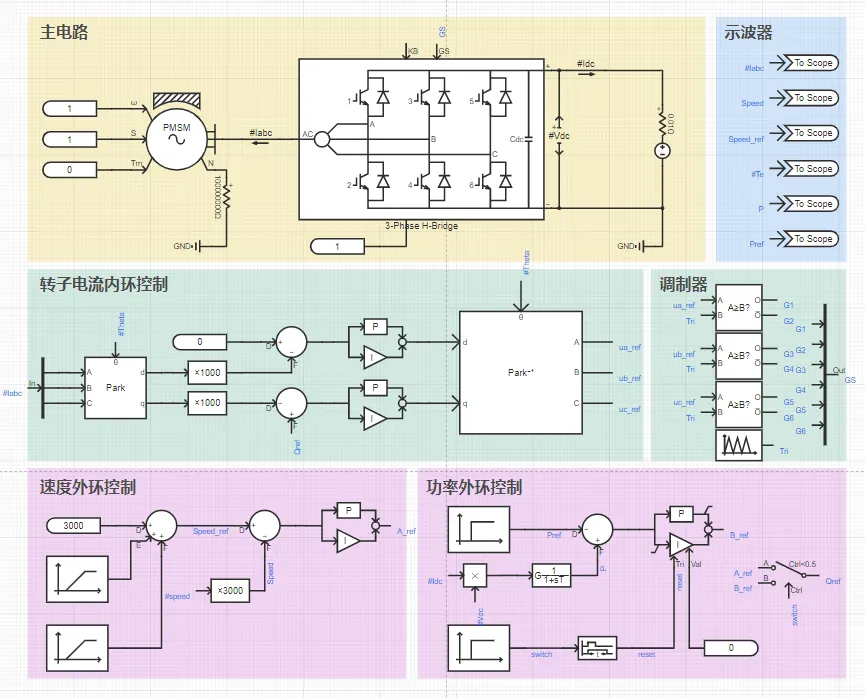
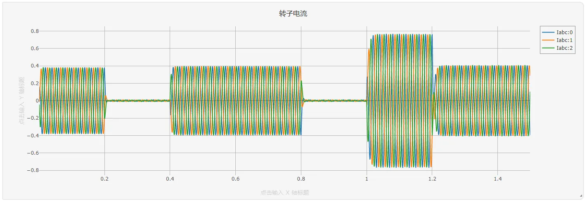
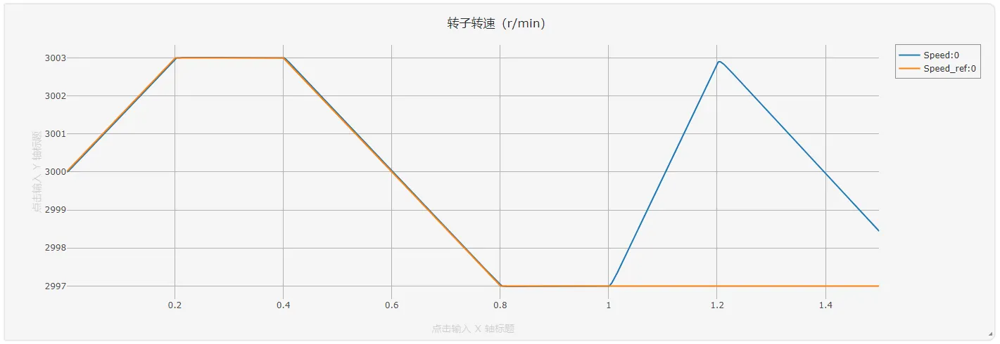
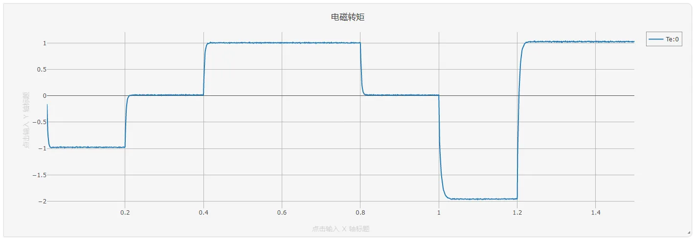
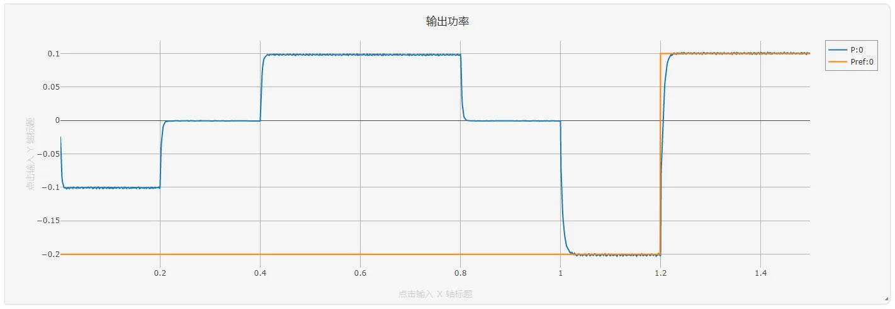

## 描述
飞轮储能系统（Flywheel Energy Storage System，FESS）通常情况下是由飞轮储能、集成驱动的电动机发电机、磁悬浮支撑系统三个部分组成，其工作模式跟化学电池一样，分为充放电两种模式。

在充电模式下，飞轮电机在系统中相当于电动机的作用。飞轮与外部供电系统连通，电机启动同时将飞轮带动旋转，飞轮电池进入运行状态。在放电模式下，电机相当于发电机的作用。飞轮与外部用电负载连接，此时发电机开始工作，飞轮电池作为提供能量的电源为设备供电。

## 模型介绍

飞轮储能系统测试算例主功率拓扑由三相电压源变换器、飞轮电机(永磁同步发动机)以及直流电压源构成。可采用功率电压外环或速度外环控制以及转子电流内环控制。调制器采用传统的正弦脉宽调制，载波频率为10kHz。仿真拓扑如下图所示。

## 仿真

设定`运行`标签页参数方案列表中的`速度外环切换为功率外环时刻 [s]`为1，`功率参考切换时刻 [s]`为1.2。点击`启动任务`开始仿真计算。

转子电流的仿真结果如下图所示：

转子速度的仿真结果如下图所示：

电磁转矩的仿真结果如下图所示：

输出功率的仿真结果如下图所示：

根据仿真设置，在0\~1s采用速度外环控制。由转子速度仿真结果可知，速度参考先上升后下降，实际转子速度完全跟随速度参考值。转子速度上升时，电磁转矩Te≈-1p.u.，转子速度不变时，电磁转矩Te≈0p.u.，转子速度下降时，电磁转矩Te≈1p.u。1s\~1.5s采用功率外环控制，此时在电压源变流器端口处检测到的功率按照参考值变化。根据输出功率仿真结果图可以看出，功率跟随效果较好。此时转子速度会随着功率变化而变化，主要为：对外释放功率时速度减小，吸收功率时速度增加。