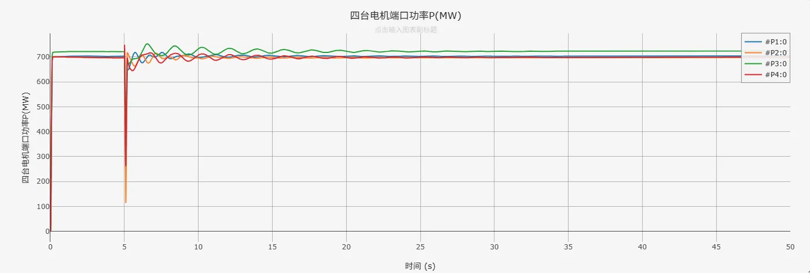
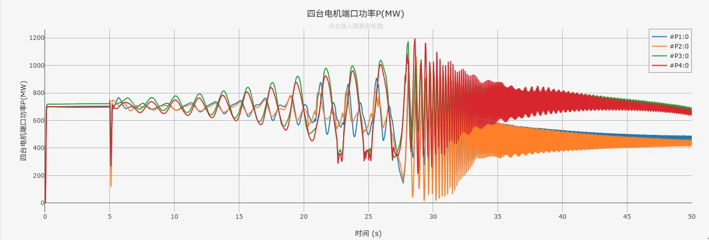

## 描述
4机2区域标准测试系统，是用于研究电网小扰动稳定的一个经典测试系统。该系统包括11条母线，4台发电机和2个区域，这2个区域之间用弱联络线连接。所有发电机均采用了励磁系统进行调控，部分工况下配置了电力系统稳定器PSS。作为测试，在本算例中，于区域1与区域2之间的联络线中点（Bus 8）添加了时长0.1s的三相接地短路故障，用户可根据需要自行修改、删除或添加其他类型的故障与扰动。

该算例可用于系统动态稳定性研究、功率交换研究、振荡阻尼研究等。

## 模型介绍

### 模型拓扑

4机2区域算例拓扑图如下，其中G3节点为松弛节点。除松弛节点外，各电机相连的母线（1-4）电压等级均为20kV，剩下所有母线电压均为230kV.

CloudPSS上该算例采用单线图构建，其拓扑如下。

### 模型参数

所有母线参数、传输线参数、变压器参数、负荷参数、电机参数均来源于文献[^1]。

#### 母线参数与潮流计算

母线参数与潮流计算数据如下表所示:

| Bus Number | Bus Name | Base kV | Bus type | Voltage(pu) | Angle(deg) |
| :---: | :---: | :---: | :---: | :---: | :---: |
| 1  | GEN G1  | 20.0  | PV | 1.0300  | 20.07  |
| 2  | GEN G2  | 20.0  | PV | 1.0100  | 10.31  |
| 3  | GEN G3  | 20.0  | swing | 1.0300  | -7.00  |
| 4  | GEN G4  | 20.0  | PV | 1.0100  | -17.19 |
| 5  | G1  | 230.0  | PQ | 1.0065  | 13.61  |
| 6  | G2  | 230.0  | PQ | 0.9781  | 3.52  |
| 7  | LOAD A  | 230.0  | PQ | 0.9610  | -4.89  |
| 8  | MID POINT  | 230.0  | PQ | 0.9486  | -18.76  |
| 9  | LOAD B  | 230.0  | PQ | 0.9714  | -32.35  |
| 10  | G4  | 230.0  | PQ | 0.9835  | -23.94  |
| 11  | G3  | 230.0  | PQ | 1.0083  | -13.63  |

#### 传输线参数

传输线参数如下表所示,参数为线路全长参数。

|From Bus | To Bus | ckt id  | R(%)  | X(%)  | B(%)  | Length/(km)  | 
| :---: | :---: | :---: | :---: | :---: | :---: | :---: |
| 5  | 6  | 1  | 0.50  | 5.0  | 2.1875  | 25  |
| 5  | 6  | 2  | 0.50  | 5.0  | 2.1875  | 25  |
| 6  | 7  | 1  | 0.30  | 3.0  | 0.5833  | 10  |
| 6  | 7  | 2  | 0.30  | 3.0  | 0.5833  | 10  |
| 6  | 7  | 3  | 0.30  | 3.0  | 0.5833  | 10  |
| 7  | 8  | 1  | 1.10  | 11.0  | 19.2500  | 110  |
| 7  | 8  | 2  | 1.10  | 11.0  | 19.2500  | 110  |
| 8  | 9  | 1  | 1.10  | 11.0  | 19.2500  | 110  |
| 8  | 9  | 2  | 1.10  | 11.0  | 19.2500  | 110  |
| 9  | 10  | 1  | 0.30  | 3.0  | 0.5833  | 10  |
| 9  | 10  | 2  | 0.30  | 3.0  | 0.5833  | 10  |
| 9  | 10  | 3  | 0.30  | 3.0  | 0.5833  | 10  |
| 10  | 11  | 1  | 0.50  | 5.0  | 2.1875  | 25  |
| 10  | 11  | 2  | 0.50  | 5.0  | 2.1875  | 25  |

#### 变压器参数

变压器参数如下表所示:

| From Bus | To Bus | R(%) | X(%) | MVA Base | tap(pu) |
| :---: | :---: | :---: | :---: | :---: | :---: |
| 1  | 5  | 0  | 15 | 900  | 1  |
| 2  | 6  | 0  | 15 | 900  | 1  |
| 3  | 11  | 0  | 15 | 900  | 1  |
| 4  | 10  | 0  | 15 | 900  | 1  |

#### 负荷参数

负荷参数如下表所示:

| Bus | P(MW) | Q(MVAr)|
| :---: | :---: | :---: |
| 7  | 967  | 100  |
| 9  | 1767  | 100  |

#### 电容器参数
电容器参数如下表所示:

| Bus | Q(MVAr) |
| :---: | :---: | 
| 7  | 200  |
| 9  | 350  |

#### 母线潮流结果误差表

CloudPSS与PSS/E的母线潮流结果误差如下表所示。

|Bus Number| Bus Name | 参数类型 | CloudPSS潮流结果 | PSS/E潮流结果 | 绝对误差 | 相对误差（%） |
| :---: | :---: | :---: | :---: | :---: | :---: | :---: |
| 1  | GEN G1  | Vm(pu)  | 1.03  | 1.03 | 0  | 0  |
| ^  | ^  | Va(deg)  | 20.1  | 20.1 | 0  | 0  |
| ^  | ^  | Pgen(MW)  | 700.0  | 700.0 | 0  | 0  |
| ^  | ^  | Qgen(MVar)  | 185.0  | 185.0 | 0  | 0  |
| ^  | ^  | Pload(MW)  | 0  | 0 | 0  | 0  |
| ^  | ^  | Qload(MVar)  | 0  | 0 | 0  | 0  |
| ^  | ^  | Pshunt(MW)  | 0  | 0 | 0  | 0  |
| ^  | ^  | Qshunt(MVar)  | 0  | 0 | 0  | 0  |
| 2  | GEN G2  | Vm(pu)  | 1.01  | 1.01 | 0  | 0  |
| ^  | ^  | Va(deg)  | 10.3  | 10.3 | 0  | 0  |
| ^  | ^  | Pgen(MW)  | 700.0  | 700.0 | 0  | 0  |
| ^  | ^  | Qgen(MVar)  | 234.6  | 234.6 | 0  | 0  |
| ^  | ^  | Pload(MW)  | 0  | 0 | 0  | 0  |
| ^  | ^  | Qload(MVar)  | 0  | 0 | 0  | 0  |
| ^  | ^  | Pshunt(MW)  | 0  | 0 | 0  | 0  |
| ^  | ^  | Qshunt(MVar)  | 0  | 0 | 0  | 0  |
| 3  | GEN G3  | Vm(pu)  | 1.03  | 1.03 | 0  | 0  |
| ^  | ^  | Va(deg)   | -7.0  | -7.0 | 0  | 0  |
| ^  | ^  | Pgen(MW)  | 719.1  | 719.1 | 0  | 0  |
| ^  | ^  | Qgen(MVar)  | 176.0  | 176.0 | 0  | 0  |
| ^  | ^  | Pload(MW)  | 0  | 0 | 0  | 0  |
| ^  | ^  | Qload(MVar)  | 0  | 0 | 0  | 0  |
| ^  | ^  | Pshunt(MW)  | 0  | 0 | 0  | 0  |
| ^  | ^  | Qshunt(MVar)  | 0  | 0 | 0  | 0  |
| 4  | GEN G4  | Vm(pu)  | 1.01  | 1.01 | 0  | 0  |
| ^  | ^  | Va(deg)   | -17.2  | -17.2 | 0  | 0  |
| ^  | ^  | Pgen(MW)  | 700.0  | 700.0 | 0  | 0  |
| ^  | ^  | Qgen(MVar)  | 202.0  | 202.0 | 0  | 0  |
| ^  | ^  | Pload(MW)  | 0  | 0 | 0  | 0  |
| ^  | ^  | Qload(MVar)  | 0  | 0 | 0  | 0  |
| ^  | ^  | Pshunt(MW)  | 0  | 0 | 0  | 0  |
| ^  | ^  | Qshunt(MVar)  | 0  | 0 | 0  | 0  |
| 5  | G1  | Vm(pu)  | 1.01  | 1.01 | 0  | 0  |
| ^  | ^  | Va(deg)   | -13.6  | -13.6 | 0  | 0  |
| ^  | ^  | Pgen(MW)  | 0  | 0 | 0  | 0  |
| ^  | ^  | Qgen(MVar)  | 0  | 0 | 0  | 0  |
| ^  | ^  | Pload(MW)  | 0  | 0 | 0  | 0  |
| ^  | ^  | Qload(MVar)  | 0  | 0 | 0  | 0  |
| ^  | ^  | Pshunt(MW)  | 0  | 0 | 0  | 0  |
| ^  | ^  | Qshunt(MVar)  | 0  | 0 | 0  | 0  |
| 6  | G2  | Vm(pu)  | 0.98  | 0.98 | 0  | 0  |
| ^  | ^  | Va(deg)   | 3.5  | 3.5 | 0  | 0  |
| ^  | ^  | Pgen(MW)  | 0  | 0 | 0  | 0  |
| ^  | ^  | Qgen(MVar)  | 0  | 0 | 0  | 0  |
| ^  | ^  | Pload(MW)  | 0  | 0 | 0  | 0  |
| ^  | ^  | Qload(MVar)  | 0  | 0 | 0  | 0  |
| ^  | ^  | Pshunt(MW)  | 0  | 0 | 0  | 0  |
| ^  | ^  | Qshunt(MVar)  | 0  | 0 | 0  | 0  |
| 7  | LOAD A  | Vm(pu)  | 0.96  | 0.96 | 0  | 0  |
| ^  | ^  | Va(deg)   | -4.9  | -4.9 | 0  | 0  |
| ^  | ^  | Pgen(MW)  | 0  | 0 | 0  | 0  |
| ^  | ^  | Qgen(MVar)  | 0  | 0 | 0  | 0  |
| ^  | ^  | Pload(MW)  | 967.0  | 967.0 | 0  | 0  |
| ^  | ^  | Qload(MVar)  | 100.0  | 100.0 | 0  | 0  |
| ^  | ^  | Pshunt(MW)  | 0  | 0 | 0  | 0  |
| ^  | ^  | Qshunt(MVar)  | -184.7  | -184.7 | 0  | 0  |
| 8  | MID POINT  | Vm(pu)  | 0.95  | 0.95 | 0  | 0  |
| ^  | ^  | Va(deg)   | -18.8  | -18.8 | 0  | 0  |
| ^  | ^  | Pgen(MW)  | 0  | 0 | 0  | 0  |
| ^  | ^  | Qgen(MVar)  | 0  | 0 | 0  | 0  |
| ^  | ^  | Pload(MW)  | 0  | 0 | 0  | 0  |
| ^  | ^  | Qload(MVar)  | 0  | 0 | 0  | 0  |
| ^  | ^  | Pshunt(MW)  | 0  | 0 | 0  | 0  |
| ^  | ^  | Qshunt(MVar)  | 0  | 0 | 0  | 0  |
| 9  | LOAD B  | Vm(pu)  | 0.97  | 0.97 | 0  | 0  |
| ^  | ^  | Va(deg)   | -32.4  | -32.4 | 0  | 0  |
| ^  | ^  | Pgen(MW)  | 0  | 0 | 0  | 0  |
| ^  | ^  | Qgen(MVar)  | 0  | 0 | 0  | 0  |
| ^  | ^  | Pload(MW)  | 1767.0  | 1767.0 | 0  | 0  |
| ^  | ^  | Qload(MVar)  | 100.0  | 100.0 | 0  | 0  |
| ^  | ^  | Pshunt(MW)  | 0  | 0 | 0  | 0  |
| ^  | ^  | Qshunt(MVar)  | -330.2  | -330.2 | 0  | 0  |
| 10  | G4  | Vm(pu)  | 0.98  | 0.98 | 0  | 0  |
| ^  | ^  | Va(deg)   | -23.9  | -23.9 | 0  | 0  |
| ^  | ^  | Pgen(MW)  | 0  | 0 | 0  | 0  |
| ^  | ^  | Qgen(MVar)  | 0  | 0 | 0  | 0  |
| ^  | ^  | Pload(MW)  | 0  | 0 | 0  | 0  |
| ^  | ^  | Qload(MVar)  | 0  | 0 | 0  | 0  |
| ^  | ^  | Pshunt(MW)  | 0  | 0 | 0  | 0  |
| ^  | ^  | Qshunt(MVar)  | 0  | 0 | 0  | 0  |
| 11  | G3  | Vm(pu)  | 1.01  | 1.01 | 0  | 0  |
| ^  | ^  | Va(deg)   | -13.6  | -13.6 | 0  | 0  |
| ^  | ^  | Pgen(MW)  | 0  | 0 | 0  | 0  |
| ^  | ^  | Qgen(MVar)  | 0  | 0 | 0  | 0  |
| ^  | ^  | Pload(MW)  | 0  | 0 | 0  | 0  |
| ^  | ^  | Qload(MVar)  | 0  | 0 | 0  | 0  |
| ^  | ^  | Pshunt(MW)  | 0  | 0 | 0  | 0  |
| ^  | ^  | Qshunt(MVar)  | 0  | 0 | 0  | 0  |

#### 支路潮流结果误差表

CloudPSS与PSS/E的支路潮流结果误差如下表所示。

| From Bus | To Bus | ckt id  | 参数类型 |CloudPSS潮流结果 | PSS/E潮流结果 | 绝对误差 | 相对误差（%） |
| :---: | :---: | :---: | :---: | :---: | :---: | :---: | :---: |
| Gen G1  |  G1  |  1  | Pij(MW)  | 700.0  | 700.0 | 0  | 0  |
| ^  | ^  | ^  | Qij(MVar)  | 185.0  | 185.0 | 0  | 0  |
| ^  | ^  | ^  | Pji(MW)  | -700.0  | -700.0 | 0  | 0  |
| ^  | ^  | ^  | Qji(MVar)  | -102.6  | -102.6 | 0  | 0  |
| Gen G2  |  G2  |  1  | Pij(MW)  | 700.0  | 700.0 | 0  | 0  |
| ^  | ^  | ^  | Qij(MVar)  | 234.6  | 234.6 | 0  | 0  |
| ^  | ^  | ^  | Pji(MW)  | -700.0  | -700.0 | 0  | 0  |
| ^  | ^  | ^  | Qji(MVar)  | -145.5  | -145.5 | 0  | 0  |
| Gen G3  |  G3  |  1  | Pij(MW)  | 719.1  | 719.1 | 0  | 0  |
| ^  | ^  | ^  | Qij(MVar)  | 176.0  | 176.0 | 0  | 0  |
| ^  | ^  | ^  | Pji(MW)  | -719.1  | -719.1 | 0  | 0  |
| ^  | ^  | ^  | Qji(MVar)  | -89.9  | -89.9 | 0  | 0  |
| Gen G4  |  G4  |  1  | Pij(MW)  | 700.0  | 700.0 | 0  | 0  |
| ^  | ^  | ^  | Qij(MVar)  | 202.0  | 202.0 | 0  | 0  |
| ^  | ^  | ^  | Pji(MW)  | -700.0  | -700.0 | 0  | 0  |
| ^  | ^  | ^  | Qji(MVar)  | -115.3  | -115.3 | 0  | 0  |
| G1  |  G2  |  1  | Pij(MW)  | 350.0  | 350.0 | 0  | 0  |
| ^  | ^  | ^  | Qij(MVar)  | 51.3  | 51.3 | 0  | 0  |
| ^  | ^  | ^  | Pji(MW)  | -343.8  | -343.8 | 0  | 0  |
| ^  | ^  | ^  | Qji(MVar)  | 8.3  | 8.3 | 0  | 0  |
| ^  | ^  | 2  | Pij(MW)  | 350.0  | 350.0 | 0  | 0  |
| ^  | ^  | ^  | Qij(MVar)  | 51.3  | 51.3 | 0  | 0  |
| ^  | ^  | ^  | Pji(MW)  | -343.8  | -343.8 | 0  | 0  |
| ^  | ^  | ^  | Qji(MVar)  | 8.3  | 8.3 | 0  | 0  |
| G2  |  LOAD A  |  1  | Pij(MW)  | 462.5  | 462.5 | 0  | 0  |
| ^  | ^  | ^  | Qij(MVar)  | 42.9  | 42.9 | 0  | 0  |
| ^  | ^  | ^  | Pji(MW)  | -455.8  | -455.8 | 0  | 0  |
| ^  | ^  | ^  | Qji(MVar)  | 24.2  | 24.2 | 0  | 0  |
| ^  | ^  | 2  | Pij(MW)  | 462.5  | 462.5 | 0  | 0  |
| ^  | ^  | ^  | Qij(MVar)  | 42.9  | 42.9 | 0  | 0  |
| ^  | ^  | ^  | Pji(MW)  | -455.8  | -455.8 | 0  | 0  |
| ^  | ^  | ^  | Qji(MVar)  | 24.2  | 24.2 | 0  | 0  |
| ^  | ^  | 3  | Pij(MW)  | 462.5  | 462.5 | 0  | 0  |
| ^  | ^  | ^  | Qij(MVar)  | 42.9  | 42.9 | 0  | 0  |
| ^  | ^  | ^  | Pji(MW)  | -455.8  | -455.8 | 0  | 0  |
| ^  | ^  | ^  | Qji(MVar)  | 24.2  | 24.2 | 0  | 0  |
| LOAD A  |  MID POINT  |  1  | Pij(MW)  | 200.2  | 200.2 | 0  | 0  |
| ^  | ^  | ^  | Qij(MVar)  | 6.1  | 6.1 | 0  | 0  |
| ^  | ^  | ^  | Pji(MW)  | -195.4  | -195.4 | 0  | 0  |
| ^  | ^  | ^  | Qji(MVar)  | 24.3  | 24.3 | 0  | 0  |
| ^  | ^  | 2  | Pij(MW)  | 200.2  | 200.2 | 0  | 0  |
| ^  | ^  | ^  | Qij(MVar)  | 6.1  | 6.1 | 0  | 0  |
| ^  | ^  | ^  | Pji(MW)  | -195.4  | -195.4 | 0  | 0  |
| ^  | ^  | ^  | Qji(MVar)  | 24.3  | 24.3 | 0  | 0  |
| MID POINT  |  LOAD B  |  1  | Pij(MW)  | 195.4  | 195.4 | 0  | 0  |
| ^  | ^  | ^  | Qij(MVar)  | -24.3  | -24.3 | 0  | 0  |
| ^  | ^  | ^  | Pji(MW)  | -190.7  | -190.7 | 0  | 0  |
| ^  | ^  | ^  | Qji(MVar)  | 53.6  | 53.6 | 0  | 0  |
| ^  | ^  | 2  | Pij(MW)  | 195.4  | 195.4 | 0  | 0  |
| ^  | ^  | ^  | Qij(MVar)  | -24.3  | -24.3 | 0  | 0  |
| ^  | ^  | ^  | Pji(MW)  | -190.7  | -190.7 | 0  | 0  |
| ^  | ^  | ^  | Qji(MVar)  | 53.6  | 53.6 | 0  | 0  |
| LOAD B  |  G4  |  1  | Pij(MW)  | -461.9  | -461.9 | 0  | 0  |
| ^  | ^  | ^  | Qij(MVar)  | 41.0  | 41.0 | 0  | 0  |
| ^  | ^  | ^  | Pji(MW)  | 468.7  | 468.7 | 0  | 0  |
| ^  | ^  | ^  | Qji(MVar)  | 26.8  | 26.8 | 0  | 0  |
| ^  | ^  | 2  | Pij(MW)  | -461.9  | -461.9 | 0  | 0  |
| ^  | ^  | ^  | Qij(MVar)  | 41.0  | 41.0 | 0  | 0  |
| ^  | ^  | ^  | Pji(MW)  | 468.7  | 468.7 | 0  | 0  |
| ^  | ^  | ^  | Qji(MVar)  | 26.8  | 26.8 | 0  | 0  |
| ^  | ^  | 3  | Pij(MW)  | -461.9  | -461.9 | 0  | 0  |
| ^  | ^  | ^  | Qij(MVar)  | 41.0  | 41.0 | 0  | 0  |
| ^  | ^  | ^  | Pji(MW)  | 468.7  | 468.7 | 0  | 0  |
| ^  | ^  | ^  | Qji(MVar)  | 26.8  | 26.8 | 0  | 0  |
| G4  |  G3  |  1  | Pij(MW)  | -353.1  | -353.1 | 0  | 0  |
| ^  | ^  | ^  | Qij(MVar)  | 17.5  | 17.5 | 0  | 0  |
| ^  | ^  | ^  | Pji(MW)  | 359.5  | 359.5 | 0  | 0  |
| ^  | ^  | ^  | Qji(MVar)  | 44.9  | 44.9 | 0  | 0  |
| ^  | ^  | 2  | Pij(MW)  | -353.1  | -353.1 | 0  | 0  |
| ^  | ^  | ^  | Qij(MVar)  | 17.5  | 17.5 | 0  | 0  |
| ^  | ^  | ^  | Pji(MW)  | 359.5  | 359.5 | 0  | 0  |
| ^  | ^  | ^  | Qji(MVar)  | 44.9  | 44.9 | 0  | 0  |

在CloudPSS平台上潮流计算收敛，将其结果与文献中PSS/E的潮流结果进行比对，二者完全一致，误差均为0。

完成潮流计算后，按照文献中的动态仿真模型及其相关参数，在CloudPSS平台中进行模型参数的设置，涉及到的模型动态参数包括发电机参数、励磁系统参数、电力系统稳定器参数。

#### 发电机参数

发电机参数如下:

| UnitNo. | RatedPower | T'do | T''do | T'qo | T''qo | H | D | Xd | Xq | X'd | X'q | X''d=X''q | Xl |
| :---: | :---: | :---: | :---: | :---: | :---: | :---: | :---: | :---: | :---: | :---: | :---: | :---: | :---: |
| 1  | 900  | 8.0  | 0.03 | 0.4  | 0.05  | 6.5  | 0  | 1.8  | 1.7  | 0.3  | 0.55  | 0.25  | 0.2  |
| 2  | 900  | 8.0  | 0.03 | 0.4  | 0.05  | 6.5  | 0  | 1.8  | 1.7  | 0.3  | 0.55  | 0.25  | 0.2  |
| 3  | 900  | 8.0  | 0.03 | 0.4  | 0.05  | 6.175  | 0  | 1.8  | 1.7  | 0.3  | 0.55  | 0.25  | 0.2  |
| 4  | 900  | 8.0  | 0.03 | 0.4  | 0.05  | 6.175  | 0  | 1.8  | 1.7  | 0.3  | 0.55  | 0.25  | 0.2  |

#### 电力系统稳定器参数

电力系统稳定器原始参数如下：
| UnitNo. | A1 | A2 | A3 | A4 | A5 | A6 | T1 | T2 | T3 | T4 | T5 | T6 | Ks | Lsmax | Lsmin | Vcu | Vcl |
| :---: | :---: | :---: | :---: | :---: | :---: | :---: | :---: | :---: | :---: | :---: | :---: | :---: | :---: | :---: | :---: | :---: | :---: |
| 1  | 0  | 0  | 0 | 0  | 0  | 0  | 0.08  | 0.015  | 0.08  | 0.015  | 10  | 10  | 10  | 0.05  | -0.05  | 0  | 0  |
| 2  | 0  | 0  | 0 | 0  | 0  | 0  | 0.08  | 0.015  | 0.08  | 0.015  | 10  | 10  | 10  | 0.05  | -0.05  | 0  | 0  |
| 3  | 0  | 0  | 0 | 0  | 0  | 0  | 0.08  | 0.015  | 0.08  | 0.015  | 10  | 10  | 10  | 0.05  | -0.05  | 0  | 0  |
| 4  | 0  | 0  | 0 | 0  | 0  | 0  | 0.08  | 0.015  | 0.08  | 0.015  | 10  | 10  | 10  | 0.05  | -0.05  | 0  | 0  |

CloudPSS平台中对应参数如下（在CloudPSS平台下，为达到最佳阻尼效果，需将PSS的T6参数调整为0.1）:

| UnitNo. | T6 | Ks | T5 | A1 | A2 | T1 | T2 | T3 | T4 | VSTMAX | VSTMIN |
| :---: | :---: | :---: | :---: | :---: | :---: | :---: | :---: | :---: | :---: | :---: | :---: |
| 1  | 0.1  | 10  | 10 | 0  | 0  | 0.08  | 0.015  | 0.08  | 0.015  | 0.05  | -0.05  |
| 2  | 0.1  | 10  | 10 | 0  | 0  | 0.08  | 0.015  | 0.08  | 0.015  | 0.05  | -0.05  |
| 3  | 0.1  | 10  | 10 | 0  | 0  | 0.08  | 0.015  | 0.08  | 0.015  | 0.05  | -0.05  |
| 4  | 0.1  | 10  | 10 | 0  | 0  | 0.08  | 0.015  | 0.08  | 0.015  | 0.05  | -0.05  |

## 仿真

模型搭建完成后，参考文献[^1]，在CloudPSS平台开展无AVR、无TGR、有TGR、无TGR有PSS四种典型励磁控制场景下的仿真测试，对比分析不同控制策略对系统稳定性的影响。仿真过程中，在5s时于BUS8处添加一个持续0.1s的三相短路接地故障，观察各个场景下的仿真结果。  
四种场景的具体实现与定义如下：  
+ 无AVR（手动励磁控制）  
  + 实现：不配置励磁调节器，发电机励磁电压设置为稳态开路电势值  
  + 目的：观察系统在无自动电压控制下的自然振荡模式与阻尼特性  
+ 无TGR（无暂态增益衰减）：  
  + 实现：采用励磁调节器，并设置其`TB`（超前滞后环节滞后时间常数）=1s，等效于无暂态增益衰减  
  + 目的：评估励磁调节器在快速调压过程中可能产生的负阻尼效应  
+ 有TGR（有暂态增益衰减）：  
  + 实现：采用励磁调节器，并设置其`TB`（超前滞后环节滞后时间常数）=10s，等效于有暂态增益衰减  
  + 目的：评估传统“暂态增益衰减”补偿方法对改善励磁系统负阻尼的局限性  
+ 无TGR有PSS（增加电力系统稳定器）：  
  + 实现：在“无TGR”场景的基础上，采用电力系统稳定器  
  + 目的：验证电力系统稳定器能够有效提供正阻尼，是抑制低频振荡、提升系统稳定性的关键措施  

无AVR的场景下，运行结果如下图所示：

无TGR的场景下，运行结果如下图所示：

有TGR的场景下，运行结果如下图所示：

无TGR有PSS的场景下，运行结果如下图所示：

通过上述仿真结果，可以发现无AVR到无TGR，振荡从缓慢衰减到剧烈发散，直观证明AVR的负阻尼效应；从无TGR到有TGR，展示了传统的“暂态增益衰减”补偿方法的局限性，甚至可能恶化稳定性；从有TGR到无TGR有PSS，突出展现了PSS的决定性作用，具备有效抑制低频振荡、恢复系统稳定性的能力。

## 算例地址
点击打开算例地址：[**4机2区域标准测试系统**](http://cloudpss-calculate.local.ddns.cloudpss.net/model/open-cloudpss/KUNDUR_TWO_AREA-v1a1)  

## 参考文献

[^1]: [Leonardo Lima. IEEE PES Task Force on Benchmark Systems for Stability Controls[R]. Report on the 2-area,4-generator system, Version 5 - June 07, 2014](<IEEE PES Task Force on Benchmark Systems for Stability Controls.pdf>)

<!-- import DocCardList from '@theme/DocCardList';

<DocCardList /> -->