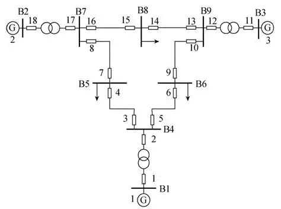
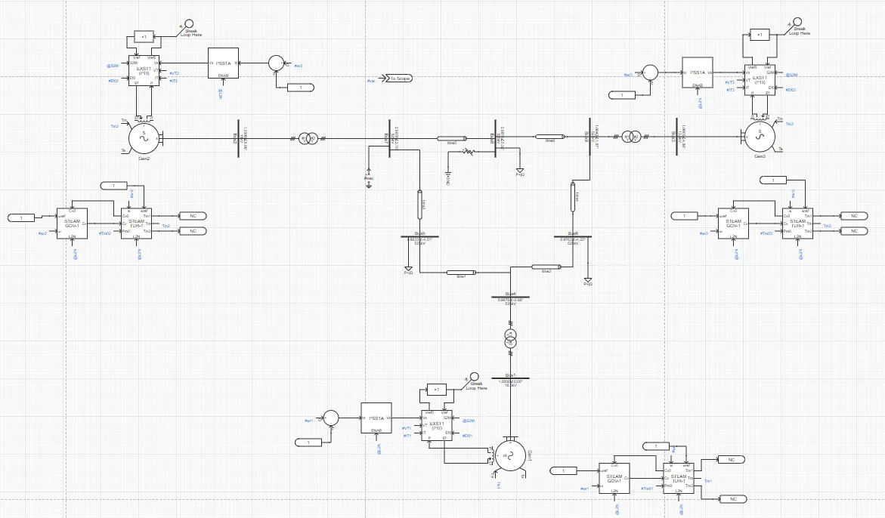
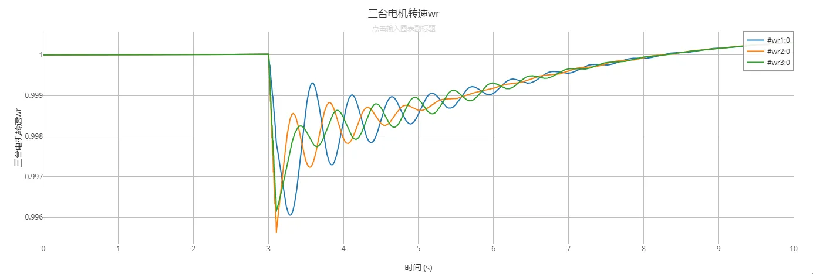
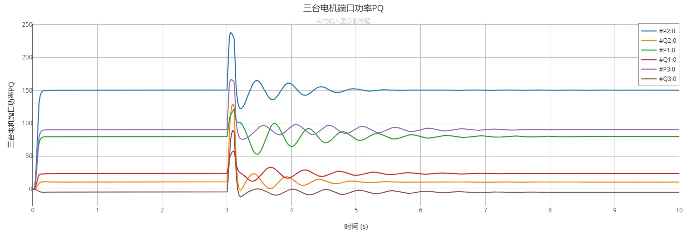
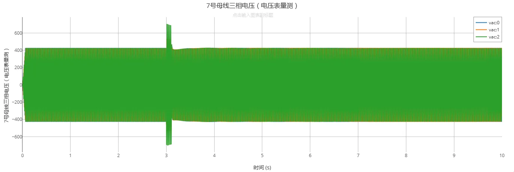
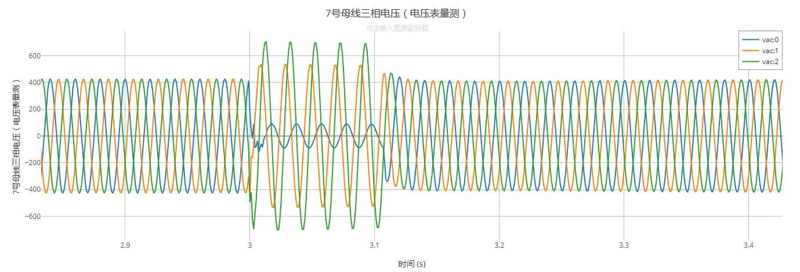

## 描述
CloudPSS 3机9节点系统是在西部系统协调委员会（Western System Coordinating Council, WSCC）提出的3机9节点经典系统[^1][^2]基础上修改构建的测试系统，由9条母线、3台发电机、3台双绕组变压器、6条线路和3个负荷组成。所有发电机均采用了励磁系统、电力系统稳定器PSS、调速器、原动机进行调控。作为测试，在本算例中，于8号母线（Bus8）添加了时长0.1s的三相接地短路故障，用户可根据需要自行修改、删除或添加其他类型的故障与扰动。

该算例可用于系统动态稳定性研究、功率交换研究、振荡阻尼研究等。

## 模型介绍

### 模型拓扑
WSCC三机九节点算例拓扑图如下，其中B1节点为松弛节点。各电机相连的母线（1-3）电压等级分别为16.5kV、18kV、13.8kV，剩下所有母线电压均为525kV。

CloudPSS上该算例采用单线图构建，其拓扑如下。  

### 模型参数

#### 母线参数与潮流解算
母线参数与潮流解算数据如下表所示：

| 母线编号 | 母线名 | 基准电压 | 节点类型 | 电压幅值 (p.u.) | 电压相角 (deg) |
|----------|--------|-----------|------------|------------------|----------------|
| 1        | Bus1   | 16.5      | swing      | 1.0000           | 0              |
| 2        | Bus2   | 18.0      | PV         | 1.0000           | 0              |
| 3        | Bus3   | 13.8      | PV         | 1.0000           | 0              |
| 4        | Bus4   | 525.0     | PV         | 0.9831           | -8.88          |
| 5        | Bus5   | 525.0     | PQ         | 0.9596           | -13.87         |
| 6        | Bus6   | 525.0     | PQ         | 0.9646           | -16.58         |
| 7        | Bus7   | 525.0     | PQ         | 0.9899           | -13.97         |
| 8        | Bus8   | 525.0     | PQ         | 0.9735           | -18.96         |
| 9        | Bus9   | 525.0     | PQ         | 0.9877           | -21.81         |

#### 传输线参数
传输线参数如下表所示，参数为线路全长参数：

| 送端母线 | 受端母线 | 电阻 R (%) | 电抗 X (%) | 电纳 B (%) |
|-----------|------------|--------------|--------------|--------------|
| 4         | 5          | 1.00         | 6.80         | 17.6         |
| 4         | 6          | 1.70         | 9.20         | 15.8         |
| 5         | 7          | 3.20         | 16.10        | 30.6         |
| 6         | 9          | 3.90         | 17.30        | 35.8         |
| 7         | 8          | 0.85         | 5.76         | 14.9         |
| 8         | 9          | 1.19         | 10.08        | 20.9         |

#### 变压器参数
变压器参数如下表所示：

| 送端母线 | 受端母线 | 电阻 R (%) | 电抗 X (%) | 容量基值 | 绕组分接头位置 (p.u.) |
|-----------|------------|--------------|--------------|-------------|-------------------------|
| 1         | 4          | 0            | 5.76         | 100         | 1                       |
| 2         | 7          | 0            | 6.25         | 100         | 1                       |
| 3         | 9          | 0            | 5.86         | 100         | 1                       |

#### 负荷参数
负荷参数如下表所示：

| 母线 | 有功 P (MW) | 无功 Q (MVAr) |
|-------|---------------|----------------|
| 5     | 125           | 50             |
| 6     | 90            | 30             |
| 8     | 100           | 35             |

在CloudPSS平台中进行暂态模型参数的设置，涉及到的模型动态参数包括发电机参数、励磁系统参数、电力系统稳定器参数。

#### 发电机参数
发电机参数如下：

| 基准容量 | 定子漏抗 XI (p.u.) | d轴同步电抗 Xd (p.u.) | d轴暂态电抗 Xd' (p.u.) | d轴次暂态 Xd'' (p.u.) | q轴同步电抗 Xq (p.u.) | q轴暂态电抗 Xq' (p.u.) | q轴次暂态 Xq'' (p.u.) | d轴暂态时间常数 Tdo' (s) | d轴次暂态时间常数 Tdo'' (s) | q轴暂态时间常数 Tqo' (s) | q轴次暂态时间常数 Tqo'' (s) | 转动惯量时间常数 Tj (s) |
|-----------|----------------------|-------------------------|--------------------------|---------------------------|-------------------------|--------------------------|---------------------------|----------------------------|-------------------------------|----------------------------|-------------------------------|---------------------------|
| 325       | 0.01                 | 0.283875                | 0.041                    | 0.028895                  | 0.283875                | 0.056603                 | 0.028895                  | 9.01                       | 0.045                        | 0.956                     | 0.069                        | 5                        |
| 325       | 0.01                 | 0.283875                | 0.041                    | 0.028895                  | 0.283875                | 0.056603                 | 0.028895                  | 9.01                       | 0.045                        | 0.956                     | 0.069                        | 5                        |
| 325       | 0.01                 | 0.283875                | 0.041                    | 0.028895                  | 0.283875                | 0.056603                 | 0.028895                  | 9.01                       | 0.045                        | 0.956                     | 0.069                        | 5                        |

#### 电力系统稳定器参数
电力系统稳定器采用标准模型，配置参数如下：

| 母线 | T6 | Ks | T5 | A1 | A2 | T1 | T2 | T3 | T4 | VSTMAX | VSTMIN |
|-------|-----|-----|-----|-----|-----|-----|-----|-----|-----|---------|---------|
| 1     | 0   | 2   | 10  | 0   | 0   | 1   | 0.2 | 1   | 0.1 | 0.2     | -0.2    |
| 2     | 0   | 2   | 10  | 0   | 0   | 1   | 0.2 | 1   | 0.1 | 0.2     | -0.2    |
| 3     | 0   | 2   | 10  | 0   | 0   | 1   | 0.2 | 1   | 0.1 | 0.2     | -0.2    |

## 仿真
模型搭建完成后，在CloudPSS平台开展电磁暂态仿真测试。在5s时于母线8处添加一个持续0.1s的A相短路接地故障，观察仿真结果。

三台电机转速运行结果如下图所示：  

三台电机端功率PQ运行结果如下图所示：  

7号母线三相电压（电压矢量测量）结果如下图所示：  

7号母线电压运行结果图如下图所示：  

## 算例地址
点击打开算例地址：[WSCC标准算例-3机9节点](https://cloudpss.net/model/CloudPSS/IEEE3)

## 参考文献

[^1]: P. M. Anderson and A. A. Fouad, *Power System Control and Stability*, 2nd ed. New York: IEEE Press, 2003.  
[^2]: 9-Bus System (WSCC Test Case), https://www.al-roomi.org/power-flow/9-bus-system

<!-- import DocCardList from '@theme/DocCardList';

<DocCardList /> -->