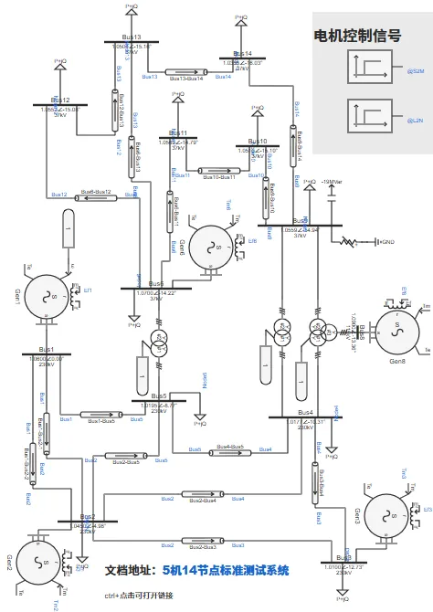
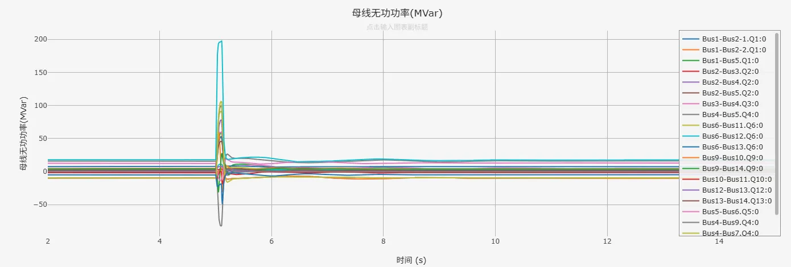
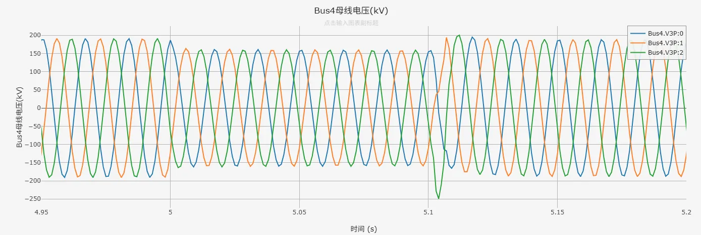

## 描述

IEEE 14节点标准系统，基于1962年2月美国电力系统简单近似而来，是电力系统分析中广泛应用的典型测试系统。该系统包含14个母线、5台发电机和11个负荷。

本测试案例基于IEEE 14节点标准系统参数搭建，系统参数来源详见[^1]。模型中发电机的暂态参数采用元件默认值，启动采用S2M模式，在仿真第1s时解锁。

作为测试，在本案例中，于母线9处设置了三相短路故障，故障在仿真第5s时发生，持续0.1s后消失。用户可根据需要自行修改、删除或添加故障设置。

本算例可用于标准电网的暂态分析。

## 模型介绍

### 模型拓扑

IEEE14节点标准系统的拓扑如下，其中母线1～母线5的电压等级为220kV，设备额定电压230kV；母线6、母线9～母线14的电压等级为35kV，设备额定电压37kV；母线8的电压等级为110kV，设备额定电压115kV。

所有发电机节点中，母线1为松弛节点，其余发电机所在母线为PV节点。系统中剩余的其他节点均为PQ节点。

基于CloudPSS搭建的IEEE14节点算例采用单线图构建，模型拓扑如下。

### 模型参数

模型中线路参数、变压器参数、负荷参数，和发电机的稳态参数均参考自[^1]。
- 由于原始数据中无暂态参数，模型中发电机的暂态参数均采用元件默认值。用户可根据仿真需求酌情修改电机参数。

#### 母线数据

原始数据中未给出各母线基准电压，但给出了母线所在的高压/中压/低压分区，本案例根据标准系统的电网拓扑及分区情况，选择230kV、115kV、37kV作为各区域基准电压。

| 母线编号 | 母线名 | 节点类型 | 基准电压(kV) |
| :--- | :--- | :--- | :--- |
| 1 | Bus1 | 松弛 | 230 |
| 2 | Bus2 | PV | 230 |
| 3 | Bus3 | PV | 230 |
| 4 | Bus4 | PQ | 230 |
| 5 | Bus5 | PQ | 230 |
| 6 | Bus6 | PV | 37 |
| 7 | Bus7 | PQ | 1(变压器中心节点) |
| 8 | Bus8 | PV | 115 |
| 9 | Bus9 | PQ | 37 |
| 10 | Bus10 | PQ | 37 |
| 11 | Bus11 | PQ | 37 |
| 12 | Bus12 | PQ | 37 |
| 13 | Bus13 | PQ | 37 |
| 14 | Bus14 | PQ | 37 |

#### 负荷数据

| 母线编号 | 有功负荷(MW) | 无功负荷(MVar) |
| :--- | :--- | :--- |
| 2 | 21.7 | 12.7 |
| 3 | 94.2 | 19.0 |
| 4 | 47.8 | -3.9 |
| 5 | 7.6 | 1.6 |
| 6 | 11.2 | 7.5 |
| 9 | 29.5 | 16.6 |
| 10 | 9.0 | 5.8 |
| 11 | 3.5 | 1.8 |
| 12 | 6.1 | 1.6 |
| 13 | 13.5 | 5.8 |
| 14 | 14.9 | 5.0 |

#### 对地并联无功数据

| 母线编号 | 基准电压(kV) | 并联电抗器(MVar) | 并联电容器(MVar) |
| :--- | :--- | :--- | :--- |
| 9 | 37 | 0.0 | 19 |

#### 发电机数据

| 母线编号 | 给定电压幅值(p.u.) | 给定电压相角(角度) | 给定有功出力(MW) | 无功出力最大限值(MVar) | 无功出力最小限值(MVar) |
| :--- | :--- | :--- | :--- | :--- | :--- |
| 1 | 1.060 | 0.0 | -- | -- | -- |
| 2 | 1.045 | -- | 40.0 | 50 | -40 |
| 3 | 1.010 | -- | 0.0 | 40.0 | 0.0 |
| 6 | 1.070 | -- | 0.0 | 24.0 | -6.0 |
| 8 | 1.090 | -- | 0.0 | 24.0 | -6.0 |

#### 线路支路数据

线路参数采用标幺值表示，其中系统基准容量为100MVA。

| 送端母线编号 | 受端母线编号 | 线路电阻(p.u.) | 线路电抗(p.u.) | 线路电纳(p.u.) |
| :--- | :--- | :--- | :--- | :--- |
| 1 | 2 | 0.01938 | 0.05917 | 0.0528 |
| 1 | 5 | 0.05403 | 0.22304 | 0.0492 |
| 2 | 3 | 0.04699 | 0.19797 | 0.0438 |
| 2 | 4 | 0.05811 | 0.17632 | 0.034 |
| 2 | 5 | 0.05695 | 0.17388 | 0.0346 |
| 3 | 4 | 0.06701 | 0.17103 | 0.0128 |
| 4 | 5 | 0.01335 | 0.04211 | 0.0 |
| 6 | 11 | 0.09498 | 0.1989 | 0.0 |
| 6 | 12 | 0.12291 | 0.25581 | 0.0 |
| 6 | 13 | 0.06615 | 0.13027 | 0.0 |
| 9 | 10 | 0.03181 | 0.0845 | 0.0 |
| 9 | 14 | 0.12711 | 0.27038 | 0.0 |
| 10 | 11 | 0.08205 | 0.19207 | 0.0 |
| 12 | 13 | 0.22092 | 0.19988 | 0.0 |
| 13 | 14 | 0.17093 | 0.34802 | 0.0 |

#### 变压器支路数据

变压器阻抗参数采用标幺值表示，其中系统基准容量为100MVA。

| 原边母线编号 | 副边母线编号 | 变压器电抗(p.u.) | 变压器变比(p.u.) |
| :--- | :--- | :--- | :--- |
| 4 | 9 | 0.55618 | 0.969 |
| 5 | 6 | 0.25202 | 0.932 |
| 4 | 7 | 0.20912 | 0.978 |
| 7 | 8 | 0.17615 | 1.0 |
| 7 | 9 | 0.11001 | 1.0 |

## 仿真案例

### 稳态潮流仿真

采用本测试案例在CloudPSS分别进行潮流计算和无故障暂态仿真，得到的潮流计算结果以及暂态仿真进入稳态后的潮流分布状态与MatPower计算结果对比如以下两表所示。

| 母线编号 | 母线名 | 参数类型 | MatPower计算结果 | CloudPSS潮流计算结果 | CloudPSS暂态仿真进入稳态后的结果 | 误差绝对值 |
| :---: | :---: | :---: | :---: | :---: | :---: | :---: |
| 1 | Bus1 | Vm(pu) | 1.060  | 1.060  | 1.060 | 0.000 |
| ^ | ^ | Va(deg) | 0.000  | 0.000  | - | 0.000 |
| 2 | Bus2 | Vm(pu) | 1.045  | 1.045  | 1.045 | 0.000 |
| ^ | ^ | Va(deg) | -4.983  | -4.983  | - | 0.000 |
| 3 | Bus3 | Vm(pu) | 1.010  | 1.010  | 1.010 | 0.000 |
| ^ | ^ | Va(deg) | -12.725  | -12.725  | - | 0.000 |
| 4 | Bus4 | Vm(pu) | 1.018  | 1.018  | 1.018 | 0.000 |
| ^ | ^ | Va(deg) | -10.313  | -10.313  | - | 0.000 |
| 5 | Bus5 | Vm(pu) | 1.020  | 1.020  | 1.020 | 0.000 |
| ^ | ^ | Va(deg) | -8.774  | -8.774  | - | 0.000 |
| 6 | Bus6 | Vm(pu) | 1.070  | 1.070  | 1.070 | 0.000 |
| ^ | ^ | Va(deg) | -14.221  | -14.221  | - | 0.000 |
| 7 | Bus7 | Vm(pu) | 1.062  | 1.062  | 变压器中心节点，无量测 | 0.000 |
| ^ | ^ | Va(deg) | -13.360  | -13.360  | - | 0.000 |
| 8 | Bus8 | Vm(pu) | 1.090  | 1.090  | 1.090 | 0.000 |
| ^ | ^ | Va(deg) | -13.360  | -13.360  | - | 0.000 |
| 9 | Bus9 | Vm(pu) | 1.056  | 1.056  | 1.056 | 0.000 |
| ^ | ^ | Va(deg) | -14.939  | -14.939  | - | 0.000 |
| 10 | Bus10 | Vm(pu) | 1.051  | 1.051  | 1.051 | 0.000 |
| ^ | ^ | Va(deg) | -15.097  | -15.097  | - | 0.000 |
| 11 | Bus11 | Vm(pu) | 1.057  | 1.057  | 1.057 | 0.000 |
| ^ | ^ | Va(deg) | -14.791  | -14.791  | - | 0.000 |
| 12 | Bus12 | Vm(pu) | 1.055  | 1.055  | 1.055 | 0.000 |
| ^ | ^ | Va(deg) | -15.076  | -15.076  | - | 0.000 |
| 13 | Bus13 | Vm(pu) | 1.050  | 1.050  | 1.050 | 0.000 |
| ^ | ^ | Va(deg) | -15.156  | -15.156  | - | 0.000 |
| 14 | Bus14 | Vm(pu) | 1.036  | 1.036  | 1.036 | 0.000 |
| ^ | ^ | Va(deg) | -16.034  | -16.034  | - | 0.000 |

| 送端母线 | 受端母线 | 参数类型 | MatPower计算结果 | CloudPSS潮流计算结果 | CloudPSS暂态仿真进入稳态后的结果 | 误差绝对值 |
| :---: | :---: | :---: | :---: | :---: | :---: | :---: |
Bus1 | Bus2 | P(MW) | 156.88  | 156.88  | 156.91  | 0.03
^ | ^ | Q(Mvar) | -20.40  | -20.40  | -20.41  | 0.01
Bus1 | Bus5 | P(MW) | 75.51  | 75.51  | 75.51  | 0.00 
^ | ^ | Q(Mvar) | 3.85  | 3.86  | 3.85  | 0.01 
Bus2 | Bus3 | P(MW) | 73.24  | 73.24  | 73.23  | 0.01 
^ | ^ | Q(Mvar) | 3.56  | 3.56  | 3.56  | 0.00 
Bus2 | Bus4 | P(MW) | 56.13  | 56.13  | 56.12  | 0.01 
^ | ^ | Q(Mvar) | -1.55  | -1.55  | -1.55  | 0.00 
Bus2 | Bus5 | P(MW) | 41.52  | 41.52  | 41.51  | 0.01 
^ | ^ | Q(Mvar) | 1.17  | 1.18  | 1.17  | 0.01 
Bus3 | Bus4 | P(MW) | -23.29  | -23.29  | -23.29  | 0.00 
^ | ^ | Q(Mvar) | 4.47  | 4.48  | 4.47  | 0.01 
Bus4 | Bus5 | P(MW) | -61.16  | -61.16  | -61.16  | 0.00 
^ | ^ | Q(Mvar) | 15.82  | 15.83  | 15.82  | 0.01 
Bus4 | Bus7 | P(MW) | 28.07  | 28.07  | 28.06  | 0.01 
^ | ^ | Q(Mvar) | -9.68  | -9.68  | -9.68  | 0.00 
Bus4 | Bus9 | P(MW) | 16.08  | 16.08  | 16.08  | 0.00 
^ | ^ | Q(Mvar) | -0.43  | -0.43  | -0.43  | 0.00 
Bus5 | Bus6 | P(MW) | 44.09  | 44.09  | 44.08  | 0.01 
^ | ^ | Q(Mvar) | 12.47  | 12.48  | 12.47  | 0.01 
Bus6 | Bus11 | P(MW) | 7.35  | 7.35  | 7.35  | 0.00 
^ | ^ | Q(Mvar) | 3.56  | 3.56  | 3.56  | 0.00 
Bus6 | Bus12 | P(MW) | 7.79  | 7.79  | 7.79  | 0.00 
^ | ^ | Q(Mvar) | 2.50  | 2.50  | 2.50  | 0.00 
Bus6 | Bus13 | P(MW) | 17.75  | 17.75  | 17.75  | 0.00 
^ | ^ | Q(Mvar) | 7.22  | 7.22  | 7.22  | 0.00 
Bus8 | Bus7 | P(MW) | 0.00  | 0.00  | 0.01  | 0.01 
^ | ^ | Q(Mvar) | 17.62  | 17.62  | 17.62  | 0.00 
Bus9 | Bus7 | P(MW) | -28.07  | -28.07  | -28.08  | 0.01 
^ | ^ | Q(Mvar) | -4.98  | -4.98  | -4.98  | 0.00 
Bus9 | Bus10 | P(MW) | 5.23  | 5.23  | 5.23  | 0.00 
^ | ^ | Q(Mvar) | 4.22  | 4.22  | 4.22  | 0.00 
Bus9 | Bus14 | P(MW) | 9.43  | 9.43  | 9.43  | 0.00 
^ | ^ | Q(Mvar) | 3.61  | 3.61  | 3.61  | 0.00 
Bus10 | Bus11 | P(MW) | -3.79  | -3.79  | -3.79  | 0.00 
^ | ^ | Q(Mvar) | -1.62  | -1.62  | -1.61  | 0.01 
Bus12 | Bus13 | P(MW) | 1.61  | 1.61  | 1.61  | 0.00 
^ | ^ | Q(Mvar) | 0.75  | 0.75  | 0.75  | 0.00 
Bus13 | Bus14 | P(MW) | 5.64  | 5.64  | 5.64  | 0.00 
^ | ^ | Q(Mvar) | 1.75  | 1.75  | 1.75  | 0.00 

测试案例在CloudPSS进行潮流计算所得结果以及进行无故障暂态仿真进入稳态后的潮流分布与MatPower计算结果吻合。

### 暂态故障仿真

采用本测试案例进行故障暂态仿真，故障点设置于母线9处，故障类型为三相短路，发生时刻为仿真第5s时，持续0.1s后消失。

对各母线电压和各线路功率进行观测，得到故障期间及故障前后系统中电压、有功、无功的分布波形如以下三图所示。  

  

  

  

以故障近区的Bu4母线为例，观测其在故障过程中的瞬时电压波形如下图所示。

仿真案例模拟了电网在故障后的恢复过程。

## 算例地址

点击打开算例地址：[**5机14节点标准测试系统**](http://cloudpss-calculate.local.ddns.cloudpss.net/model/open-cloudpss/IEEE_14_BUS-v1a1)

## 参考文献

[^1]: [**IEEE 14 Bus Power Flow Test Case**](./case14B.txt)(https://labs.ece.uw.edu/pstca/pf14/pg_tca14bus.htm)