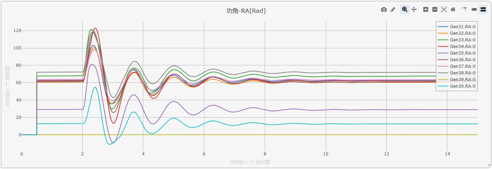
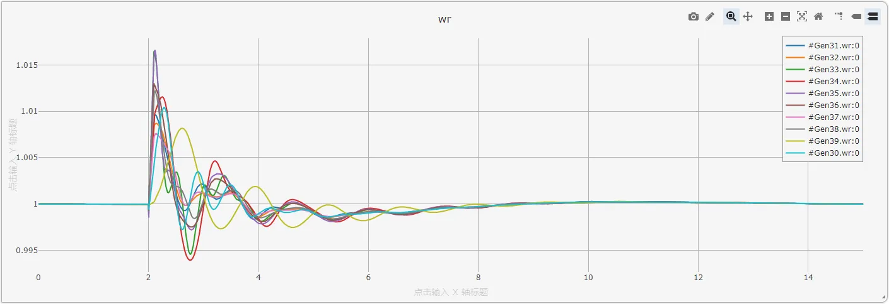
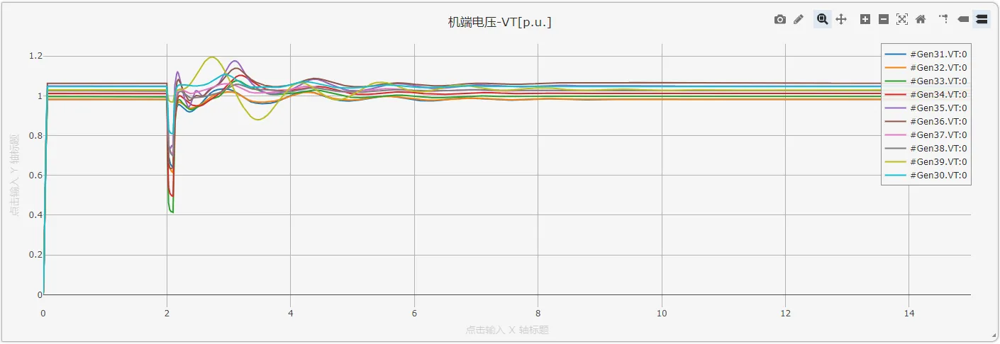
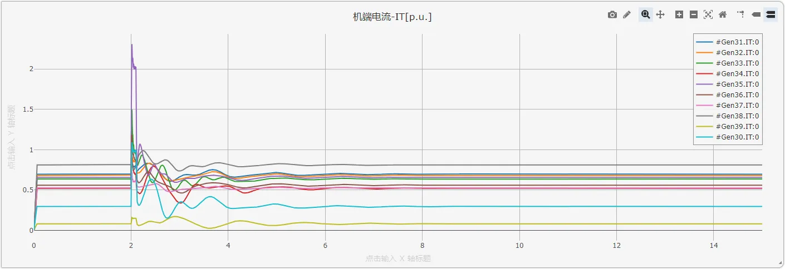

## 描述
IEEE 39节点标准系统，是美国新英格兰地区的一个电力网络。该系统包括10台发电机，39个母线，12台变压器。所有电机均采用了励磁、调速以及电力系统稳定器进行调控。
作为测试，在实例算例中，于bus-16母线处添加了时长0.1s的三项接地短路故障，用户可根据需要自行修改、删除或添加。

系统可以选择两种启动方式：S2M启动方式与稳态潮流断面启动方式。详见[潮流断面启动](../../../../../documents/software/20-emtlab/60-power-flow/30-initializing-from-power-flow-results/index.md#潮流断面启动)。

该算例可用于传统暂态稳定分析，励磁、调速控制器设计，系统调频等特性分析等。

## 模型介绍

### 模型拓扑

IEEE39节点算例拓扑图如下，其中39号节点为松弛节点。除松弛节点外，各电机相连的母线（30-38）电压等级均为20kV，另外12号节点为25kV，剩下所有母线电压均为500kV。

CloudPSS上该算例采用单线图构建，其拓扑如下。

#### 子系统功能

CloudPSS上的IEEE39节点标准系统中，对电机采用了子系统功能进行封装。每个子系统内部的拓扑如下图所示（以30号电机为例），每台电机包含励磁器、调速器、原动机、电力系统稳定器四种控制器模型。  
+ 励磁器采用IEEE标准的EXST1_PTI型励磁调节器，详见：[EXST1_PTI](../../../../../documents/software/20-emtlab/110-component-library/10-basic/20-control/170-ieee-standard-excitors/10-_EXST1_PTI/index.md)  
+ 调速器采用IEEE标准的STEAM_GOV_1型调速器，详见：[STEAM_GOV_1](../../../../../documents/software/20-emtlab/110-component-library/10-basic/20-control/180-ieee-standard-governors/10-_STEAM_GOV_1/index.md)  
+ 原动机采用IEEE标准的STEAM_TUR_1型原动机，详见：[STEAM_TUR_1](../../../../../documents/software/20-emtlab/110-component-library/10-basic/20-control/180-ieee-standard-governors/20-_STEAM_TUR_1/index.md)  
+ 电力系统稳定器采用IEEE标准的PSS1A电力系统稳定器，详见：[PSS1A](../../../../../documents/software/20-emtlab/110-component-library/10-basic/20-control/190-ieee-standard-pss/10-_PSS1A/index.md)

  

### 模型参数

所有发电机、线路、变压器、励磁器、调速器、原动机、电力系统稳定器参数均来源于文献[^1]。

#### 发电机参数

本案例中[同步发电机](../../../../../documents/software/20-emtlab/110-component-library/10-basic/10-electrical/40-three-phase-ac-components/120-SyncGeneratorRouter/index.md)模型参数输入方式选用`Experimental Data`（试验参数），与文献[^1]中提供的发电机原始标幺值参数保持一致。  

#### 线路参数

文献[^1]线路原始参数中，标幺值参数为线路全长参数（潮流计算使用的参数），有名值参数为单位长度参数（根据标幺值参数和基准容量、电压、线路长度折算）。在CloudPSS提供的39节点标准算例中，线路参数采用标幺值的方式录入。  

线路参数基值选取：电压基值为500kV，功率基值为100MW。

#### 负荷参数

| 节点编号 | 有功功率P（MW） | 无功功率Q（MVar）|
| :--- | :--- | :--- |
| 1 | 97.6 | 44.2|
| 3 | 322 | 2.4|
| 4 | 500 | 184|
| 7 | 233.8 | 84|
| 8 | 522 | 176|
| 12 | 8.5 | 88|
| 15 | 320 | 153|
| 16 | 329 | 32.3|
| 18 | 158 | 30|
| 20 | 680 | 103|
| 21 | 274 | 115|
| 23 | 247.5 | 84.6|
| 24 | 308.6 | -92.2|
| 25 | 224 | 47.2|
| 26 | 139 | 17|
| 27 | 281 | 75.5|
| 28 | 206 | 27.6|
| 29 | 283.5 | 26.9|
| 31 | 9.2 | 4.6|
| 39 | 1104 | 250|

## 仿真

CloudPSS的电磁暂态仿真中电气系统的启动可以大体分为两种：`从零启动`以及`从潮流断面直接启动`。具体可以参考[潮流断面启动](../../../../../documents/software/20-emtlab/60-power-flow/30-initializing-from-power-flow-results/index.md#潮流断面启动)

作为演示，这里选择从零启动（即S2M启动）方式，在`运行`标签页下配置`电磁暂态仿真方案`。在仿真方案配置页面，可配置输出窗口，这里选择输出所有10台发电机的功角、转速、端电压标幺值、端电流标幺值，以及37号母线所连电机的三相瞬时电流曲线。

点击`启动任务`或按下[[ctrl]]+[[R]]开始仿真。

下面展示某次仿真的运行结果，注意在2s-2.1s间，16号母线处发生了三相接地短路故障。

所有电机的功角波形如图所示：

所有电机的转速波形如图所示：

所有电机的端电压标幺值仿真结果如图所示：

所有电机的端电流标幺值仿真结果如图所示：

以37号节点为例，在故障前后处机端电流波形的仿真结果为：

  

由上述仿真结果可以看到，在系统发生0.1s三相接地短路故障后，所有电机功角、转速及端电压均能快速恢复至稳态，表明系统具备良好的暂态稳定性，验证了所建IEEE10机39节点标准测试系统案例的正确性。

## 算例地址
点击打开算例地址：[**10机39节点标准测试系统**](http://cloudpss-calculate.local.ddns.cloudpss.net/model/open-cloudpss/IEEE_39_BUS-v1a1)  

## 参考文献

[^1]: [[Luc Gérin-Lajoie. IEEE PES Task Force on Benchmark Systems for Stability Controls[R]. EMTP-RV 39-bus system, Version 1.5 - Mars 04, 2015]](<IEEE PES Task Force on Benchmark Systems for Stability Controls.pdf>) 