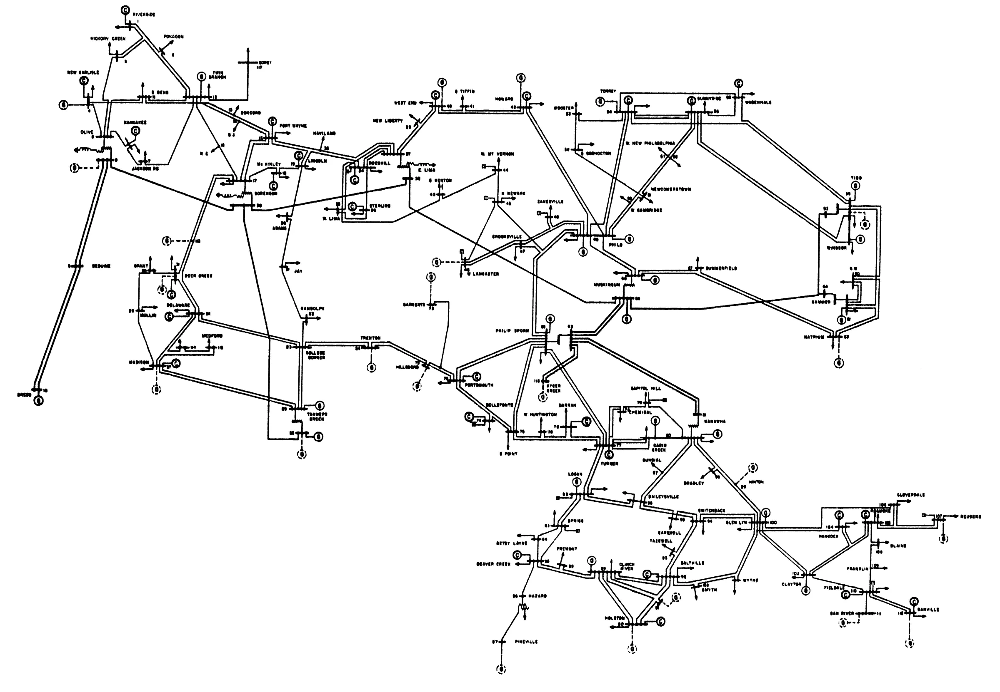
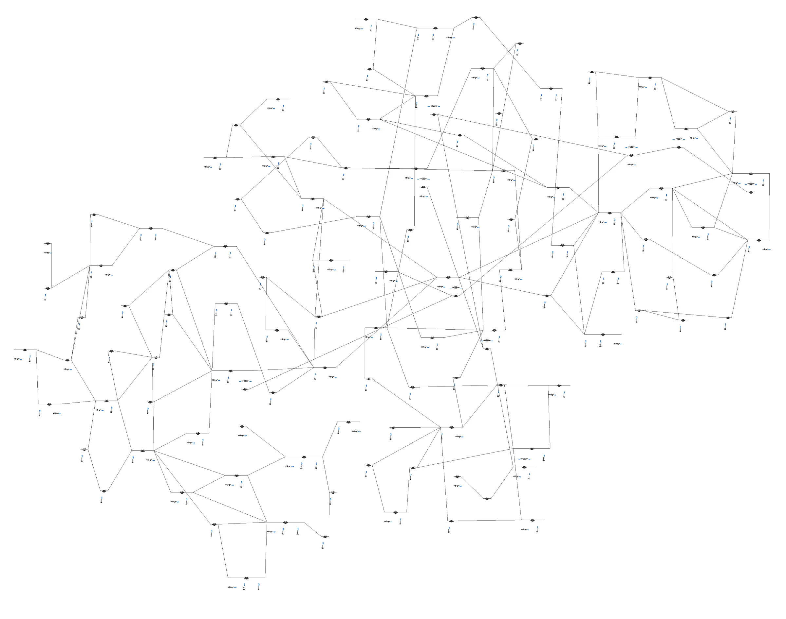

## 描述
IEEE118 节点标准测试系统是电力系统分析中广泛使用的经典测试案例。本算例基于华盛顿大学电力系统测试案例库提供的 IEEE118 节点标准数据文件搭建[^1]，该系统包括 118 条母线，19 台发电机、35 台调相机和9 台变压器。该系统包含了变压器、并联补偿等典型电力系统元件，适用于电力系统潮流计算与静态安全分析。  

## 模型介绍

### 模型拓扑

IEEE118 节点算例拓扑图如下，其中 Bus69 号节点为松弛节点。系统通过变压器实现不同电压等级的互联，形成了典型的层次化网络结构，电压等级包括 345、161、138kV。  

  

CloudPSS 上该算例采用单线图构建，其拓扑如下。  

### 模型参数

所有母线参数、传输线参数、变压器参数、负荷参数、电机参数均来源于标准数据文件[^1]。  

## 潮流计算

基于相同的标准数据文件，在 CloudPSS 和 Matpower 中分别进行潮流计算，对计算结果进行对比验证。

### 母线潮流计算结果
 
CloudPSS 与 Matpower 母线潮流计算中电压幅值与相角的结果及误差如下表所示。

| **母线编号** |     >     | **CloudPSS 潮流结果** |     >     | **Matpower 潮流结果** |       >       |   **误差绝对值**   |
| :----------: | :-------: | :------------------: | :-------: | :--------------: | :-----------: | :------------: |
|             | **V[pu]** |      **δ[deg]**      | **V[pu]** |    **δ[deg]**    | **V_err[pu]** | **δ_err[deg]** |
|     Bus1     |   0.955   |        10.982        |   0.955   |      10.982      |     0.000     |     0.000      |
|     Bus2     |   0.971   |        11.522        |   0.971   |      11.522      |     0.000     |     0.000      |
|     Bus3     |   0.968   |        11.866        |   0.968   |      11.866      |     0.000     |     0.000      |
|     Bus4     |   0.998   |        15.583        |   0.998   |      15.583      |     0.000     |     0.000      |
|     Bus5     |   1.002   |        16.028        |   1.002   |      16.028      |     0.000     |     0.000      |
|     Bus6     |   0.990   |        13.301        |   0.990   |      13.301      |     0.000     |     0.000      |
|     Bus7     |   0.989   |        12.857        |   0.989   |      12.857      |     0.000     |     0.000      |
|     Bus8     |   1.015   |        21.049        |   1.015   |      21.049      |     0.000     |     0.000      |
|     Bus9     |   1.043   |        28.303        |   1.043   |      28.303      |     0.000     |     0.000      |
|    Bus10     |   1.050   |        35.884        |   1.050   |      35.884      |     0.000     |     0.000      |
|    Bus11     |   0.985   |        13.016        |   0.985   |      13.016      |     0.000     |     0.000      |
|    Bus12     |   0.990   |        12.499        |   0.990   |      12.499      |     0.000     |     0.000      |
|    Bus13     |   0.968   |        11.641        |   0.968   |      11.641      |     0.000     |     0.000      |
|    Bus14     |   0.984   |        11.783        |   0.984   |      11.783      |     0.000     |     0.000      |
|    Bus15     |   0.970   |        11.489        |   0.970   |      11.489      |     0.000     |     0.000      |
|    Bus16     |   0.984   |        12.197        |   0.984   |      12.197      |     0.000     |     0.000      |
|    Bus17     |   0.995   |        14.005        |   0.995   |      14.005      |     0.000     |     0.000      |
|    Bus18     |   0.973   |        11.791        |   0.973   |      11.791      |     0.000     |     0.000      |
|    Bus19     |   0.963   |        11.307        |   0.963   |      11.307      |     0.000     |     0.000      |
|    Bus20     |   0.958   |        12.187        |   0.958   |      12.187      |     0.000     |     0.000      |
|    Bus21     |   0.959   |        13.775        |   0.959   |      13.775      |     0.000     |     0.000      |
|    Bus22     |   0.970   |        16.329        |   0.970   |      16.329      |     0.000     |     0.000      |
|    Bus23     |   1.000   |        21.250        |   1.000   |      21.250      |     0.000     |     0.000      |
|    Bus24     |   0.992   |        21.118        |   0.992   |      21.118      |     0.000     |     0.000      |
|    Bus25     |   1.050   |        28.184        |   1.050   |      28.184      |     0.000     |     0.000      |
|    Bus26     |   1.015   |        29.965        |   1.015   |      29.964      |     0.000     |     0.001      |
|    Bus27     |   0.968   |        15.612        |   0.968   |      15.612      |     0.000     |     0.000      |
|    Bus28     |   0.962   |        13.888        |   0.962   |      13.887      |     0.000     |     0.001      |
|    Bus29     |   0.963   |        12.895        |   0.963   |      12.895      |     0.000     |     0.000      |
|    Bus30     |   0.986   |        19.040        |   0.986   |      19.040      |     0.000     |     0.000      |
|    Bus31     |   0.967   |        13.012        |   0.967   |      13.012      |     0.000     |     0.000      |
|    Bus32     |   0.964   |        15.060        |   0.964   |      15.059      |     0.000     |     0.001      |
|    Bus33     |   0.972   |        10.864        |   0.972   |      10.864      |     0.000     |     0.000      |
|    Bus34     |   0.986   |        11.506        |   0.986   |      11.506      |     0.000     |     0.000      |
|    Bus35     |   0.981   |        11.079        |   0.981   |      11.079      |     0.000     |     0.000      |
|    Bus36     |   0.980   |        11.083        |   0.980   |      11.083      |     0.000     |     0.000      |
|    Bus37     |   0.992   |        11.970        |   0.992   |      11.970      |     0.000     |     0.000      |
|    Bus38     |   0.962   |        17.107        |   0.962   |      17.107      |     0.000     |     0.000      |
|    Bus39     |   0.970   |        8.597         |   0.970   |      8.597       |     0.000     |     0.000      |
|    Bus40     |   0.970   |        7.523         |   0.970   |      7.523       |     0.000     |     0.000      |
|    Bus41     |   0.967   |        7.077         |   0.967   |      7.077       |     0.000     |     0.000      |
|    Bus42     |   0.985   |        8.673         |   0.985   |      8.673       |     0.000     |     0.000      |
|    Bus43     |   0.978   |        11.460        |   0.978   |      11.460      |     0.000     |     0.000      |
|    Bus44     |   0.985   |        13.946        |   0.985   |      13.945      |     0.000     |     0.001      |
|    Bus45     |   0.987   |        15.776        |   0.987   |      15.776      |     0.000     |     0.000      |
|    Bus46     |   1.005   |        18.582        |   1.005   |      18.582      |     0.000     |     0.000      |
|    Bus47     |   1.017   |        20.805        |   1.017   |      20.805      |     0.000     |     0.000      |
|    Bus48     |   1.021   |        20.025        |   1.021   |      20.025      |     0.000     |     0.000      |
|    Bus49     |   1.025   |        21.028        |   1.025   |      21.028      |     0.000     |     0.000      |
|    Bus50     |   1.001   |        18.989        |   1.001   |      18.989      |     0.000     |     0.000      |
|    Bus51     |   0.967   |        16.370        |   0.967   |      16.370      |     0.000     |     0.000      |
|    Bus52     |   0.957   |        15.416        |   0.957   |      15.416      |     0.000     |     0.000      |
|    Bus53     |   0.946   |        14.441        |   0.946   |      14.441      |     0.000     |     0.000      |
|    Bus54     |   0.955   |        15.353        |   0.955   |      15.353      |     0.000     |     0.000      |
|    Bus55     |   0.952   |        15.063        |   0.952   |      15.063      |     0.000     |     0.000      |
|    Bus56     |   0.954   |        15.250        |   0.954   |      15.250      |     0.000     |     0.000      |
|    Bus57     |   0.971   |        16.455        |   0.971   |      16.455      |     0.000     |     0.000      |
|    Bus58     |   0.959   |        15.598        |   0.959   |      15.598      |     0.000     |     0.000      |
|    Bus59     |   0.985   |        19.452        |   0.985   |      19.452      |     0.000     |     0.000      |
|    Bus60     |   0.993   |        23.234        |   0.993   |      23.234      |     0.000     |     0.000      |
|    Bus61     |   0.995   |        24.125        |   0.995   |      24.125      |     0.000     |     0.000      |
|    Bus62     |   0.998   |        23.509        |   0.998   |      23.508      |     0.000     |     0.001      |
|    Bus63     |   0.969   |        22.831        |   0.969   |      22.831      |     0.000     |     0.000      |
|    Bus64     |   0.984   |        24.597        |   0.984   |      24.597      |     0.000     |     0.000      |
|    Bus65     |   1.005   |        27.722        |   1.005   |      27.722      |     0.000     |     0.000      |
|    Bus66     |   1.050   |        27.563        |   1.050   |      27.563      |     0.000     |     0.000      |
|    Bus67     |   1.020   |        24.923        |   1.020   |      24.923      |     0.000     |     0.000      |
|    Bus68     |   1.003   |        27.601        |   1.003   |      27.601      |     0.000     |     0.000      |
|    Bus69     |   1.035   |        30.000        |   1.035   |      30.000      |     0.000     |     0.000      |
|    Bus70     |   0.984   |        22.620        |   0.984   |      22.620      |     0.000     |     0.000      |
|    Bus71     |   0.987   |        22.209        |   0.987   |      22.209      |     0.000     |     0.000      |
|    Bus72     |   0.980   |        21.112        |   0.980   |      21.111      |     0.000     |     0.001      |
|    Bus73     |   0.991   |        21.998        |   0.991   |      21.998      |     0.000     |     0.000      |
|    Bus74     |   0.958   |        21.671        |   0.958   |      21.671      |     0.000     |     0.000      |
|    Bus75     |   0.967   |        22.933        |   0.967   |      22.933      |     0.000     |     0.000      |
|    Bus76     |   0.943   |        21.803        |   0.943   |      21.803      |     0.000     |     0.000      |
|    Bus77     |   1.006   |        26.757        |   1.006   |      26.757      |     0.000     |     0.000      |
|    Bus78     |   1.003   |        26.453        |   1.003   |      26.453      |     0.000     |     0.000      |
|    Bus79     |   1.009   |        26.752        |   1.009   |      26.752      |     0.000     |     0.000      |
|    Bus80     |   1.040   |        28.998        |   1.040   |      28.998      |     0.000     |     0.000      |
|    Bus81     |   0.997   |        28.149        |   0.997   |      28.149      |     0.000     |     0.000      |
|    Bus82     |   0.989   |        27.277        |   0.989   |      27.277      |     0.000     |     0.000      |
|    Bus83     |   0.985   |        28.467        |   0.985   |      28.467      |     0.000     |     0.000      |
|    Bus84     |   0.980   |        31.001        |   0.980   |      31.001      |     0.000     |     0.000      |
|    Bus85     |   0.985   |        32.555        |   0.985   |      32.555      |     0.000     |     0.000      |
|    Bus86     |   0.987   |        31.185        |   0.987   |      31.185      |     0.000     |     0.000      |
|    Bus87     |   1.015   |        31.445        |   1.015   |      31.445      |     0.000     |     0.000      |
|    Bus88     |   0.987   |        35.686        |   0.987   |      35.686      |     0.000     |     0.000      |
|    Bus89     |   1.005   |        39.741        |   1.005   |      39.741      |     0.000     |     0.000      |
|    Bus90     |   0.985   |        33.337        |   0.985   |      33.337      |     0.000     |     0.000      |
|    Bus91     |   0.980   |        33.355        |   0.980   |      33.355      |     0.000     |     0.000      |
|    Bus92     |   0.992   |        33.854        |   0.992   |      33.854      |     0.000     |     0.000      |
|    Bus93     |   0.987   |        30.843        |   0.987   |      30.843      |     0.000     |     0.000      |
|    Bus94     |   0.991   |        28.689        |   0.991   |      28.689      |     0.000     |     0.000      |
|    Bus95     |   0.981   |        27.718        |   0.981   |      27.718      |     0.000     |     0.000      |
|    Bus96     |   0.993   |        27.550        |   0.993   |      27.550      |     0.000     |     0.000      |
|    Bus97     |   1.011   |        27.924        |   1.011   |      27.924      |     0.000     |     0.000      |
|    Bus98     |   1.024   |        27.446        |   1.024   |      27.446      |     0.000     |     0.000      |
|    Bus99     |   1.010   |        27.084        |   1.010   |      27.084      |     0.000     |     0.000      |
|    Bus100    |   1.017   |        28.080        |   1.017   |      28.080      |     0.000     |     0.000      |
|    Bus101    |   0.992   |        29.653        |   0.992   |      29.653      |     0.000     |     0.000      |
|    Bus102    |   0.991   |        32.351        |   0.991   |      32.351      |     0.000     |     0.000      |
|    Bus103    |   1.001   |        24.486        |   1.001   |      24.485      |     0.000     |     0.001      |
|    Bus104    |   0.971   |        21.740        |   0.971   |      21.740      |     0.000     |     0.000      |
|    Bus105    |   0.966   |        20.618        |   0.966   |      20.618      |     0.000     |     0.000      |
|    Bus106    |   0.962   |        20.371        |   0.962   |      20.371      |     0.000     |     0.000      |
|    Bus107    |   0.952   |        17.580        |   0.952   |      17.580      |     0.000     |     0.000      |
|    Bus108    |   0.967   |        19.427        |   0.967   |      19.427      |     0.000     |     0.000      |
|    Bus109    |   0.967   |        18.978        |   0.967   |      18.978      |     0.000     |     0.000      |
|    Bus110    |   0.973   |        18.139        |   0.973   |      18.139      |     0.000     |     0.000      |
|    Bus111    |   0.980   |        19.784        |   0.980   |      19.784      |     0.000     |     0.000      |
|    Bus112    |   0.975   |        15.040        |   0.975   |      15.040      |     0.000     |     0.000      |
|    Bus113    |   0.993   |        14.003        |   0.993   |      14.003      |     0.000     |     0.000      |
|    Bus114    |   0.960   |        14.729        |   0.960   |      14.729      |     0.000     |     0.000      |
|    Bus115    |   0.960   |        14.722        |   0.960   |      14.722      |     0.000     |     0.000      |
|    Bus116    |   1.005   |        27.166        |   1.005   |      27.166      |     0.000     |     0.000      |
|    Bus117    |   0.974   |        10.958        |   0.974   |      10.958      |     0.000     |     0.000      |
|    Bus118    |   0.949   |        21.945        |   0.949   |      21.945      |     0.000     |     0.000      |

### 支路潮流计算结果

CloudPSS 与 Matpower 支路潮流计算中有功功率与无功功率的结果及误差如下表所示。

| **送端母线** | **受端母线** | >         | **CloudPSS 潮流结果** |     >     | **Matpower 潮流结果** | >             |   **误差绝对值**    |
| :------: | :--------: | :---------: | :--------------------: | :-------: | :--------------: | :-------------: | :-------------: |
|         |         | **P[MW]** | **Q[MVar]**          | **P[MW]** |   **Q[MVar]**    | **P_err[MW]** | **Q_err[MVar]** |
|    1     | 2        | -12.356   | -13.040              |  -12.360  |     -13.040      | 0.004         |      0.000      |
|    1     | 3        | -38.644   | -17.061              |  -38.640  |     -17.060      | 0.004         |      0.001      |
|    2     | 12       | -32.454   | -20.005              |  -32.450  |     -20.010      | 0.004         |      0.005      |
|    3     | 5        | -68.103   | -14.487              |  -68.100  |     -14.490      | 0.003         |      0.003      |
|    3     | 12       | -9.791    | -12.395              |  -9.790   |     -12.390      | 0.001         |      0.005      |
|    4     | 5        | -103.213  | -26.728              | -103.210  |     -26.790      | 0.003         |      0.062      |
|    4     | 11       | 64.213    | -0.213               |  64.210   |      -0.210      | 0.003         |      0.003      |
|    5     | 6        | 88.456    | 4.099                |  88.460   |      4.110       | 0.004         |      0.011      |
|    5     | 11       | 77.205    | 2.964                |  77.210   |      2.970       | 0.005         |      0.006      |
|    6     | 7        | 35.526    | -4.768               |  35.530   |      -4.770      | 0.004         |      0.002      |
|    7     | 12       | 16.466    | -6.502               |  16.470   |      -6.500      | 0.004         |      0.002      |
|    8     | 5        | 338.417   | 124.634              |  338.420  |     124.720      | 0.003         |      0.086      |
|    8     | 9        | -440.635  | -89.734              | -440.640  |     -89.730      | 0.005         |      0.004      |
|    8     | 30       | 74.218    | 27.784               |  74.220   |      27.770      | 0.002         |      0.014      |
|    9     | 10       | -445.255  | -24.429              | -445.250  |     -24.430      | 0.005         |      0.001      |
|    11    | 12       | 34.284    | -35.137              |  34.280   |     -35.130      | 0.004         |      0.007      |
|    11    | 13       | 35.061    | 11.414               |  35.060   |      11.410      | 0.001         |      0.004      |
|    12    | 14       | 18.286    | 2.631                |  18.290   |      2.630       | 0.004         |      0.001      |
|    12    | 16       | 7.504     | 4.286                |   7.500   |      4.290       | 0.004         |      0.004      |
|    12    | 117      | 20.153    | 5.197                |  20.150   |      5.200       | 0.003         |      0.003      |
|    13    | 15       | 0.745     | -3.837               |   0.740   |      -3.840      | 0.005         |      0.003      |
|    14    | 15       | 4.210     | 3.149                |   4.210   |      3.150       | 0.000         |      0.001      |
|    15    | 17       | -103.717  | -24.426              | -103.720  |     -24.410      | 0.003         |      0.016      |
|    15    | 19       | 11.411    | 12.236               |  11.410   |      12.250      | 0.001         |      0.014      |
|    15    | 33       | 7.230     | -4.882               |   7.230   |      -4.880      | 0.000         |      0.002      |
|    16    | 17       | -17.515   | -3.702               |  -17.510  |      -3.700      | 0.005         |      0.002      |
|    17    | 18       | 80.268    | 24.860               |  80.270   |      24.850      | 0.002         |      0.010      |
|    17    | 31       | 14.772    | 11.551               |  14.770   |      11.550      | 0.002         |      0.001      |
|    17    | 113      | 2.059     | 6.059                |   2.060   |      6.040       | 0.001         |      0.019      |
|    18    | 19       | 19.387    | 14.015               |  19.390   |      14.020      | 0.003         |      0.005      |
|    19    | 20       | -10.648   | 5.423                |  -10.650  |      5.420       | 0.002         |      0.003      |
|    19    | 34       | -3.661    | -10.565              |  -3.660   |     -10.570      | 0.001         |      0.005      |
|    20    | 21       | -28.692   | 4.973                |  -28.690  |      4.970       | 0.002         |      0.003      |
|    21    | 22       | -42.863   | -1.838               |  -42.860  |      -1.840      | 0.003         |      0.002      |
|    22    | 23       | -53.281   | -6.491               |  -53.280  |      -6.490      | 0.001         |      0.001      |
|    23    | 24       | 8.298     | 10.797               |   8.300   |      10.800      | 0.002         |      0.003      |
|    23    | 25       | -162.613  | -25.919              | -162.610  |     -25.920      | 0.003         |      0.001      |
|    23    | 32       | 92.994    | 4.713                |  92.990   |      4.710       | 0.004         |      0.003      |
|    24    | 70       | -6.209    | -2.974               |  -6.210   |      -2.970      | 0.001         |      0.004      |
|    24    | 72       | 1.473     | 3.305                |   1.470   |      3.310       | 0.003         |      0.005      |
|    25    | 27       | 143.486   | 30.055               |  143.490  |      30.060      | 0.004         |      0.005      |
|    26    | 25       | 90.300    | 21.678               |  90.300   |      21.580      | 0.000         |      0.098      |
|    26    | 30       | 223.700   | -11.671              |  223.700  |     -11.680      | 0.000         |      0.009      |
|    27    | 28       | 32.858    | -0.589               |  32.860   |      -0.590      | 0.002         |      0.001      |
|    27    | 32       | 12.499    | 1.018                |  12.500   |      1.020       | 0.001         |      0.002      |
|    27    | 115      | 20.734    | 4.665                |  20.730   |      4.670       | 0.004         |      0.005      |
|    28    | 29       | 15.638    | -6.564               |  15.640   |      -6.560      | 0.002         |      0.004      |
|    29    | 31       | -8.432    | -8.639               |  -8.430   |      -8.640      | 0.002         |      0.001      |
|    30    | 17       | 231.055   | 93.419               |  231.060  |      93.370      | 0.005         |      0.049      |
|    30    | 38       | 62.533    | 18.061               |  62.530   |      18.080      | 0.003         |      0.019      |
|    31    | 32       | -29.869   | 11.814               |  -29.870  |      11.820      | 0.001         |      0.006      |
|    32    | 113      | 4.108     | -17.529              |   4.110   |     -17.530      | 0.002         |      0.001      |
|    32    | 114      | 9.361     | 2.169                |   9.360   |      2.170       | 0.001         |      0.001      |
|    33    | 37       | -15.795   | -10.956              |  -15.800  |     -10.960      | 0.005         |      0.004      |
|    34    | 36       | 30.425    | 11.490               |  30.430   |      11.500      | 0.005         |      0.010      |
|    34    | 37       | -94.582   | -38.552              |  -94.580  |     -38.570      | 0.002         |      0.018      |
|    34    | 43       | 1.438     | 1.921                |   1.440   |      1.920       | 0.002         |      0.001      |
|    35    | 36       | 0.671     | 6.243                |   0.670   |      6.250       | 0.001         |      0.007      |
|    35    | 37       | -33.671   | -15.243              |  -33.670  |     -15.250      | 0.001         |      0.007      |
|    37    | 39       | 54.963    | 3.746                |  54.960   |      3.750       | 0.003         |      0.004      |
|    37    | 40       | 44.098    | -2.931               |  44.100   |      -2.930      | 0.002         |      0.001      |
|    38    | 37       | 243.685   | 112.086              |  243.680  |     112.110      | 0.005         |      0.024      |
|    38    | 65       | -181.410  | -57.006              | -181.410  |     -57.010      | 0.000         |      0.004      |
|    39    | 40       | 26.969    | -7.936               |  26.970   |      -7.930      | 0.001         |      0.006      |
|    40    | 41       | 15.513    | 1.172                |  15.510   |      1.170       | 0.003         |      0.002      |
|    40    | 42       | -11.770   | -6.468               |  -11.770  |      -6.470      | 0.000         |      0.002      |
|    41    | 42       | -21.525   | -7.808               |  -21.520  |      -7.810      | 0.005         |      0.002      |
|    42    | 49       | -129.608  | 10.428               | -129.600  |      10.420      | 0.008         |      0.008      |
|    43    | 44       | -16.569   | -1.033               |  -16.570  |      -1.030      | 0.001         |      0.003      |
|    44    | 45       | -32.746   | 5.805                |  -32.750  |      5.810       | 0.004         |      0.005      |
|    45    | 46       | -36.316   | -3.375               |  -36.320  |      -3.380      | 0.004         |      0.005      |
|    45    | 49       | -49.688   | -1.947               |  -49.690  |      -1.950      | 0.002         |      0.003      |
|    46    | 47       | -31.100   | -1.224               |  -31.100  |      -1.220      | 0.000         |      0.004      |
|    46    | 48       | -14.760   | -5.831               |  -14.760  |      -5.830      | 0.000         |      0.001      |
|    47    | 49       | -9.555    | -10.827              |  -9.550   |     -10.830      | 0.005         |      0.003      |
|    47    | 69       | -55.909   | 11.617               |  -55.910  |      11.620      | 0.001         |      0.003      |
|    48    | 49       | -34.897   | 3.206                |  -34.900  |      3.210       | 0.003         |      0.004      |
|    49    | 50       | 53.667    | 13.426               |  53.670   |      13.430      | 0.003         |      0.004      |
|    49    | 51       | 66.635    | 20.441               |  66.640   |      20.440      | 0.005         |      0.001      |
|    49    | 54       | 75.524    | 24.266               |  75.520   |      24.270      | 0.004         |      0.004      |
|    49    | 66       | -264.366  | 8.625                | -264.360  |      8.620       | 0.006         |      0.005      |
|    49    | 69       | -46.509   | 10.633               |  -46.510  |      10.630      | 0.001         |      0.003      |
|    50    | 57       | 35.882    | 9.139                |  35.880   |      9.140       | 0.002         |      0.001      |
|    51    | 52       | 28.561    | 6.245                |  28.560   |      6.240       | 0.001         |      0.005      |
|    51    | 58       | 18.791    | 3.157                |  18.790   |      3.160       | 0.001         |      0.003      |
|    52    | 53       | 10.374    | 1.993                |  10.370   |      1.990       | 0.004         |      0.003      |
|    53    | 54       | -12.680   | -5.552               |  -12.680  |      -5.550      | 0.000         |      0.002      |
|    54    | 55       | 7.075     | 1.456                |   7.080   |      1.460       | 0.005         |      0.004      |
|    54    | 56       | 18.534    | 4.345                |  18.530   |      4.340       | 0.004         |      0.005      |
|    54    | 59       | -30.375   | -7.509               |  -30.380  |      -7.510      | 0.005         |      0.001      |
|    55    | 56       | -21.426   | -5.822               |  -21.430  |      -5.820      | 0.004         |      0.002      |
|    55    | 59       | -34.508   | -8.264               |  -34.510  |      -8.260      | 0.002         |      0.004      |
|    56    | 57       | -22.994   | -9.101               |  -22.990  |      -9.100      | 0.004         |      0.001      |
|    56    | 58       | -6.671    | -3.691               |  -6.670   |      -3.690      | 0.001         |      0.001      |
|    56    | 59       | -57.264   | -8.086               |  -57.270  |      -8.090      | 0.006         |      0.004      |
|    59    | 60       | -43.313   | 3.573                |  -43.310  |      3.570       | 0.003         |      0.003      |
|    59    | 61       | -51.715   | 5.031                |  -51.710  |      5.030       | 0.005         |      0.001      |
|    60    | 61       | -112.061  | 8.518                | -112.060  |      8.520       | 0.001         |      0.002      |
|    60    | 62       | -9.874    | -7.114               |  -9.870   |      -7.110      | 0.004         |      0.004      |
|    61    | 62       | 25.487    | -13.857              |  25.490   |     -13.860      | 0.003         |      0.003      |
|    62    | 66       | -37.166   | -17.264              |  -37.170  |     -17.260      | 0.004         |      0.004      |
|    62    | 67       | -24.307   | -14.413              |  -24.310  |     -14.410      | 0.003         |      0.003      |
|    63    | 59       | 151.751   | 67.547               |  151.750  |      67.480      | 0.001         |      0.067      |
|    63    | 64       | -151.751  | -67.547              | -151.750  |     -67.480      | 0.001         |      0.067      |
|    64    | 61       | 30.522    | 13.907               |  30.520   |      13.990      | 0.002         |      0.083      |
|    64    | 65       | -182.756  | -66.477              | -182.760  |     -66.490      | 0.004         |      0.013      |
|    65    | 66       | 8.463     | 72.196               |   8.460   |      72.250      | 0.003         |      0.054      |
|    65    | 68       | 14.168    | -22.446              |  14.170   |     -22.430      | 0.002         |      0.016      |
|    66    | 67       | 53.165    | 19.272               |  53.160   |      19.270      | 0.005         |      0.002      |
|    68    | 69       | -125.658  | 112.768              | -125.660  |     112.810      | 0.002         |      0.042      |
|    68    | 81       | -44.304   | -4.634               |  -44.300  |      -4.610      | 0.004         |      0.024      |
|    68    | 116      | 184.126   | -66.301              |  184.130  |     -66.360      | 0.004         |      0.059      |
|    69    | 70       | 108.348   | 16.078               |  108.350  |      16.080      | 0.002         |      0.002      |
|    69    | 75       | 109.972   | 20.492               |  109.970  |      20.490      | 0.002         |      0.002      |
|    69    | 77       | 62.105    | 6.809                |  62.100   |      6.810       | 0.005         |      0.001      |
|    70    | 71       | 16.646    | -12.375              |  16.650   |     -12.380      | 0.004         |      0.005      |
|    70    | 74       | 16.202    | 12.894               |  16.200   |      12.890      | 0.002         |      0.004      |
|    70    | 75       | -0.141    | 9.942                |  -0.140   |      9.940       | 0.001         |      0.002      |
|    71    | 72       | 10.596    | -0.938               |  10.600   |      -0.940      | 0.004         |      0.002      |
|    71    | 73       | 6.012     | -10.738              |   6.010   |     -10.740      | 0.002         |      0.002      |
|    74    | 75       | -51.994   | -6.191               |  -51.990  |      -6.190      | 0.004         |      0.001      |
|    75    | 77       | -34.635   | -9.544               |  -34.630  |      -9.540      | 0.005         |      0.004      |
|    75    | 118      | 40.194    | 23.594               |  40.190   |      23.590      | 0.004         |      0.004      |
|    76    | 77       | -61.170   | -21.032              |  -61.170  |     -21.030      | 0.000         |      0.002      |
|    76    | 118      | -6.830    | -9.699               |  -6.830   |      -9.700      | 0.000         |      0.001      |
|    77    | 78       | 45.373    | 6.617                |  45.370   |      6.620       | 0.003         |      0.003      |
|    77    | 80       | -141.003  | -57.936              | -141.010  |     -57.940      | 0.007         |      0.004      |
|    77    | 82       | -3.087    | 17.343               |  -3.090   |      17.340      | 0.003         |      0.003      |
|    78    | 79       | -25.705   | -18.366              |  -25.710  |     -18.370      | 0.005         |      0.004      |
|    79    | 80       | -64.759   | -29.578              |  -64.760  |     -29.580      | 0.001         |      0.002      |
|    80    | 96       | 18.928    | 20.852               |  18.930   |      20.850      | 0.002         |      0.002      |
|    80    | 97       | 26.383    | 25.537               |  26.380   |      25.540      | 0.003         |      0.003      |
|    80    | 98       | 28.864    | 8.334                |  28.860   |      8.330       | 0.004         |      0.004      |
|    80    | 99       | 19.479    | 8.184                |  19.480   |      8.180       | 0.001         |      0.004      |
|    81    | 80       | -44.360   | 75.518               |  -44.360  |      75.550      | 0.000         |      0.032      |
|    82    | 83       | -47.109   | 24.505               |  -47.110  |      24.510      | 0.001         |      0.005      |
|    82    | 96       | -10.117   | -6.875               |  -10.120  |      -6.870      | 0.003         |      0.005      |
|    83    | 84       | -24.734   | 14.731               |  -24.730  |      14.730      | 0.004         |      0.001      |
|    83    | 85       | -42.709   | 12.070               |  -42.710  |      12.070      | 0.001         |      0.001      |
|    84    | 85       | -36.293   | 9.039                |  -36.290  |      9.040       | 0.003         |      0.001      |
|    85    | 86       | 17.172    | -7.354               |  17.170   |      -7.350      | 0.002         |      0.004      |
|    85    | 88       | -50.334   | 7.582                |  -50.330  |      7.580       | 0.004         |      0.002      |
|    85    | 89       | -71.177   | 0.661                |  -71.180  |      0.660       | 0.003         |      0.001      |
|    86    | 87       | -3.947    | -15.091              |  -3.950   |     -15.090      | 0.003         |      0.001      |
|    88    | 89       | -98.873   | -2.481               |  -98.870  |      -2.480      | 0.003         |      0.001      |
|    89    | 90       | 168.916   | -10.149              |  168.910  |     -10.150      | 0.006         |      0.001      |
|    89    | 92       | 265.390   | -13.086              |  265.390  |     -13.080      | 0.000         |      0.006      |
|    90    | 91       | 1.289     | 4.462                |   1.290   |      4.460       | 0.001         |      0.002      |
|    91    | 92       | -8.720    | -8.348               |  -8.720   |      -8.350      | 0.000         |      0.002      |
|    92    | 93       | 57.715    | -10.752              |  57.710   |     -10.750      | 0.005         |      0.002      |
|    92    | 94       | 52.256    | -14.310              |  52.260   |     -14.310      | 0.004         |      0.000      |
|    92    | 100      | 31.453    | -15.812              |  31.450   |     -15.810      | 0.003         |      0.002      |
|    92    | 102      | 44.623    | -7.668               |  44.620   |      -7.670      | 0.003         |      0.002      |
|    93    | 94       | 44.818    | -18.567              |  44.820   |     -18.570      | 0.002         |      0.003      |
|    94    | 95       | 40.977    | 9.337                |  40.980   |      9.340       | 0.003         |      0.003      |
|    94    | 96       | 19.915    | -9.460               |  19.910   |      -9.460      | 0.005         |      0.000      |
|    94    | 100      | 4.243     | -49.299              |   4.240   |     -49.300      | 0.003         |      0.001      |
|    95    | 96       | -1.262    | -21.370              |  -1.260   |     -21.370      | 0.002         |      0.000      |
|    96    | 97       | -11.060   | -19.967              |  -11.060  |     -19.970      | 0.000         |      0.003      |
|    98    | 100      | -5.341    | 2.449                |  -5.340   |      2.450       | 0.001         |      0.001      |
|    99    | 100      | -22.732   | -4.574               |  -22.730  |      -4.570      | 0.002         |      0.004      |
|   100    | 101      | -16.734   | 22.073               |  -16.730  |      22.070      | 0.004         |      0.003      |
|   100    | 103      | 121.084   | -4.284               |  121.080  |      -4.300      | 0.004         |      0.016      |
|   100    | 104      | 56.422    | 10.621               |  56.420   |      10.620      | 0.002         |      0.001      |
|   100    | 106      | 60.573    | 9.172                |  60.570   |      9.170       | 0.003         |      0.002      |
|   101    | 102      | -38.960   | 9.353                |  -38.960  |      9.350       | 0.000         |      0.003      |
|   103    | 104      | 32.310    | 7.924                |  32.310   |      7.930       | 0.000         |      0.006      |
|   103    | 105      | 42.949    | 6.547                |  42.950   |      6.550       | 0.001         |      0.003      |
|   103    | 110      | 60.556    | 3.226                |  60.560   |      3.230       | 0.004         |      0.004      |
|   104    | 105      | 48.733    | 0.066                |  48.730   |      0.070       | 0.003         |      0.004      |
|   105    | 106      | 8.681     | 4.547                |   8.680   |      4.550       | 0.001         |      0.003      |
|   105    | 107      | 26.733    | -1.854               |  26.730   |      -1.850      | 0.003         |      0.004      |
|   105    | 108      | 23.992    | -10.608              |  23.990   |     -10.610      | 0.002         |      0.002      |
|   106    | 107      | 24.004    | -3.398               |  24.000   |      -3.400      | 0.004         |      0.002      |
|   108    | 109      | 21.805    | -10.391              |  21.800   |     -10.390      | 0.005         |      0.001      |
|   109    | 110      | 13.740    | -12.858              |  13.740   |     -12.860      | 0.000         |      0.002      |
|   110    | 111      | -35.703   | 0.956                |  -35.700  |      0.960       | 0.003         |      0.004      |
|   110    | 112      | 69.459    | -30.614              |  69.460   |     -30.610      | 0.001         |      0.004      |
|   114    | 115      | 1.347     | 0.612                |   1.350   |      0.610       | 0.003         |      0.002      |

IEEE118 节点标准测试系统在 CloudPSS 平台上潮流计算收敛，并且经过对比，CloudPSS 的潮流结果与 Matpower 的潮流结果高度一致，验证了 IEEE118 节点标准系统算例的正确性。

## 模型地址
点击打开模型地址：[**IEEE 标准算例-118 节点**](http://cloudpss-calculate.local.ddns.cloudpss.net/model/cxbaby/IEEE118-v1a1-1127)  

[^1]: [IEEE 118 Bus Test Case](ieee118cdf.txt)(http://labs.ece.uw.edu/pstca/pf118/pg_tca118bus.htm)  