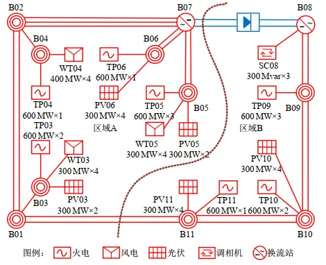
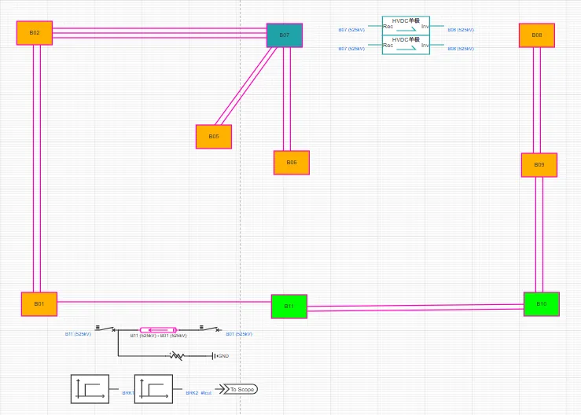
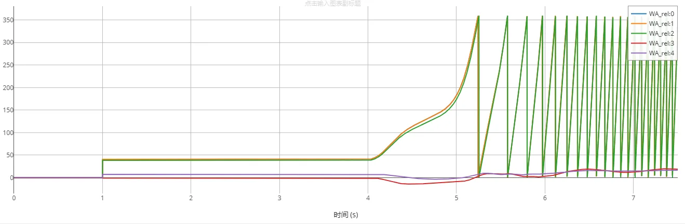
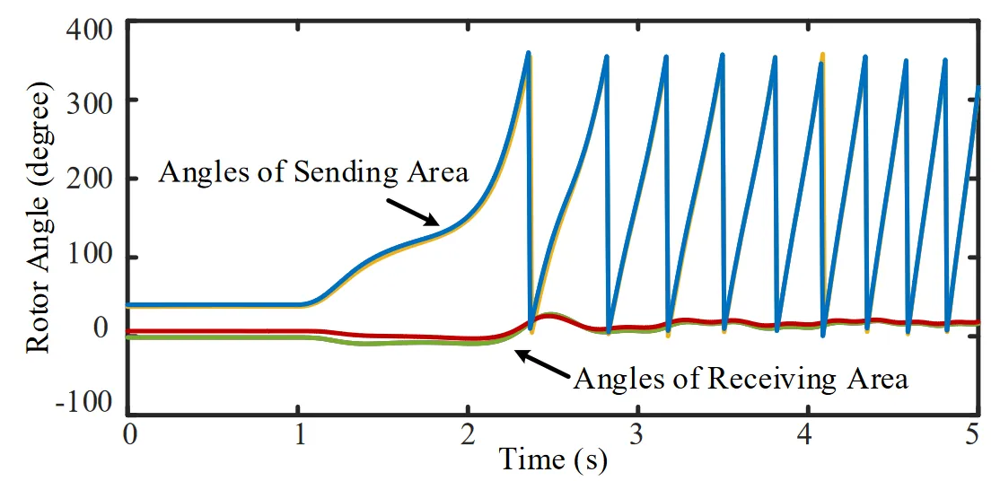

<!-- import DocCardList from '@theme/DocCardList';

<DocCardList /> -->

## 案例介绍
CSEE-RAS 功角失稳算例是由中国电机工程学会发布的新型电力系统标准算例[^CSEE-RAS], 该算例以 500kV 交流和 ±500kV 直流为主网架，总三相交流母线数为 108，交流线路数为 40，直流线路数为 1。

## 使用方法说明
**暂态功角稳定**标准模型的适用范围：
   + 建议步长范围：1–50 μs  
   + 设置的故障时间建议在 2s 之后  

## 算例介绍
CSEE-RAS 功角失稳算例是为根据某区域实际电网构建的交直流混联电网模型，系统拓扑如下图所示。

CloudPSS 上该算例的系统拓扑如下。

**线路及变压器概况**

系统共有交流输电线路 26 条，变压器 86 台，并通过 1 回 ±500kV 直流输电通道与其他电网异步互联，线路及变压器概况如下表所示。

| 电压等级/kV  | 母线数目 | 母线类型 |
|:------: |:----: |:----------:|
| 500 | 11 | 交流输电网架 |
| 220 | 24 | 变压器中/高压侧 |
| 37 / 20  | 50 | 变压器低压侧 |
| 0.69 / 0.4 | 23| 新能源设备端口 |
| 合计 | 108| —— |

| 类型  | 数目 |   | 备注 |
|:----: |:----:|:---:|:----:|
| 交流线路 | 40 条 | 500 kV | 交流输电网架 17 条 |
| ^ | ^ | 220 kV  | 新能源送出线路 23 条 |
| 两绕组变压器 | 62 台 | 20/525 kV | 常规机组升压变 16 台 |
| ^ | ^ | 0.4/38.5 kV | 光伏箱变 12 台 |
| ^ | ^ | 0.69/38.5kV | 风机箱变 11 台 |
| ^ | ^ | 38.5/230 kV | 新能源场站升压变 23 台 |
| 三绕组变压器 | 15 台 | 电压/kV | 525/230/37 |
| 直流线路 | 1 回 | 额定电压/kV | ±500 |
| ^ | ^ | 额定功率/MW  | 3000 |

**电源概况**

常规机组共 16 台，总装机 8904MW，其中 13台火电装机 8004MW，3 台调相机 900MW；光伏总装机 4800MW，风电总装机 3300MW，新能源装机比例为 47.6%，装机概况如下表所示。

| 接入母线  | 同步电机  |  风电   | 光伏 |
|:------: |:----:|:-------:|:------:|
| B01 | 0  | 0 | 0 |
| B02 | 0  | 0 | 0 |
| B03 | 1334  | 900 | 800 |
| B04 | 667  | 1200 | —— |
| B05 | 2001  | 1200 | 0 |
| B06 | 667  | 0 | 1200 |
| B07 | 0  | 0 | 0 |
| B08 | 900  | 0 | 0 |
| B09 | 2001  | 0 | 0 |
| B10 | 1334  | 0 | 1200 |
| B11 | 667  | 0 | 1600 |
| 合计 | 8904  | 4800 | 3300 |

**负荷概况**

系统总有功负荷 10563.4MW，总无功负荷 562.8MVar，负荷功率因数为 0.998，各母线负荷水平见下表。

| 母线  | 有功负荷/MW | 无功负荷/MVar |
|:------: |:----:|:-------:|
| B01 | 450 | 50 |
| B02 | 450 | 50 |
| B03 | 0 | 0 |
| B04 | 0 | 0 |
| B05 | 0 | 0 |
| B06 | 0 | 0 |
| B07 | 0 | 0 |
| B08 | 0 | 0 |
| B09 | 4347 | 150 |
| B10 | 3590 | 200 |
| B11 | 1700 | 100 |
| 合计 | 10563.4  | 562.8 |

**新能源与直流模型说明**

算例中的直驱风机风场采用 [直驱风机01型-标准封装模型](../../20-wind-power-system/30-wtg_pmsg_f/10-wtg_pmsg_01-avm-stdm-v2/index.md)，双馈风机风场采用 [双馈风机01型-标准封装模型](../../20-wind-power-system/40-wtg_dfig_f/10-wtg_dfig_01-avm-stdm-v1/index.md)，光伏机组采用 [光伏发电01型-标准封装模型](../../30-photovoltaic-power-system/30-pvs_f/10-pvs_01-avm-stdm-v1/index.md)，每一回直流由 2 个 [LCC直流（单极）](../../../../../documents/software/20-emtlab/110-component-library/30-dc-modules/10-dc-electrical-modules/20-DCLine_sp/index.md) 模型构成。

## 算例仿真测试

当线路B11 (525kV) - B01 (525kV)发生三永故障触发N-1时，区域功角失稳。

在 BPA 以及论文[^CSEE-TAS] 中 CSEE-TAS 功角崩溃场景的系统功角仿真结果如下图所示。通过对比可以看出，CloudPSS 中的 CSEE-TAS 算例在准确刻画新型电力系统的电磁暂态过程的同时，可以具备与机电暂态一致的功角特性。

针对 CloudPSS 和 BPA 的仿真结果差异，需说明的是：由于新能源机组（直驱风机、双馈风机、光伏电站）的建模方式不同，以及电磁暂态仿真（CloudPSS）与机电暂态仿真（BPA）在计算原理上的本质差异，标准算例的仿真结果存在合理偏差。

## 算例地址
点击打开算例地址：[**CSEE-RAS**](http://cloudpss-calculate.local.ddns.cloudpss.net/model/open-cloudpss/CSEE-RAS-std-v1b1)

[^CSEE-RAS]:徐式蕴,李宗翰,赵兵,等.新型电力系统标准算例(一)：功角稳定CSEE-RAS[J].中国电机工程学报,2024,44(15):5973-5985.DOI:10.13334/j.0258-8013.pcsee.230534.

## 附：修改及调试日志
20250807 编写案例文档  