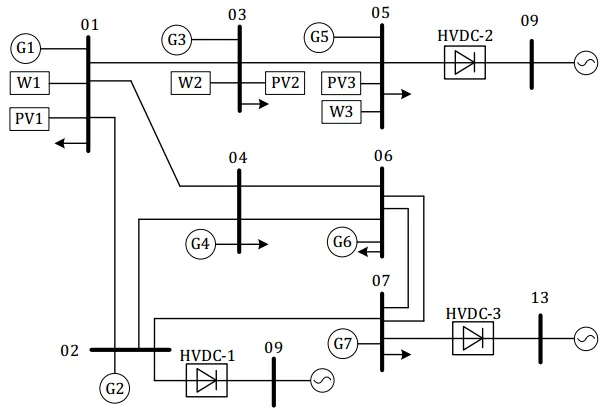
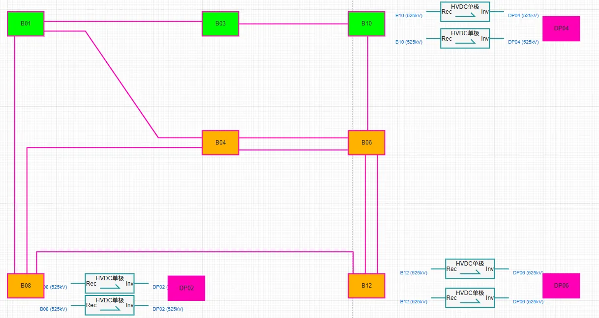
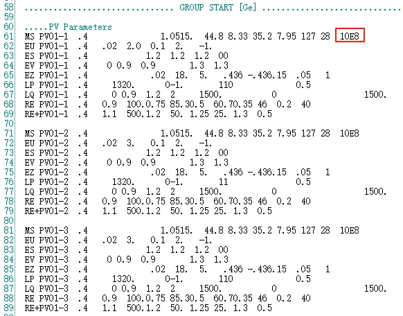
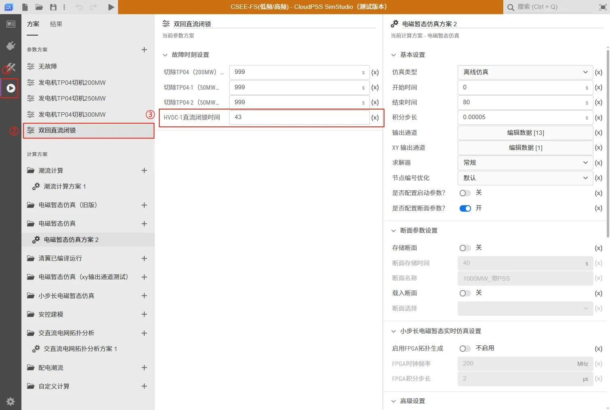
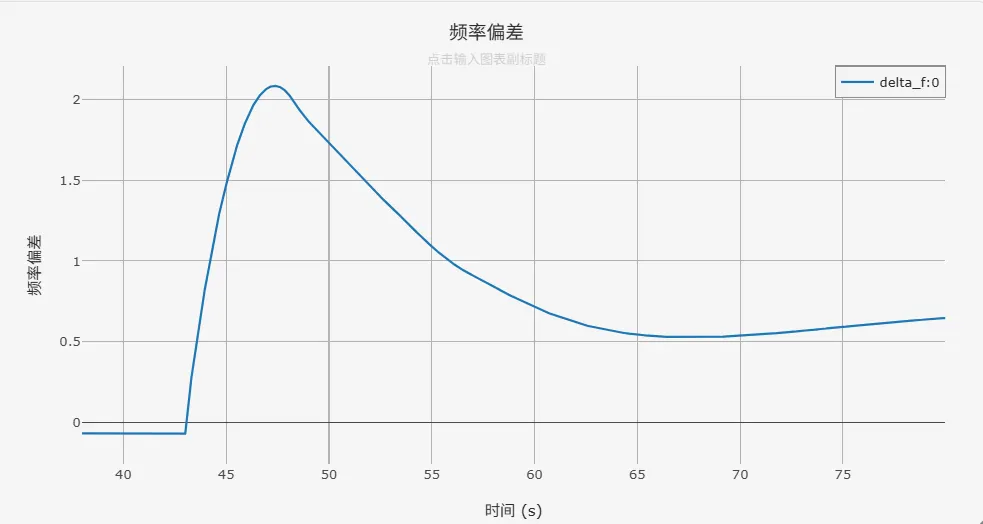
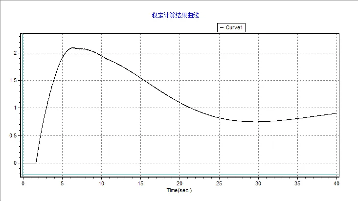
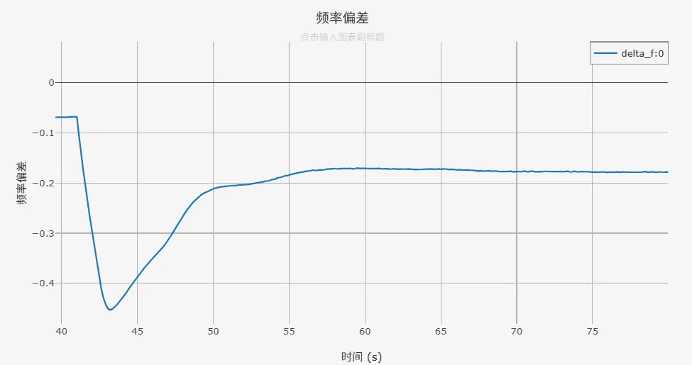
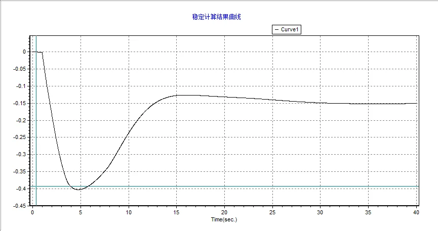

<!-- import DocCardList from '@theme/DocCardList';

<DocCardList /> -->

## 案例介绍
频率稳定 CSEE-FS 算例是由中国电机工程学会发布的新型电力系统标准算例[^CSEE-FS], CSEE-FS 算例以 500kV 交流和 ±500kV 直流为主网架，三相交流母线数为 99，交流线路数为 31，直流线路数为 3。针对传统频率稳定问题，构建了新能源装机及出力占比均在 50% 以上的高频、低频场景，可用于分析故障强度、新能源出力及控制策略等对频率偏差最大值及其出现时间、稳态频率偏差的影响。

## 使用方法说明
**频率稳定**标准模型的适用范围：  
   + 建议步长范围：1–50 μs  
   + 设置的故障时间建议在 40s 之后  

## 算例介绍
CSEE-FS 算例是根据某实际电网数据，对网架结构进行简化后，搭建的交直流混联系统。系统拓扑如下图所示。

CloudPSS 上该算例的系统拓扑如下。

输电网架概况如下所示，共有三相交流母线 99 条。

| 基准电压/kV  | 三相交流母线数 | 备注 |
|:------: |:----: |:----------:|
| 525 | 16 | 交流输电网架 |
| 230 | 19 | 变压器中/高压侧 |
| 38.5 | 20 | 新能源升压变侧 |
| 37 | 15 | 三绕组变压器低压侧 |
| 20 | 9 | 发电机母线 |
| 0.69 | 9 | 风机母线 |
| 0.4 | 11 | 光伏母线 |
| 合计 | 99| —— |

**线路及变压器概况**

系统共有交流输电线路 31 条，变压器 62 台，并通过 3 回 ±500kV 直流输电通道与其他电网异步互联，线路及变压器概况如下表所示。

| 类型  | 数目 |   | 备注 |
|:----: |:----:|:---:|:----:|
| 交流线路 | 31 条 | 500 kV | 交流输电网架 11 条 |
| ^ | ^ | 220 kV  | 新能源送出线路 20 条 |
| 两绕组变压器 | 47 台 | 20/525 kV | 常规机组升压变 7 台 |
| ^ | ^ | 0.4/38.5 kV | 新能源箱变 20 台 |
| ^ | ^ | 0.69/38.5kV | ^ |
| ^ | ^ | 38.5/230 kV | 新能源场站升压变 20 台 |
| 三绕组变压器 | 15 台 | 电压/kV | 525/230/37 |
| 直流线路 | 3 回 | 额定电压/kV | ±500 |
| ^ | ^ | 额定功率/MW  | 5000 |

**电源概况**

常规机组共 7 台，总装机 5400MW，其中 5台火电装机 3400MW，2 台水电装机 2000MW；风电、光伏 2 种新能源总装机 6900MW，其中风电装机 3150MW，光伏装机 3750MW，新能源装机比例为 56.1%，装机概况如下表所示。

| 接入母线  | 火电 | 水电 | 风电   | 光伏 |
|:------: |:----:|:-------:|:------:|:----:|
| B01 | 600 | —— | 1050 | 1050 |
| B02 | 600 | —— | —— | —— |
| B03 | 1000 | —— | 1050 | 1650 |
| B04 | 600 | —— | —— | —— |
| B05 | —— | 1000 | 1050 | 1050 |
| B06 | —— | 1000 | —— | —— |
| B07 | 600 | —— | —— | —— |
| 合计 | 3400  | 2000 | 3150 | 3750 |

**负荷概况**

系统总有功负荷 4852.1MW，总无功负荷 1528MVar，负荷功率因数为 0.9538，各母线负荷水平见下表。

| 母线  | 有功负荷/MW | 无功负荷/MVar |
|:------: |:----:|:-------:|
| B01 | 1100 | 360 |
| B02 | 700 | 220 |
| B03 | 900 | 300 |
| B04 | 429.1 | 78 |
| B05 | 500 | 170 |
| B07 | 1223 | 400 |
| 合计 | 4852.1  | 1528 |

**新能源与直流模型说明**

系统中共有 9 组风机机组（其中 1 组为直驱风机风场，剩余 8 组为双馈风机风场），11 组光伏机组，3 回直流。 算例中的直驱风机风场采用 [直驱风机01型-标准封装模型](../../20-wind-power-system/10-wtg_pmsg/10-wtg_pmsg_01/30-wtg_pmsg_01-avm-std-v1/index.md)，双馈风机风场采用 [双馈风机01型-标准封装模型](../../20-wind-power-system/20-wtg_dfig/10-wtg_dfig_01/30-wtg_dfig_01-avm-std-v1/index.md)，光伏机组采用 [光伏发电01型-标准封装模型](../../30-photovoltaic-power-system/10-pvs/10-pvs_01/30-pvs_01-avm-std-v1/index.md)，每一回直流由 2 个 [LCC直流（单极）](../../../../../documents/software/20-emtlab/110-component-library/30-dc-modules/10-dc-electrical-modules/20-DCLine_sp/index.md) 模型构成。

需要进行说明的是，在当前版本（2025年08月26日）的 CSEE-FS 标准算例中，新能源模型的直流侧电容参数过大（直驱风机的直流侧电容为 10E8 F，光伏电站的直流侧电容为 10E8 mF），在算例转换和对比时已将该参数分别修改为 0.015 F 和 3.9 mF。

## 算例仿真测试
点击左侧**运行标签页**，算例已经预设好了不同的故障类型，选择参数方案中的方案，可对故障的时间进行设置。

### 高频场景
当直流发生闭锁故障时，系统将产生永久功率盈余，发电机承受电磁功率突减，将产生正的频率变化率，导致高频问题。直流 HVDC-1 外送功率为 1000MW，设置 HVDC-1 在 t = 43s 发生双极闭锁故障，系统频率偏差如下图所示。

在 BPA 中 CSEE-FS 高频场景的系统频率偏差仿真结果如下图所示。通过对比可以看出，CloudPSS 中的 CSEE-FS 算例在准确刻画新型电力系统的电磁暂态过程的同时，可以具备与机电暂态一致的频率特性。

### 低频场景
当发生切机故障时，发电机机械功率减小，机械功率小于电磁功率，使发电机加速功率为负，系统出现低频场景。设置 t= 43s 发电机 TP04 切机 200MW，系统频率偏差如下图所示。

在 BPA 中 CSEE-FS 低频场景的系统频率偏差仿真结果如下图所示。通过对比可以看出，CloudPSS 中的 CSEE-FS 算例在准确刻画新型电力系统的电磁暂态过程的同时，可以具备与机电暂态一致的频率特性。

针对 CloudPSS 和 BPA 的仿真结果差异，需说明的是：由于新能源机组（直驱风机、双馈风机、光伏电站）的建模方式不同，以及电磁暂态仿真（CloudPSS）与机电暂态仿真（BPA）在计算原理上的本质差异，标准算例的仿真结果存在合理偏差。

## 算例地址
点击打开算例地址：[**CSEE-FS-高/低频**](http://cloudpss-calculate.local.ddns.cloudpss.net/model/admin/CSEE-FS_LF_HF)

[^CSEE-FS]:H. Sun, B. Zhao, S. Xu, T. Lan, Z. Li and P. Wu, "Test Models for Stability/Security Studies of AC-DC Hybrid Power Systems With High Penetration of Renewables," IEEE Transactions on Power Systems, vol. 40, no. 1, pp. 957-969, Jan. 2025

## 附：修改及调试日志
20250801 编写案例文档  
20250805 添加新能源与直流模型说明