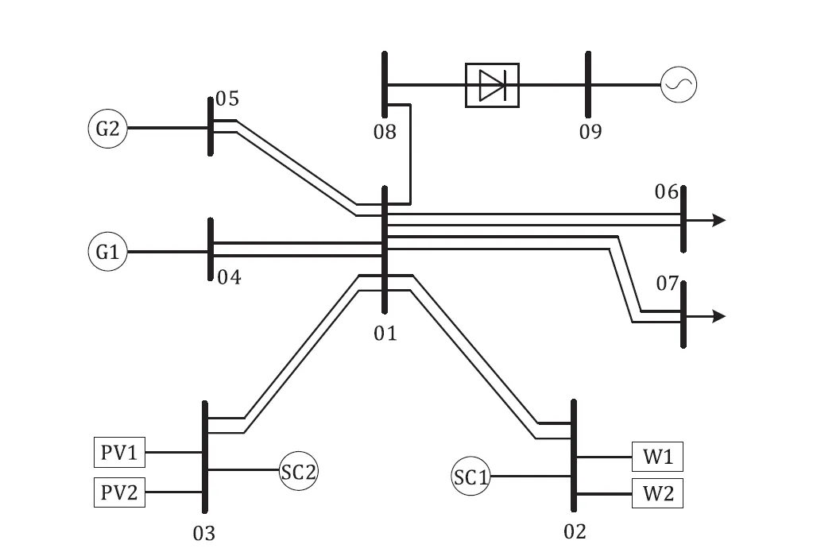
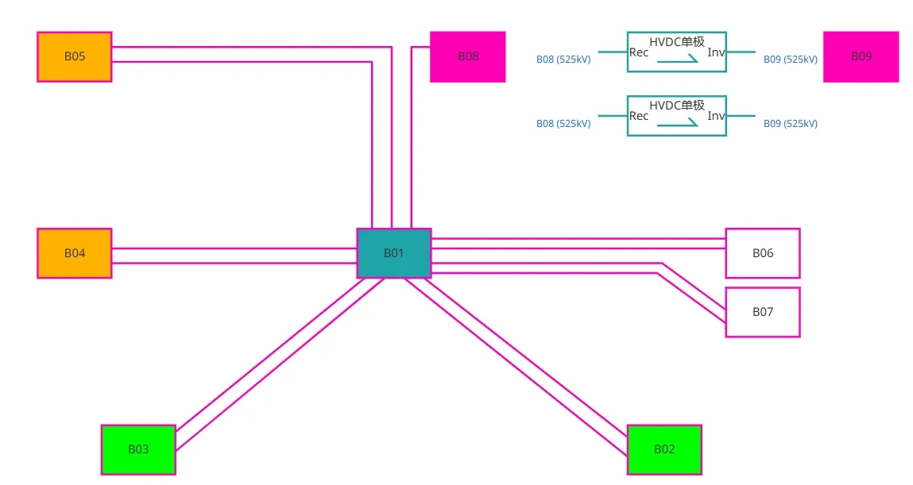
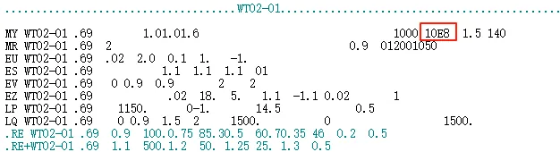
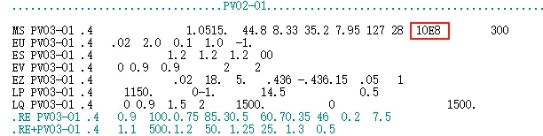
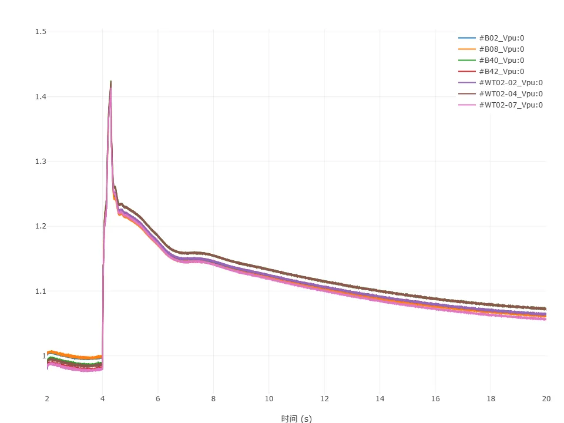
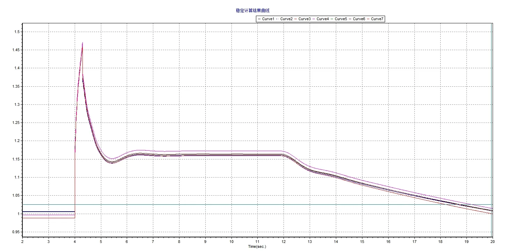

<!-- import DocCardList from '@theme/DocCardList';

<DocCardList /> -->

## 案例介绍
工频过电压CSEE-PFO算例是由中国电机工程学会（Chinese Society for Electrical Engineering）发布的新型电力系统标准算例[^CSEE-PFO]。CSEE-PFO算例以500kV为主网架，三相交流母线数为70，其中500kV节点数为10，交流线路数为26，直流线路数为1，该算例为暂时工频过电压场景。

## 使用方法说明
**暂时工频过电压**标准模型的适用范围：  
   + 建议步长：50 μs  

## 算例介绍
CSEE-PFO算例是一个HVDC送端系统，取自中国某区域电网的HVDC送端。主电网有10个500kV节点，模型还包括58个低电压水平的节点，描述了所有电力设备的连接细节，系统拓扑如下图所示。

CloudPSS 上该算例的系统拓扑如下图所示。

**输电网架概况**

输电网架概况如下表所示，共有三相交流母线70条。

| 电压等级/kV  | 节点数目 | 节点类型 |
|:------: |:----: |:----------:|
| 525 | 10 | 交流输电网架 |
| 230 | 14 | 变压器中/高压侧 |
| 37 | 25 | 三绕组变压器低压侧 |
| 20 | 7 | 发电机母线 |
| 0.69 | 8 | 风机母线 |
| 0.4 | 6 | 光伏母线 |

**线路及变压器概况**

系统共有交流输电线路26条，变压器46台，并通过1回±500kV直流输电通道与其他电网互联，线路及变压器概况如下表所示。

| 类型  | 数目 | > | 备注|
|:------: |:----: |:----------:|:----------:|
| 交流线路     |  26 | 500 kV  | 12  |
| ^     |  ^ | 220 kV  | 14  |
| 两绕组变压器  | 37 | 750MVA   |  7  |
| ^  | ^ | 360MVA   |  6  |
| ^  | ^ | 300MVA   |  14 |
| ^  | ^ | 240MVA   |  8  |
| 三绕组变压器  | 11  | 1000 /1000 / 360 MVA |11 |
| 直流线路     |  1   | 额定电压/ kV  | ±500   |
| ^     |  ^   | 额定功率/MW  | 3700  |

**电源概况**

火电机组总装机2750MW，风电机组总装机1600MW，光伏总装机1200MW，新能源机组装机占比为50.5%。系统电源装机概况详见下表。

| 接入母线  | 火电/MW | 风电/MW   | 光伏/MW |
|:------: |:----:|:------:|:----:|
| B02 |  ——  | 1600| —— |
| B03 |  ——  |  —— |1200|
| B04 | 1320 |  —— | —— |
| B05 | 1430 |  —— | —— |
| 合计 | 2750 | 1600 | 1200 |

**负荷概况**

系统总有功负荷1830MW，总无功负荷372Mvar，负荷功率因数为0.98，各母线负荷水平见下表。

| 母线  | 有功负荷/MW | 无功负荷/MVar |
|:------: |:----:|:-------:|
| B10 | 260 | 70 |
| B11 | 260 | 70 |
| B12 | 50 | 32 |
| B13 | 230 | 30 |
| B14 | 230 | 30 |
| B15 | 400 | 70 |
| B16 | 400 | 70 |
| 合计 | 1830  | 372 |

**新能源与直流模型说明**

系统中共有 8 组直驱风机机组，6 组光伏机组，1 回直流。 算例中的直驱风机风场采用 [直驱风机01型-标准封装模型](../../20-wind-power-system/10-wtg_pmsg/10-wtg_pmsg_01/30-wtg_pmsg_01-avm-std-v1/index.md)，光伏机组采用 [光伏发电01型-标准封装模型](../../30-photovoltaic-power-system/10-pvs/10-pvs_01/30-pvs_01-avm-std-v1/index.md)，每一回直流由 2 个 [LCC直流（单极）](../../../../../documents/software/20-emtlab/110-component-library/30-dc-modules/10-dc-electrical-modules/20-DCLine_sp/index.md) 模型构成。

需要进行说明的是，在当前版本（2025年08月26日）的 CSEE-PFO 标准算例中，新能源模型的直流侧电容参数过大（直驱风机的直流侧电容为 10E8 F，光伏电站的直流侧电容为 10E8 mF），在算例转换和对比时已将该参数分别修改为0.015 F 和 0.0039 F。

## 算例仿真测试

### 暂时工频过电压场景
设置4s直流双极闭锁，4.3s切除换流站全部交流滤波器，4.3s切除火电机组以及新能源机组共3300MW，CloudPSS与BPA的母线电压曲线如下图所示。

在 BPA 中 CSEE-PFO 故障后暂时PFO场景的仿真结果如下图所示。通过对比可以看出，CloudPSS中的CSEE-PFO 算例在准确刻画新型电力系统的电磁暂态过程的同时，可以具备与机电暂态一致的特性。

由于新能源机组（直驱风机、双馈风机、光伏电站）的建模差异，以及电磁暂态仿真（CloudPSS）与机电暂态仿真（BPA）在算法层面的本质区别，标准算例的仿真结果存在合理偏差。

## 算例地址
点击打开算例地址：[**CSEE标准算例-暂时工频过电压**](http://cloudpss-calculate.local.ddns.cloudpss.net/model/open-cloudpss/CSEE_PFO_Temporary-v1)

[^CSEE-PFO]:H. Sun, B. Zhao, S. Xu, T. Lan, Z. Li and P. Wu, "Test Models for Stability/Security Studies of AC-DC Hybrid Power Systems With High Penetration of Renewables," IEEE Transactions on Power Systems, vol. 40, no. 1, pp. 957-969, Jan. 2025

<!-- 
## 附：修改及调试日志
20250806 编写案例文档
-->