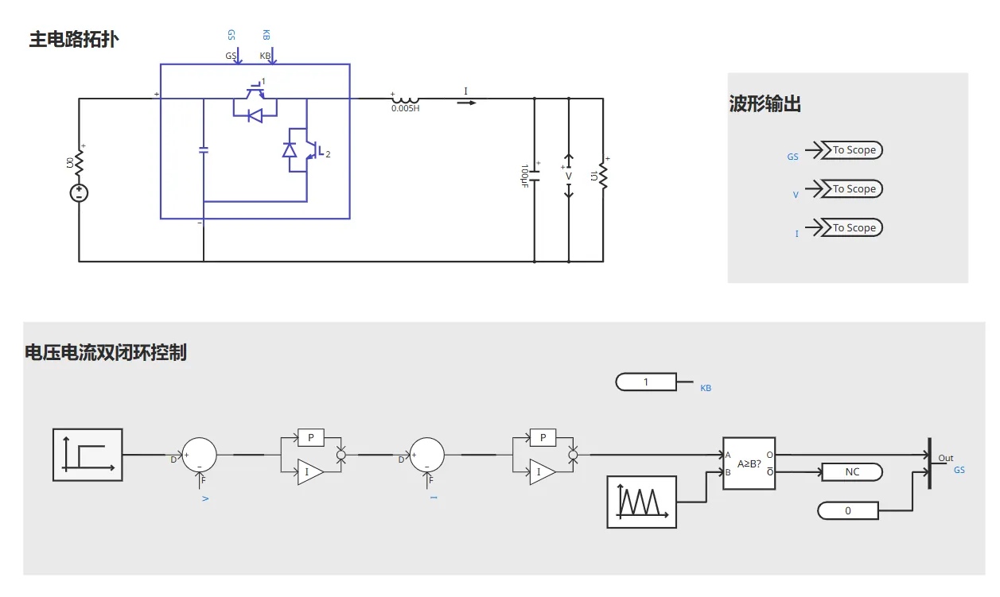
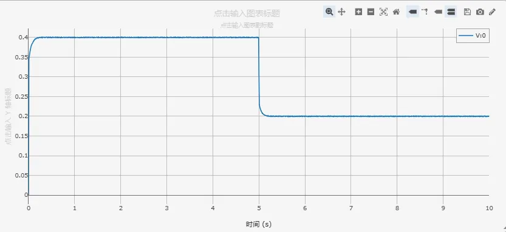
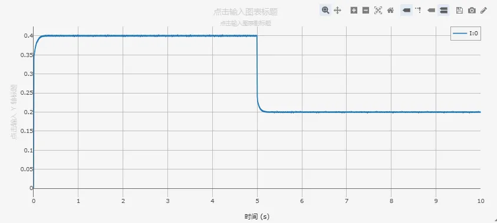
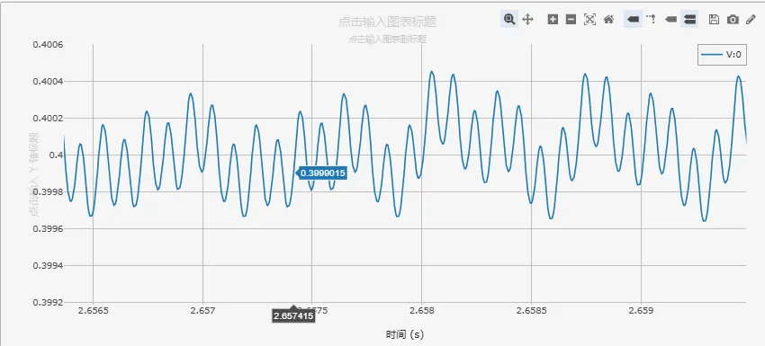
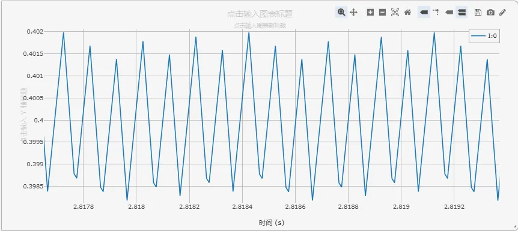

<!-- import DocCardList from '@theme/DocCardList';

<DocCardList /> -->

## 案例介绍
Buck 电路是一种常见的降压型直流-直流（DC-DC）转换器，用于将高电压输入转换为较低电压输出。它在电子设备中起着重要的作用，如电源适配器、稳压器等。其核心工作原理是在开关元件高速导通与关断之间切换，通过电感储能与电容滤波，实现输出电压的小纹波和快响应。
## 使用方法说明
- 建议步长范围：1–10μs
## 算例介绍
 
Buck 电路详细模型由主电路拓扑、电压电流双闭环控制组成。
**主电路拓扑**由以下核心元件组成：
1. 功率开关：使用 IGBT，用于控制电路的开关状态。
2. 电感元件：电感是 Buck 电路中的核心元件，它负责储存和释放能量，实现电流的平滑变化。
3. 电容元件：电容被用来平滑输出电压，减小电压波动。它能够吸收和释放能量，保持输出电压的稳定性。
4. 二极管：二极管用于保护 IGBT 免受反向电压的损害。当 IGBT 关闭时，二极管提供一个通路，使电流能够继续流动。  

**控制电路**用于监测和调整 Buck 电路的输出电压。它根据反馈信号来控制 IGBT 的开关频率和占空比，以确保输出电压稳定。本案例采用**电压外环、电流内环的双闭环控制策略**,兼顾稳态精度与动态性能。
- **电压外环**：将采样得到的输出电压与给定的参考电压进行比较，得到的偏差经过 PI (比例-积分) 控制器，其输出作为电流内环的参考信号 。电压外环的主要作用是确保输出电压的稳定和精确。
- **电流内环**：将采样得到的电感电流与电压环输出的电流参考值进行比较，偏差经过另一个 PI 控制器，其输出信号经过与三角载波信号比较，生成最终驱动 IGBT 的开关信号。电流内环响应速度快，可以实现对电感电流的精确控制，从而提高系统的动态响应速度和稳定性。

## 算例仿真测试

设置初始参考电压参考是为 400V，在 5s 时，参考电压跳变至 200V，验证双闭环控制策略下，Buck 电路的启动性能和稳态调节能力，仿真参数设置如下表：

| **参数名称** | **数值** | **参数名称** | **数值** |
| -------- | ------ | -------- | ------ |
| 输入电压     | 700 V  | 电压环 Ki   | 0.01   |
| 载波频率     | 10kHz  | 电流环 Kp   | 5      |
| 电感       | 0.005H | 电流环 Ki   | 500    |
| 输出电容     | 100 μF | 仿真步长     | 5μs    |
| 电阻       | 1Ω     | 仿真时长     | 10s    |
| 电压环 Kp   | 5      |          |        |
## 算例仿真测试
### 1. 动态响应性能分析
 

系统启动后，输出电压快速上升至 400V，调节时间约 0.3s，5s 时刻电压参考值从 400V 跳变至 200V 后，输出电压快速跟踪，电压跳变响应时间小于 0.2s，表现出良好的动态跟踪性能，无超调、无振荡，系统稳定性良好。

 

在 5s 时刻，负载电流从 400A 平滑过渡至 200A，电流变化与电压变化完全同步，说明电流内环控制有效，电流跳变过程无冲击或振荡现象。

### 2. 稳态性能分析

 

电压纹波波形规整，无异常尖峰或噪声；电压纹波率约 0.25%，满足工业应用要求。

 

局部放大的电流波形呈现典型的**三角波形状**，这正是电感电流在开关周期内线性充电和放电的特征；纹波率约 0.875%，处于合理范围。这个纹波电流被输出电容平滑，最终形成了前面分析的微小电压纹波。

## 修改及调试日志

+ 20250610 搭建 Buck 电路、双闭环控制

+ 20250611 Buck 电路调参

+ 20250612 调整参数名称、模型布局

