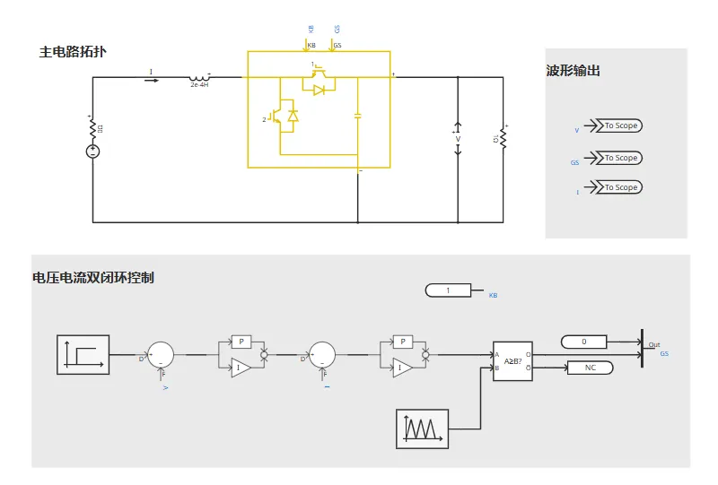
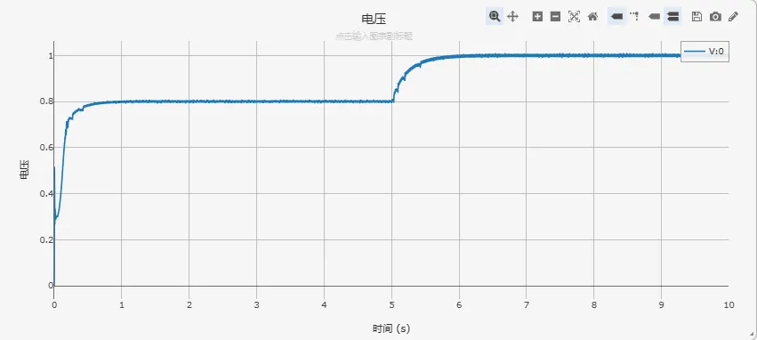
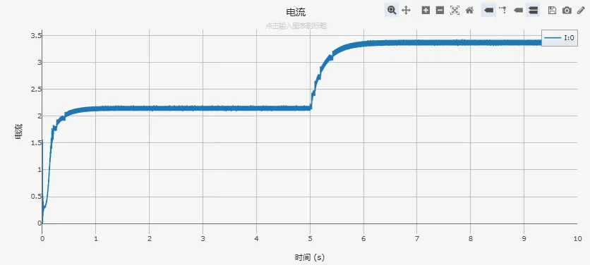
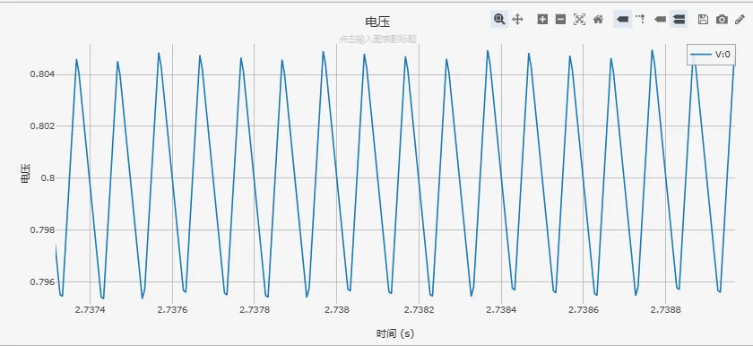
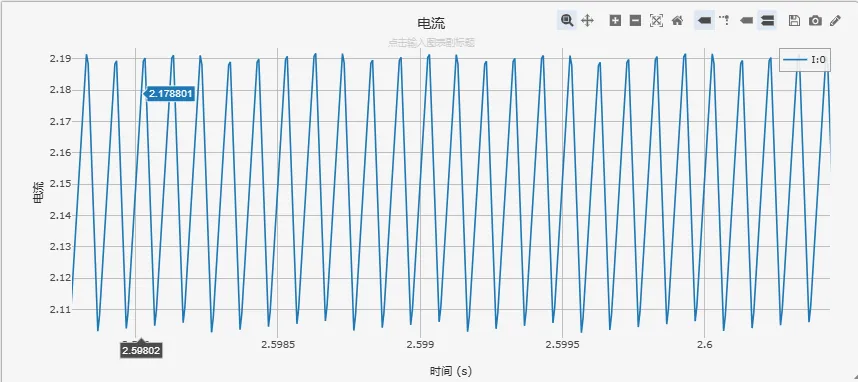

<!-- import DocCardList from '@theme/DocCardList';

<DocCardList /> -->

## 案例介绍
Boost（升压型）直流-直流转换器是一种将较低输入电压升至较高输出电压的高效电源模块，广泛应用于太阳能发电系统、电池充电器和便携式设备中。其核心工作原理是利用电感储能特性，在开关导通时电感储存能量，开关关断时电感与输入电源串联向负载供电，实现电压提升功能。
## 使用方法说明
- 建议步长范围：1–10μs
## 算例介绍

 

Boost 电路详细模型由主电路拓扑、电压电流双闭环控制组成。
**主电路拓扑**由以下核心元件组成：
1. **功率开关（IGBT）**: 控制能量存储与释放周期，通过调节占空比实现升压功能。
2. **电感元件**: 在开关导通阶段储能，关断阶段释放能量至负载，实现电压提升。
3. **电容元件**: 平滑输出电压纹波，保持负载端电压稳定。
4. **二极管**: 在 IGBT 关断时提供电流通路，防止反向电压冲击。

**控制电路**用于监测和调整 Boost 电路的输出电压。它根据反馈信号来控制 IGBT 的开关频率和占空比，以确保输出电压稳定。本案例采用**电压外环、电流内环的双闭环控制策略**,兼顾稳态精度与动态性能。

- **电压外环**：将采样得到的输出电压与给定的参考电压进行比较，得到的偏差经过 PI (比例-积分) 控制器，其输出作为电流内环的参考信号。电压外环的主要作用是确保输出电压的稳定和精确。
- **电流内环**：将采样得到的电感电流与电压环输出的电流参考值进行比较，偏差经过另一个 PI 控制器，其输出信号经过与三角载波信号比较，生成最终驱动 IGBT 的开关信号。电流内环响应速度快，可以实现对电感电流的精确控制，从而提高系统的动态响应速度和稳定性。

## 算例仿真测试

设置初始参考电压参考是为 800V，在 5s 时，参考电压跳变至 1000V，验证双闭环控制策略下，Boost 电路的启动性能和稳态调节能力，仿真参数设置如下表：

| **参数名称** | **数值**  | **参数名称** | **数值** |
| -------- | ------- | -------- | ------ |
| 输入电压     | 300 V   | 电压环 Ki   | 0.04   |
| 载波频率     | 10kHz   | 电流环 Kp   | 0.005  |
| 电感       | 0.0002H | 电流环 Ki   | 0.1    |
| 输出电容     | 5000 μF | 仿真步长     | 1μs    |
| 电阻       | 1Ω      | 仿真时长     | 10s    |
| 电压环 Kp   | 0.05    |          |        |

## 算例仿真测试

### 1. 动态响应性能分析

 

系统从 0V 快速上升至 800V，调节时间约 0.5 秒，表现出良好的启动特性，满足快速调节需求。在 5s 时刻，当参考电压从 800V 跳变至 1000V 时，输出电压能够快速跟踪并稳定在新的设定值，电压跳变响应迅速，无明显超调和振荡，体现了双闭环控制系统的优异动态性能，整个过程平滑稳定，证明 PI 控制器参数设计合理。

 

电感电流从约 2.2kA 平滑上升至约 3.4kA，与电压变化同步，说明电流内环控制有效，电感电流连续，处于 CCM 工作模式。电流跳变过程无冲击现象，过渡较平滑。

### 2. 稳态性能分析

 

从电压局部放大图可看出，电压纹波波形规整，呈现典型的开关电源纹波特征，无异常尖峰；电压纹波率约 1%，满足工业应用的设计要求。

 

电感电流呈现典型的三角波形状，这是 BOOST 电路在连续导通模式（CCM）下的正常特征；电感电流纹波率约为 3.6%，处于合理范围。这个纹波电流被输出电容平滑，最终形成了前面分析的电压纹波。

## 修改及调试日志

+ 20250610 完成基本电路拓扑搭建，实现电压外环、电流内环双闭环控制，添加量测通道
+ 20250612 优化PI控制器参数，调整电感、电容参数
+ 20250613 统一参数命名规范，优化仿真模型布局