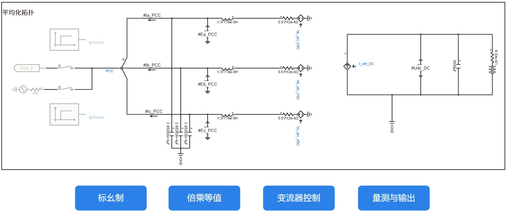
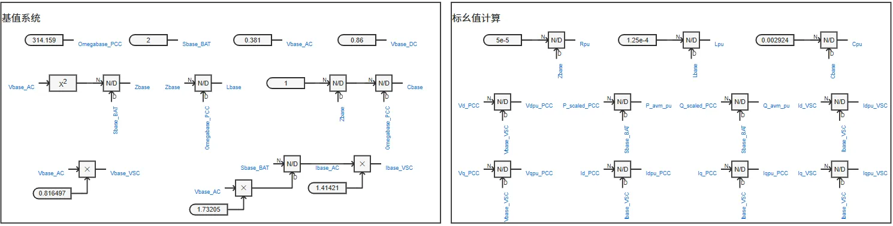
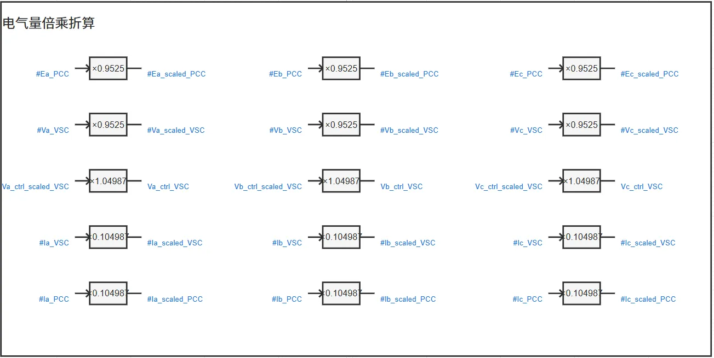
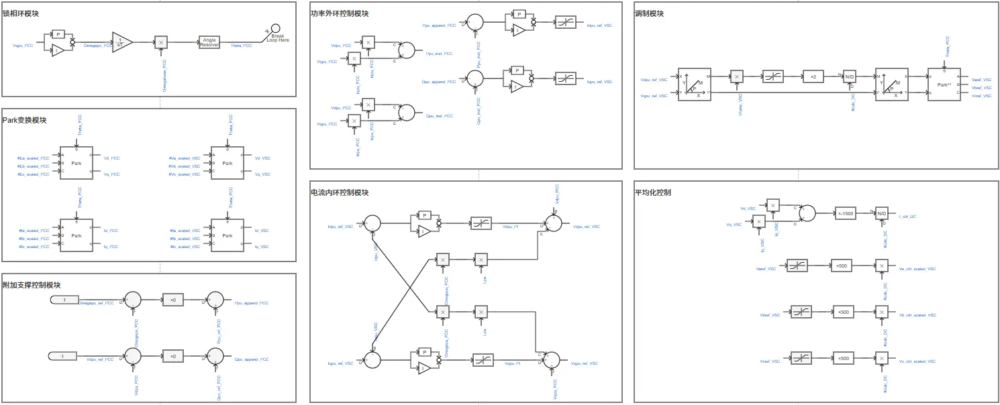
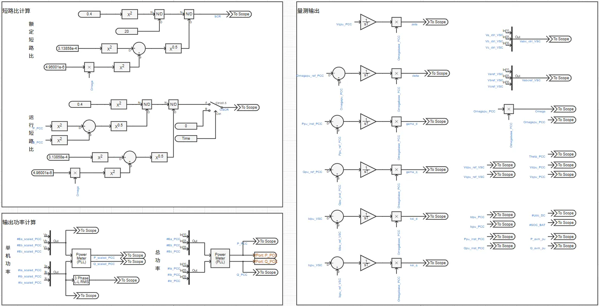

## 案例介绍

:::tip

本案例由清华大学沈沉教授团队（赖启平、沈怡、李陶、曹宇祺、李姝嫚、杨明皓博士参与）构建。

:::

**跟网型储能变流器-平均模型**由平均化电气拓扑、锁相环、功率外环、电流内环、调制环节等模块构成，还附加了标幺化、倍乘等值、量测与输出、多短路比测试实现，直流侧为储能电池，后续可拓展斩波控制、穿越控制、脱网控制等模块。模型整体架构如下图所示。  

    

模型已封装为元件，具备单元测试回路，可单独使用，也可在其他算例中调用。  

    

## 使用方法说明

### 适用场景

**跟网型储能变流器-平均模型**支持单机或接入大规模电力系统算例的仿真测试，适用于以下分析场景：
   + 小信号稳定性分析
   + 不同短路比下的变流器并网适应性测试
   + 考虑系统功角、频率、电压的电网稳定性分析
   + 高比例新能源接入下的系统支撑能力评估
   + 跟网型与构网型控制策略的对比研究  

### 适用范围  
   + 建议步长范围：1-50μs  
   + 当前参数设置下建议短路比范围：>3  

### 功能概述

   + 变流器并网系统的发电单元除储能外，还可以接入风机、光伏或SVG，以满足不同的研究需求
   + 跟网型变流器控制可以附加频率-有功和电压-无功的支撑控制，提升系统的稳定性和可靠性

## 算例介绍

**跟网型储能变流器-平均模型**由电气主拓扑、标幺制、倍乘等值、变流器控制、量测与输出等五个模块组成。

**电气主拓扑**由蓄电池、直流电容、受控电流源组成的直流侧和受控电压源、交流滤波器、电压源组成的交流侧，以及功率设定和单元测试构成，实现平均化变流器等效建模。  
+ **功率设定**输出由用户设定的输出有功、无功功率参考值，并包含输出小信号扰动功率的功能  
+ **单元测试**中设置经线路阻抗与理想电压源相连，连接阻抗的大小由用户设置，系统的短路比在**量测与输出**模块中计算并输出。  

    

    

**标幺制**处理使仿真中除时间外的电气量均为标幺值，便于参数的通用化设置。为使得所构建的变流器模型适用于各种电压等级及功率送出场景，需要构造一个物理概念清晰、使用方便的变流器模型标幺制系统，将控制环节中的量测值、参考值、元件参数、控制参数等均转换为标幺值，经过调试和优化可以得到一套通用的控制参数，实现变流器模型标幺化。

  

**倍乘等值**的基本原理为：按设备额定电压、额定容量、并联数量变化倍数线性缩放电阻、电感、电容等参数，并保持电压、电流标幺值不变（有名值需要折算），可在简化模型规模的同时，使等效模型在并网点呈现与真实多机系统相似的功率输出和动态响应，从而满足系统级稳定性分析的需求。

  

**变流器控制**由锁相环、Park变换、功率外环控制、电流内环控制、调制模块、平均化控制等部分组成，实现输出功率的控制，此外还可附加支撑控制，提升系统的稳定性和可靠性。平均化变流器的控制信号通过功率平衡法计算得到。

  

**量测与输出**模块量测控制环节所需电气量，计算并输出用户关注的电气量。

  
  
## 算例仿真测试

针对**跟网型储能变流器-平均模型**分别进行了小信号状态空间模型验证和并网适应性测试。

### 小信号状态空间模型验证
依据**跟网型储能变流器-平均模型**构建了全阶小信号状态空间模型，如下式所示。
$$
\Delta \dot x = A\Delta x + B\Delta u
$$

其中：
$$
x = {\left[ {\zeta ,\;\delta ,\;{\gamma _d},\;{\gamma _q},\;{\xi _d},\;{\xi _q},\;{i_d},\;{i_q},\;{i_{Ld}},\;{i_{Lq}},\;{v_d},\;{v_q}} \right]^{\rm{T}}}
$$

$$
u = {\left[ {{P_{{\rm{ref}}}},{Q_{{\rm{ref}}}}} \right]^{\rm{T}}}
$$

$$
\tiny{A} = \begin{bmatrix}
0&0&0&0&0&0&0&0&0&0&0&1\\[4mm]
{\dfrac{1}{{{T_p}}}}&0&0&0&0&0&0&0&0&0&0&{{K_p}}\\[4mm]
0&0&0&0&0&0&{ - {v_{d0}}}&{ - {v_{q0}}}&0&0&{ - {i_{d0}}}&{ - {i_{q0}}}\\[4mm]
0&0&0&0&0&0&{{v_{q0}}}&{ - {v_{d0}}}&0&0&{ - {i_{q0}}}&{{i_{d0}}}\\[4mm]
0&0&{\dfrac{1}{{{T_{o1}}}}}&0&0&0&{ - {K_{o1}}{v_{d0}}}&{ - {K_{o1}}{v_{q0}}}&{ - 1}&0&{ - {K_{o1}}{i_{d0}}}&{ - {K_{o1}}{i_{q0}}}\\[4mm]
0&0&0&{\dfrac{1}{{{T_{o1}}}}}&0&0&{{K_{o1}}{v_{q0}}}&{ - {K_{o1}}{v_{d0}}}&0&{ - 1}&{ - {K_{o1}}{i_{q0}}}&{{K_{o1}}{i_{d0}}}\\[4mm]
{\dfrac{{{i_{q0}}}}{{{T_p}}}}&{\dfrac{{{v_{g0}}\sin ({\delta _0})}}{{{L_g}}}}&0&0&0&0&{ - \dfrac{{{R_g}}}{{{L_g}}}}&{{\omega _0}}&0&0&{\dfrac{1}{{{L_g}}}}&{{K_p}{i_{q0}}}\\[4mm]
{ - \dfrac{{{i_{d0}}}}{{{T_p}}}}&{\dfrac{{{v_{g0}}\cos ({\delta _0})}}{{{L_g}}}}&0&0&0&0&{ - {\omega _0}}&{ - \dfrac{{{R_g}}}{{{L_g}}}}&0&0&0&{ - \dfrac{{{K_p}{L_g}{i_{d0}} - 1}}{{{L_g}}}}\\[4mm]
0&0&{\dfrac{{{K_{i1}}}}{{{L_f}{T_{o1}}}}}&0&{\dfrac{1}{{{L_f}{T_{i1}}}}}&0&{ - \dfrac{{{K_{i1}}{K_{o1}}{v_{d0}}}}{{{L_f}}}}&{ - \dfrac{{{K_{i1}}{K_{o1}}{v_{q0}}}}{{{L_f}}}}&{ - \dfrac{{{K_{i1}} + {R_f}}}{{{L_f}}}}&0&{ - \dfrac{{{K_{i1}}{K_{o1}}{i_{d0}}}}{{{L_f}}}}&{ - \dfrac{{{K_{i1}}{K_{o1}}{i_{q0}}}}{{{L_f}}}}\\[4mm]
0&0&0&{\dfrac{{{K_{i1}}}}{{{L_f}{T_{o1}}}}}&0&{\dfrac{1}{{{L_f}{T_{i1}}}}}&{\dfrac{{{K_{i1}}{K_{o1}}{v_{q0}}}}{{{L_f}}}}&{ - \dfrac{{{K_{i1}}{K_{o1}}{v_{d0}}}}{{{L_f}}}}&0&{ - \dfrac{{{K_{i1}} + {R_f}}}{{{L_f}}}}&{ - \dfrac{{{K_{i1}}{K_{o1}}{i_{q0}}}}{{{L_f}}}}&{\dfrac{{{K_{i1}}{K_{o1}}{i_{d0}}}}{{{L_f}}}}\\[4mm]
{\dfrac{{{v_{q0}}}}{{{T_p}}}}&0&0&0&0&0&{ - \dfrac{1}{{{C_f}}}}&0&{\dfrac{1}{{{C_f}}}}&0&0&{\dfrac{{{C_f}{\omega _0} + {C_f}{K_p}{v_{q0}}}}{{{C_f}}}}\\[4mm]
{ - \dfrac{{{v_{d0}}}}{{{T_p}}}}&0&0&0&0&0&0&{ - \dfrac{1}{{{C_f}}}}&0&{\dfrac{1}{{{C_f}}}}&{ - {\omega _0}}&{ - {K_p}{v_{d0}}}
\end{bmatrix}
$$

$$
B = \begin{bmatrix}
0&0&{1{\kern 1pt} }&{0{\kern 1pt} }&{{K_{o1}}{\kern 1pt} }&{0{\kern 1pt} }&{0{\kern 1pt} }&{0{\kern 1pt} }&{\dfrac{{{K_{i1}}{K_{o1}}}}{{{L_f}}}{\kern 1pt} }&{0{\kern 1pt} }&{0{\kern 1pt} }&0\\
0&0&{0{\kern 1pt} }&{ - 1{\kern 1pt} }&{0{\kern 1pt} }&{ - {K_{o1}}{\kern 1pt} }&{0{\kern 1pt} }&{0{\kern 1pt} }&{0{\kern 1pt} }&{ - \dfrac{{{K_{i1}}{K_{o1}}}}{{{L_f}}}{\kern 1pt} }&{0{\kern 1pt} }&0
\end{bmatrix}^{\rm{T}}
$$

参数列表如下：  

| **符号**     | **物理意义**               | **取值**       |
|:--------------:|:--------------------------:|:----------------:|
| *Kp*       | 锁相环比例系数             | 1.00p.u.       |
| *Tp*       | 锁相环积分时间常数         | 0.01s          |
| *Ko*       | 功率外环比例系数           | 0.01p.u.       |
| *To*       | 功率外环积分时间常数       | 0.01s          |
| *Ki*       | 电流内环比例系数           | 0.10p.u.       |
| *Ti*       | 电流内环积分时间常数       | 0.10s          |
| *Kω*       | 调频系数                   | 0p.u.          |
| *Ku*       | 调压系数                   | 0p.u.          |
| *R**f*0    | 原始滤波电阻               | 2.00mΩ         |
| *L**f*0    | 原始滤波电感               | 5.00mH         |
| *C**f*0    | 原始滤波电容               | 73.10μF        |
| *V*0       | 原始额定电压               | 0.381kV        |
| *S**B*0    | 原始单机额定容量           | 0.05MVA        |
| *N*          | 并联数量                   | 10             |
| *VB*       | 额定电压                   | 0.40kV         |
| *S**B*1    | 单机额定容量               | 2.00MVA        |
| *P*ref     | 有功功率参考值             | 0.90p.u.       |
| *Q*ref     | 无功功率参考值             | 0.10p.u.       |
| *SCR*        | 系统短路比                 | 5.0            |
| *X/R*        | 系统电抗电阻比             | 5.0            |  

由小信号状态空间模型计算得到并网系统特征根分布如下图所示，验证了系统的稳定性。

  

小扰动下**跟网型储能变流器-平均模型**状态空间方程理论计算结果与电磁暂态仿真结果基本相同，各电气量均方根误差均小于$5×10^{-4}$，验证了模型的准确性。 

  

### 并网适应性测试

对**跟网型储能变流器-平均模型**进行了多短路比下的并网适应性测试。由下图可知，随着系统短路比增大，系统稳定性单调增强，而系统稳定性随电抗电阻比变化非单调，同一短路比下电抗电阻比过小或过大系统稳定性均减弱，不同短路比下的最佳电抗电阻比不同，例如该图中系统最稳定工况为SCR=10，X/R=9，而当短路比小于等于3时系统均失稳。

  

  

## 模型地址
点击打开模型地址：[**跟网型储能变流器-平均模型**](cloudpss:/model/open-cloudpss/PCS_GFL-acad_DPS_lqp-v1b3)  

## 附录

### 参数

import Parameters from './_parameters.md'

<Parameters/>

### 引脚

import Pins from './_pins.md'

<Pins/>