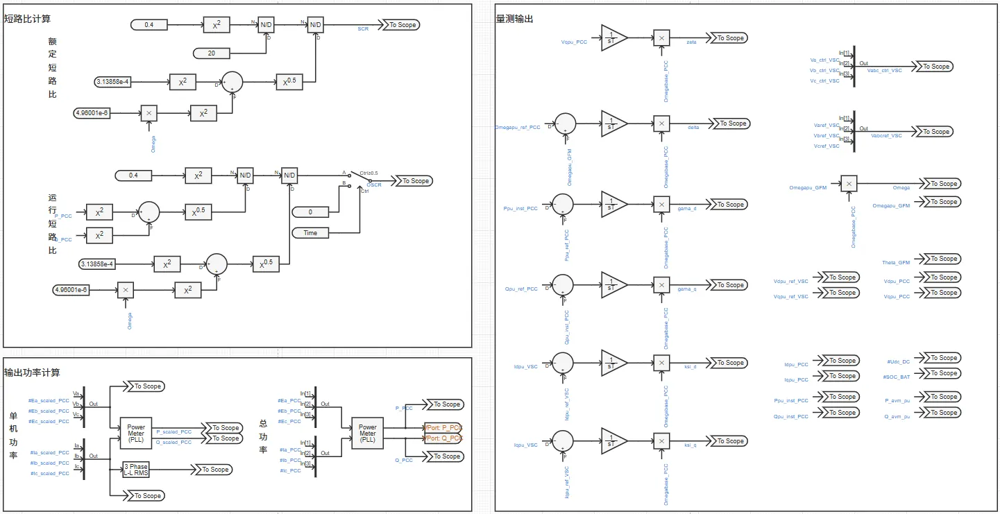

## 案例介绍

**构网型储能变流器**标准模型由平均化电气拓扑、功率同步环节、电压外环、电流内环和调制环节等模块构成，还附加了标幺化、倍乘等值、量测与输出、多短路比测试实现，直流侧为储能电池，后续可拓展斩波控制、穿越控制、脱网控制等模块，如下图所示。

## 使用方法说明

**构网型储能变流器**标准模型的适用范围：  
  + 建议步长范围：1–50 μs  
  + 当前参数设置下建议短路比范围：2~7
  
## 算例介绍

**构网型储能变流器**标准模型由电气主拓扑、标幺制、倍乘等值、变流器控制、量测与输出等五个模块组成。

**电气主拓扑**由蓄电池、直流电容、受控电流源组成的直流侧和受控电压源、交流滤波器、电压源组成的交流侧构成，实现平均化变流器等效建模。并网方式可选择直接与理想电压源相连或经线路连接阻抗与理想电压源相连，其中连接阻抗大小由用户设置的短路比、电抗电阻比计算得到。两种并网方式的切换以及短路比、电抗电阻比的大小均可在参数组中进行设置。

**标幺制**处理使仿真中除时间外的电气量均为标幺值，便于参数的通用化设置。为使得所构建的变流器模型适用于各种电压等级及功率送出场景，需要构造一个物理概念清晰、使用方便的变流器模型标幺制系统，将控制环节中的量测值、参考值、元件参数、控制参数等均转换为标幺值，经过调试和优化可以得到一套通用的控制参数，实现变流器模型标幺化。

**倍乘等值**的基本原理为：按设备额定电压、额定容量、并联数量变化倍数线性缩放电阻、电感、电容等参数，并保持电压、电流标幺值不变（有名值需要折算），可在简化模型规模的同时，使等效模型在并网点呈现与真实多机系统相似的功率输出和动态响应，从而满足系统级稳定性分析的需求。

**变流器控制**由坐标变换、功率计算、功率同步环节、电压外环控制、电流内环控制、调制模块和平均化控制等部分组成，实现输出功率的控制。其中功率同步环节包含有功-频率控制和无功-电压控制两个部分，控制策略可选择虚拟同步控制或下垂控制，两种控制策略的切换可在参数组中进行设置。此外，平均化变流器的控制信号通过功率平衡法计算得到。

  

**量测与输出**模块量测控制环节所需电气量，计算并输出用户关注的电气量。

  

## 算例仿真测试

针对**构网型储能变流器**标准模型分别进行了小信号状态空间模型验证和并网适应性测试。

### 小信号状态空间模型验证
依据**构网型储能变流器**标准模型构建了全阶小信号状态空间模型，如下式所示。

$$
\Delta \dot x = A\Delta x + B\Delta u
$$

其中：

$$
x = {[\delta ,\omega ,E,{\gamma _d},{\gamma _q},\;{\xi _d},{\xi _q},{i_d},{i_q},{i_{Ld}},{i_{Lq}},{v_d},{v_q}]^{\rm{T}}}
$$

$$
u = {\left[ {{P_{{\rm{ref}}}},{Q_{{\rm{ref}}}},{v_{d{\rm{ref}}}},{v_{q{\rm{ref}}}}} \right]^{\rm{T}}}
$$

$$
\tiny{A} = \begin{bmatrix}
0&1&0&0&0&0&0&0&0&0&0&0&0\\[4mm]
0&{ - \dfrac{{{D_p} + {K_w}/{\omega _0}}}{J}}&0&0&0&0&0&{ - \dfrac{{{v_{d0}}}}{{J{\omega _0}}}}&{ - \dfrac{{{v_{q0}}}}{{J{\omega _0}}}}&0&0&{ - \dfrac{{{i_{d0}}}}{{J{\omega _0}}}}&{ - \dfrac{{{i_{q0}}}}{{J{\omega _0}}}}\\[4mm]
0&0&0&0&0&0&0&{ - {K_q}{v_{q0}}}&{{K_q}{v_{d0}}}&0&0&{{K_q}{i_{q0}} - {K_u}}&{ - {K_q}{i_{d0}}}\\[4mm]
0&0&{\dfrac{1}{{{T_Q}}}}&0&0&0&0&{ - {K_Q}{K_q}{v_{q0}}}&{{K_Q}{K_q}{v_{d0}}}&0&0&{ - {K_Q}({K_u} - {K_q}{i_{q0}}) - 1}&{ - {K_Q}{K_q}{i_{d0}}}\\[4mm]
0&0&0&0&0&0&0&0&0&0&0&0&{ - 1}\\[4mm]
0&{ - {C_f}{v_{q0}}}&{\dfrac{{{K_{o{\rm{2}}}}}}{{{T_Q}}}}&{\dfrac{1}{{{T_{o{\rm{2}}}}}}}&0&0&0&{1 - {K_Q}{K_{o{\rm{2}}}}{K_q}{v_{q0}}}&{{K_Q}{K_{o{\rm{2}}}}{K_q}{v_{d0}}}&{ - 1}&0&{ - {K_{o{\rm{2}}}}({K_Q}({K_u} - {K_q}{i_{q0}}) + 1)}&{ - {C_f}{\omega _0} - {K_Q}{K_{o{\rm{2}}}}{K_q}{i_{d0}}}\\[4mm]
0&{{C_f}{v_{d0}}}&0&0&{\dfrac{1}{{{T_{o{\rm{2}}}}}}}&0&0&0&1&0&{ - 1}&{{C_f}{\omega _0}}&{ - {K_{o{\rm{2}}}}}\\[4mm]
{\dfrac{{{v_{g0}}\sin {\delta _0}}}{{{L_g}}}}&{{i_{q0}}}&0&0&0&0&0&{ - \dfrac{{{R_g}}}{{{L_g}}}}&{{\omega _0}}&0&0&{\dfrac{1}{{{L_g}}}}&0\\[4mm]
{\dfrac{{{v_{g0}}\cos {\delta _0}}}{{{L_g}}}}&{ - {i_{d0}}}&0&0&0&0&0&{ - {\omega _0}}&{ - \dfrac{{{R_g}}}{{{L_g}}}}&0&0&0&{\dfrac{1}{{{L_g}}}}\\[4mm]
0&{ - \dfrac{{{C_f}{K_{i{\rm{2}}}}{v_{q0}}}}{{{L_f}}}}&{\dfrac{{{K_{i{\rm{2}}}}{K_{o{\rm{2}}}}}}{{{L_f}{T_Q}}}}&{\dfrac{{{K_{i{\rm{2}}}}}}{{{L_f}{T_{o{\rm{2}}}}}}}&0&{\dfrac{1}{{{L_f}{T_{i{\rm{2}}}}}}}&0&{ - \dfrac{{{K_{i{\rm{2}}}}({K_Q}{K_{o{\rm{2}}}}{K_q}{v_{q0}} - 1)}}{{{L_f}}}}&{\dfrac{{{K_Q}{K_{i{\rm{2}}}}{K_{o{\rm{2}}}}{K_q}{v_{d0}}}}{{{L_f}}}}&{ - \dfrac{{{K_{i{\rm{2}}}} + {R_f}}}{{{L_f}}}}&0&{ - \dfrac{{{K_{i{\rm{2}}}}{K_{o{\rm{2}}}}({K_Q}({K_u} - {K_q}{i_{q0}}) + 1)}}{{{L_f}}}}&{ - \dfrac{{{K_{i{\rm{2}}}}({C_f}{\omega _0} + {K_Q}{K_{o{\rm{2}}}}{K_q}{i_{d0}})}}{{{L_f}}}}\\[4mm]
0&{\dfrac{{{C_f}{K_{i{\rm{2}}}}{v_{d0}}}}{{{L_f}}}}&0&0&{\dfrac{{{K_{i{\rm{2}}}}}}{{{L_f}{T_{o{\rm{2}}}}}}}&0&{\dfrac{1}{{{L_f}{T_{i{\rm{2}}}}}}}&0&{\dfrac{{{K_{i{\rm{2}}}}}}{{{L_f}}}}&0&{ - \dfrac{{{K_{i{\rm{2}}}} + {R_f}}}{{{L_f}}}}&{\dfrac{{{C_f}{K_{i{\rm{2}}}}{\omega _0}}}{{{L_f}}}}&{ - \dfrac{{{K_{i{\rm{2}}}}{K_{o{\rm{2}}}}}}{{{L_f}}}}\\[4mm]
0&{{v_{q0}}}&0&0&0&0&0&{ - \dfrac{1}{{{C_f}}}}&0&{\dfrac{1}{{{C_f}}}}&0&0&{{\omega _0}}\\[4mm]
0&{ - {v_{d0}}}&0&0&0&0&0&0&{ - \dfrac{1}{{{C_f}}}}&0&{\dfrac{1}{{{C_f}}}}&{ - {\omega _0}}&0
\end{bmatrix}
$$

$$
{B} = {\begin{bmatrix}
0&{\dfrac{1}{{J{\omega _0}}}}&0&0&0&0&0&0&0&0&0&0&0\\[4mm]
0&0&{{K_q}}&{{K_Q}{K_q}}&0&{{K_Q}{K_{o{\rm{2}}}}{K_q}}&0&0&0&{\dfrac{{{K_Q}{K_{i{\rm{2}}}}{K_{o{\rm{2}}}}{K_q}}}{{{L_f}}}}&0&0&0\\[4mm]
0&0&{{K_u}}&{{K_Q}{K_u} + 1}&0&{{K_{o{\rm{2}}}}({K_Q}{K_u} + 1)}&0&0&0&{\dfrac{{{K_{i{\rm{2}}}}{K_{o{\rm{2}}}}({K_Q}{K_u} + 1)}}{{{L_f}}}}&0&0&0\\[4mm]
0&0&0&0&1&0&{{K_{o{\rm{2}}}}}&0&0&0&{\dfrac{{{K_{i{\rm{2}}}}{K_{o{\rm{2}}}}}}{{{L_f}}}}&0&0
\end{bmatrix}
^{\rm{T}}}
$$

参数列表如下：

由小信号状态空间模型计算得到并网系统特征根分布如下图所示，验证了系统的稳定性。

如下图所示，小扰动下并网变流器状态空间方程理论计算结果与电磁暂态仿真结果基本相同，各电气量均方根误差均小于$5×10^{-4}$，验证了模型的准确性。 

### 并网适应性测试

由下图可知，对于**构网型储能变流器**标准模型并网系统，当系统短路比为2~7时，系统稳定性随短路比和电抗电阻比变化较小，系统均保持稳定，而当短路比小于2或大于7时，系统稳定性随着电抗电阻比增大而减弱，甚至失稳。

  

## 模型地址
点击打开模型地址：[**构网型储能变流器-平均模型**](http://cloudpss-calculate.local.ddns.cloudpss.net/model/gaoqunneng/PCS_GFM-acad_DPS_lqp-v1)  