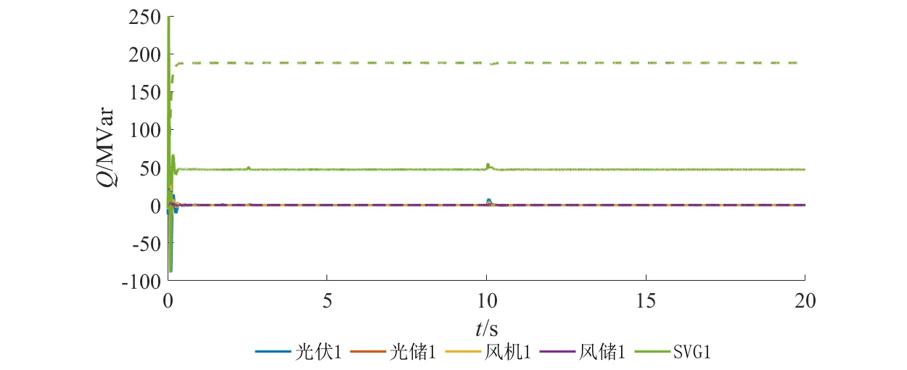

## 案例介绍

**跟网/构网型并网变流器**标准模型由**跟网型储能变流器**和**构网型储能变流器**标准模型整合而成，用户可在模型参数方案中选用变流器控制类型。模型整体架构如下图所示。

## 使用方法说明

**跟网型并网变流器**标准模型的适用范围：  
   + 建议步长范围：1-50μs  
   + 当前参数设置下建议短路比范围：>3

**构网型并网变流器**标准模型的适用范围：  
  + 建议步长范围：1–50 μs  
  + 当前参数设置下建议短路比范围：2~7
  
## 算例介绍

选用跟网型控制时，**跟网/构网型并网变流器**标准模型与[**跟网型储能变流器-平均模型**](../10-pcs_gfl-acad_dps_lqp-v1/index.md)一致；  
选用构网型控制时，**跟网/构网型并网变流器**标准模型与[**构网型储能变流器-平均模型**](../20-pcs_gfm-acad_dps_lqp-v1/index.md)一致。

## 算例仿真测试

将**跟网/构网型并网变流器**标准模型接入实际电网标准模型进行仿真验证。

### 并网变流器接入标准算例仿真验证

采用CSEE-RAS标准算例，拓扑如下图，其中风机、光伏、储能和静止无功发生器设备均采用本文档构建的跟网/构网型变流器设备。为B03区的风电、光伏设备配备跟网/构网型储能设备，并在该区接入跟网/构网型静止无功发生器，算例中所有构网型设备的出力比例设置为20%。在10s时刻设置B03区2号火电机组掉机故障，以此对比构网型设备接入前后系统频率的暂态响应和稳定性。

由下图可得，当系统中均为跟网型设备时，系统稳定频率偏低，并且发生掉机故障后系统频率失稳；当系统中接入出力占比为20%的构网型设备后，故障后系统频率仍保持在稳定范围内，即所构建的构网型设备能够较好地支撑系统频率。

由下图可得，图中实线和虚线分别表示构网型和跟网型设备的出力情况，可见当系统发生掉机故障时，跟网型设备仍保持原功率设定值，无法支撑系统频率，而构网型设备主动增大有功功率输出，有利于维持系统频率稳定，同时提供无功补偿以维持机端电压稳定。由此验证了模型的有效性。  

  

## 模型地址
点击打开模型地址：[**跟网/构网型并网变流器-平均模型**](http://cloudpss-calculate.local.ddns.cloudpss.net/model/gaoqunneng/IBR-acad_DPS_lqp-v1)  