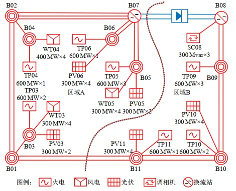

<!-- import DocCardList from '@theme/DocCardList';

<DocCardList /> -->

## 案例介绍
 CSEE-RAS 功角振荡算例是由中国电机工程学会发布的新型电力系统标准算例[^CSEE-RAS], CSEE-RAS 功角振荡算例以 500kV 交流和 ±500kV 直流为主网架，总三相交流母线数为 59，交流线路数为 26，直流线路数为 1。

## 使用方法说明
**动态功角稳定**标准模型的适用范围：
   + 建议步长范围：1–50 μs  
   + 设置的故障时间建议在 2s 之后  

## 算例介绍
CSEE-RAS 功角振荡算例是为根据某区域实际电网构建的交直流混联电网模型，系统拓扑如下图所示。

CloudPSS 上该算例的系统拓扑如下。

**线路及变压器概况**

系统共有交流输电线路 40 条，变压器 25 台，并通过 1 回 ±500kV 直流输电通道与其他电网异步互联，线路及变压器概况如下表所示。

| 电压等级/kV  | 母线数目 | 母线类型 |
|:------: |:----: |:----------:|
| 500 | 11 | 交流输电网架 |
| 220 | 14 | 变压器中/高压侧 |
| 37 / 20  | 25 | 变压器低压侧 |
| 0.69 / 0.4 | 9| 新能源设备端口 |
| 合计 | 59| —— |

| 类型  | 数目 |   | 备注 |
|:----: |:----:|:---:|:----:|
| 交流线路 | 26 条 | 500 kV | 交流输电网架 17 条 |
| ^ | ^ | 220 kV  | 新能源送出线路 9 条 |
| 两绕组变压器 | 25 台 | 20/525 kV | 常规机组升压变 7 台 |
| ^ | ^ | 0.4/38.5 kV | 光伏箱变 5 台 |
| ^ | ^ | 0.69/38.5kV | 风机箱变 4 台 |
| ^ | ^ | 38.5/230 kV | 新能源场站升压变 9 台 |
| 三绕组变压器 | 13 台 | 电压/kV | 525/230/37 |
| 直流线路 | 1 回 | 额定电压/kV | ±500 |
| ^ | ^ | 额定功率/MW  | 800 |

**电源概况**

常规机组共 7 台，总装机 4669MW；光伏总装机 2000MW，风电总装机 1200MW，新能源装机比例为 40.7%，装机概况如下表所示。

| 接入母线  | 同步电机  |  风电   | 光伏 |
|:------: |:----:|:-------:|:------:|
| B02 | 0  | 0 | 0 |
| B03 | 667  | 0 | 800 |
| B04 | 667  | 600 | 0 |
| B05 | 0  | 600 | 400 |
| B06 | 667  | 0 | 800 |
| B07 | 0  | 0 | 0 |
| B08 | 0  | 0 | 0 |
| B09 | 1334  | 0 | 0 |
| B10 | 667  | 0 | 0 |
| B11 | 667  | 0 | 0 |
| 合计 | 4669  | 1200 | 2000 |

**负荷概况**

系统总有功负荷 4484MW，总无功负荷 250MVar，负荷功率因数为 0.998，各母线负荷水平见下表。

| 母线  | 有功负荷/MW | 无功负荷/MVar |
|:------: |:----:|:-------:|
| B09 | 3084 | 200 |
| B10 | 1400 | 50 |
| 合计 | 4484  | 250 |

**新能源与直流模型说明**

系统中共有 4 组风机机组（其中 2 组为直驱风机风场，剩余 2 组为双馈风机风场），5 组光伏机组，1 回直流。 算例中的直驱风机风场采用 [直驱风机01型-标准封装模型](../../../10-typical-cases/20-wind-power-system/30-wtg_pmsg_f/10-wtg_pmsg_01-avm-stdm-v2/index.md)，双馈风机风场采用 [双馈风机01型-标准封装模型](../../../10-typical-cases/20-wind-power-system/40-wtg_dfig_f/10-wtg_dfig_01-avm-stdm-v1/index.md)，光伏机组采用 [光伏发电01型-标准封装模型](../../../10-typical-cases/30-photovoltaic-power-system/30-pvs_f/10-pvs_01-avm-stdm-v1/index.md)，每一回直流由 2 个 [LCC直流（单极）](../../../../../documents/software/20-emtlab/110-component-library/30-dc-modules/10-dc-electrical-modules/20-DCLine_sp/index.md) 模型构成。

## 算例仿真测试

当线路B11 (525kV) - B01 (525kV)发生三永故障触发N-1时，区域功角失稳。

在 BPA 以及论文[^CSEE-RAS] 中 CSEE-RAS 功角振荡场景的系统功角仿真结果如下图所示。通过对比可以看出，CloudPSS 中的 CSEE-RAS 功角振荡算例在准确刻画新型电力系统的电磁暂态过程的同时，可以具备与机电暂态一致的功角特性。

针对 CloudPSS 和 BPA 的仿真结果差异，需说明的是：由于新能源机组（直驱风机、双馈风机、光伏电站）的建模方式不同，以及电磁暂态仿真（CloudPSS）与机电暂态仿真（BPA）在计算原理上的本质差异，标准算例的仿真结果存在合理偏差。

## 算例地址
点击打开算例地址：[**CSEE-RAS**](http://cloudpss-calculate.local.ddns.cloudpss.net/model/open-cloudpss/CSEE-RAS-std-v1b1)

[^CSEE-RAS]:徐式蕴,李宗翰,赵兵,等.新型电力系统标准算例(一)：功角稳定CSEE-RAS[J].中国电机工程学报,2024,44(15):5973-5985.DOI:10.13334/j.0258-8013.pcsee.230534.

原算例下载链接：https://github.com/lbl-hub/CSEE

<!-- 参考文献下载：[点击下载](../10-csee_ras_aperiodic-v1/_新型电力系统标准算例(一)：功角稳定CSEE-RAS.pdf)

## 附：修改及调试日志
20250807 编写案例文档   -->