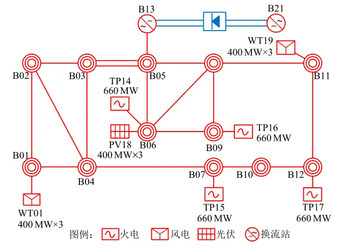
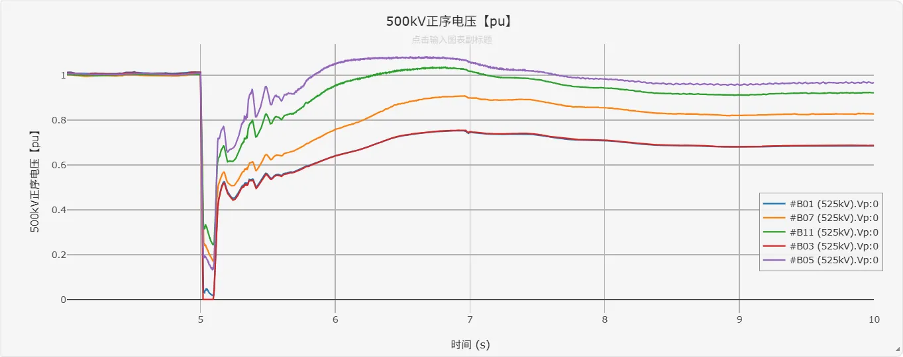

<!-- import DocCardList from '@theme/DocCardList';

<DocCardList /> -->

## 案例介绍

**持续低电压 CSEE-CLV** 算例是由中国电机⼯程学会发布的新型电力系统标准算例 [^CSEE-CLV]，该算例着重刻画了 500kV 主网以及直流逆变站、新能源场站附近 0.4kV~220kV 的交流升压网络，其中新能源机组出力占比达 50%以上，较为全面地反映了电磁暂态尺度下的持续低电压失稳的演化过程与关键特征，可作为高比例新能源场景下直流受端电网电压稳定分析的基础平台，降低科研人员在典型算例设计环节的工作量，为不同研究方案的横向对比分析提供了统一基准。

## 使用方法说明

**持续低电压**标准算例的适用范围：  
   + 建议步长范围：1–50 μs  
   + 设置的故障时间建议在 5s 之后  

## 算例介绍

CSEE-CLV 是基于我国电网实际数据提取的高压直流输电受端系统[^CSEE-CLV]，系统中的火电总出力 1553 MW，新能源总出力 1800MW，直流功率 1600MW，新能源出力占总电源的比例为 53.7%。系统拓扑如下图所示。

  

CloudPSS 上该算例的系统拓扑如下。

  

### 输电网架概况
输电网架共有 71 条三相交流母线（500kV 主网架为 20 条三相交流母线），输电网架概况如下表所示。

| 电压等级/kV | 母线数目 |          母线类型          |
| :---------: | :------: | :------------------------: |
|     500     |    20    |         交流主网架         |
|     220     |    18    | 新能源场站内母线，负荷母线 |
|     35      |    18    |      新能源场站内母线      |
|     20      |    6     | 同步发电机母线，调相机母线 |
|    0.69     |    6     |      新能源场站内母线      |
|     0.4     |    3     |      新能源场站内母线      |
|    合计     |    71    |             /              |

### 线路及变压器概况

系统共有交流线路 35 条，变压器 49 台，直流回路 1 回，线路及变压器概况如下表所示。

|   线路类型   | 数目  |        >         | 备注  |
| :----------: | :---: | :--------------: | :---: |
|   交流线路   | 35 条  |      500kV       | 23 条  |
|      ^       |   ^   |      220kV       | 12 条  |
| 两绕组变压器 | 34 台  |     3000 MVA     |  4 台  |
|      ^       |   ^   |     750 MVA      |  4 台  |
|      ^       |   ^   |     450 MVA      |  6 台  |
|      ^       |   ^   |     360 MVA      |  2 台  |
|      ^       |   ^   |     300 MVA      | 18 台  |
| 三绕组变压器 | 15 台  | 1500/1500/450MVA |  3 台  |
|      ^       |   ^   | 1000/1000/360MVA | 12 台  |
|   直流线路   |  1 回  |   额定电压/kV    | ±500  |
|      ^       |   ^   |   额定功率/MW    | 1600  |

### 电源概况

常规火电机组共 4 台，总装机 2640MW；调相机共 2 台，总装机 600MW；风电、光伏 2 种新能源机组总装机 3600MW，其中风电装机 2400MW，光伏装机 1200MW，新能源机组装机占比超过 50%。系统电源装机概况如下表所示。

| 接入母线 | 火电装机/MW | 水电装机/MW | 风电装机/MW | 光伏装机/MW | 调相机装机/Mvar |
| :------: | :---------: | :---------: | :---------: | :---------: | :-------------: |
| TP14-01  |     660     |      /      |      /      |      /      |        /        |
| TP15-01  |     660     |      /      |      /      |      /      |        /        |
| TP16-01  |     660     |      /      |      /      |      /      |        /        |
| TP17-01  |     660     |      /      |      /      |      /      |        /        |
| WT19-01  |      /      |      /      |     400     |      /      |        /        |
| WT19-02  |      /      |      /      |     400     |      /      |        /        |
| WT19-03  |      /      |      /      |     400     |      /      |        /        |
| WT20-01  |      /      |      /      |     400     |      /      |        /        |
| WT20-02  |      /      |      /      |     400     |      /      |        /        |
| WT20-03  |      /      |      /      |     400     |      /      |        /        |
| PV18-01  |      /      |      /      |      /      |     400     |        /        |
| PV18-02  |      /      |      /      |      /      |     400     |        /        |
| PV18-03  |      /      |      /      |      /      |     400     |        /        |
| SC05-01  |      /      |      /      |      /      |      /      |       300       |
| SC05-02  |      /      |      /      |      /      |      /      |       300       |
|   合计   |    2640     |      /      |    2400     |    1200     |       600       |

### 负荷概况

系统总有功负荷 4905MW，无功负荷 1647Mvar，在全网的分布相对均匀，没有显著的负荷中心。负荷模型为 30%感应电机+70%恒阻抗负荷。所有负荷均连接在 220kV 母线上，通过三绕组变压器与 500kV 母线相连。各母线负荷水平如下表所示。

|  接入母线   | 有功负荷/MW | 无功负荷/Mvar |
| :---------: | :---------: | :-----------: |
| B34 (230kV) |     356     |      123      |
| B52 (230kV) |     509     |      166      |
| B54 (230kV) |     427     |      142      |
| B56 (230kV) |     107     |      32       |
| B36 (230kV) |     408     |      149      |
| B38 (230kV) |     339     |      122      |
| B40 (230kV) |     452     |      165      |
| B42 (230kV) |     506     |      162      |
| B44 (230kV) |     475     |      154      |
| B46 (230kV) |     457     |      157      |
| B48 (230kV) |     470     |      160      |
| B50 (230kV) |     399     |      115      |
|    合计     |    4905     |     1647      |

### 新能源与直流模型说明

系统包含新能源场站 3 个，±500kV 直流输电线路一回。在新能源场站中，共包含倍乘等值的直驱风电集群 4 个，倍乘等值的双馈风电集群 2 个，等值光伏集群 3 个。 其中直驱风电集群采用 [直驱风机01型-标准封装模型](../../../10-typical-cases/20-wind-power-system/30-wtg_pmsg_f/10-wtg_pmsg_01-avm-stdm-v2/index.md)，双馈风电集群采用 [双馈风机01型-标准封装模型](../../../10-typical-cases/20-wind-power-system/40-wtg_dfig_f/10-wtg_dfig_01-avm-stdm-v1/index.md)，光伏集群采用 [光伏发电01型-标准封装模型](../../../10-typical-cases/30-photovoltaic-power-system/30-pvs_f/10-pvs_01-avm-stdm-v1/index.md)，直流输电线路采用 [LCC 直流模型](../../../../../documents/software/20-emtlab/110-component-library/30-dc-modules/10-dc-electrical-modules/10-DCLine/index.md) 。

需要进行说明的是，在当前版本（2025年08月26日）的 CSEE-FS 标准算例中，新能源模型的直流侧电容参数过大（直驱风机的直流侧电容为 10E8 F，光伏电站的直流侧电容为 10E8 mF），在算例转换和对比时已将该参数分别修改为0.015 F 和 3.9 mF。

## 算例仿真测试

在母线 B03-B05 间的双回线路中，一回线路在 t=1.00s 时发生三相永久性短路，t=1.09s 时故障线路的 B03 侧断路器跳开，t=1.10s 时故障线路的 B05 侧断路器跳开，另一回并联线路被同时切除。故障发生后，母线 B01、B02、B03、B04 附近成为受端薄弱区域，出现持续低电压现象，伴随部分新能源脱网。系统部分母线的电压波形如下图所示。

  

  

针对 CloudPSS 和 BPA 的仿真结果差异，需说明的是：由于新能源机组（直驱风机、双馈风机、光伏电站）的建模方式不同，以及电磁暂态仿真（CloudPSS）与机电暂态仿真（BPA）在计算原理上的本质差异，标准算例的仿真结果存在合理偏差。

## 算例地址
点击打开算例地址：[**CSEE-CLV-持续低电压**](https://cloudpss.net/model/open-cloudpss/CSEE_VS_CLV-v1b1)  
原始算例下载链接：[**中国电机工程学会新型电力系统标准算例**](https://www.csee.org.cn//portal/qtxx/20240921/33256.html)  

<!-- 参考文献下载：[**点击下载**](../50-csee_vs_vc-v1/新型电力系统标准算例(三)：电压稳定CSEE-VS.pdf) -->

[^CSEE-CLV]: 赵兵，徐式蕴，兰天楷，等。新型电力系统标准算例（三）：电压稳定 CSEE-VS[J]. 中国电机工程学报，2024,44(21):8353-8364.DOI:10.13334/j.0258-8013.pcsee.230536.

<!-- 
## 附：修改及调试日志

+ 20250805 编写案例文档
-->
