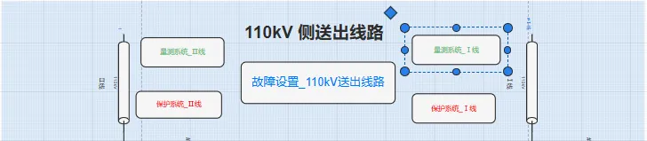
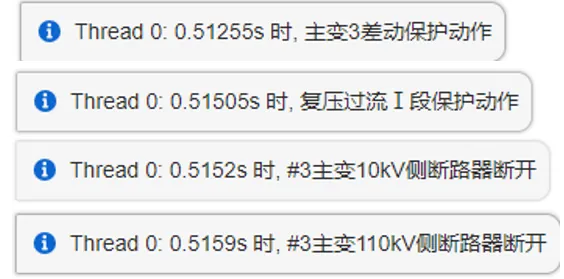
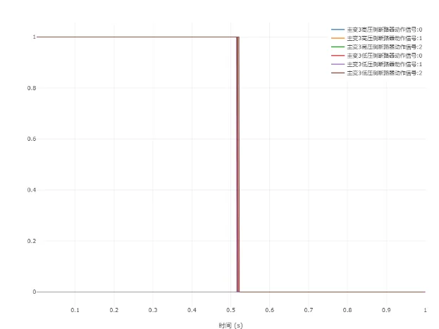
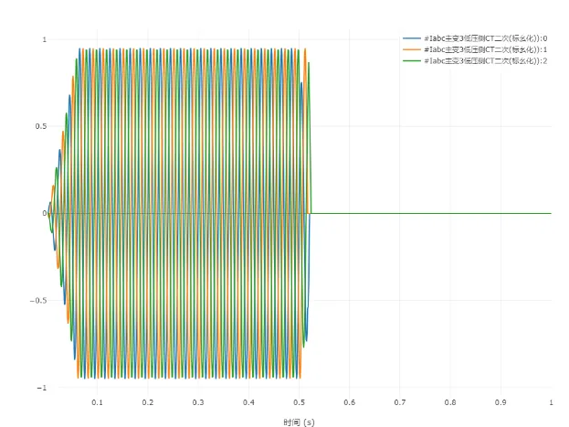

import Tabs from '@theme/Tabs'
import TabItem from '@theme/TabItem'

智能变电站作为新型电力系统中衔接一、二次系统的重要节点，担任着受电、变电、配电、控制、保护等重要角色。随着高比例分布式电源的接入，保证在各种工况下继电保护和控制系统都对故障做出正确的判断和快速响应是智能变电站保护和控制装置研发的难点，用户可使用本案例，进行保护配合测试、连锁故障反演等相关内容研究。

## 算例介绍
该算例包含了智能变电站一次主接线、量测系统及保护系统全部模块。电气与控制节点总数超过20000个。为使用户更直观、快速地掌握该算例，SimStudio结合实际智能变电站的层级划分结构，采用分层设计理念，将算例分为了一次系统、量测系统、保护系统三个层级分别构建。
### 变电站一次系统

一次系统由电源、送出线路、母线、主变、出线、负荷、电容器、接地变、断路器、CT\PT等元件组成，用于模拟一次设备的运行情况。

一次系统又按照电源、送出线路、母线、变压器进行进一步的层级划分，每一个层级下配置了该层级量测系统、保护系统、故障设置的对应链接，用户可通过双击链接进行不同层级图纸之间的导航。

例如：在 110kV 送出线路系统层级下，双击”量测系统_Ⅰ线”。可导航至对应的量测系统：“Ⅰ线保护设备量测“

### 变电站量测系统

量测系统主要包含数字量量测(断路器状态)、模拟量量测(CT\PT)两类，其中数字量量测主要测量断路器的开断信息用于事件日志的触发以及与保护逻辑配合，模拟量量测主要测量一次设备的电压、电流等信息，用于保护与控制。

本次算例中的量测系统监测了所有断路器的状态信息、以及各一次设备的电压、电流等采样信息。

### 变电站保护系统

保护系统通过监测断路器的开断状态决定一次设备对应的保护装置是否投切以及根据二次侧的电压、电流等采样信息判断一次设备、电网是否故障，从而进行故障定位、切除与隔离，保障电网的可靠运行。本

算例中，根据实际保护配置信息及保护定值单，构建了包含主网、配网保护逻辑的保护系统。

## 算例入门指南

### 新建算例

可以在**SimStudio 工作台**页面中，点击**新建**按钮，在弹出框中选择**继电保护系统**，创建**110kV变电站一、二次系统**。

### 用户自定义场景
为方便用户使用，智能变电站算例为用户配置了保护投入/闭锁状态、故障参数快速配置面板，用户可快速配置不同类型故障、不同类型保护的投切状态，测试不同故障下各类保护的配合效果。

- 保护投入/闭锁

用户可在**保护投入/闭锁面板**根据保护类型选择要**投入/闭锁**的保护。

- 故障设置
  
用户可在**故障设置面板**选择算例中已经搭建好的故障位置、故障场景。

- 运行

  用户设置好**保护投切/闭锁**、**故障场景**、**故障位置后**，配置好仿真时间、以及需要显示的通道数据，即可运行仿真。

## 典型场景
<Tabs>

<TabItem value="case1" label="送出线路短路故障">

用户可通过设置送出线路故障类型，故障位置选择为Ⅰ线或者Ⅱ线，仿真差动保护动作特性。差动保护相关日志记录、动作信号、量测信息如下图所示。

</TabItem>

<TabItem value="case2" label="母线短路故障">
用户可通过设置母线故障类型，故障位置为110kVⅠ段母线，仿真母线保护动作特性。母线保护相关日志记录、动作信号、量测信息如下图所示。

</TabItem>

<TabItem value="case3" label="变压器故障">
用户可通过设置变压器故障类型，故障位置为主变3，仿真变压器相关保护动作特性。变压器保护相关日志记录、动作信号、量测信息如下图所示。

</TabItem>

<TabItem value="case4" label="重合闸">

此次算例中在10kV配网出线处配置了重合闸保护，用户可通过设置送出线路故障类型，故障位置选择为10kV出线1，故障类型为单相短路故障，仿真重合闸相关动作特性。重合闸相关日志记录、动作信号、量测信息如下图所示。

</TabItem>

</Tabs>