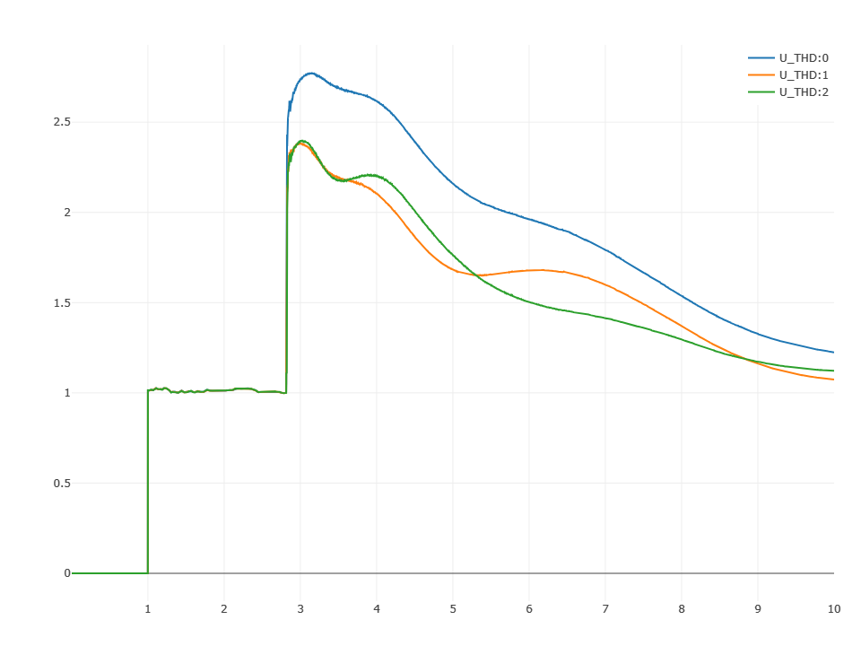

## 元件定义

## 元件说明

自定义曲线元件参数标签页包括**属性**、**参数**、**引脚**三类参数，下面对每类参数进行详细说明。

### 属性

CloudPSS 提供了一套统一的元件属性功能，关于元件属性参数的配置，详见 [参数卡](docs/documents/software/10-xstudio/20-simstudio/40-workbench/20-function-zone/30-design-tab/30-param-panel/index.md) 页面。

### 参数

import Parameters from './_parameters.md'

<Parameters/>

### 引脚

import Pins from './_pins.md'

<Pins/>

## 案例
本案例展示如何利用**自定义曲线元件**绘制 .csv 文件中存储的多维数据，典型 .csv 文件数据存储形式如下。  

import CSVdatas from './_csvdatas.md'

<CSVdatas/>

 - 对于一个含有 n+1 维（包含时间维度）数据的 .csv 文件，共需进行 n 次**数据导入**。
 - 每一次数据导入时，进行一次**数据标记**，并导入 1 个**自定义曲线元件**中，因此对于 n+1 维（包含时间维度）数据的 .csv 文件共需 n 个**自定义曲线元件**。
 - 最终可以将 n 个**自定义曲线元件**的输出数据通过**多路信号合并元件**汇总到**输出通道**中显示。

### 引脚设置
- 输入引脚：在**控制-基础**中找到**时间输入**并连接到**自定义曲线元件**的输入引脚。
- 输出引脚：通常接**多路信号合并元件**或**输出通道**。

### 数据标记
- 一个**自定义曲线元件**包含一组二维数据，因此从 .csv 文件中导入数据时需在 .csv 文件中标记 x 轴数据以及 y 轴数据。
- 将列名设置为 0 表示该列数据被标记为 x 轴数据，将列名设置为 1 表示将该列数据标记为 y 轴数据。

:::warning
 标记 .csv 文件中的数据列名时，不能重复标记!
:::

### 数据导入   
- **选中自定义曲线元件**，在右边参数编辑栏选择**编辑数据**，选择表格上方的**导入CSV选项**，并选择数据所在的 .csv 文件。

:::warning
导入 .csv 文件需事先进行**数据标记**！
:::

### 算例搭建
- 以某存储了 7 维（包含时间维度）数据的 .csv 文件为例，首先[新建空白简单电力系统仿真模型](cloudpss:/model/#)。
- 在模型库**控制-非线性函数**中找到并添加 6 个**自定义曲线元件**，分别进行 6 次**数据标记**及**数据导入**。
- 将每个**自定义曲线元件**的输入引脚连接到**时间输入**，输出引脚连接到**多路信号合并元件**，将输出结果以每 3 维数据为一组的形式，汇总到两个**输出通道**中，模型展示如下。
  
  

### 效果展示
- 将仿真时长设置为 10s，并运行，**输出通道**中的结果展示如下。
  
  

  

:::warning
**计算方案**中设置的**仿真时间长度**需小于等于从文件中导入的**数据时间长度**，若**仿真时间长度**大于**数据时间长度**，超过部分会按照预先配置的**插值方式**进行拟合!
:::
## 常见问题

