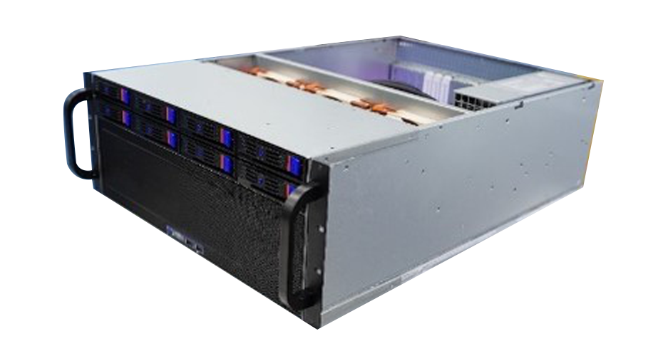

## 产品简介
CloudPSS Pro 是搭载 CloudPSS 电力系统电磁暂态云仿真平台的高性能软硬件一体仿真机，相较于 CloudPSS Mini，它拥有更强大的计算性能、更大的仿真规模。 

  
## 产品特点

## 产品规格

### 型号与参数

[CloudPSS Pro 参数]
|     产品型号   ||                 CloudPSS Pro             ||||
|       ^^       || 型号 A |   型号 B  |  型号 C |   型号 D   |
|----------------|:--------:| ----------:|
|       |  电源   |  850W |   1600W |   1600W |   1600W |
|       |  CPU   |  16 核 |   24 核 |   32 核 |   64 核 |
|   ^^  |  GPU   |         可选配最多两块NVIDIA RTX 30系列        ||||
|   ^^  |  内存  | 32GB  |    64GB  |   128GB  |   128GB  |
|   ^^  |  硬盘  | 1TB SSD| 1TB SSD | 1TB SSD  |  1TB SSD |

|  功能模块  |CloudPSS 建模工作台| √ | √ | √ | √ |
|     ^^    |电磁暂态仿真元件库  | √ | √ | √ | √ |
|     ^^    |EMTLab 4.0内核    | √ | √ | √ | √ |
|     ^^    |潮流计算内核       | √ | √ | √ | √ |
|     ^^    |Dashboard         | √ | √ | √ | √ |
|     ^^    |知识资源库         | √ | √ | √ | √ |
|     ^^    |CPU-Turbo         | √ | √ | √ | √ |
|     ^^    |EMTLab-API        | √ | √ | √ | √ | 
|     ^^    |实时仿真内核       | 可选配 | 可选配 | 可选配 | 可选配 |

|  性能指标  |最大用户数| 12 | 20 | 28 | 60 |
|     ^^    |最大并发任务数  | 12 | 20 | 28 | 60 |
|     ^^    |单任务最大并发线程数     | 12 | 20 | 28 | 60 |
|     ^^    |最大电气系统节点规模（非实时）    | 无限制 | 无限制 | 无限制 | 无限制 |
|     ^^    |最大控制系统节点规模（非实时） | 无限制 | 无限制 | 无限制 | 无限制 |
|     ^^    |最大电气系统节点规模（实时）   | 500 | 750 | 1000 | 2000 |
|     ^^    |最大控制系统节点规模（实时）   | 2000 | 3000 | 4000 | 8000 |
|     ^^    |是否支持Raid        | √ | √ | √ | √ |

### 前面板接口

### 后面板接口

## 设备安装

## 注意事项

## 常见问题