## 产品简介
CloudPSS 数模信号枢纽（CloudPSS A/D Signal Hub）是一款多功能信号处理设备，具备高速率数模转换功能，可作为 CloudPSS-RT 实时仿真器的模拟量、数字量输入/输出的扩展接口，实现 CloudPSS 仿真模型与外部控制器、信号发生器或示波器的实时信号交互。

## 产品特点

CloudPSS A/D Signal Hub 可应用于外部信号实时输入、仿真波形实时输出、控制器硬件在环等多种场景，与 CloudPSS-RT 实时仿真器配合使用可满足用户的快速原型控制、硬件在环系统测试等多种需求。 

- 具备 2 个 SFP 光口，通过光纤和定制通信协议与 CloudPSS-RT 通信，兼具稳定性与高效性。 

- 支持 8 路模拟量输入，32 路模拟量输出和 96 路数字量输入/输出，满足绝大部分硬件在环测试需求。  

- 拥有屏幕及按钮式交互面板，可实时监控运行状态、设置和下发功能指令。  

   

## 产品规格
### 性能与参数
Signal Hub 的尺寸参数与接口参数可参考下表：  

[CloudPSS A/D Signal Hub 参数]
|性能|参数指标||
|-----|:----:| ----:|
|尺寸|275mm * 280mm * 110mm ||
|供电特性| DC 12V，2A ||
|通讯接口| SFP 接口，10G，850nm，300M ||
|模拟量输入| 8 路| 量测范围 ±5V，采样精度 16bit，最高采样率 500kHz |
|模拟量输出| 32 路| 输出范围 ±5V |
|数字量输入/输出| 96 路| 输入/输出方向可切换，高电平 +5V | 

### 前面板接口

  

- A：功能旋钮   

- B：电源指示灯，开机后常量  
- C：SFP 光口，插入光模块，实现与计算服务器的通信  
- D：交互屏幕，显示系统状态、发送帧、超时帧、发送间隔、通道个数、数字量输入/输出方向等  
- E：数字键盘，可输入数字等设置值，也可快速切换对应通道的数字量输入/输出方向
- F：功能按键。**电源**短按开机，长按关机；**复位**短按清零超时帧，长按复位所有设置；**确认**下发选中的设置指令；**设置**切换状态和设置页面

### 后面板接口

  

- A：模拟量输入接口，8路模拟量输入，BNC接口，量程±5V  

- B：电源输入口，12V，2A  
- C：SCSI 接口 1，包含 64 路数字量输入/输出，数字量高电平 +5V
- D：SCSI 接口 2，包含 32 路模拟量输出，量程 ±5V；32 路数字量输入/输出，高电平 +5V  

#### SCSI 接口引脚定义

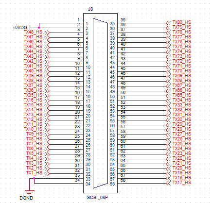  

- Pin 1-2 ：+5V  
  
- Pin 33-34：GND
- Pin 3-32，35-68：共 64 路数字量输入/输出  

数字量通道对应的 Channel ID 见 [使用方法 -> 软件模块](#软件模块)。  

  

- Pin 17-18：GND
  
- Pin 51-52：GND
- Pin 1-16，35-50：共 32 路模拟量输出  
- Pin 19-34，53-68：共 32 路数字量输入/输出  

数字量通道对应的 Channel ID 见 [使用方法 -> 软件模块](#软件模块)。

## 功能介绍  
  
CloudPSS A/D Signal Hub 在默认的模拟量输入/输出、数字量输入/输出功能的基础上，通过功能按键和功能旋钮可以实现其它几个辅助功能。  

  

  

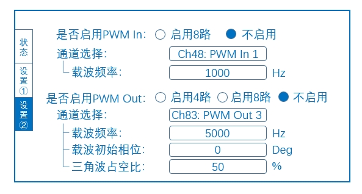  

### 功能1. 已接收帧数与超时帧数显示  

**状态**页面显示**已接收帧数**和**超时帧数**。**已接收帧数**指 Signal Hub 接收到的数据帧数，**超时帧数**指数据超时的帧数。超时帧的判定逻辑为：若一个时步内，Signal Hub 没有收到任何数据，则超时帧计数加 1。  

### 功能2. 系统状态显示

**状态**页面显示 Signal Hub 的工作状态，分为**运行**、**等待**和**停止**状态。

- 设备启动后即进入**运行**状态，自动发送和开始接收数据；

- 若 5s 内未收到任何数据，则进入**等待**状态，此时超时帧计数不再增加，但仍正常发送数据；

- 在**等待**状态中，若重新收到连续数据，则进入**运行**状态，超时帧计数可以继续累加；

- 在**等待**状态中，若连续 30s 没有收到数据，系统切换为**停止**状态，停止发送数据，待复位后重新开始状态判定。  

### 功能3. 发送间隔控制  

控制 Signal Hub 发出数据的时间间隔，间隔范围从 **20us** 到 **200us** 每 10us 一个档，共 19 档。在状态页面可通过功能旋钮选择发送间隔，按下**确认**下发指令。  

:::warning
需要注意的是，在利用 Signal Hub 输出 CloudPSS SimStudio 的仿真波形时，为保证波形频率一致且不失真，SimStudio 仿真步长应与 Signal Hub 的发送间隔相同。
:::

发送间隔控制的效果可参考下图：

  

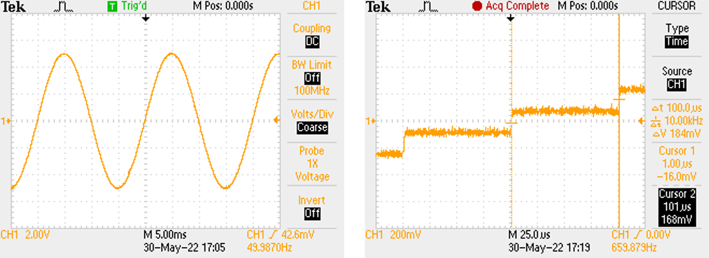  

### 功能4. 超时帧清零与复位功能  

超时帧可辅助判断当前仿真的实时性，在**状态**页面短按**复位**可将超时帧清零，重新计数。长按**复位**直到出现“复位成功”提示，将 Signal Hub 恢复至刚启动时的状态，同时将**已接收帧数**与**超时帧数**清零，所有设置（包括发送间隔、通道数、IO 方向）均恢复到默认状态，工作状态变为启动后的**运行**状态，发送和开始接收数据，重新进行超时帧和系统状态的判定。

### 功能5. 模拟量输出通道数选择  

选择模拟量输出通道的个数。按下**设置**进入**设置1** 页面，可通过功能旋钮选择模拟量输出通道为 1 个、8 个或 32 个。当选择 1 个通道时，只启用第 1 路模拟量输出通道，其它通道闭锁；当选择 8 个通道时，第 1、5、9、13、17、21、25、29 路模拟量输出通道启用，其它通道闭锁；当选择 32 个通道时，所有通道启用。按下**确认**下发指令。  

:::tip
需要注意的是，模拟量输出通道的数模转换速率与发送间隔同步。  

通道闭锁后仍会输出一个定值，该值为闭锁前寄存器中保存的最后一个数值，无实际意义。
:::

### 功能6. IO 方向控制  

选择数字量通道是输入还是输出。数字量每 8 路通道为 1 组，共 12 组，每组都可以单独控制数字量的方向。按下**设置**进入**设置1** 页面，默认状态为数字量输入，通过**数字键盘**可快速切换对应通道的 IO 方向，按下**确认**下发切换指令。数字量输出为低电平 0V、高电平 +5V。

### 功能7. PWM IO 设置  

按下**设置**可切换至**设置2** 页面，将部分 **SCSI2** 的数字量 DIO 通道设置为 PWM IO 通道。

  

**SCSI2** 中，TX49-TX56 可选择为普通 DIO 或 PWMI。当作为普通 DIO 时，功能与其它 IO 相同，可变换 IO 方向；当作为 PWMI 时，固定为 PWM 输入，TX49 对应 Ref in 1，TX50 对应 Ref in 2，依次类推到 TX56 对应 Ref in 8。  

**SCSI2** 中，TX81-TX96 可选择为普通 DIO 或 PWMO。当作为普通 DIO 时，功能与其它 IO 相同，可变换 IO 方向；当作为 PWMO 时，固定为 PWM 输出，TX81、TX82 对应 Ref out 1 和它的反置，TX83、TX84 对应 Ref out 2 和它的反置，依次类推到 TX95、TX96 对应 Ref out 8 和它的反置。  

Ref out 与 TX 的关系示意图如下：

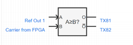  

在**设置2** 页面可选择是否启用 PWM In，如启用，则 Ch48-55 失去 DIO 方向切换功能，变为 PWM In，Signal Hub 将对接收到的 PWM 信号进行解调，并通过对应的 Ref in 接口输入到仿真模型中。可设置 PWM In 对应的载波频率，载波幅值默认为 [-1,1]`。  

在**设置2** 页面可选择启用 4 路或 8 路 PWM Out，Signal Hub 将按照设置的载波参数将仿真模型中对应的 Ref Out 调制为 PWM 信号后输出。当启用 4 路时，Ch80-87 失去 DIO 方向切换功能，变为 PWM Out，Ch81、83、85、87 自动变为 Ch80、82、84、86 的反置。当启用 8 路时，Ch80-87、Ch88-95 失去 DIO 方向切换功能，变为 PWM Out，Ch89、91、93、95 为 Ch88、90、92、94 的反置。可设置载波的频率、初始相位及三角波的占空比，若占空比设为 `99%`，则等效于锯齿波。载波幅值固定为 `[-1,1]`。

:::tip
通过旋钮选到对应的通道后，按**确定**键可以进入当前通道的设置层级。数字键盘的 `*` 为**退格**或**取消设置**，`#` 为**参数下发**。在当前通道的设置层级中，必须**参数下发**或**取消设置**后才能退出当前层级，切换到其它通道。
:::

## 使用方法

### 硬件连接

Signal Hub 作为 CloudPSS-RT 的模拟量、数字量输入/输出扩展接口，主要与 CloudPSS-RT 配合使用，以实现仿真波形的实时输出、外部信号的实时输入或控制器硬件在环等应用。它与 CloudPSS-RT 通过光纤连接，接口位置在前面板，连接示意图如下：

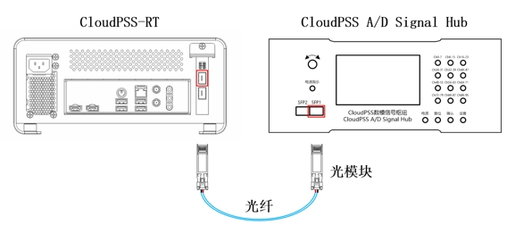  

模拟量输入信号通过 Signal Hub 后面板的 8 个 BNC 接口接入，CH1-8 分别表示第 1 通道到第 8 通道；模拟量输出和数字量输入/输出信号在 Signal Hub 后面板的 SCSI 接口，可以用两个 SCSI68 中继端子台引出。  

  

### 软件模块

在 SimStudio 中，添加订阅 **CloudPSS 实时仿真工具** 的模型库。模型库中包含**模拟量输入**、**模拟量输出**、**数字量输入**、**数字量输出**、**调制波输入**和**调制波输出**元件。

  

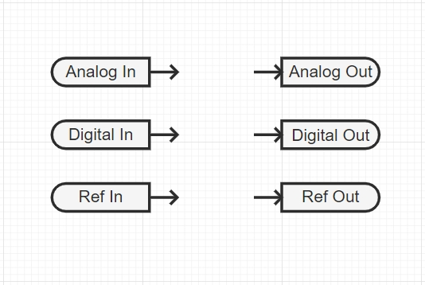  

#### 模拟量输入元件  

  

Channel ID：模拟量输入通道序号，0 为第 1 路，1 为第 2 路，以此类推，可填入 0-7。  

使用方法与**信号发生器**元件类似，使用时引脚可以连接到其他元件的控制输入引脚/虚拟输入引脚。

#### 模拟量输出元件  

  

Channel ID：模拟量输出通道序号，0 为第 1 路，1 为第 2 路，以此类推，可填入 0-31。  

使用方法与**输出通道**元件类似，使用时引脚可以连接到其他元件的控制输出引脚/虚拟输出引脚。

#### 数字量输入元件  

  

:::tip
仅 IO 方向设为输入时生效。  
:::

Channel ID：数字量组别序号，0 为第 1 组，1 为第 2 组，以此类推，可填入 0-11。  

- Channel 0 对应 TX17-24  

- Channel 1 对应 TX25-32  
- Channel 2 对应 TX1-8  
- Channel 3 对应 TX9-16  
- Channel 4 对应 TX49-56  
- Channel 5 对应 TX57-64  
- Channel 6 对应 TX33-40  
- Channel 7 对应 TX41-48  
- Channel 8 对应 TX81-88  
- Channel 9 对应 TX89-96  
- Channel 10 对应 TX65-72  
- Channel 11 对应 TX73-80  

Line ID：数字量在组中的通道序号，0 为该组第 1 路，1 为该组第 2 路，以此类推，可填入 0-7。  

使用方法与**信号发生器**元件类似，使用时引脚可以连接到其他元件的控制输入引脚/虚拟输入引脚。

#### 数字量输出元件  

  

:::tip
仅 IO 方向设为输出时生效。  
:::

Channel ID：数字量组别序号，0 为第 1 组，1 为第 2 组，以此类推，可填入 0-11。  

- Channel 0 对应 TX17-24  

- Channel 1 对应 TX25-32
- Channel 2 对应 TX1-8  
- Channel 3 对应 TX9-16    
- Channel 4 对应 TX49-56  
- Channel 5 对应 TX57-64  
- Channel 6 对应 TX33-40  
- Channel 7 对应 TX41-48  
- Channel 8 对应 TX81-88  
- Channel 9 对应 TX89-96  
- Channel 10 对应 TX65-72  
- Channel 11 对应 TX73-80  

Line ID：数字量在组中的通道序号，0 为该组第 1 路，1 为该组第 2 路，以此类推，可填入 0-7。  

使用方法与**输出通道**元件类似，使用时引脚可以连接到其他元件的控制输出引脚/虚拟输出引脚。

#### 调制波输入元件  

  

:::tip
仅 PWM In 启用时生效。
:::

Channel ID：调制波输入通道序号，0 为第 1 路，1 为第 2 路，以此类推，可填入 0-7。  

- Channel 0 对应 TX49  

- Channel 1 对应 TX50 
- Channel 2 对应 TX51  
- Channel 3 对应 TX52  
- Channel 4 对应 TX53  
- Channel 5 对应 TX54
- Channel 6 对应 TX55  
- Channel 7 对应 TX56  

Carrier Type：可选择调制波的幅值范围，`[-1,1]` 或 `[0,1]`。  

Zero Adjustment Offset：可设置偏置。  

使用方法与**信号发生器**元件类似，使用时引脚可以连接到其他元件的控制输入引脚/虚拟输入引脚。

#### 调制波输出元件  

  

:::tip
仅 PWM Out 启用时生效。
:::

Channel ID：调制波输出通道序号，0 为第 1 路，1 为第 2 路，以此类推，可填入 0-7。  

- Channel 0 对应 TX81、TX82  

- Channel 1 对应 TX83、TX84 
- Channel 2 对应 TX85、TX86  
- Channel 3 对应 TX87、TX88  
- Channel 4 对应 TX89、TX90  
- Channel 5 对应 TX91、TX92
- Channel 6 对应 TX93、TX94  
- Channel 7 对应 TX95、TX96  

Carrier Type：可选择载波的幅值范围，`[-1,1]` 或 `[0,1]`。  

Zero Adjustment Offset：可设置偏置。  

使用方法与**输出通道**元件类似，使用时引脚可以连接到其他元件的控制输出引脚/虚拟输出引脚。

### 实时仿真方案配置  

在**运行标签页**的计算方案列表，添加一个**电磁暂态仿真方案**。

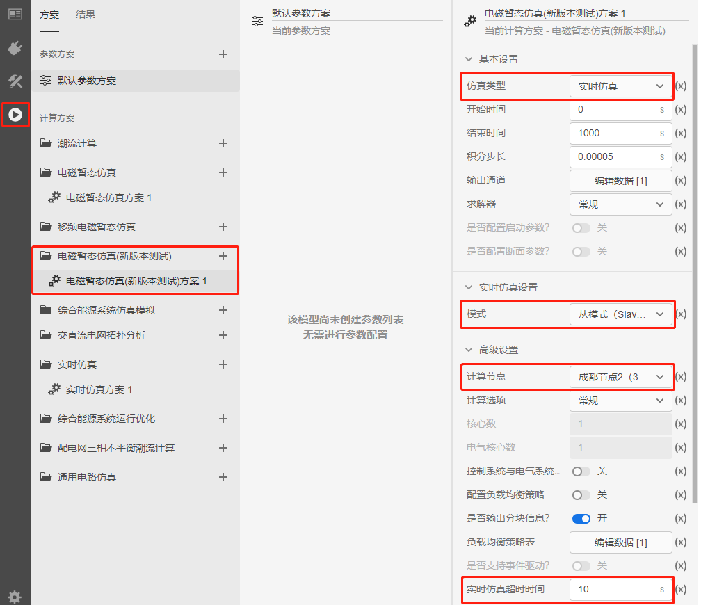  

在基本设置中选择仿真类型为**实时仿真**；结束时间建议设一个较大的值，如 `1000s`；积分步长默认 `0.00005s`；求解器默认**常规**。  

在实时仿真设置中，模式设为**从模式（Slave Mode）**，表示 CloudPSS-RT 的时钟同步将跟随外部时钟，即 Signal Hub 的时钟。  

在高级设置中，计算节点选择 **CloudPSS-RT** 对应的节点名称；计算选项默认为**常规**；实时仿真超时时间可设为 `10s`，当启动 SimStudio 仿真任务后，若在这个设定时间内未接收到任何数据，将判定为实时仿真超时，仿真任务会自动结束。  

### 启动顺序

Signal Hub 与 CloudPSS-RT 通信时，CloudPSS-RT 作为**从模式（Slave Mode）**，跟随 Signal Hub 的时钟并进行同步。因此，使用 Signal Hub 时需要注意 Signal Hub 与 CloudPSS-RT 的启动顺序。  

在硬件连接、模型接口设置和实时仿真方案都配置好后，设备的启动步骤及状态如下：  

[Signal Hub 与 CloudPSS-RT 建立通信的启动顺序]
|序号|操作步骤|CloudPSS-RT 状态|Signal Hub 状态|
|-----|----|----|----|
|1|Signal Hub启动电源|/|开机即进入运行状态，开始发送数据并等待接收数据；  未接收到数据时，超时帧计数每时步累加；连续 5s 未接收到数据时，进入等待状态，仍然发送数据但超时帧计数不再增加；连续 30s 未接收到数据，进入错误状态，不再发送数据。|
|2|SimStudio 运行标签页点击启动任务|5s 初始化后，提示“Start Success！”，开始接收 Signal Hub 的数据。|等待状态或停止状态|
|3|在设定的实时仿真超时时间（默认 10s）内复位 Signal Hub|接收到 Signal Hub 的数据，并开始发送数据，通信建立。|已接收帧数与超时帧数清零，进入运行状态，重新开始发送数据，并接收到 CloudPSS-RT 的数据，通信建立。|

## 案例 

import Tabs from '@theme/Tabs';
import TabItem from '@theme/TabItem';

<Tabs>
<TabItem value="case1" label="模拟量自闭环测试">
使用 CloudPSS-RT 与 Signal Hub 实现模拟量输入与输出的闭环，并用示波器实时观测结果。  

具体地，在 SimStudio 中添加一个正弦波信号发生器，通过模拟量输出元件和 Signal Hub 的模拟量输出接口输出，输出的模拟量信号再经由 Signal Hub 的模拟量输入接口与模拟量输入元件回到 SimStudio，乘以一个变比后，再由第 2 个模拟量输出通道输出。用示波器实时观测第 1、第 2 通道的模拟量信号。 

- 步骤1. 硬件连接
  参照 [使用方法 -> 硬件连接](#硬件连接) 完成 CloudPSS-RT 与 Signal Hub 的连接，以及 Signal Hub 与 SCSI68 中继端子台的连接，其中光模块插入 Signal Hub 前面板的 **SFP1** 光口，SCSI68 线缆接入 Signal Hub 后面板的 **SCSI2** 接口。

- 步骤2. 信号引入与引出
  从中继端子台引出 Pin15、Pin16 与 Pin17 的信号，它们分别对应第 2 路模拟量输出通道、第 1 路模拟量输出通道与 GND。  
  使用一根 BNC 转鳄鱼夹的转接线，BNC 头接入 Signal Hub 后面板的 CH1 接口，红色鳄鱼夹连接 Pin16，黑色鳄鱼夹连接 Pin17，从而让第 1 路模拟量输入通道采集第 1 路模拟量输出信号。  
  示波器的 CH1 和 CH2 两通道分别连接 Pin16、GND 与 Pin15、GND，从而实时观测第 1 路和第 2 路模拟量输出信号的波形。

- 步骤3. 模型接口设置
  参照 [使用方法 -> 软件模块](#软件模块) ，在 SimStudio 实现标签页左侧的模型库中，点击**添加更多**，并订阅 **CloudPSS 实时仿真工具** 模型库。  
  从 **CloudPSS 实时仿真工具** 模型库中拖取 2 个**模拟量输出元件**、1 个**模拟量输入元件**到图纸上，并从 **控制-信号发生器** 模型库中拖取 1 个**正弦发生器**元件、从 **控制-基本数学函数** 模型库中拖取 1 个**乘法器**元件、从 **控制-基础** 模型库中拖取 1 个**常量输入**元件到图纸上，按下图所示完成连线。  
  
  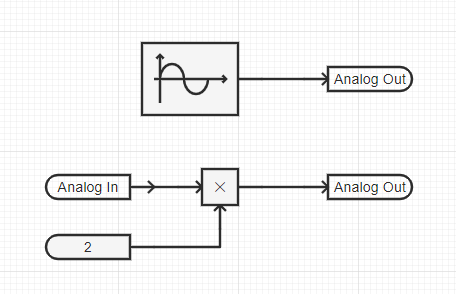  
  
  然后，配置各元件的参数。**正弦发生器**设置为频率 `50Hz`，幅值为 `1`，初始相位为 `0`，函数类型为 `Sine`。  

    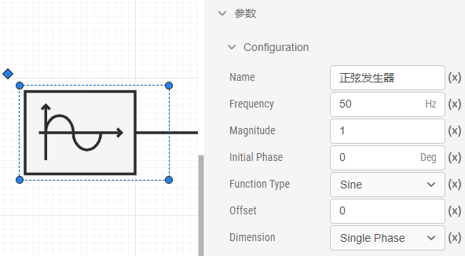  

    **正弦发生器**的信号输出到第 1 路模拟量输出通道，因此与它引脚相连的**模拟量输出**元件设置 Channel ID 为 `0`。

      

    **正弦发生器**的信号由模拟量输出通道输出后，再由第 1 路模拟量输入通道采集。因此，**模拟量输入**元件设置 Channel ID 为 `0`。  

    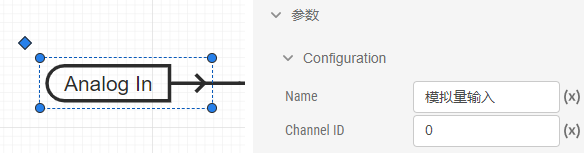  

    模拟量输入信号乘以 2 倍后，再从第 2 路模拟量输出通道输出。因此，**常量输入**元件设置常数为 `2`，与**乘法器**输出引脚相连的**模拟量输出**元件设置 Channel ID 为 `1`。

      

    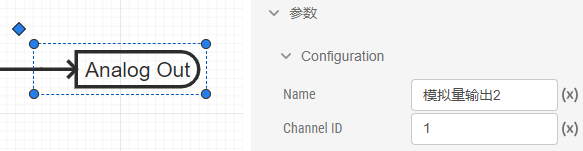

- 步骤4. 实时仿真方案设置
  在 SimStudio **运行标签页**，添加**电磁暂态仿真**方案。在基本设置中，选择仿真类型为**实时仿真**，结束时间 `1000s`，积分步长 `0.00005s`；在实时仿真设置中，选择模式为**从模式（Slave Mode）**；在高级设置中，选择计算节点为 CloudPSS-RT 对应的节点，实时仿真超时时间为 `10s`。其它设置保持默认值即可。  

        

- 步骤5. 启动 Signal Hub 并运行仿真
    参照 [使用方法 -> 启动顺序](#启动顺序)，先启动 Signal Hub，再点击 SimStudio **运行标签页**顶部的**启动任务**按钮，待出现“Start Success！”提示后，10s（设置的实时仿真超时时间）内长按 Signal Hub 的**复位**按钮进行复位。  

        

    操作后，CloudPSS-RT 与 Signal Hub 成功建立通信，可通过示波器实时观测模拟量输出 1 和模拟量输出 2 的波形。  

按照上述操作步骤，本案例可在示波器观测到的模拟量输出 1 和模拟量输出 2 的波形如图：  

       

</TabItem>
</Tabs>

## 常见问题 
为什么功能设置后没有生效？
:  
为什么禁用的模拟量输出通道引脚处可以测量到直流电压？
: 
