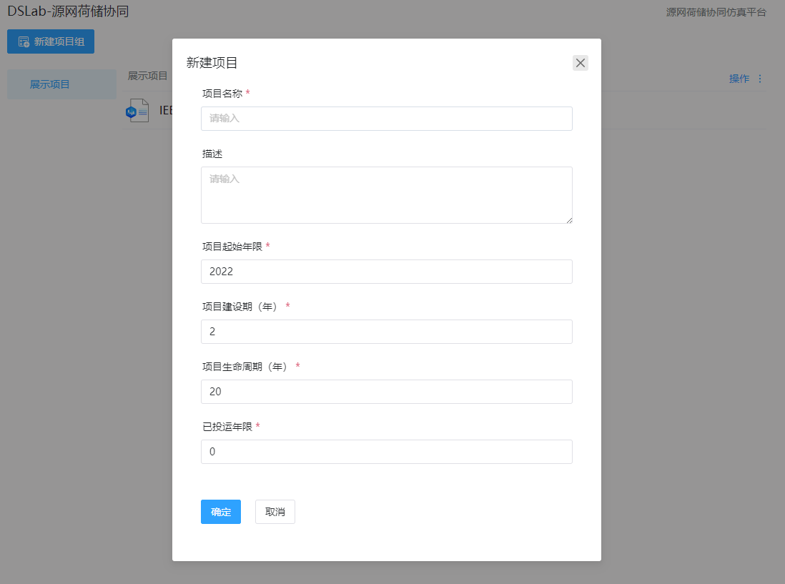
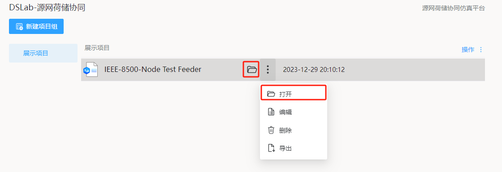

---

title: DSLab 应用介绍
description: CloudPSS 个人中心 DSLab 应用介绍
sidebar_position: 50

tags: 
- 个人中心

---

用户成功登录后，在 CloudPSS 主页点击源网荷储协同的图标后，页面跳转至 `DSLab-源网荷储协同 个人中心`，该界面包含项目组管理、项目管理等。

## 新建项目组

点击`新建项目组`，输入项目组名称及描述，`是否从已有项目组导入`选择`否`，创建一个空白项目组。

## 编辑项目组

点击`操作`，点击`编辑`,输入项目组名称及描述，更新项目组信息

## 新建项目

点击项目组右侧的`操作`，选择`新建项目`。

在弹出的`新建项目`对话框中，输入项目名称、描述、项目起始年限、项目建设期(年)、项目生命周期(年)、已投运年限。

## 打开项目

点击项目所在行，或点击文件夹按钮打开；或点击`更多选项`打开按钮

## 编辑项目
选中项目所在行，点击`更多选项`编辑按钮

## 导出项目
选中项目所在行，点击`更多选项`导出按钮，导出zip压缩包文件，包括：项目基础数据、设备参数数据、拓扑信息、气象数据；导出可能耗时较长，请耐心等待。

## 导入项目
点击项目组右侧的`操作`，选择`导入`。导入zip压缩文件。

