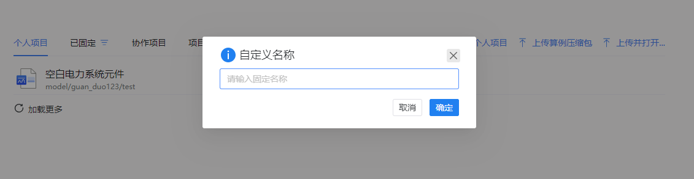

---

title: SimStudio 应用介绍
description: CloudPSS 个人中心 SimStudio 应用介绍
sidebar_position: 10

tags: 
- 个人中心

---

用户成功登录后，在 CloudPSS 主页点击 SimStudio 的图标后，页面将跳转至 `SimStudio 个人中心`，如图所示。该界面包含新建项目、项目管理等。

## 新建项目

该区域包含：

+ 模板案例：包括新建电力系统仿真项目、新建综合能源系统项目、新建电路仿真项目、空白电力系统元件等。点击进入工作台并自动打开该项目
+ 更多内容： 打开一个新的页面（进入工作台）并自动创建一个新的项目。
+ 搜索模板：打开全局搜索并自动填充(type:model is:template)，详情查看[高级搜索功能](../../others/advanced-search/index.md "高级搜索功能")

## 项目管理

该区域包含：

+ 个人项目：显示用户权限为私有的个人项目。

+ 已固定：显示已固定(收藏)的个人项目。
  
+ 协作项目：显示组织内合作的项目。

+ 项目广场：显示权限为公开的全部项目。

+ 加载更多：加载下一页项目。

+ 搜索个人项目/固定项目/协作项目/项目广场：用于打开全局搜索。
  
+ 上传算例压缩包：用于上传本地已保存的算例压缩包(zip格式)。

+ 上传并打开：用于打开保存在本地的项目文件(cmdl格式)。  

鼠标移至任一个项目文件，会显示`打开`和`更多选项`操作按钮，可对项目文件进行`打开`、`固定`(仅限个人项目)、`取消固定`(仅限已固定的项目)操作、`查看文档`(可以通过点击该项目快速查看)、`删除`(仅限个人项目)、`导出`等操作，如图所示。

在项目文件上点击`打开`按钮，会跳转到工作台页面并打开该仿真项目。

在项目文件上点击`查看文档`按钮，页面右侧会出现该项目的文档描述。

在项目文件上选择`固定`按钮，会出现`固定`、已固定的列表、`自定义名称`，点击`固定`按钮就会把当前项目文件加入默认收藏列表，点击已固定列表会把当前项目文件加入该固定列表，点击`自定义名称`创建新的固定列表。

在项目文件上点击`导出`按钮，导出一个包含当前项目文件全部信息的zip压缩文件。