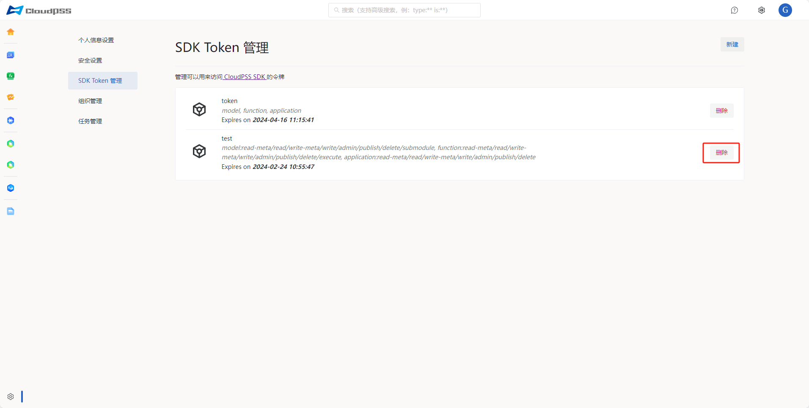

点击页面左下角的账户 `设置` 按钮，然后点击左侧的 `SDK Token 管理` 按钮，进入 SDK Token 管理页面。

## 新建 token 

按照以下步骤执行操作：

1. 点击页面右上角的 `新建` 按钮；弹出如下图所示列表按需填写。

2. 输入标记、选择时效、输入并检索角色、分配权限列表，点击 `生成` 按钮。
   
3. 弹出如下密码验证界面，输入密码；如果忘记了原密码，可以采用下方的其他验证方式，譬如邮箱/手机号/动态口令/WebAuthn；点击 `下一步`。

4. 密码验证通过，弹出 token 申请成功页面，复制所需 token 并关闭界面。

> 时效：1天/3天/30天/60天/90天/180天/360天

> 权限列表： model(SimStudio 操作权限)、function(FuncStudio 操作权限)、application(AppStudio 操作权限)

### model( SimStudio 操作权限)

+ read-meta 列出资源、读取元数据和权限数据

+ read 读取资源内容数据
  
+ write-meta 修改资源元数据
  
+ write 修改资源内容数据
  
+ admin 修改资源权限数据
  
+ publish 修改资源发布数据
  
+ delete 删除资源
  
+ submodule 读取模型接口信息，并作为子模块导入其他模型

### function( FuncStudio 操作权限)

+ read-meta 列出资源、读取元数据和权限数据

+ read 读取资源内容数据
  
+ write-meta 修改资源元数据
  
+ write 修改资源内容数据
  
+ admin 修改资源权限数据
  
+ publish 修改资源发布数据
  
+ delete 删除资源
  
+ excute 读取函数参数信息，并运行函数

### application( AppStudio 操作权限)

+ read-meta 列出资源、读取元数据和权限数据

+ read 读取资源内容数据
  
+ write-meta 修改资源元数据
  
+ write 修改资源内容数据
  
+ admin 修改资源权限数据
  
+ publish 修改资源发布数据
  
+ delete 删除资源

## 删除 token 

点击页面 token 右侧的 `删除` 按钮

