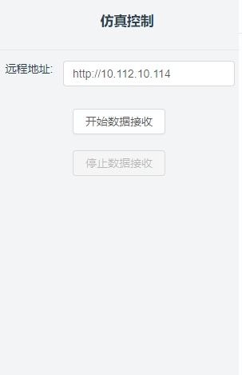
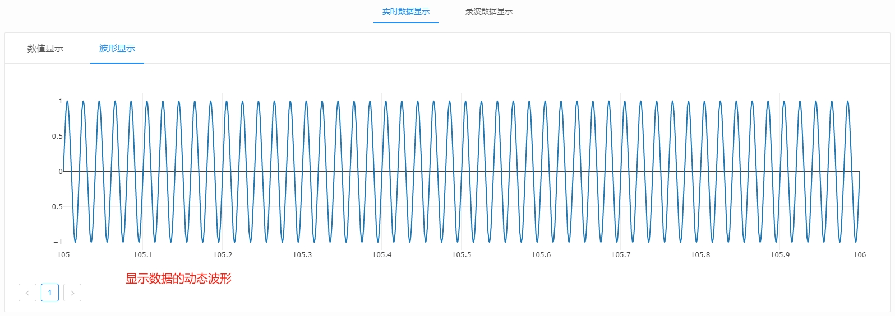
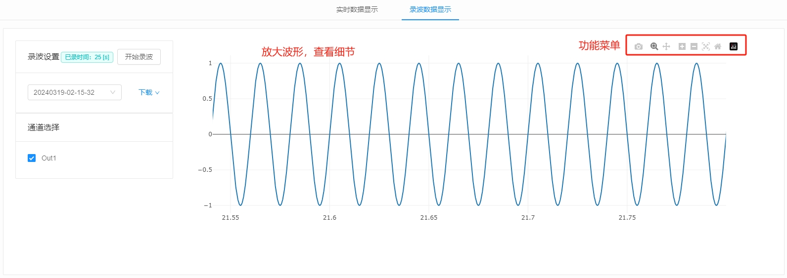
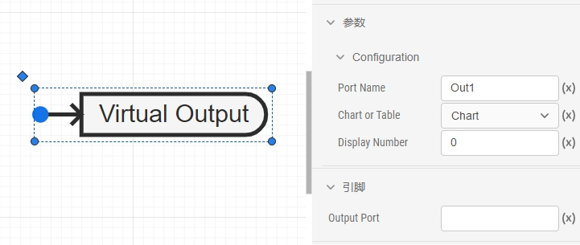
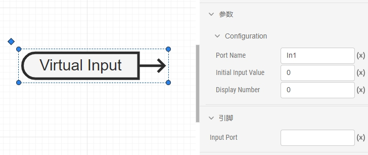
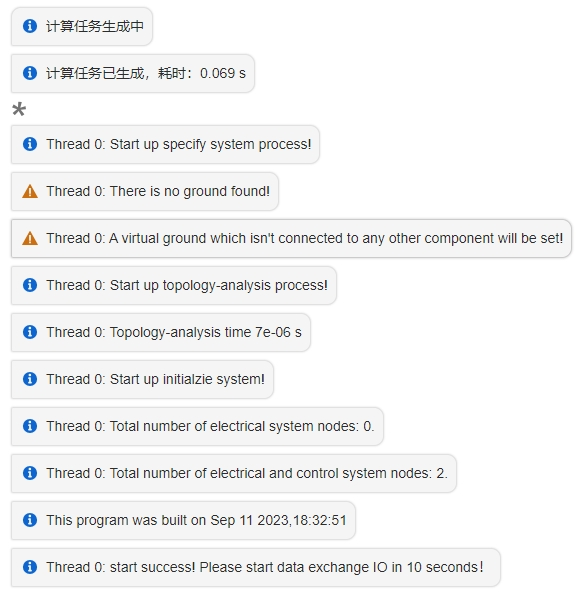
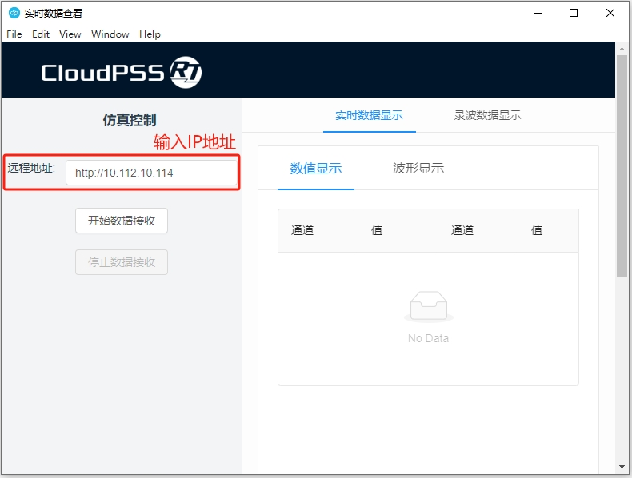
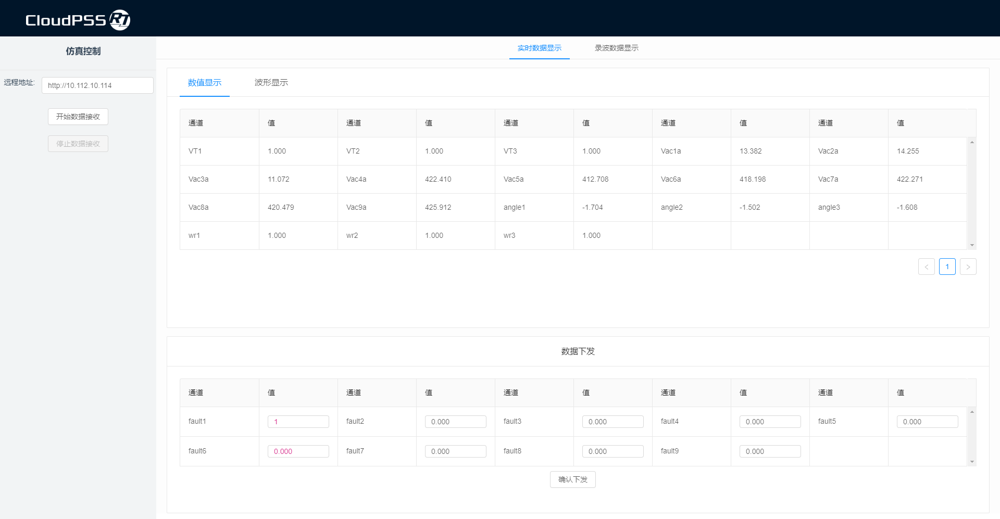
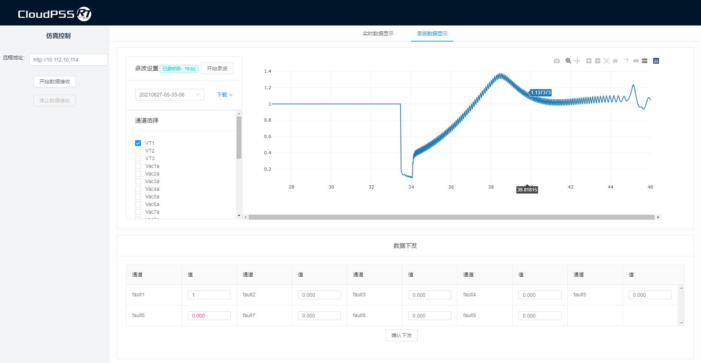
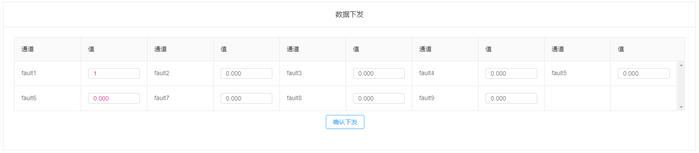

## 功能定义
本工具提供实时仿真的数据观测、数据录波和数据下发功能。

## 文档摘要
本节介绍实时数据查看器 CloudPSS Signal Monitor 的功能，并通过一个案例介绍它的使用方法。本工具需配合 CloudPSS-RT 实时仿真器使用，用于在实时仿真过程中监控数据和下发指令。

## 功能说明
### 主界面
实时数据查看器的主界面如图所示，可分为三大功能区，分别是**仿真控制**、**数据显示**和**数据下发**。  

其中，**数据显示**功能区又可以分为**实时数据显示**页面和**录波数据显示**页面。在**实时数据显示**页面，可以通过切换**数据显示**和**波形显示**两个子页面，查看数据的实时数值或动态波形。  

   

### 仿真控制
在实时仿真开始运行后，通过输入远程地址，连接指定的 CloudPSS-RT 服务器。点击**开始数据接收**，本工具会自动加载指定服务器上运行的实时仿真任务，并识别和列出任务模型中的所有**虚拟输出端口**和**虚拟输入端口**信号。

   

**虚拟输出端口**信号会在**数据显示**功能区中显示，**虚拟输入端口**信号会在**数据下发**功能区中显示，它们的定义以及添加方法将在下文中的**软件接口**中介绍。

### 实时数据显示
**数据显示**功能区包含**实时数据显示**页面和**录波数据显示**页面。

点击**开始数据接收**并成功连接到正在运行的实时仿真任务后，**实时数据显示**页面会显示任务模型中的所有**虚拟输出端口**信号。具体有两种显示方式：在**数值显示**子页面，显示数据的实时数值；在**波形显示**子页面，显示数据的动态波形，如下图所示。

   

   

**波形显示**的窗口长度固定为 1s，即在一个窗口内显示该数据 1s 内的波形。当鼠标悬停至波形上时，会显示数据通道的名称。

### 录波数据显示
切换到**录波数据显示**页面，可以对所有**虚拟输出端口**和**虚拟输入端口**的信号进行录波。

点击**开始录波**，会同时对所有通道进行录波。点击**停止录波**后，会自动生成录波文件。

选择录波文件，并勾选**通道选择栏**中相应通道的名称，可以在右侧查看录波波形。

   

在录波波形窗口的右上角，有一些功能菜单，可以放大、缩小波形或重置坐标轴，也可以使用鼠标框选放大波形，便于查看细节。

   

### 录波数据保存
在**录波数据显示**页面，选中录波文件后，可以点击右侧的**下载**按钮将录波文件保存到本地。下载的录波文件中包含所有通道的录波数据。

目前仅支持将录波文件保存为 CSV 格式。

   

### 数据下发
在**数据下发**功能区，会列出任务模型中的所有**虚拟输入端口**信号，并显示它们的当前值。

修改相应通道的值，并点击**确认下发**将数据指令下发到任务模型中。  

   

在数据录波的过程中，也可以进行数据下发。

### 软件接口  
本工具中，**数据显示**和**数据下发**功能区中列出的所有通道都与任务模型中的**虚拟输出端口**和**虚拟输入端口**一一对应。  

使用本工具观测实时仿真数据时，需要先在模型中添加端口元件。端口元件可在 **CloudPSS-实时仿真工具** 模型库中找到。

- 虚拟输出端口  

       

    **虚拟输出端口**可以将任务模型中的数据发送至 Signal Monitor 观测，需要设置的参数有：  

    - Port Name：虚拟输出端口的名称，也是在 Signal Monitor 中显示的名称，不可重复。  

    - Chart or Table：选择数据类型是曲线或者表格。  
    - Display Number：数据在 Signal Monitor 中显示的序号。  

- 虚拟输入端口

       

    **虚拟输入端口**可以将 Signal Monitor 中设置的参数数据下发到任务模型中，可用于在线修改模型中的参数或改变模型中一些元件的状态，如脉冲使能、控制切换、故障触发等。需要设置的参数有：  

    - Port Name：虚拟输入端口的名称，也是在 Signal Monitor 中显示的名称，不可重复。  

    - Initial Input Value：虚拟输入端口的初始值。  
    - Display Number：数据在 Signal Monitor 中显示的序号。  

**虚拟输入端口**用于控制，用法类似于离线仿真的**阶跃发生器**。**虚拟输出端口**用于观测，用法类似于离线仿真的**输出通道**。  

   

## 案例

import Tabs from '@theme/Tabs';
import TabItem from '@theme/TabItem';

<Tabs>
<TabItem value="case1" label="使用 Signal Monitor 触发一个故障并观测实时仿真数据">

- 在任务模型中添加虚拟输出端口和虚拟输入端口
  

- 实时仿真方案设置  
    
    在**运行**标签页，添加实时仿真方案。  

    设置实时仿真的开始时间、结束时间和积分步长。**开始时间**默认为 `0`，**结束时间**可以设置为一个较大的值。  

    当与外部设备（如 Signal Hub）通信时，模式选择为**从模式**。当仅用于观测数据或作为主机时，模式选择为**主模式**。  

       

- 点击启动任务运行仿真
   
   仿真启动成功后会出现如下报文。

       
    
    实时仿真中，不会显示**输出通道**的波形，仅能通过**虚拟输出端口**和 Signal Monitor 观测数据结果。

- 启动 Signal Monitor
    
    输入实时仿真器的 IP 地址。  

       

- 点击开始接收数据
    
    在**数据显示**功能区可以查看数据的实时数值和动态波形。

       

       

- 录波与数据下发
    在**数据显示**功能区的**录波数据显示**页面，点击开始录波。

       

    在**数据下发**功能区设置

   

</TabItem>
</Tabs>

## 常见问题
点击开始接收数据后，没有数据响应？
:   reload

点击下载录波数据后，没有响应？
:   

能否设置波形显示窗口长度或波形刷新频率？
:   