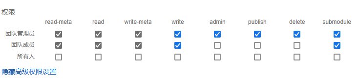

---

title: 应用权限介绍
description: CloudPSS 个人中心应用权限介绍补充文档
sidebar_position: 60

tags: 
- 个人中心

---

**CloudPSS** 应用分为 **SimStudio**、**AppStudio**、**FuncStudio** 三个基本应用，各自具有不同的权限划分，权限划分详情如下：

import Tabs from '@theme/Tabs';
import TabItem from '@theme/TabItem';

<Tabs>

<TabItem value="SimStudio" label="SimStudio 项目权限">

**SimStudio** 项目按人员权限划分为：

- **团队管理员**: admin

- **团队成员**: member

- **所有人（公开）**: everyone

**SimStudio** 项目按操作权限划分为：

+ **read-meta** 列出资源、读取元数据和权限数据

+ **read** 读取资源内容数据

+ **write-meta** 修改资源元数据

+ **write** 修改资源内容数据

+ **admin** 修改资源权限数据

+ **publish** 修改资源发布数据

+ **delete** 删除资源

+ **submodule** 读取模型接口信息，并作为子模块导入其他模型

</TabItem>

<TabItem value="AppStudio" label="AppStudio 项目权限">

**AppStudio** 项目按人员权限划分为：

- **团队管理员**: admin

- **团队成员**: member

- **所有人（公开）**: everyone

**AppStudio** 项目按操作权限划分为：

+ **read-meta** 列出资源、读取元数据和权限数据

+ **read** 读取资源内容数据

+ **write-meta** 修改资源元数据

+ **write** 修改资源内容数据

+ **admin** 修改资源权限数据

+ **publish** 修改资源发布数据

+ **delete** 删除资源

</TabItem>

<TabItem value="FuncStudio" label="FuncStudio 项目权限">

**FuncStudio** 项目按人员权限划分为：

- **团队管理员**: admin

- **团队成员**: member

- **所有人（公开）**: everyone

**FuncStudio** 项目按操作权限划分为：

+ **read-meta** 列出资源、读取元数据和权限数据

+ **read** 读取资源内容数据

+ **write-meta** 修改资源元数据

+ **write** 修改资源内容数据

+ **admin** 修改资源权限数据

+ **publish** 修改资源发布数据

+ **delete** 删除资源

+ **excute** 读取函数参数信息，并运行函数

</TabItem>

</Tabs>

