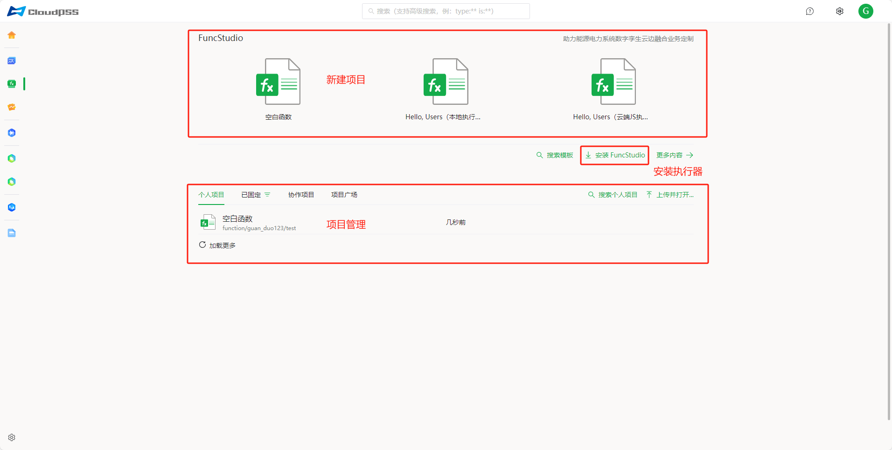
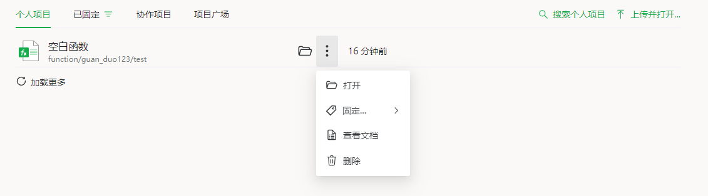
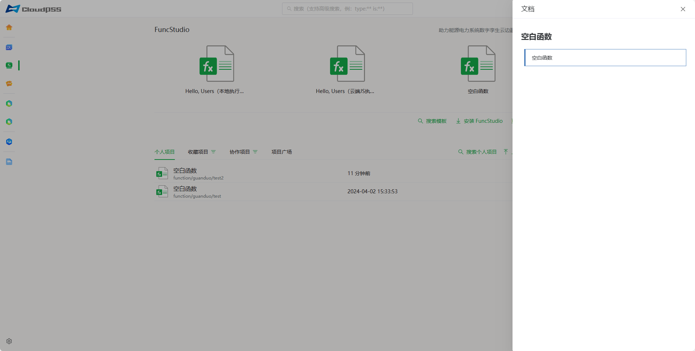
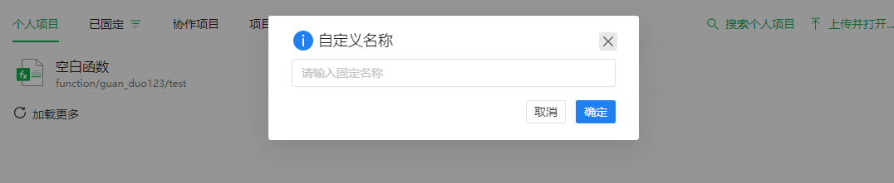
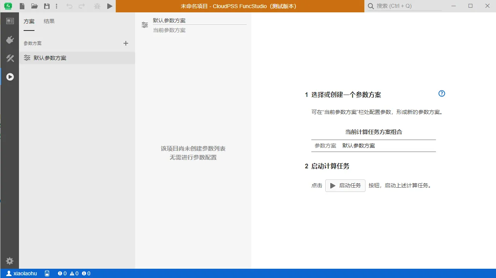
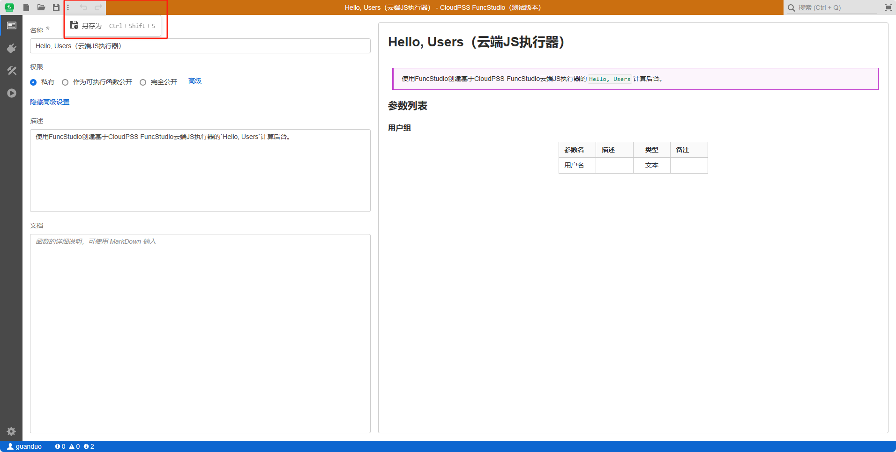
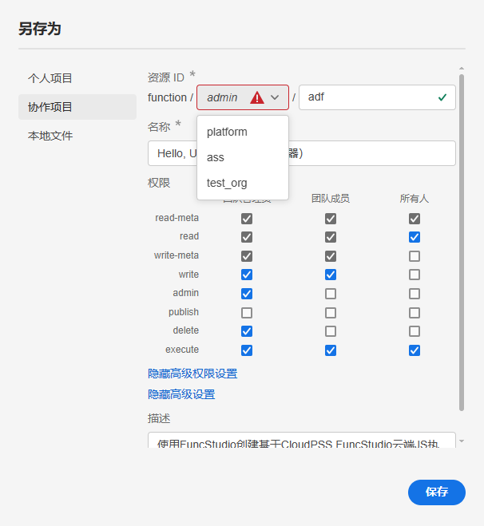
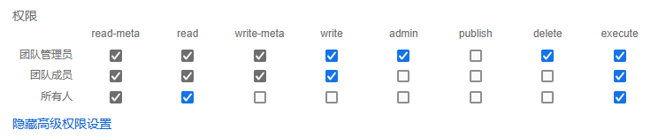

---

title: FuncStudio 应用介绍
description: CloudPSS 个人中心 FuncStudio 应用介绍
sidebar_position: 20

tags: 
- 个人中心

---

用户成功登录后，在 **CloudPSS** 主页点击 **FuncStudio** 的图标后，页面将跳转至**FuncStudio 个人中心**，如图所示。该界面包含新建项目、项目管理、执行器下载等。

## 功能介绍

### 新建项目

该区域包含：

+ **模板案例**：包括**空白函数**、**Hello,Users(本地执行器)**、**Hello,Users(云端JS执行器)**。点击进入工作台并自动打开该项目。
+ **更多内容**： 打开一个新的页面（进入工作台）并自动创建一个新的项目。
+ **搜索模板**：打开全局搜索并自动填充(type:function is:template)，详情查看[高级搜索功能](../../others/advanced-search/index.md "高级搜索功能")

### 项目管理

该区域包含：

+ **个人项目**：显示用户权限为私有的个人项目。

+ **已固定**：显示存储已固定的个人项目。
  
+ **协作项目**：显示组织内合作的项目。

+ **项目广场**：显示权限为公开的全部项目。

+ **加载更多**：加载下一页项目。
  
+ **搜索个人项目/固定项目/协作项目/项目广场**：用于打开全局搜索。

+ **上传并打开**：用于打开保存在本地的项目文件( **cnfc** 格式文件)。  

鼠标移至任一个人项目文件，会显示**打开**和**更多选项**操作按钮，可对项目文件进行**打开**、**查看文档**（可以通过点击该项目快速查看）、**固定**（仅限个人项目）、**取消固定**（仅限已固定项目）、**删除**（仅限个人项目）等操作，如图所示。

在项目文件上点击**打开**按钮，会跳转到工作台页面并打开该函数项目。

在项目文件上点击**查看文档**按钮，页面右侧会出现该项目的文档描述。

 
在项目文件上选择**固定**按钮，会出现**固定**、**已固定的列表**、**自定义名称**（例如：test 列表），点击**固定**按钮就会把当前项目文件加入默认收藏列表，点击已固定的列表（例如：test 列表）会把当前项目文件加入该固定列表，点击**自定义名称**创建新的固定列表。

## 案例介绍

### 执行器下载

执行一个构建好的函数项目，首先要给其分配执行器，因此，需要在本地安装 **FuncStudio** 的执行器，点击**安装 FuncStudio**按钮下载程序按照引导逐步安装完成即可。执行器的工作页面和 **FuncStudio** 的工作台一致，也可以在执行器内实现函数，如下图所示：

打开并登录执行器后，系统状态栏中会出现一个 **FuncStudio** 执行器的小图标，如下图所示：

### 编辑配置文件

右击系统状态栏中 **FuncStudio** 执行器的小图标，选择**编辑配置文件**的选项，点击后打开配置文件进行编辑，如下图所示：

对于公网平台用户，配置文件如下图所示，安装时已默认完成配置，用户无需自行更改。

对于 **CloudPSS-Mini** 用户，需要将配置文件的 **HOME_URL** 配置为 **CloudPSS-Mini** 的 **IP地址** 如下图所示：

对于非公网用户，如：**internal** 用户，需要将配置文件的 **HOME_URL** 配置为 `https://internal.cloudpss.net/`，如下图所示：

### 协作项目

协作项目是组织内成员间可共享的项目资源。以下案例以 **Hello, Users（云端JS执行器）**为例：

1. 打开 **FuncStudio**，找到并打开 **Hello, Users（云端JS执行器）函数**算例。

2. 对函数进行所需修改后，选择**另存为**以保存修改。键盘快捷操作：**Ctrl + Shift + S**

3. 在保存过程中，选定**协作项目**选项。在资源 ID 的**所有者**一栏中选择您的**协作组织**（默认设置为个人账户）。完成选择后，点击**保存**。

4. 保存成功之后，您所在组织的其他成员便可以在协作项目中访问并查看此项目。

## 常见问题

### **FuncStudio** 协作项目权限如何划分？

**FuncStudio** 协作项目按人员权限划分为：

- **团队管理员**: admin

- **团队成员**: member

- **所有人（公开）**: everyone

**FuncStudio** 协作项目按操作权限划分为：

+ **read-meta** 列出资源、读取元数据和权限数据

+ **read** 读取资源内容数据
  
+ **write-meta** 修改资源元数据
  
+ **write** 修改资源内容数据
  
+ **admin** 修改资源权限数据
  
+ **publish** 修改资源发布数据
  
+ **delete** 删除资源
  
+ **excute** 读取函数参数信息，并运行函数

