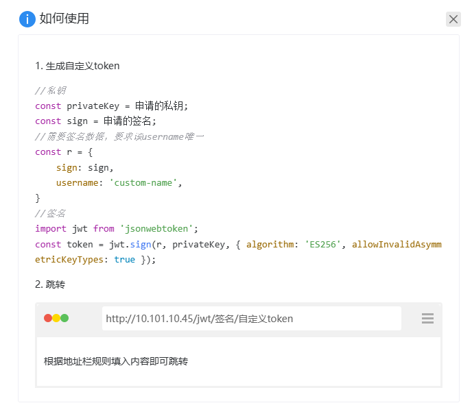

:::tip
此页面需要系统管理员权限。
:::

点击页面左下角的账户**设置**按钮，然后点击左侧的**自定义认证证书管理**按钮，进入自定义认证证书管理页面。


## 使用指南

点击**如何使用**查看使用指南。如下图所示：

1. **生成自定义token**

```ts showLineNumbers
//私钥
const privateKey = 申请的私钥;
const sign = 申请的签名;
//需要签名数据，要求该username唯一
const r = {
    sign: sign,
    username: 'custom-name',
}
//签名
import jwt from 'jsonwebtoken';
const token = jwt.sign(r, privateKey, { algorithm: 'ES256', allowInvalidAsymmetricKeyTypes: true });
```

2. **跳转链接**

构建 **ip 地址 + 签名 + 自定义 token** 的页面链接跳转，例如：`http://10.101.10.45/jwt/签名/自定义token`



## 其他操作

### 复制签名

点击页面签名右方的**复制签名**按钮，当前签名进入剪贴板。

### 复制公钥

点击页面签名右方的**复制公钥**按钮，当前公钥进入剪贴板。

### 复制私钥

点击页面签名右方的**复制私钥**按钮，当前私钥进入剪贴板。

### 删除

点击页面签名右方的**删除**按钮。