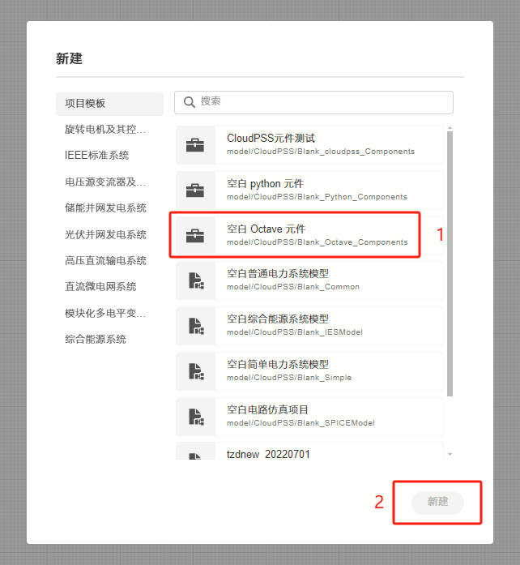
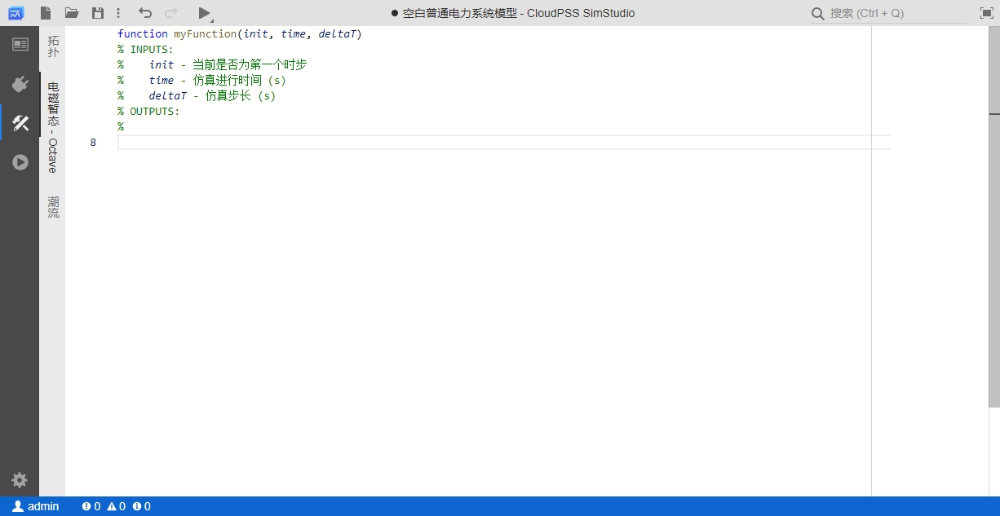

## 功能定义
该功能支持使用 MATLAB/Octave 语言构建自定义电磁暂态仿真元件。

## 文档摘要
本节介绍自定义 Octave 元件的创建和调用方法，并通过 3 个案例介绍自定义 Octave 元件的使用方法。阅读该文档，用户需熟悉 MATLAB/Octave 语言的基本语法。该功能仅支持在 EMTLab 平台使用。

## 功能说明
### 创建元件
#### 方法1 直接创建 Octave 元件
在 EMTLab 工作台中，点击**新建**按钮，在弹出的向导窗口中选择**空白 Octave 元件**模板，点击新建按钮，新建元件，如下图所示。

#### 方法2 从已有算例修改为 Octave 元件
选择已有算例中，选择**总览**标签页，将**模型类型**切换为**元件**。

此时，在**实现**标签页中将出现**拓扑**、**电磁暂态**等子标签页。选中**电磁暂态**子标签页，点击**创建电磁暂态 Octave 控制实现**按钮，即可创建 Octave 用户自定义控制元件。

创建成功后，在**电磁暂态**子标签下将会出现 Octave 代码编辑器。

### 参数、引脚设置
自定义 Octave 元件的参数、引脚设置与其它用户自定义元件类似，在**接口**标签页中进行配置，可以参考[模块封装](https://docs.cloudpss.net/simstudio/features/Basic/Mask)。

### 代码编辑
切换到**实现**标签页，选择**电磁暂态**标签，跳转到电磁暂态元件代码编辑窗口。

此时，如果已定义好元件的参数和引脚，它们的键名会自动识别并列出。同时，EMTLab 已提供了三个内置变量，分别是 **init**（当前是否为第一个时步）、**time**（仿真进行时间）和 **deltaT**（仿真步长），用户可以直接使用这三个变量参与控制逻辑实现。

用户可以在代码编辑器中以 **args.键名**的形式调用自定义的元件参数，也可以通过 **global** 的方式定义全局变量，用于在时步之间传递数据。

模型编写时需要给所有输出引脚赋值。

### 调用方式
3 种调用方式，分别是 每时步触发、内部触发、外部触发

## 案例

本文档提供 3 个案例，分别是...

import Tabs from '@theme/Tabs';
import TabItem from '@theme/TabItem';

<Tabs>
<TabItem value="case1" label="案例 1">

简单控制元件，每时步触发

案例1：简单控制元件，每时步触发，重点讲述基础用法。

本节以一个可调斜率和分段点的分段函数，展示 Octave 元件的创建和使用方法。

#### 新建 Octave 元件  

在 CloudPSS SimStudio 工作台，点击左上角的`新建`，在弹出的窗口中，选择项目模板下的**空白 Octave 元件**。点击窗口右下角的新建按钮，即可完成新建。

#### 参数与引脚定义

元件的参数与引脚类型可参考[参数及引脚体系](/docs/docs/software/xstudio/simstudio/basic/parameterSystem/index.md)帮助文档，参数与引脚的添加和设置方法可参考[模块封装](/docs/docs/software/xstudio/simstudio/basic/moduleEncapsulation/index.md)帮助文档。    
  

本例中需要用到的可设置参数有第一段函数斜率 *k1*、第二段函数斜率 *k2*、分段点横坐标 *a* 和分段点纵坐标 *b*。 在`接口标签页`的参数列表定义中作如下设置。  

本例中需要用到的引脚有一个输入引脚和一个输出引脚。在`接口标签页`的引脚列表定义中作如下设置。

#### 元件图形设计

在元件图形设计窗口绘制元件图标，并添加两个引脚，分别与input和output绑定。

#### 编辑代码

切换到`实现标签页`，选择`电磁暂态`标签，跳转到电磁暂态元件代码编辑窗口。此时，由于已经定义好元件的参数和引脚，它们的键名会自动识别并列出。

CloudPSS SimStudio已提供了三个内置变量，分别是 *init* （当前是否为第一个时步）、 *time* （仿真进行时间）和 *deltaT* （仿真步长），用户可以直接使用这三个变量参与控制逻辑实现。

将可调斜率和分段点的分段函数代码填入代码编辑窗口。

注意变量名称为`args.键名`的形式。

#### 元件名称与权限设置

切换到`总览标签页`，输入元件的名称，并设置元件的`权限`和`元件标签`。权限设置为`私有`时，该元件仅用户自己可见；设置为`公开`时，该元件会出现在项目广场中，所有用户可见。`元件标签`为该模块在模型库中的分组。

保存的元件可以在设置的元件标签中查找，也可通过搜索查找。

#### 效果展示

至此，一个使用 Octave 语言的分段函数元件构建完成。可以新建一个`普通项目`，在对应的`元件标签`中找到该元件，并验证仿真结果。

</TabItem>

<TabItem value="case2" label="案例 2">

带有全局变量的控制元件，固定频率触发式

</TabItem>

<TabItem value="case3" label="案例 3">

多维输入、多维输出控制元件，外部触发式

</TabItem>
</Tabs>

## 常见问题
我同时设置了一个元件的“拓扑”和“电磁暂态”的两种实现方法，为什么“拓扑”中的内容没有正确地生效？
:   需要注意的是，在存在“电磁暂态”标签页的具体实现时，“拓扑”的实现方法将会失效。用户可以右键选择“电磁暂态”的子标签，并选择“删除”按钮，删除Octave的元件实现方法，保留“拓扑”实现方法，如下图所示。当然，也可以根据用户需要，自行选择需要保留的实现方法类型。

    

带有Octave元件的算例运行很慢？
:   对于含有 octave 元件的算例，在仿真的过程中每个时步都需要调用 octave 的解释器，导致仿真速度较慢。用户可以根据需求，选用拓扑模块封装等速度更快的方式进行模块构建。

仿真运行报错："The function belongs to the image package from Octave Forge which seems to not be installed in your system."
:   

为什么使用 disp() 函数没有效果？
:   暂不支持在前台输出 disp() 结果。