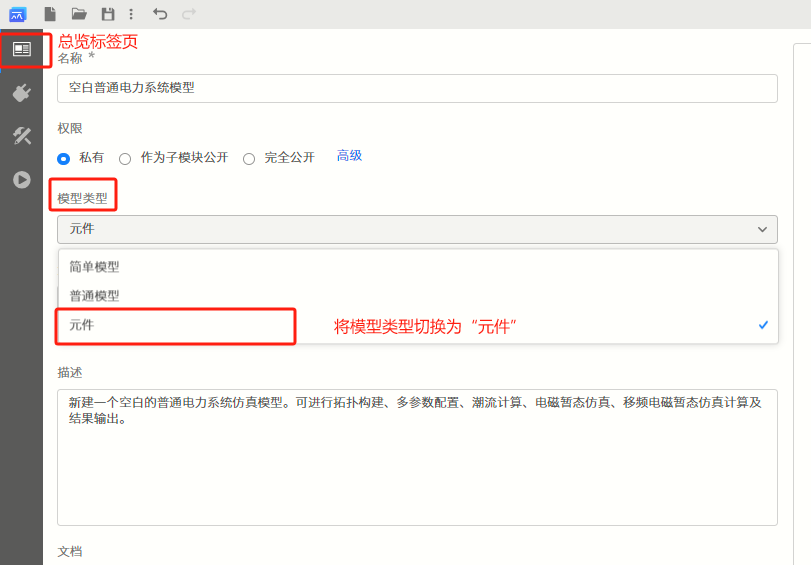
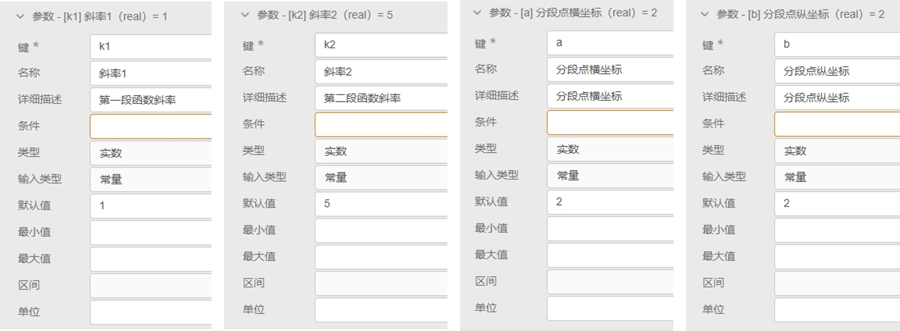
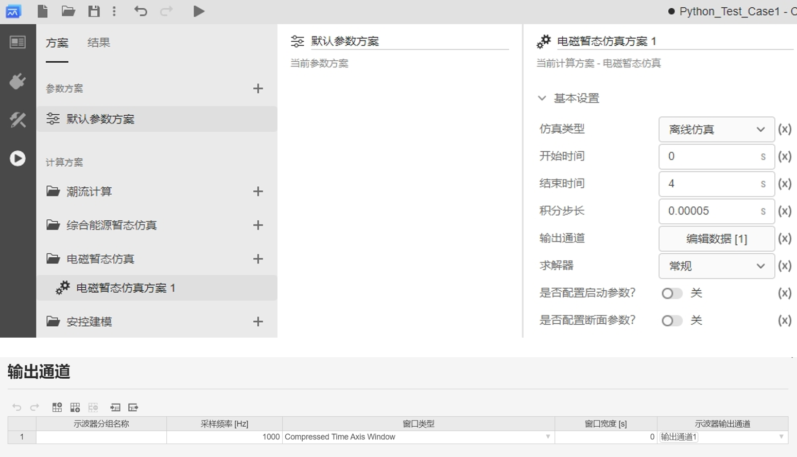
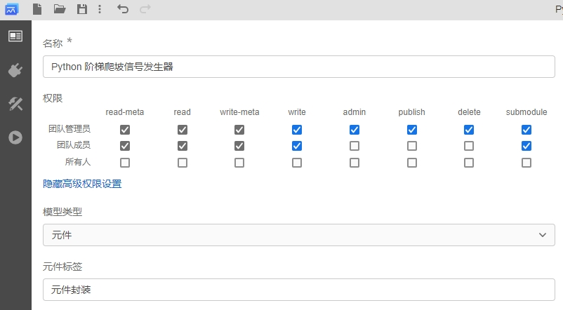
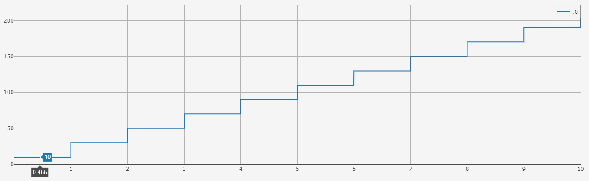

## 功能定义
该功能支持使用 Python 语言构建自定义电磁暂态仿真元件。

## 文档摘要
本文档介绍自定义 Python 元件的创建和调用方法，并通过 3 个案例介绍自定义 Python 元件的使用方法。阅读该文档，用户需熟悉 Python 的基本语法。该功能仅支持在 EMTLab 平台使用。

公网试用平台暂不支持自定义 Python 元件。

## 功能说明
### 创建元件
#### 方法1 直接创建 Python 元件
在 EMTLab 工作台中，点击**新建**按钮，在弹出的向导窗口中选择**空白 Python 元件**模板，点击新建按钮，新建元件，如下图所示。


#### 方法2 从已有算例修改为 Python 元件
在已有算例中，选择**总览**标签页，将**模型类型**切换为**元件**。



此时，在**实现**标签页中将出现**拓扑**、**电磁暂态**等子标签页。选中**电磁暂态**子标签页，点击**创建电磁暂态 - Python 实现**按钮，即可创建 Python 用户自定义控制元件。


创建成功后，在**电磁暂态**子标签下将会出现 Python 代码编辑器。


### 参数、引脚设置
自定义 Python 元件的参数、引脚设置与其它用户自定义元件类似，在**接口**标签页中进行配置。参数、引脚的类型和定义可以参考[模块封装](https://docs.cloudpss.net/simstudio/features/Basic/Mask)。

参数、引脚定义后，将在代码编辑中作为变量被调用。


### 代码编辑
切换到**实现**标签页，选择**电磁暂态**子标签，跳转到电磁暂态元件代码编辑窗口。

此时，如果已定义好元件的参数和引脚，它们的键名会自动识别并列出。同时，EMTLab 已提供了三个内置变量，分别是 `init`（当前是否为第一个时步）、`time`（仿真进行时间）和 `deltaT`（仿真步长），用户可以直接使用这三个变量参与控制逻辑实现。

用户可以在代码编辑器中以 `args["键名"]` 的形式调用自定义的元件参数，也可以通过 `global` 的方式定义全局变量，用于在时步之间传递数据。

代码编写时，使用 **return** 语句返回要输出的值，返回值为列表类型，列表中元素的数量需要与输出引脚数量一致。


### 调用方式
自定义 Python 元件根据触发方式的不同可分为 3 种，分别是：每时步触发、固定频率触发和外部触发。

- **每时步触发**：  
    即仿真运行的每个时步都会调用 Python 元件，与其它常规元件的调用方式一致。

- **固定频率触发**：  
    当需要以某一固定频率调用 Python 元件时，可以使用 EMTLab 提供的内置参数 **Trigger**，参数类型为**实数**，含义为**触发频率**。该参数需要用户在参数列表手动添加后才能修改，否则默认为每时步触发。

    在**接口**标签页的参数列表定义栏，新建一个参数，设置其键名为 **Trigger**，详细描述为“触发频率”，类型为**实数**，如下图所示。
  
    

    在元件参数面板修改 Trigger 的值后，Python 元件将按所设置的触发频率被调用。

- **外部触发**：
    当需要用一个外部信号触发来调用 Python 元件时，可以将 EMTLab 提供的内置参数 **Trigger** 的参数类型需设为**虚拟引脚**，虚拟引脚的连接类型为**输入**，含义为**外部触发信号输入端口**，需要注意，这个信号为**上升沿触发**。该参数需要用户在参数列表手动添加后才能生效，否则默认为每时步触发。

    在**接口**标签页的参数列表定义栏，新建一个参数，设置其键名为 **Trigger**，详细描述为“外部触发信号输入端口（上升沿触发）”，类型为**虚拟引脚**，连接类型为**输入**，如下图所示。

        
    
    在元件参数面板的 Trigger 栏填入 **@前缀**的控制信号，Python 元件将按该信号的上升沿触发被调用。


## 案例
本文档提供 3 个案例：
- 案例 1：每时步触发的简单 Python 控制元件；
- 案例 2：固定频率触发的并带有全局变量的 Python 控制元件；
- 案例 3：外部触发的含多维输入、多维输出的 Python 控制元件。

import Tabs from '@theme/Tabs';
import TabItem from '@theme/TabItem';

<Tabs>
<TabItem value="case1" label="案例 1">

**简单控制元件，每时步触发**

本案例以一个可调斜率和分段点的分段函数，展示 Python 元件的创建和使用方法。

- 新建 Python 元件  

    在 SimStudio 工作台，点击左上角的**新建**，在弹出的窗口中，选择项目模板下的**空白 Python 元件**。点击窗口右下角的新建按钮，即可完成新建。

    

- 参数与引脚定义

    在**接口**标签页的参数列表定义栏新建一个参数组，并新建参数。本例中需要添加的参数有：第一段函数斜率 **k1**、第二段函数斜率 **k2**、分段点横坐标 **a** 和分段点纵坐标 **b**。可如下图所示新建参数。

    

    在**接口**标签页的引脚列表栏新建引脚。本例中需要添加的引脚有：输入引脚 **input** 和输出引脚 **output** 。可如下图所示新建引脚。

    

-  元件图形设计
    
    在**接口**标签页的元件图形设计窗口绘制元件图标，并添加两个引脚，分别与 input 和 output 绑定。

    

- 代码编辑

    切换到**实现**标签页，选择**电磁暂态**子标签，跳转到 Python 元件代码编辑窗口。此时，由于已经定义好元件的参数和引脚，它们的键名会自动识别并列出。

    

    在代码编辑窗口编写可调斜率和分段点的分段函数代码：

    ```
        if input < args["a"]:
            output = args["k1"] * input + args["b"] - args["k1"] * args["a"] 
        else:        
            output = args["k2"] * input + args["b"] - args["k2"] * args["a"]

        return[output]
    ```
    
    注意代码的缩进，注意变量名称为 `args["键名"]` 的形式。
    
    

- 元件名称与权限设置

    切换到**总览**标签页，输入元件的名称，并设置元件的**权限**和**元件标签**。
    
    
    
    保存的元件可以在设置的元件标签中查找，也可通过搜索查找。

至此，一个使用自定义 Python 功能的分段函数元件构建完成。可以新建一个**普通项目**，在对应的**元件标签**中找到该元件，验证其控制效果。

- 控制效果验证

    新建一个普通项目，调用 Python 分段函数元件。在其输入引脚连接一个**时间输入**元件，在其输出引脚连接一个**输出通道**观测输出结果。
 
    

    

    配置电磁暂态仿真方案和输出通道，运行电磁暂态仿真，得到如下图所示结果。曲线的分段点和斜率与设置参数一致。
    
    

</TabItem>

<TabItem value="case2" label="案例 2">

**带有全局变量的控制元件，固定频率触发**

本案例以一个阶梯爬坡信号发生器，展示带有全局变量且固定频率触发的 Python 元件的创建和使用方法。

- 新建 Python 元件  

    在 SimStudio 工作台，点击左上角的**新建**，在弹出的窗口中，选择项目模板下的**空白 Python 元件**。点击窗口右下角的新建按钮，即可完成新建。

    

- 参数与引脚定义
      
    在**接口**标签页的参数列表定义栏新建参数。
    
    本例为固定频率触发式 Python 元件，因此在参数定义时需要添加键名为 **Trigger** 的参数，设置固定触发频率。
    
    此外，还需要添加的参数有：初始值 **InitValue** 和爬升高度 **Step**。新建参数后，参数列表如下图所示。

    

    在**接口**标签页的引脚列表栏新建引脚。本例中需要添加的引脚为：输出引脚 **output** 。可如下图所示新建引脚。

    

-  元件图形设计
    
    在**接口**标签页的元件图形设计窗口绘制元件图标，并添加引脚，与 output 绑定。

    

- 代码编辑

    切换到**实现**标签页，选择**电磁暂态**子标签，跳转到 Python 元件代码编辑窗口。此时，由于已经定义好元件的参数和引脚，它们的键名会自动识别并列出。

    

    在代码编辑窗口编写阶梯爬坡信号实现的代码：

    ```
        global StepMemory
        output = StepMemory
        StepMemory = output + args["Step"]
        return [output]

    StepMemory = args["InitValue"]
    ```
    
    注意代码的缩进，注意变量名称为 `args["键名"]` 的形式。代码中的 `StepMemory` 为全局变量，可存储每次调用 Python 时所赋的值，注意全局变量的初值需在函数外定义。
    
    

- 元件名称与权限设置

    切换到**总览**标签页，输入元件的名称，并设置元件的**权限**和**元件标签**。
    
    
    
    保存的元件可以在设置的元件标签中查找，也可通过搜索查找。

至此，一个带有全局变量并使用固定频率触发的 Python 元件构建完成。可以新建一个**普通项目**，在对应的**元件标签**中找到该元件，验证其效果。

- 效果验证

    新建一个普通项目，调用 Python 阶梯爬坡信号发生器元件。在其参数面板设置**触发频率**为 1 Hz，**初始值**为 10，**爬升高度**为 20。在其输出引脚连接一个**输出通道**观测输出结果。
 
    

    

    配置电磁暂态仿真方案和输出通道，运行电磁暂态仿真，得到如下图所示结果。元件的输出从 10 开始，每 1 秒爬升 20，与设置参数一致。
    
    

</TabItem>

<TabItem value="case3" label="案例 3">
多维输入、多维输出控制元件，外部触发式
</TabItem>
</Tabs>


## 常见问题
仿真运行报错："compile python code failed"
:

仿真运行报错："python module return type error"
:

仿真运行报错："execute python module failed"
:
为什么使用 print() 函数没有效果？
:   暂不支持在前台输出 print() 结果。


return
如果函数没有return语句，它会自动返回None。
当使用return语句返回多个值时，使用逗号分隔值，而不是使用空格（元组）。
在函数中使用return语句可以提前结束函数的执行，在使用时要谨慎，确保在需要时才使用它。
循环中使用return语句，会导致函数在第一次迭代时退出，并不执行完整个循环。
在使用return语句时，要注意缩进。