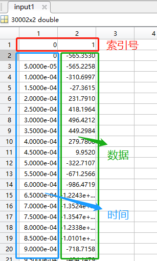
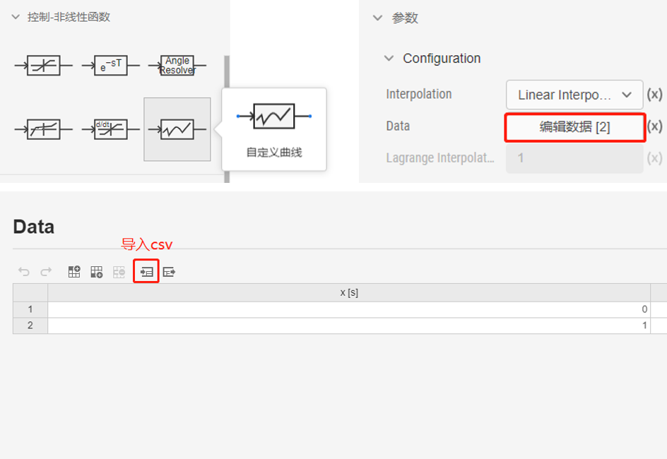

## 功能定义


## 文档摘要
EMTLab 支持将封装的二进制模型导入平台，构建 S-Function 元件。本节主要介绍自定义 S-Function 元件的的创建和使用方法。


## 功能说明

S-Function 实现具有以下几个功能特点：

- 控制模型构建方便、高效，可降低模型搭建和参数校验的时间成本。  
  
- 控制策略与真实控制器的保持高度一致，仿真结果更接近实际情况。  
  
- 控制器开发者不需要公开具体的控制策略和核心算法，具备保密性。

### 适用模型
该功能适用于 Linux 64 位系统环境下编译生成的 `.so` 文件。  

#### 编译来源：  

1. MATLAB/Simulink 编译生成 S-Function 时自动生成的代码文件。  

2. 用户自定义函数和接口的代码文件。  

### 整体流程


用户可将 Simulink 白箱模型封装成 S-Function 子系统，利用 MATLAB 的自动代码生成功能，得到 `.c` 和 `.h` 文件，在 Linux 环境中编译生成 `.so` 文件；也可以提供包含自定义函数和接口的二进制文件，在Linux 环境中再编译，生成 `.so` 文件。  

用户需要获取 S-Function 子系统或自定义代码文件的**全局参数**、**输入/输出接口信息**，并根据信息构建 CloudPSS 的前台元件，即定义元件的**参数**、**引脚**和**图形**。  

导入 `.so` 文件，与前台元件关联后，即完成 S-Function 元件的构建。

### 具体步骤

若编译来源是 **MATLAB/Simulink 自动生成代码**，请参见**白盒模型 S-Function 实现的具体步骤**。若编译来源是**用户自定义函数和接口代码**，请参见**黑盒模型 S-Function 实现的具体步骤**。


import DocCardList from '@theme/DocCardList';

<DocCardList />


### 调试方法

#### 步骤 1：获取 S-Function 正常运行时的输入数据  

- a. 添加示波器

闭环运行原模型，使用示波器观测 S-Function 所有输入引脚。  

   

- b. 保存数据  

设置示波器保存数据到 MATLAB 工作区。

   

#### 步骤 2：数据处理并导出为 .csv 格式文件 

- a. 数据处理  

在 MATLAB 中处理示波器保存的数据，将每一路引脚的数据按照第一列时间、第二列数据的方式另存。  

:::tip
每组数据的第一行添加一个索引号，第一列是 `0`，第二列是 `1`（将数据导入 CloudPSS 时的识别需要）。
:::  

   

- b. 导出 .csv  

使用 `dlmwrite` 命令将每路输入引脚的数据导出为 `.csv` 格式，命令参考如下：

```
dlmwrite('input1.csv', input1, 'delimiter', ',', 'precision', 9);  
```
:::warning
为保证导出的 `.csv` 文件中数据的精度，请使用 `dlmwrite` 而不使用 `csvwrite`。
:::  

#### 步骤 3：利用 CloudPSS 自定义曲线元件导入 .csv 格式文件 

- a. 自定义曲线元件导入 .csv   

使用 **CloudPSS 控制-非线性函数**库中的**自定义曲线**元件，在元件参数面板的`编辑数据`中直接导入刚才生成的 `.csv` 文件。  

   

- b. 数据输入  

自定义曲线的输入是**控制-基础**库中的**时间输入**元件，输出连到 S-Function 元件的对应引脚。  

     

#### 步骤 4：对比开环测试结果  

- a. 将 S-Function 元件的所有输入引脚都以 .csv 导入的形式输入数据。

- b. 在运行标签页中，设置与生成 S-Function 时固定步长相同的积分步长。  

- c. 根据输入数据的长度，设置合适的仿真结束时间，运行仿真得到开环测试结果。

## 案例

本文档提供了一个白盒模型 S-Function 实现的案例。

import Tabs from '@theme/Tabs';
import TabItem from '@theme/TabItem';

<Tabs>
<TabItem value="case1" label="三相整流器控制的 S-Function 实现">
- 封装白盒模型
- 自动代码生成
- 编译生成 .so
- 构建前台元件
- 开环测试
- 闭环测试
</TabItem>
</Tabs>


## 常见问题
如何设置控制器的采样步长？
:   

如何选择控制器求解的积分方式？
:   

如何输入矩阵类型的参数？
:   
