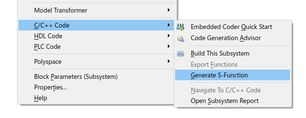

## 文档摘要
本文档介绍白盒模型 S-Function 实现的具体步骤。

## 实现步骤

### 步骤 1. 将 Simulink 模型封装为 S-Function 并自动生成代码

#### a. 解算器设置

模型设置为固定步长，解算器设置为 `discrete`，确保模型在当前设置下能正常运行。  


CloudPSS 中的系统均为离散系统，因此建议 S-Function 也使用离散解算器。
:::warning
**若 S-Function 子系统中存在难以离散化的连续状态，可选用连续积分解算器，目前支持的有 ode1、ode2、ode3、ode4、ode5 和 ode8**，不同的积分方式会影响仿真结果准确度和仿真计算时间。
:::

#### b. 子系统封装

将控制模型封装为一个子系统。子系统中可以引用全局参数，若子系统的顶层有参数封装，并且希望这些参数在生成 S-Function 后可调，请将这些参数也通过全局参数定义，否则将被视为固定值而不可调。  

  

例如上图中，`Parameter1` 与 `Parameter2` 分别用全局参数 `a` 和 `b` 定义，则在生成 S-Function 后，这两个参数仍可在子系统顶层设置，而 `Parameter3` 为固定值 `0`，在生成 S-Function 时将以固定值写入。
:::warning
S-Function 参数必须以字母开头（不能是数字或下划线），目前仅支持 **double** 型，若是一个矩阵，在 CloudPSS 中对应表格型参数。
:::

#### c. 生成 S-Function  

右键子系统，依次选择 `C/C++ Code`、`Generate S-Function` 选项。

  

#### d. 设置 S-Function 参数

勾选列出的全局参数中需要可调的，未勾选的参数将以固定值写入。

  

#### e. S-Function 自动代码生成

自动代码生成，`sfcn_rtw` 文件夹中包含 `.c` 与 `.h` 文件。

 

:::tip
若提示无编译器，则下载并安装一个 **MingGW64** 编译器，流程可参考：  `https://zhuanlan.zhihu.com/p/359962279?ivk_sa=1024320u`
:::

 


### 步骤 2. 在 Linux 环境编译生成 .so 文件

在 [步骤 1](#步骤1) 生成的 `sfcn_rtw` 文件夹中找到以 S-Function 名称命名的 `.c` 文件，在 #include 之后添加如下接口定义并保存：
```c
#define ssSetInputPortVectorDimension(S, port, d)   \
  (ssSetInputPortWidth(S, port, d))
#define ssSetOutputPortVectorDimension(S, port, d)   \
  (ssSetOutputPortWidth(S, port, d))
```
:::warning
此函数定义是为识别 S-Function 的输入输出引脚，若每个输入输出引脚维数均为 1，则不用添加；若有引脚维数大于 1，则必须添加。
:::

将 `sfcn_rtw` 文件夹复制到 Linux 环境，在其路径下输入以下编译命令：

```
gcc -Wall -DRT -DRT_MALLOC -fPIC -lm -shared *.c -o xxxx.so
```  
:::warning
`xxxx` 为用户自定义的 `.so` 文件名，与内部函数名（S-Function 名）无关。Linux 环境必须是 64 位系统。
:::

如报错缺少 `.h` 头文件，需要手动添加。不同版本的 MATLAB 所调用的头文件不同，获取路径可参考：

```
安装路径\MATLAB\Rxxxxx\simulink\include
安装路径\MATLAB\Rxxxxx\extern\include
安装路径\MATLAB\Rxxxxx\rtw\c\src
```  
:::tip
`xxxxx` 为 MATLAB 版本。
:::  
  
### 步骤 3：根据全局参数和输入输出接口信息构建 S-Function 实现元件  

#### a. 参数引脚列表定义  

打开空白 S-Function 模型模板，在`接口标签页`参数列表添加参数，引脚列表添加引脚，并绘制元件图形。参数键名必须与 S-Function 引用的全局参数名一致；引脚键名不作要求，但顺序必须分别与 S-Function 的输入输出引脚一致。  

   

#### b. 导入 .so 文件  

在`实现标签页`导入步骤2生成的 `.so` 文件，并填写入口函数名。  

   

:::warning
入口函数名是 S-Function 名称，不是 `.so` 的文件名。
:::

#### c. 保存项目，元件添加到模型库中  


## 常见问题
在 Simulink 中更改解算器设置后，模型运行失败
:   


在 Simulink 中生成 S-Function 失败
:   
