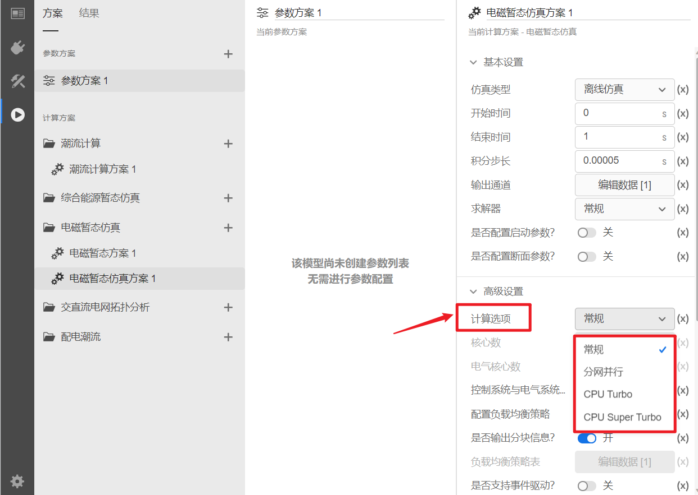
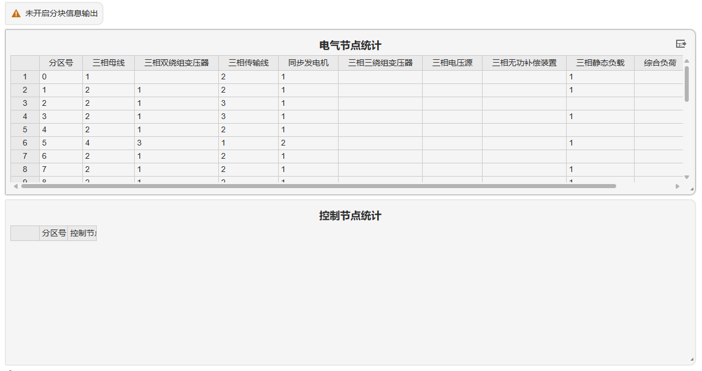

## 功能定义

EMTLab 提供的并行计算方案配置功能。

## 文档摘要

本节介绍电磁暂态仿真并行计算方案配置与适用范围，并以 IEEE39 节点标准测试系统算例进行演示。目前并行计算功能仅在私有服务器上可用，公网暂未开放使用。

## 功能说明

### 计算选项与适用范围

针对用户不同仿真场景的使用需求，EMTLab 提供了**常规**、**分网并行**、 **CPU Turbo** 与 **CPU Super Turbo** 等4种计算选项。对于新能源单机模型、三机九节点算例等**小规模算例**，一般常规计算选项进行仿真；对于**含长传输线的大规模系统**（如省级电网模型），可以选择分网并行、 CPU Turbo 与 CPU Super Turbo 等三种采用计算选项进行仿真加速；对于**不具备分网条件的大规模系统**（如只有较短集电线的新能源场站模型），可以选择 CPU Turbo 或 CPU Super Turbo 等2种计算选项进行仿真加速。

<table>
<tr><th><b>计算选项</b></th><th><b>功能说明</b></th><th><b>适用场景</b></th><th><b>算例要求</b></th><th><b>（3机9节点标准算例）10s物理过程仿真耗时</b></th><th><b>（某省级电网）10s物理过程仿真耗时</b></th><th><b>（某详细风电场模型）10s物理过程仿真耗时</b></th></tr>
<tr><td><b>常规</b></td><td>利用单核CPU完成所有计算</td><td>小规模算例</td><td>无</td><td>单核：2.15s</td><td>单核：2020.58s</td><td>单核：385.22s</td></tr>
<tr><td><b>分网并行</b></td><td>每个电网分区在一个 CPU 核心中完成计算，利用多核 CPU 加速仿真</td><td>含长传输线的大规模电网（如省级电网）</td><td>需要长传输线进行解耦</td><td>/</td><td>**分网：114.80s**</td><td>/</td></tr>
<tr><td rowspan="2"><b>CPU Turbo</b></td><td rowspan="2">多核间执行自动负载均衡策略</td><td rowspan="2">含控制节点较多的大规模系统（如新能源场站）</td><td>无</td><td>不分网：1.74s</td><td>不分网：303.23s</td><td>**不分网：62.56s**</td></tr>
<tr><td>需要长传输线进行解耦</td><td>/</td><td>**分网：102.17s**</td><td>/</td></tr>
<tr><td rowspan="2"><b>CPU Super Turbo</b></td><td rowspan="2">在 CPU Turbo 的基础上优化计算流程，进一步提升计算效率</td><td rowspan="2">含控制节点较多的大规模系统（如新能源场站）</td><td>无</td><td>不分网：1.73s</td><td>不分网：300.63s</td><td>**不分网：57.86s**</td></tr>
<tr><td valign="top">需要长传输线进行解耦</td><td>/</td><td>**分网：100.68s**</td><td>/</td></tr>
</table>

### 计算选项配置流程

import Tabs from '@theme/Tabs';
import TabItem from '@theme/TabItem';

<Tabs>
<TabItem value="setting1" label="常规计算选项配置">

- **基本设置**
  
在**基本设置**中设置好 后，在高级设置中选择**常规**计算选项即可。

</TabItem>
<TabItem value="setting2" label="分网并行计算选项配置">

- **基本设置**
  在**基本设置**中设置好 后，在高级设置中选择**CPU Turbo**计算选项。

- **队列及逻辑核心设置**
  
针对大规模算例选择**分网并行**、**CPU Turbo** 或 **CPU Super Turbo** 进行仿真加速时，需要选择队列并设置逻辑核心数。点击**运行设置**中**计算资源**选项，设置最大可用的逻辑核心数限制。

点击**高级设置**中**核心数**选项，根据仿真效率需求填写实际使用的CPU核数，核心数不能超过计算资源中配置的逻辑核心数限制。

- **拓扑分析与自动分网**

- **点击启动仿真**

</TabItem>
<TabItem value="setting3" label="CPU Turbo计算选项配置">

- **基本设置**
- 
在高级设置中，CloudPSS提供了4种可选计算选项，包括**常规**、**分网并行**、 **CPU Turbo** 与 **CPU Super Turbo** 。系统默认配置为**常规**计算方案，即仅利用单核 CPU 完成全部计算。针对**大规模算例**，可选择**分网并行**、**CPU Turbo** 或 **CPU Super Turbo** 进行仿真加速。

- **队列及逻辑核心设置**
  
针对大规模算例选择**分网并行**、**CPU Turbo** 或 **CPU Super Turbo** 进行仿真加速时，需要选择队列并设置逻辑核心数。点击**运行设置**中**计算资源**选项，设置最大可用的逻辑核心数限制。

点击**高级设置**中**核心数**选项，根据仿真效率需求填写实际使用的CPU核数，核心数不能超过计算资源中配置的逻辑核心数限制。

- **拓扑分析与自动分网**

- **点击启动仿真**

</TabItem>
<TabItem value="setting4" label="CPU Super Turbo计算选项配置">

- **基本设置**
  
  

- **队列及逻辑核心设置**
  
针对大规模算例选择**分网并行**、**CPU Turbo** 或 **CPU Super Turbo** 进行仿真加速时，需要选择队列并设置逻辑核心数。点击**运行设置**中**计算资源**选项，设置最大可用的逻辑核心数限制。

点击**高级设置**中**核心数**选项，根据仿真效率需求填写实际使用的CPU核数，核心数不能超过计算资源中配置的逻辑核心数限制。

- **拓扑分析与自动分网**

- **点击启动仿真**

</TabItem>
</Tabs>

### 高级设置

<Tabs>
<TabItem value="advsetting1" label="控制系统与电气系统并行">

点击**高级设置**中**控制系统与电气系统并行**按钮启用电磁暂态仿真中控制系统与电气系统并行计算，根据电气系统与控制系统规模合理配置电气核心数，电气核心数不能超过核心数。

</TabItem>
<TabItem value="advsetting2" label="配置负载均衡策略">

- **交直流电网拓扑分析**
  
使用该功能，需要先进行交直流电网拓扑分析，获取各个分区数据。详见[交直流电网拓扑分析](../../topology/basic-principle/index.md)帮助文档。

- **自动写入负载均衡信息**
  
然后，在交直流电网拓扑分析结果页中写入负载均衡信息，自动将拓扑分析得到的负载均衡策略表写回到计算方案。详见[负载均衡配置](../../topology/load-average/index.md)帮助文档。

- **手动写入负载均衡信息**
  
也可以在**高级设置**中启用**配置负载均衡策略**，根据各个分区计算量和预估耗时，设计负载均衡策略，将分区编号对应手动填入“分区-核心”映射表。**普通用户不建议使用，风险自负！**

</TabItem>
<TabItem value="advsetting3" label="输出分块信息">

点击**高级设置**中**是否输出分块信息**按钮启用分块信息输出,即可在交直流电网拓扑分析中输出分块信息。详见[交直流电网拓扑分析](../../topology/basic-principle/index.md)帮助文档。

</TabItem>
</Tabs>

## 案例介绍

<Tabs>
<TabItem value="case1" label="10机39节点系统分网并行仿真加速">

- **新建算例与电磁暂态仿真方案**  
在 **CloudPSS Simstudio** 个人中心打开 **IEEE-39节点标准测试系统算例**。

选择**运行标签页**新建电磁暂态仿真方案进行参数配置。

- **并行计算方案配置**

- **拓扑分析**

- **电磁暂态仿真计算**

- **效率对比**

</TabItem>
<TabItem value="case2" label="10机39节点系统 CPU Turbo 仿真加速">

- **并行计算方案配置**

- **拓扑分析**

- **电磁暂态仿真计算**

- **效率对比**

</TabItem>
<TabItem value="case3" label="10机39节点系统 CPU Super Turbo 仿真加速">

- **并行计算方案配置**

- **拓扑分析**

- **电磁暂态仿真计算**

- **效率对比**

</TabItem>
</Tabs>

## 常见问题 Q&A

为什么我无法选择多个逻辑核心？
:   

为什么我在分网后仿真效率提升不大？
:

如何选取合适逻辑核心数量？
:   

在仿真时报错:"Error: +/- Seq. Travel Time is less than the integration time step. Decrease the time step or use Lumped π-Model instead."
:

交直流电网拓扑分析方案报错："选择一个电磁暂态仿真方案="args":"@debug":"","@priority":0,"@queue":1,"@tres":"cpu=1"。"
:

如何在拓扑中查看分网结果？
:
