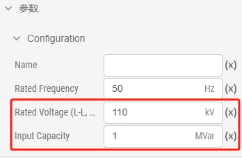

本节介绍进行潮流计算的要求，以及潮流计算方案的参数配置。

## 功能定义
EMTLab 提供的潮流计算计算方案设置功能。

## 功能说明

### 潮流计算基本要求
要使用 EMTLab 提供的潮流计算功能，首先需要搭建满足要求的算例。本小节介绍 EMTLab 支持潮流计算的元件和潮流计算前所需的元件设置。

#### 支持潮流计算的设备元件
目前，潮流计算功能支持的设备元件包含**静态负载**、**三相交流电压源**、**同步发电机**、**并联电容/电抗器**、**三相传输线**、**三相电阻**、**三相电感**、**三相电容**、**三相双绕组变压器**和**三相三绕组变压器**，更多元件支持将在后续版本中逐步加入。

潮流计算功能是围绕着**三相交流母线**进行的。因此，上述设备元件中，单电气端口的元件（静态负载、三相交流电压源、同步发电机、并联电容/电抗器）只有当其电气端口与母线直接相连时，才会被计入；对于多电气端口的元件，则其每一个电气端口都必须与母线直接相连。特别地，电流表可以串入电路中，在潮流计算过程中将被忽略。

:::tip
- 每条母线至多连接一个电源（三相交流电压源或同步发电机），未连接电源的母线将作为 PQ 节点参与计算。
- 同一个算例中可以包含多个独立的网络，每个网络都必须包含且仅包含一个平衡节点。
- 潮流计算中暂不考虑静态负载的功率特性。
:::
#### 元件的相关设置
进行潮流计算前，需要对元件的初值和节点类型进行设置，单电气端口的元件潮流计算的相关设置如下所示：

import Tabs from '@theme/Tabs';
import TabItem from '@theme/TabItem';

<Tabs>
<TabItem value="case1" label="三相交流母线">
三相交流母线需要设置的参数值如下图所示，具体的参数说明可见表格：

| 参数名称 | 单位 | 备注 | 说明 |
| :--- | :--- | :--- | :--- |
| Rated Frequency | Hz | 母线的额定频率 | 潮流计算要求相连的母线必须采用相同频率 |
| Voltage Angle | Deg | 母线电压相位（A相相电压） | 用于设定潮流计算时的母线的初始相位，潮流回写时，将母线相位迭代值写回该参数 |
| Voltage Magnitude (L-L, RMS) | p.u. | 母线线电压幅值 | 线电压幅值与电压基值决定了潮流计算时的母线初始电压，潮流回写时，将母线电压迭代值写回该参数 |
| Base Voltage (L-L, RMS) | kV | 母线的电压基准值 | 用于在潮流计算过程中将参与计算的母线电压数据转换为标幺值 |

</TabItem>
<TabItem value="case2" label="静态负载">
静态负载需要设置的参数值如下图所示，具体的参数说明可见表格：

| 参数名称 | 单位 | 备注 | 说明 |
| :--- | :--- | :--- | :--- |
| Rated Voltage (L-L, RMS) | kV | 标称负载线电压有效值 | 用于在潮流计算后将初始电压幅值数据转换为标幺值 |
| Rated Active Power (3 Phase) | MW | 额定有功功率 | 潮流计算时节点消耗有功功率 |
| Rated Reactive Power (3 Phase) | MVar | 额定无功功率，感性负荷为正 | 潮流计算时节点消耗无功功率 |
| Initial Voltage | p.u. | 初始电压幅值，由潮流计算决定 | 潮流计算后迭代的节点电压有名值会换算为标幺值，潮流回写时修改该参数 |

</TabItem>
<TabItem value="case3" label="三相交流电压源">
三相交流电压源需要设置的参数值如下图所示，具体的参数说明可见表格：

| 参数名称 | 单位 | 备注 | 说明 |
| :--- | :--- | :--- | :--- |
| Bus Type |  | 节点类型 | 潮流计算时指定电源所在母线的节点类型，可选择**PQ Bus**，**PV Bus**或**Slack Bus** |
| Injected Active Power | MW | 节点注入有功功率 | 潮流计算时 **PV**、**PQ** 节点的注入有功功率 |
| Injected Reactive Power | MVar | 节点注入无功功率 |  **PQ** 节点的注入无功功率 |
| Lower Voltage Limit | p.u. | 母线电压下限 | 由节点的电压基准值转换为有名值，决定 **PQ** 节点电压下界，越界后该节点由无功约束转为电压约束 |
| Upper Voltage Limit | p.u. | 母线电压上限 | 由节点的电压基准值转换为有名值，决定 **PQ** 节点电压上界，越界后该节点由无功约束转为电压约束 |
| Bus Voltage Magnitude | p.u. | 母线电压幅值 | 由节点的电压基准值转换为有名值，决定 **PV** 节点的电压幅值 |
| Lower Reactive Power Limit| MVar | 无功功率下限 | **PV** 节点和**平衡节点**的注入无功下界，越界后该节点由电压约束转为无功约束 |
| Upper Reactive Power Limit| MVar | 无功功率上限 | **PV** 节点和**平衡节点**的注入无功上界，越界后该节点由电压约束转为无功约束 |
| Bus Voltage Angle | Deg | 母线电压相位 | **平衡节点**的相角 |

</TabItem>
<TabItem value="case4" label="同步发电机">
同步发电机需要设置的参数值如下图所示，具体的参数说明可见表格：

| 参数名称 | 单位 | 备注 | 说明 |
| :--- | :--- | :--- | :--- |
| Bus Type |  | 节点类型 | 潮流计算时指定电源所在母线的节点类型，可选择**PQ Bus**，**PV Bus**或**Slack Bus** |
| Injected Active Power | MW | 节点注入有功功率 | 潮流计算时 **PV**、**PQ** 节点的注入有功功率 |
| Injected Reactive Power | MVar | 节点注入无功功率 |  **PQ** 节点的注入无功功率 |
| Lower Voltage Limit | p.u. | 母线电压下限 | 由节点的电压基准值转换为有名值，决定 **PQ** 节点电压下界，越界后该节点由无功约束转为电压约束 |
| Upper Voltage Limit | p.u. | 母线电压上限 | 由节点的电压基准值转换为有名值，决定 **PQ** 节点电压上界，越界后该节点由无功约束转为电压约束 |
| Bus Voltage Magnitude | p.u. | 母线电压幅值 | 由节点的电压基准值转换为有名值，决定 **PV** 节点的电压幅值 |
| Lower Reactive Power Limit| MVar | 无功功率下限 | **PV** 节点和**平衡节点**的注入无功下界，越界后该节点由电压约束转为无功约束 |
| Upper Reactive Power Limit| MVar | 无功功率上限 | **PV** 节点和**平衡节点**的注入无功上界，越界后该节点由电压约束转为无功约束 |
| Bus Voltage Angle | Deg | 母线电压相位 | **平衡节点**的相角 |

</TabItem>
<TabItem value="case5" label="并联电容/电抗器">
并联电容/电抗器需要设置的参数值如下图所示，具体的参数说明可见表格：

| 参数名称 | 单位 | 备注 | 说明 |
| :--- | :--- | :--- | :--- |
| Rated Voltage (L-L, RMS) | kV | 额定线电压有效值 | 与容量一起决定潮流计算时的对地电纳 |
| Input Capacity | MVar | 投入容量（电容为负，电抗为正） |  与电压一起决定潮流计算时的对地电纳|

</TabItem>
</Tabs>

多电气端口的元件潮流计算的相关设置如下所示：

<Tabs>
<TabItem value="case1" label="三相传输线">
三相传输线需要设置的参数值如下图所示，具体的参数说明可见表格：

</TabItem>
<TabItem value="case2" label="三相电阻">

</TabItem>
<TabItem value="case3" label="三相电感">

</TabItem>
<TabItem value="case4" label="三相电容">

</TabItem>
<TabItem value="case5" label="三相双绕组变压器">

</TabItem>
<TabItem value="case6" label="三相三绕组变压器">

</TabItem>
</Tabs>

### 潮流计算方案的参数设置
#### 初始设置

#### 约束设置

#### 求解设置

#### 输出设置

#### 运行设置

## 常见问题 Q&A
怎么导出 EMTLab 的潮流计算的结果
:

潮流计算方案的参数设置有哪些是必选项
: